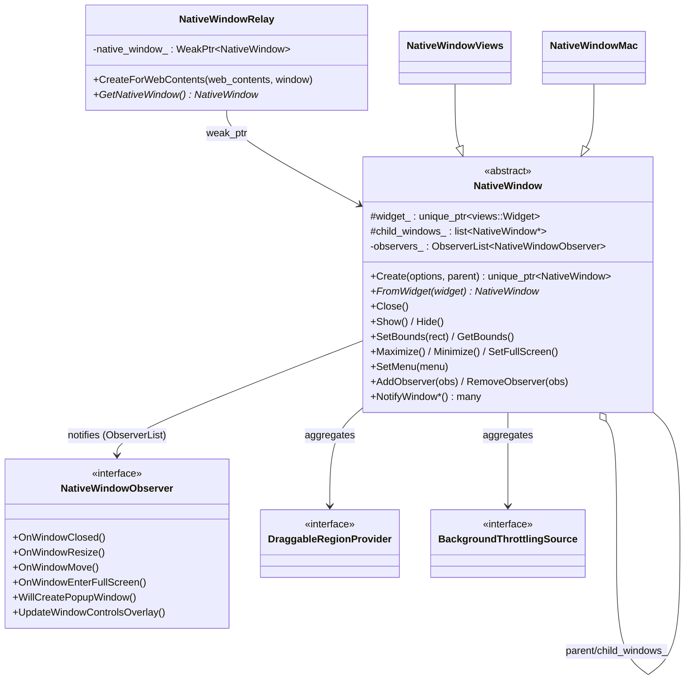
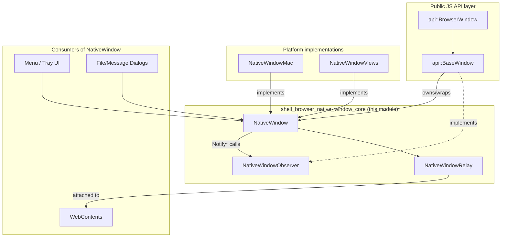
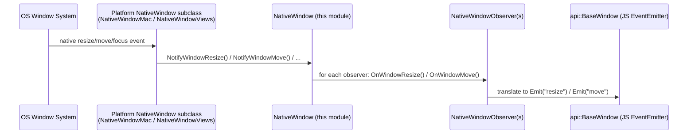
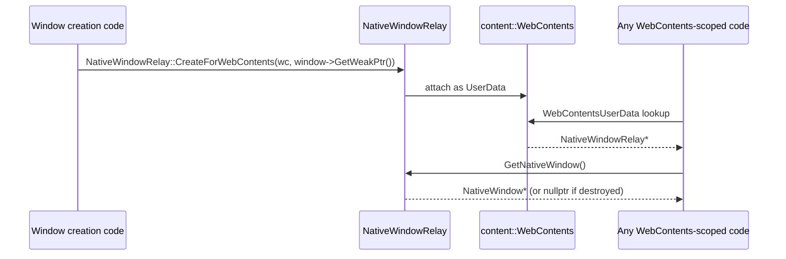

# Shell Browser Native Window Core

## 1. Purpose & Overview

The `shell_browser_native_window_core` module defines the **abstract, cross-platform contract** for representing a native OS window inside Electron's browser process. It is the foundational layer on which all platform-specific window implementations (macOS, Windows/Linux "Views") are built, and the layer that the JS-facing `BrowserWindow`/`BaseWindow` API objects ultimately drive.

The module is intentionally small and header-only — it contains no platform code itself. Instead it:

- Declares the `electron::NativeWindow` base class: a large virtual interface covering window geometry, visibility, state (maximize/minimize/fullscreen), decorations, taskbar/dock integration, vibrancy, touch bar, tabbing, and more.
- Declares `electron::NativeWindowObserver`, a `base::CheckedObserver`-based interface that platform windows use to broadcast lifecycle and UI events (resize, move, focus, fullscreen transitions, etc.) to interested listeners (most notably the `api::BaseWindow`/`api::BrowserWindow` gin wrappers).
- Declares `electron::NativeWindowRelay`, a `content::WebContentsUserData` that attaches a weak reference to the owning `NativeWindow` onto a `content::WebContents`, allowing any code holding a `WebContents*` to find its hosting native window.

Because nearly every desktop-facing feature in Electron (menus, tray, dialogs, drag-and-drop, DevTools, frame views, tabbing, vibrancy…) ultimately needs to manipulate or observe a top-level window, this module sits at a structural chokepoint of the codebase.

## 2. Architecture

### 2.1 Position within the broader "Native Window & Menu Management" family

This module is the **core/base** sub-module of the larger native-window group. Sibling sub-modules provide the concrete platform implementations and supporting utilities that build directly on top of the interfaces defined here:

| Sub-module | Relationship |
|---|---|
| [shell_browser_native_window_mac.md](shell_browser_native_window_mac.md) | Implements `NativeWindow` for macOS (`NativeWindowMac`), using AppKit/Cocoa (`ElectronNSWindow`, touch bar, vibrancy, traffic lights). |
| [shell_browser_native_window_views.md](shell_browser_native_window_views.md) | Implements `NativeWindow` for Windows/Linux via the `views::Widget` toolkit (`NativeWindowViews`), including frameless/custom frame handling and global menu bars. |
| [shell_browser_native_window_support.md](shell_browser_native_window_support.md) | Small helper classes (`ChildWebContentsTracker`, `ExtendedWebContentsObserver`) that assist window/WebContents lifecycle coordination. |

### 2.2 High-level class diagram

### 2.3 How platform windows & consumers connect

## 3. Core Components

### 3.1 `NativeWindow` (`shell/browser/native_window.h`)

The central abstract base class, deriving from `base::SupportsUserData` and `views::WidgetDelegate`.

**Responsibilities:**
- **Lifecycle & factory**: `Create()` instantiates the correct platform subclass (macOS vs. Views) via conditional compilation; `FromWidget()` recovers a `NativeWindow*` from a `views::Widget*`.
- **Geometry**: bounds, size, position, content-vs-window bounds conversion, min/max size constraints, aspect ratio.
- **Window state**: show/hide, focus, maximize/minimize/restore, fullscreen (including HTML5 fullscreen vs native fullscreen transitions tracked via `pending_transitions_` and `FullScreenTransitionType`), kiosk mode, "simple fullscreen" (pre-Lion macOS).
- **Decorations & chrome**: frame/no-frame, titlebar style (`TitleBarStyle` enum: normal/hidden/hidden-inset/custom-buttons-on-hover), window controls overlay rect, background color/material, vibrancy, shadow, opacity.
- **Platform affordances**: taskbar/dock progress bar and overlay icon, workspace visibility, touch bar (macOS), native tabs (macOS), accent color (Windows), traffic light buttons (macOS).
- **Hierarchy**: parent/child window relationships (`parent_`, `child_windows_`), modal window tracking (`is_modal_`).
- **Draggable regions**: `AddDraggableRegionProvider` / `RemoveDraggableRegionProvider` maintain a list of `DraggableRegionProvider*` used for custom-shaped drag regions (frameless windows).
- **Background throttling**: `AddBackgroundThrottlingSource` / `RemoveBackgroundThrottlingSource` aggregate `BackgroundThrottlingSource*` instances to decide whether the `ui::Compositor` should throttle background rendering — used by off-screen rendering and BrowserView features.
- **Event notification**: dozens of `Notify*` methods (e.g., `NotifyWindowResize`, `NotifyWindowEnterFullScreen`, `NotifyWindowSystemContextMenu`) that forward to all registered `NativeWindowObserver`s. This is the primary mechanism by which the JS-facing window object learns about native UI events and re-emits them as JS events.
- **Weak references**: exposes `GetWeakPtr()` used by `NativeWindowRelay` and other long-lived owners that must not outlive the window.

**Key forward-declared collaborator types** (defined elsewhere, referenced here as interface/pointer types):
- `ElectronMenuModel` — see [Menu (Model & Views)](Menu_(Model_&_Views).md) documentation for the menu system attached via `SetMenu()`.
- `api::BrowserView` — declared a `friend class`; see [shell_browser_api_window_ui](shell_browser_api_window_ui.md).
- `gin_helper::Dictionary` / `gin_helper::PersistentDictionary` — construction options and touch bar item descriptors; see [Gin_Helper](Gin_Helper.md).
- `DraggableRegionProvider`, `BackgroundThrottlingSource` — small mixin interfaces implemented by content/OSR code; see [OSR_(Offscreen_Rendering)](OSR_(Offscreen_Rendering).md).

### 3.2 `NativeWindowObserver` (`shell/browser/native_window_observer.h`)

A pure interface (`base::CheckedObserver`) with default no-op virtual methods, letting subscribers override only what they need. Categories of callbacks:

- **Popup/navigation intents**: `WillCreatePopupWindow`, `WillNavigate`.
- **Close lifecycle**: `WillCloseWindow`, `OnCloseButtonClicked`, `OnWindowClosed`, and Windows session events `OnWindowQueryEndSession` / `OnWindowEndSession`.
- **Focus/visibility**: `OnWindowBlur`, `OnWindowFocus`, `OnWindowIsKeyChanged`, `OnWindowShow`, `OnWindowHide`.
- **State transitions**: maximize/unmaximize/minimize/restore, resize (`OnWindowWillResize`, `OnWindowResize`, `OnWindowResized`), move (`OnWindowWillMove`, `OnWindowMove`, `OnWindowMoved`), fullscreen (native and HTML5 variants).
- **Gestures (macOS)**: `OnWindowSwipe`, `OnWindowRotateGesture`, sheet begin/end.
- **Misc UI**: touch bar item results, new-tab-for-window, system context menu, Windows raw message pump (`OnWindowMessage`, Windows-only), app command execution, window-controls-overlay bounding rect updates.

This is the primary extension point implemented by the JS window wrapper objects (`api::BaseWindow` / `api::BrowserWindow`, in [shell_browser_api_window_ui](shell_browser_api_window_ui.md)) to translate native events into JS `EventEmitter` events, and by internal helpers like [Window_List](Window_List.md) to track window open/close counts.

### 3.3 `NativeWindowRelay` (`shell/browser/native_window.h`)

A `content::WebContentsUserData<NativeWindowRelay>` that stores a `base::WeakPtr<NativeWindow>` on a `WebContents`. This lets any component with access to a `WebContents*` (renderer IPC handlers, permission checks, autofill, print preview, etc.) resolve the top-level `NativeWindow` that hosts it, without those components needing a direct dependency on window construction. It is created via `CreateForWebContents()` and looked up with the standard `WEB_CONTENTS_USER_DATA_KEY_DECL()` machinery.

## 4. Data / Event Flow

### 4.1 Window event notification flow

### 4.2 WebContents → NativeWindow resolution

## 5. Relationship to Other Modules

- **[shell_browser_native_window_mac.md](shell_browser_native_window_mac.md)** and **[shell_browser_native_window_views.md](shell_browser_native_window_views.md)**: concrete subclasses of `NativeWindow` that fulfill every pure-virtual method declared here for their respective platforms.
- **[shell_browser_native_window_support.md](shell_browser_native_window_support.md)**: small companion utilities (`ChildWebContentsTracker`) that work alongside `NativeWindow`'s parent/child tracking for popup and guest windows.
- **[shell_browser_api_window_ui.md](shell_browser_api_window_ui.md)**: the gin-wrapped JS API (`BaseWindow`, `BrowserWindow`) that owns a `NativeWindow` instance, implements `NativeWindowObserver` to bridge native events into JS, and exposes menu/view/tray functionality built atop it.
- **[Window_List.md](Window_List.md)**: maintains a process-wide list of all live `NativeWindow` instances, observing their close events via `WindowListObserver`.
- **[Menu_(Model_&_Views).md](Menu_(Model_&_Views).md)**: `ElectronMenuModel`, attached to a window through `NativeWindow::SetMenu()`.
- **[OSR_(Offscreen_Rendering).md](OSR_(Offscreen_Rendering).md)**: implements `BackgroundThrottlingSource` and interacts with `NativeWindow` for off-screen rendered windows.
- **[shell_browser_api_webcontents.md](shell_browser_api_webcontents.md)**: the `WebContents` wrapper that is hosted inside a `NativeWindow`'s content view and that `NativeWindowRelay` links back to its window.
- **[Gin_Helper.md](Gin_Helper.md)**: supplies `gin_helper::Dictionary` / `PersistentDictionary` used throughout `NativeWindow`'s construction options and touch bar APIs.

## 6. Design Notes

- **Header-only interface module**: there is no `.cc` implementation belonging to this module directly (implementation lives in platform subclasses); this module's job is purely to define a stable ABI/API surface consumed across the codebase.
- **Heavy use of optional virtuals with default no-op bodies** (e.g., `PreviewFile`, `SetGTKDarkThemeEnabled`) allows platform subclasses to opt into only the behavior relevant to their OS, avoiding `#ifdef` sprawl at every call site.
- **Weak-pointer-safe cross-references**: both `NativeWindowRelay` and the window's own `GetWeakPtr()` reflect a deliberate design where a `NativeWindow`'s lifetime is decoupled from long-lived owners like `WebContents`, preventing use-after-free when windows close before their content.
- **`window_id_` allocation**: a simple monotonically increasing static counter (`next_id_`) gives every window a stable identity used for menu-window disambiguation and DevTools APIs.
