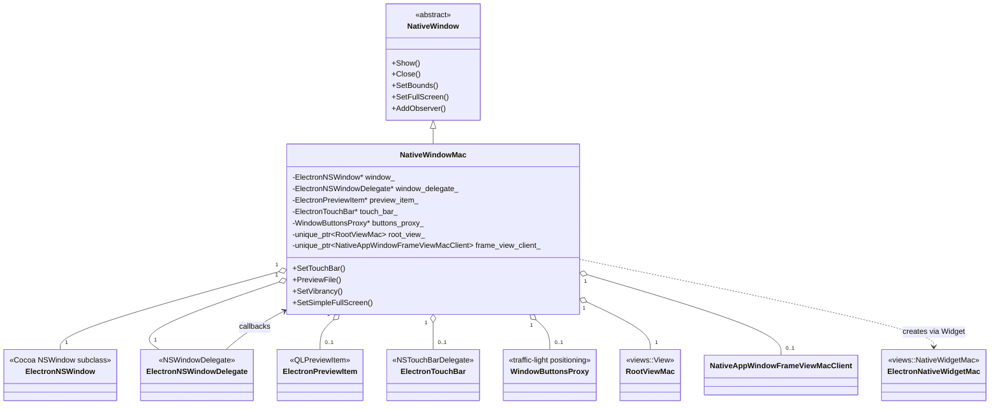
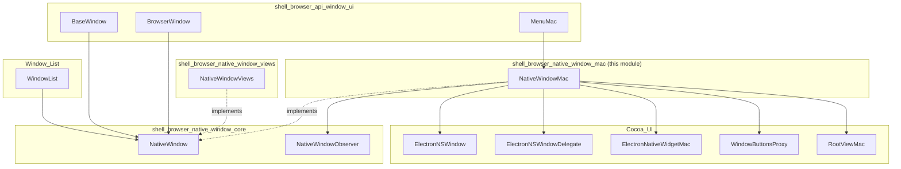
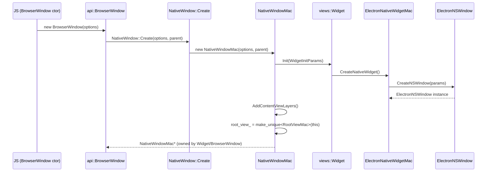
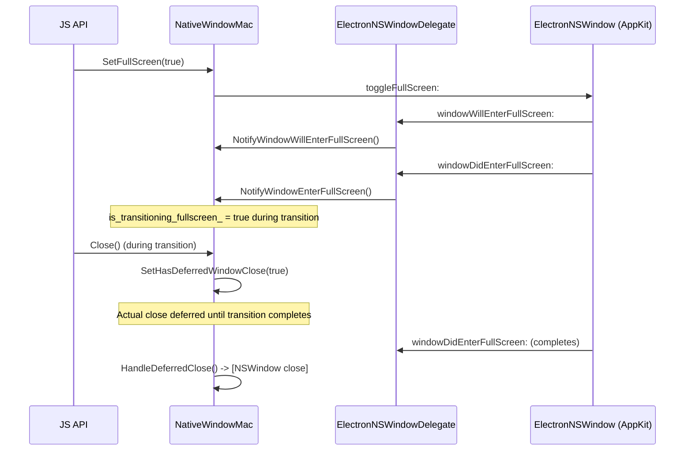
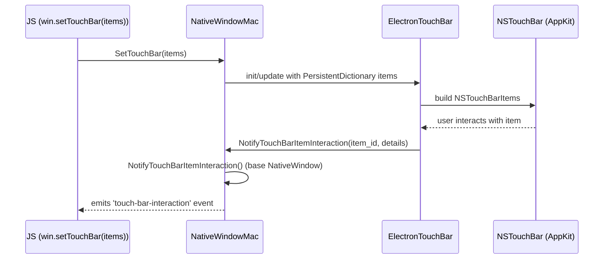

# Shell Browser Native Window (macOS)

## Introduction

The `shell_browser_native_window_mac` module provides the **macOS-specific implementation** of Electron's cross-platform `NativeWindow` abstraction. It is defined primarily in `shell/browser/native_window_mac.h` and its companion Objective-C++ implementation, and is responsible for translating the platform-agnostic windowing API used throughout Electron's C++ codebase into native Cocoa (`NSWindow`, `NSView`, `NSToolbar`/Touch Bar, etc.) behavior.

This module is a sibling of [shell_browser_native_window_views](shell_browser_native_window_views.md) (Windows/Linux via `views::Widget`) under the parent [shell_browser_native_window](shell_browser_native_window.md) module, and both extend the shared contract defined in [shell_browser_native_window_core](shell_browser_native_window_core.md) (`NativeWindow`, `NativeWindowObserver`).

`NativeWindowMac` is the C++ "shell" object that owns and coordinates a constellation of Objective-C helper classes (declared as forward-declared `@class`/`@interface` types in the header and implemented in Cocoa-specific `.mm` files) that implement the actual AppKit behavior — window delegate callbacks, Touch Bar support, Quick Look previews, and traffic-light (window control button) positioning.

---

## Purpose & Core Functionality

`NativeWindowMac` implements every pure-virtual and platform-conditional method declared by the base `NativeWindow` class (see [shell_browser_native_window_core](shell_browser_native_window_core.md)) for macOS, including:

- **Window lifecycle**: `Show`, `Hide`, `Close`, `CloseImmediately`, `Focus`, `Minimize`, `Restore`, `Maximize`/`Unmaximize`.
- **Bounds & sizing**: `SetBounds`, `GetBounds`, `GetNormalBounds`, `SetSizeConstraints`, `SetAspectRatio`, and mac-specific zoom-frame tracking (`default_frame_for_zoom_`) needed because macOS's "best fit" zoom logic can override requested aspect ratios.
- **Window chrome/state**: resizable/movable/minimizable/maximizable/closable flags, always-on-top z-order levels, opacity, background color, shadow control, and document-edited/represented-filename metadata (mapped to macOS proxy-icon and edited-dot UI).
- **Fullscreen modes**: native fullscreen (`SetFullScreen`), Simple (pre-Lion) Fullscreen (`SetSimpleFullScreen`), and Kiosk mode (`SetKiosk`), including presentation-option save/restore and deferred-close handling to avoid AppKit fullscreen-transition lockups.
- **Traffic lights / window buttons**: custom positioning and visibility of the close/minimize/zoom buttons via `WindowButtonsProxy`, including redraw-on-demand (`RedrawTrafficLights`) for frameless/hidden-titlebar windows.
- **Touch Bar integration**: `SetTouchBar`, `RefreshTouchBarItem`, `SetEscapeTouchBarItem`, delegated to `ElectronTouchBar`.
- **Tabbed windows**: native macOS window tabbing (`SelectNextTab`, `MergeAllWindows`, `AddTabbedWindow`, tabbing identifiers).
- **Quick Look file preview**: `PreviewFile`/`CloseFilePreview` via `ElectronPreviewItem`.
- **Vibrancy & visual effects**: translucent/vibrant materials rendered through a `views::NativeViewHost` (`vibrant_native_view_host_`).
- **Parent/child window relationships**: attach/detach/remove child `NSWindow`s while respecting visibility state.
- **OS integration hooks**: `ui::NativeThemeObserver` (dark mode changes) and `display::DisplayObserver` (display metric changes, e.g. for repositioning/redrawing on monitor changes).

## Architecture

`NativeWindowMac` acts as a C++ facade/coordinator. It does not itself subclass `NSWindow`; instead it owns (via `__strong` Objective-C references) a set of collaborator objects that implement AppKit protocols and forward events back into the C++ object.

### Key Collaborators

| Component | Role |
|---|---|
| `ElectronNSWindow` | Custom `NSWindow` subclass that backs the `views::Widget`; overrides window behaviors (e.g., key window handling, style mask enforcement) needed by Electron. |
| `ElectronNSWindowDelegate` | Implements `NSWindowDelegate` methods (resize, move, fullscreen transitions, close) and forwards them as `Notify*` calls into `NativeWindowMac`/`NativeWindow`. |
| `ElectronPreviewItem` | Implements `QLPreviewItem` to support `PreviewFile`/`CloseFilePreview` (Quick Look). |
| `ElectronTouchBar` | Implements `NSTouchBarDelegate`, builds `NSTouchBarItem`s from `gin_helper::PersistentDictionary` specs supplied through `SetTouchBar`. |
| `WindowButtonsProxy` | Manages the position/visibility of the native close/minimize/zoom "traffic light" buttons, used for frameless and custom-titlebar windows. |
| `RootViewMac` | A `views::View` subclass that anchors the Views-based content view (e.g. `BrowserView`) inside the native Cocoa window's content view; also defines min/max size for the Views hierarchy. |
| `NativeAppWindowFrameViewMacClient` | Provides app-specific frame customization hooks consumed by non-client frame view creation (`CreateNonClientFrameView`). |
| `ElectronNativeWidgetMac` | (`views::NativeWidgetMac` subclass, declared in `shell/browser/ui/cocoa/electron_native_widget_mac.h`) creates the underlying `NativeWidgetMacNSWindow`/`ElectronNSWindow` and connects the Views `Widget` machinery to `NativeWindowMac`. |

These Cocoa-facing types are further described in the [Cocoa_UI](Cocoa_UI.md) documentation, which covers `electron_ns_window.h`, `electron_ns_window_delegate.h`, `electron_touch_bar.h`, `window_buttons_proxy.h`, `root_view_mac.h`, `views_delegate_mac.h`, and `electron_bundle_mover.h` in detail.

## Relationship to Other Modules

- **[shell_browser_native_window_core](shell_browser_native_window_core.md)**: defines the abstract `NativeWindow` interface and `NativeWindowObserver`; `NativeWindowMac` is one of the concrete implementations (alongside `NativeWindowViews` for Windows/Linux — see [shell_browser_native_window_views](shell_browser_native_window_views.md)).
- **[shell_browser_native_window_support](shell_browser_native_window_support.md)**: `ChildWebContentsTracker` and `ExtendedWebContentsObserver` used generically by window implementations for managing child web contents / dragging regions.
- **[Cocoa_UI](Cocoa_UI.md)**: houses the concrete Objective-C++ implementations of the collaborator classes referenced by `NativeWindowMac` (`ElectronNSWindow`, `ElectronNSWindowDelegate`, `ElectronTouchBar`, `WindowButtonsProxy`, `RootViewMac`, `ElectronNativeWidgetMac`, `ViewsDelegateMac`, `ElectronBundleMover`).
- **[shell_browser_api_window_ui](shell_browser_api_window_ui.md)**: the JS-facing `BaseWindow`/`BrowserWindow` gin wrappers that create and drive `NativeWindow`/`NativeWindowMac` instances in response to renderer/main-process JS API calls.
- **[Menu_(Model_&_Views)](Menu_(Model_&_Views).md)**: `MenuMac` (in `electron_api_menu_mac.h`) attaches native menus to a `NativeWindow`, including mac-specific popup behavior.
- **[Window_List](Window_List.md)**: `WindowList`/`WindowListObserver` track all live `NativeWindow` instances (including `NativeWindowMac`) for app-wide window enumeration (e.g., `app.getAllWindows()` gin API, macOS "quit when all windows closed" logic).
- **[Tray_Icon](Tray_Icon.md)**: `TrayIconCocoa` shares some Cocoa infrastructure conventions (menu controllers, status items) with this module but is a distinct top-level UI surface.
- **[Autofill_Popup](Autofill_Popup.md)** and **OSR (Offscreen Rendering)** consumers rely on `NativeWindow::GetNativeView()`/`GetNativeWindow()` exposed here to anchor overlay UI.

## Data / Control Flow

### Window Creation Flow

### Fullscreen Transition Flow (illustrating deferred-close handling)

### Touch Bar Update Flow

## Key State & Design Notes

- **Weak vs. strong references**: `window_` (the `ElectronNSWindow*`) is a *weak* reference — its lifetime is owned by the `views::Widget`/`ElectronNativeWidgetMac` machinery. The delegate, preview item, touch bar, and buttons proxy are held with `__strong` ARC references directly by `NativeWindowMac`.
- **Deferred close pattern**: Because closing an `NSWindow` mid-fullscreen-transition can hang AppKit, `has_deferred_window_close_` + `HandleDeferredClose()` implement a safe deferred-close pattern coordinated with the `ElectronNSWindowDelegate` fullscreen callbacks.
- **Zoom/maximize semantics on macOS**: Since native macOS "zoom" (green button) doesn't map 1:1 onto a simple maximize concept — especially with aspect ratios — `default_frame_for_zoom_` caches the OS-provided "best fit" frame from `windowWillUseStandardFrame:defaultFrame:` so `IsMaximized()`/`Unmaximize()` can be computed correctly.
- **Style mask & collection behavior helpers**: `HasStyleMask`, `SetStyleMask`, `SetCollectionBehavior`, and `SetWindowLevel` are low-level escape hatches used internally (and by `WindowButtonsProxy`) to work around AppKit quirks, e.g. zoom button enable/disable bugs.
- **Vibrancy**: implemented by inserting a `views::NativeViewHost` (`vibrant_native_view_host_`) wrapping an `NSVisualEffectView` into the Views hierarchy, toggled via `SetVibrancy`/`UpdateVibrancyRadii`.
- **Theme & display observation**: `NativeWindowMac` mixes in `ui::NativeThemeObserver` and `display::DisplayObserver` to react to macOS dark-mode toggles and multi-monitor changes (e.g., re-applying vibrancy corner radii or repositioning traffic lights).

## Where This Fits in the Broader System

`NativeWindowMac` is instantiated indirectly through the JS-exposed `BrowserWindow`/`BaseWindow` gin wrappers (see [shell_browser_api_window_ui](shell_browser_api_window_ui.md)), which call the platform-agnostic `NativeWindow::Create()` factory. On macOS, this factory resolves to `NativeWindowMac`. All subsequent window operations invoked from JavaScript (resize, fullscreen, vibrancy, touch bar, traffic lights, tabs) are dispatched through this class into the Cocoa collaborator objects described above.

For the equivalent Windows/Linux implementation, see [shell_browser_native_window_views](shell_browser_native_window_views.md). For the platform-neutral contract both implementations fulfill, see [shell_browser_native_window_core](shell_browser_native_window_core.md).
