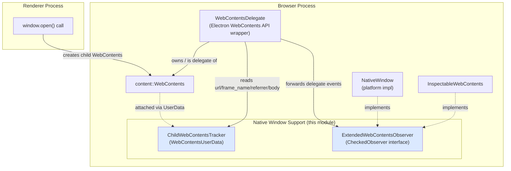
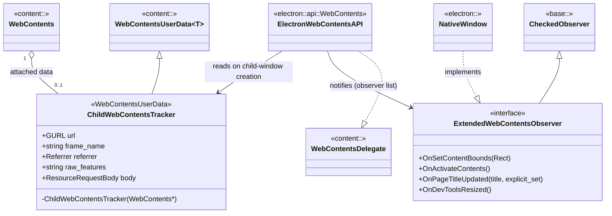
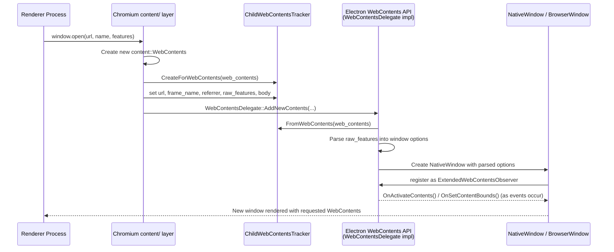
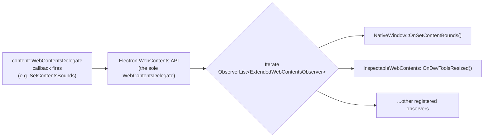

# Native Window Support Module

## Introduction

The **Native Window Support** module (`shell_browser_native_window_support`) is a small but structurally important part of Electron's native windowing subsystem. It provides two lightweight, cross-platform support types that glue together the `NativeWindow` hierarchy with Chromium's `content::WebContents` layer:

- **`ChildWebContentsTracker`** — a `WebContentsUserData` attachment that records the metadata (`URL`, frame name, referrer, raw window features, and POST body) associated with a `WebContents` created via a native `window.open()` call, before Electron's higher-level window/WebContents wiring takes over.
- **`ExtendedWebContentsObserver`** — a small observer interface (`base::CheckedObserver`) that exposes a handful of `WebContentsDelegate`-only events (bounds changes, activation, title updates, DevTools resize) to code that only has access to `WebContents` observers, not the delegate itself.

Both types are intentionally minimal "adapter" classes: they don't implement window behavior themselves, but they enable the `NativeWindow` implementations and the `WebContents`/window-management API layer to communicate window-related lifecycle events cleanly across process and ownership boundaries.

This module is a child of [Native_Window_&_Menu_Management](shell_browser_native_window.md) and works closely with:
- [shell_browser_native_window_core](shell_browser_native_window_core.md) — the abstract `NativeWindow` base class and its observer interface.
- [shell_browser_native_window_mac](shell_browser_native_window_mac.md) and [shell_browser_native_window_views](shell_browser_native_window_views.md) — platform-specific `NativeWindow` implementations.
- [shell_browser_api_webcontents](shell_browser_api_webcontents.md) — the `electron.WebContents` API binding that drives child-window creation and consumes these support types.
- [Web_Contents](Web_Contents.md) — general `WebContents` preference/permission/zoom infrastructure.
- [Window_List](Window_List.md) — the global registry of live `NativeWindow` instances.

---

## Module Purpose

Electron windows are implemented as a combination of:
1. A **`NativeWindow`** (platform-specific native widget: Cocoa `NSWindow`, Views-based window on Windows/Linux).
2. A **`content::WebContents`** that renders the window's web page content.

These two objects are related but distinct — a `WebContents` can exist without a top-level `NativeWindow` (e.g., guest views, `<webview>` tags, popups from `window.open()`), and a `NativeWindow` needs to observe certain `WebContents`/`WebContentsDelegate` events without becoming a full `WebContentsDelegate` itself.

The **Native Window Support** module solves two narrow but recurring problems:

| Problem | Solution provided by this module |
|---|---|
| When a renderer calls `window.open()`, Chromium creates a new `WebContents` before Electron's JS-side `BrowserWindow`/`webContents` wrapper exists. The browser process needs a place to stash the requested URL, frame name, referrer, feature string, and request body until the new window/WebContents is fully wired up. | `ChildWebContentsTracker`, attached via `content::WebContentsUserData`. |
| Some window-affecting events (setting content bounds, activating the window, page title updates, DevTools resizing) are delivered only through `content::WebContentsDelegate`, but various pieces of Electron code (e.g., a `NativeWindow`, or an `InspectableWebContents` consumer) need to observe them without being *the* delegate. | `ExtendedWebContentsObserver`, an observer interface added alongside the standard `content::WebContentsObserver`. |

---

## Core Components

### `ChildWebContentsTracker`

```
shell/browser/child_web_contents_tracker.h
```

`ChildWebContentsTracker` is a `content::WebContentsUserData<ChildWebContentsTracker>`, meaning it is attached directly to a `WebContents` instance and retrieved via a static key rather than through inheritance or composition. It is created for **child WebContents that originate from native `window.open()` calls** (as opposed to WebContents created directly via the Electron `BrowserWindow`/`WebContentsView` APIs).

**Stored data:**
| Field | Type | Description |
|---|---|---|
| `url` | `GURL` | The URL requested by `window.open()`. |
| `frame_name` | `std::string` | The target/frame name argument. |
| `referrer` | `content::Referrer` | Referrer policy/URL for the new page. |
| `raw_features` | `std::string` | The raw, unparsed window features string (e.g., `"width=200,height=100"`). |
| `body` | `scoped_refptr<network::ResourceRequestBody>` | POST body, if the navigation was a form submission. |

**Lifecycle:** The tracker is constructed privately (constructor is private, `friend`ed to `content::WebContentsUserData`) and attached via the standard `CreateForWebContents`/`FromWebContents` pattern inherited from `WebContentsUserData`. It has no behavior of its own — it is a pure data carrier consumed later by the code that finishes constructing the Electron-level window/WebContents wrapper (typically in the `WebContents` API layer, see [shell_browser_api_webcontents](shell_browser_api_webcontents.md)) to determine window options, apply the referrer, or replay the POST body.

### `ExtendedWebContentsObserver`

```
shell/browser/extended_web_contents_observer.h
```

`ExtendedWebContentsObserver` extends `base::CheckedObserver` and defines optional (default no-op) virtual hooks for events that Chromium normally routes only through `content::WebContentsDelegate`:

```cpp
class ExtendedWebContentsObserver : public base::CheckedObserver {
 public:
  virtual void OnSetContentBounds(const gfx::Rect& rect) {}
  virtual void OnActivateContents() {}
  virtual void OnPageTitleUpdated(const std::u16string& title, bool explicit_set) {}
  virtual void OnDevToolsResized() {}
 protected:
  ~ExtendedWebContentsObserver() override = default;
};
```

Because `content::WebContentsDelegate` is a singleton role per `WebContents` (only one delegate can be active), any component that needs visibility into these specific delegate-level events — without *becoming* the delegate — registers itself as an `ExtendedWebContentsObserver` with whatever object *is* acting as the `WebContentsDelegate` (typically Electron's `WebContents` API wrapper, see [shell_browser_api_webcontents](shell_browser_api_webcontents.md)). That delegate forwards the relevant `WebContentsDelegate` callback into `OnSetContentBounds`, `OnActivateContents`, `OnPageTitleUpdated`, or `OnDevToolsResized` for each registered observer.

This pattern lets multiple independent consumers (e.g., a `NativeWindow` implementation reacting to `SetContentBounds` to resize itself, and `InspectableWebContents` reacting to DevTools resize) observe the same delegate-only signal set without conflicting over exclusive delegate ownership.

---

## Architecture



## Component Relationships



---

## Data Flow: Child Window Creation (`window.open()`)



---

## Process Flow: Delegate Event Fan-out via `ExtendedWebContentsObserver`



---

## How This Module Fits Into the System

- **Upstream dependency**: Both components depend only on Chromium primitives (`content::WebContentsUserData`, `base::CheckedObserver`, `gfx::Rect`, `content::Referrer`, `network::ResourceRequestBody`) — they have no dependency on Electron's `gin`/V8 bindings, making them safe to use deep in native `content/` glue code.
- **Downstream consumers**:
  - The [shell_browser_api_webcontents](shell_browser_api_webcontents.md) module (`ElectronBrowserClient`/`WebContents` API wrapper) is the primary consumer of `ChildWebContentsTracker` — it inspects the tracker right after a child `WebContents` is created to decide window options, referrer policy, and to replay the original POST body if the new window ends up navigating.
  - `NativeWindow` implementations in [shell_browser_native_window_core](shell_browser_native_window_core.md), [shell_browser_native_window_mac](shell_browser_native_window_mac.md), and [shell_browser_native_window_views](shell_browser_native_window_views.md) implement `ExtendedWebContentsObserver` to stay in sync with content-bounds changes and activation requests that originate from the `WebContentsDelegate` layer rather than from the window system directly.
  - [Inspectable_Web_Contents](Inspectable_Web_Contents.md) (DevTools UI hosting) uses `OnDevToolsResized()` to react to layout changes driven by the WebContents delegate.
- **Related sibling modules** in the [Native_Window_&_Menu_Management](shell_browser_native_window.md) parent group: [Window_List](Window_List.md) (tracks all live `NativeWindow` instances) and [shell_browser_api_window_ui](shell_browser_api_window_ui.md) (JS-facing `BrowserWindow`/`BaseWindow`/`View` bindings).

---

## Summary

| Component | Category | Key Role |
|---|---|---|
| `ChildWebContentsTracker` | `WebContentsUserData` | Carries `window.open()` request metadata (URL, frame name, referrer, features, POST body) from Chromium's content layer to Electron's window-creation logic. |
| `ExtendedWebContentsObserver` | Observer interface | Exposes delegate-only `WebContentsDelegate` events (bounds, activation, title, DevTools resize) to non-delegate observers such as `NativeWindow`. |

Despite their small footprint, these two types are essential connective tissue: they let Electron cleanly separate "who owns/creates the `WebContents`" (Chromium's `content/` layer and the sole `WebContentsDelegate`) from "who needs to react to window-affecting events" (potentially many `NativeWindow`/UI components), without forcing every interested party to become a full `WebContentsDelegate` or reach into internal WebContents state directly.
