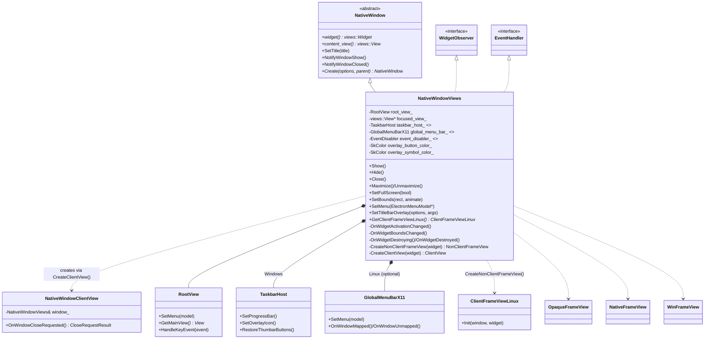
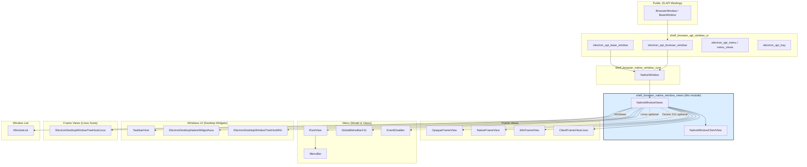
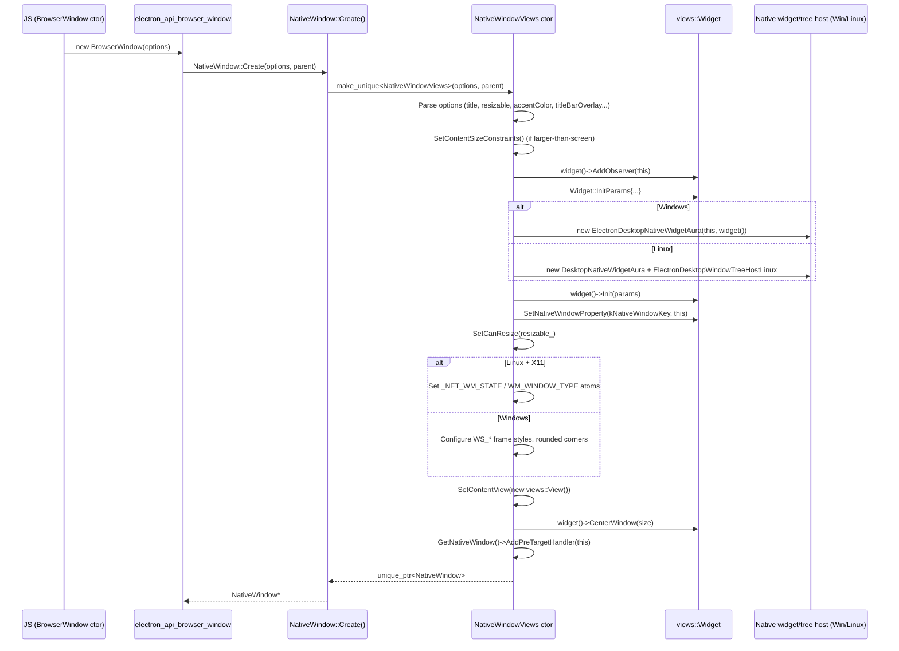
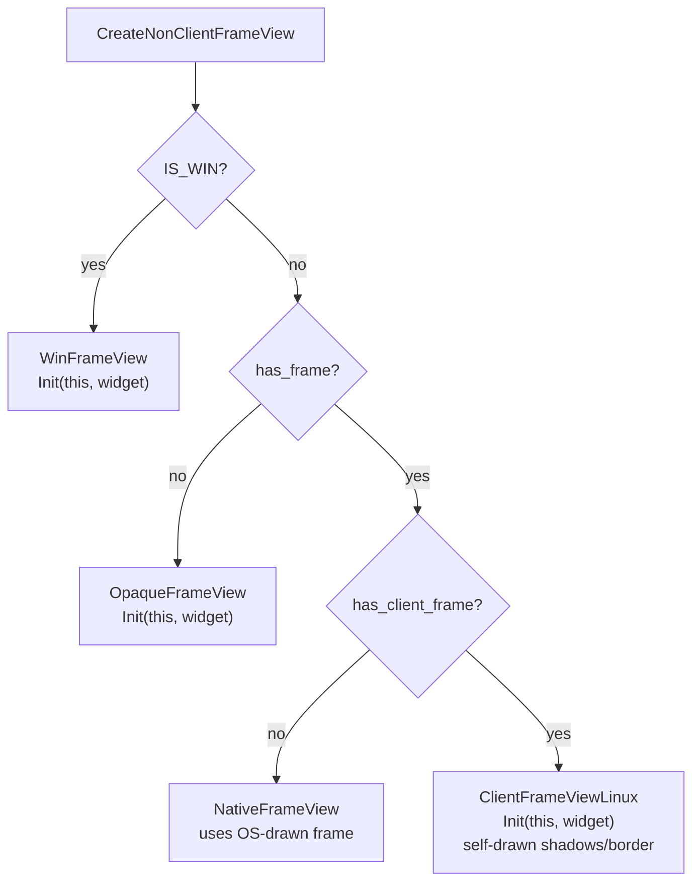
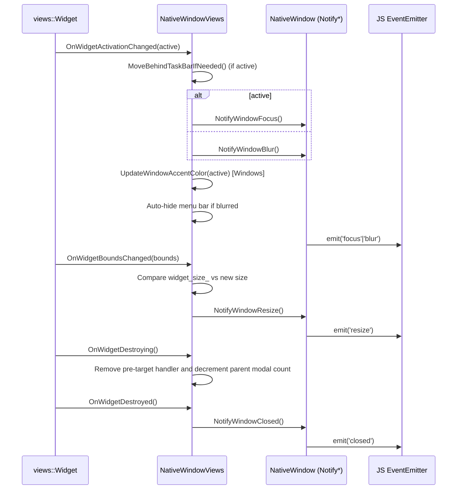
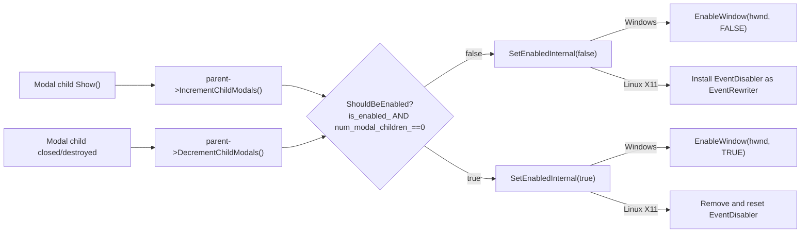
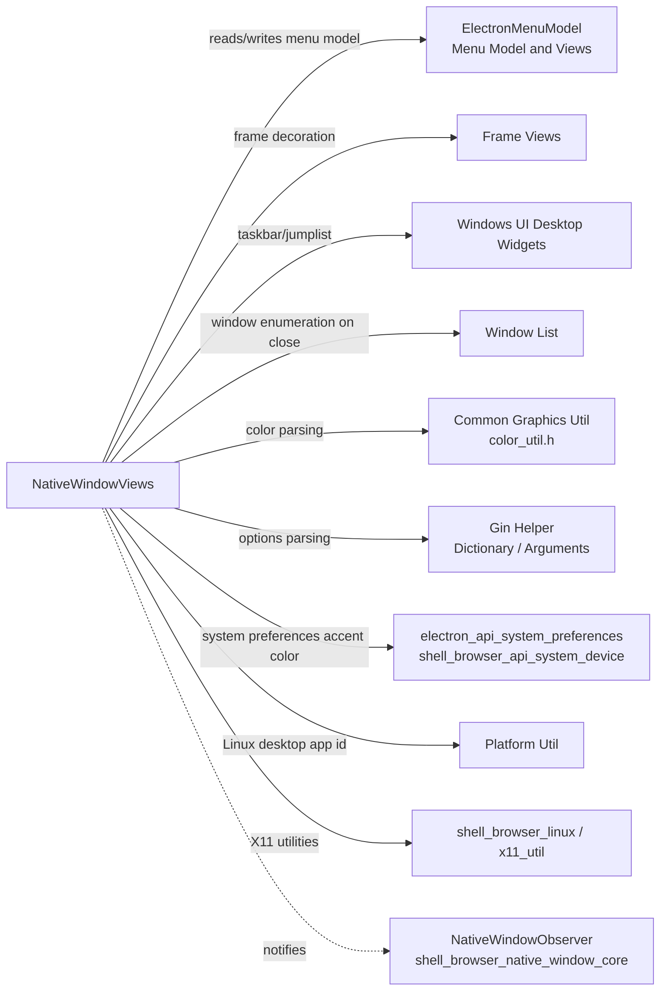

# Shell Browser Native Window Views

## Introduction

`shell_browser_native_window_views` provides the **Views-toolkit backed** implementation of Electron's cross-platform `NativeWindow` abstraction. It is compiled on **Windows** and **Linux** (the macOS equivalent lives in [shell_browser_native_window_mac](shell_browser_native_window_mac.md)), and is responsible for turning the platform-agnostic window API exposed to JavaScript into concrete `views::Widget` objects, handling OS message loops, frame decoration, menu bars, taskbar integration, and window state transitions (maximize/minimize/fullscreen/always-on-top/etc.).

The module's centerpiece is the `NativeWindowViews` class, which:

- Subclasses `NativeWindow` (the platform-neutral base defined in [shell_browser_native_window_core](shell_browser_native_window_core.md)) and `views::WidgetObserver`/`ui::EventHandler`.
- Owns a `views::Widget` and a `RootView` (from [Menu (Model & Views)](Menu_%28Model_%26_Views%29.md)) that hosts the window's content view and optional in-window menu bar.
- Delegates frame painting to platform-specific `NonClientFrameView` implementations (see [Frame Views](Frame_Views.md)).
- Integrates with Windows-only facilities such as `TaskbarHost` (jump lists, thumbnail toolbars, progress bars) and with Linux-only facilities such as `GlobalMenuBarX11` and `EventDisabler`.

This document focuses on the internals of this module; for the JS-facing `BrowserWindow`/`BaseWindow` APIs that consume `NativeWindowViews`, see [shell_browser_api_window_ui](shell_browser_api_window_ui.md).

---

## 1. Purpose & Scope

| Concern | Handled here | Handled elsewhere |
|---|---|---|
| Cross-platform window contract | No (base class) | [shell_browser_native_window_core](shell_browser_native_window_core.md) (`NativeWindow`) |
| Views/Aura-backed window (Win/Linux) | **Yes** (`NativeWindowViews`) | — |
| Cocoa-backed window (macOS) | No | [shell_browser_native_window_mac](shell_browser_native_window_mac.md) |
| Frame/non-client area rendering | Delegates to frame view classes | [Frame Views](Frame_Views.md) |
| In-window (non-global) menu bar rendering | Uses `RootView`/`MenuBar` | [Menu (Model & Views)](Menu_%28Model_%26_Views%29.md) |
| Global (X11/DBus) menu bar | **Yes** (`GlobalMenuBarX11`) | [Menu (Model & Views)](Menu_%28Model_%26_Views%29.md) (class definition) |
| Windows taskbar (jump list, thumbnails, progress) | Uses `TaskbarHost` | [Windows UI (Desktop Widgets)](Windows_UI_%28Desktop_Widgets%29.md) |
| JS `BrowserWindow`/`BaseWindow` bindings | No | [shell_browser_api_window_ui](shell_browser_api_window_ui.md) |
| Window registry / lifecycle tracking | No | [Window List](Window_List.md) |

---

## 2. Component Inventory

| Component | File | Description |
|---|---|---|
| `NativeWindowViews` | `native_window_views.h/.cc` | Concrete `NativeWindow` implementation using the Chromium Views toolkit. Implements every pure-virtual method of `NativeWindow` (show/hide, resize, fullscreen, always-on-top, menu, taskbar/overlay icon, opacity, etc.) |
| `NativeWindowClientView` | `native_window_views.cc` (anonymous-namespace-adjacent) | A `views::ClientView` subclass that intercepts the OS "close" request and forwards it to `NativeWindowViews::NotifyWindowCloseButtonClicked()`, always returning `kCannotClose` so that Electron (JS) can veto/close the window itself. |
| `ClientFrameViewLinux` (fwd-declared) | consumed from [Frame Views](Frame_Views.md) | Custom-drawn, Wayland-friendly, non-client frame used when `has_frame() && has_client_frame()`. `NativeWindowViews::GetClientFrameViewLinux()` exposes it. |
| `GlobalMenuBarX11` (fwd-declared) | consumed from [Menu (Model & Views)](Menu_%28Model_%26_Views%29.md) | Publishes the window's menu via the `com.canonical.dbusmenu` protocol so desktop environments (Unity, KDE) can render it in a global menu bar instead of in-window. |
| `EventDisabler` (fwd-declared) | consumed from [Menu (Model & Views)](Menu_%28Model_%26_Views%29.md) | An `ui::EventRewriter` installed on the X11 `DesktopWindowTreeHostLinux` to swallow input events while the window is "disabled" (e.g., blocked by a modal child). |
| `gin_helper::Arguments` (fwd-declared) | [Gin Helper](Gin_Helper.md) | Used by `SetTitleBarOverlay()` to throw JS-visible errors when misused. |
| `TaskbarHost` (member, Windows only) | [Windows UI (Desktop Widgets)](Windows_UI_%28Desktop_Widgets%29.md) | Encapsulates `ITaskbarList3` COM usage: thumbnail toolbar buttons, progress bar, overlay icon, thumbnail clipping. |
| `RootView` (member) | [Menu (Model & Views)](Menu_%28Model_%26_Views%29.md) | Hosts the content view plus an optional in-window `MenuBar`; handles accelerator registration and Alt-key menu toggling. |

---

## 3. Class Architecture

For the full `NativeWindow` contract (shared with the macOS implementation), see [shell_browser_native_window_core](shell_browser_native_window_core.md). For frame-view class details, see [Frame Views](Frame_Views.md).

---

## 4. Module Position in the System

---

## 5. Window Creation Flow

`NativeWindow::Create()` is a factory defined only in this module (Windows/Linux builds), instantiating `NativeWindowViews` directly:

---

## 6. Frame View Selection

`CreateNonClientFrameView()` chooses the non-client (title bar / border) implementation based on platform and window options:

- **Windows**: Always `WinFrameView`, which itself composes `WinCaptionButtonContainer` (see [Frame Views](Frame_Views.md)).
- **Linux, frameless**: `OpaqueFrameView` (used also for custom-drawn *with* frame but no client-frame requirement).
- **Linux, framed, no client frame** (X11 with WM-drawn decorations): `NativeFrameView`.
- **Linux, framed + client frame** (e.g., Wayland where Electron must draw its own decorations): `ClientFrameViewLinux`, retrievable at runtime via `GetClientFrameViewLinux()`.

---

## 7. State Management & Widget Observation

`NativeWindowViews` mixes in `views::WidgetObserver` to react to the underlying `views::Widget` lifecycle and translate Views events into `NativeWindow` notifications consumed by JS listeners (`focus`, `blur`, `resize`, `move`, `closed`, etc.):

Additionally, `NativeWindowViews` implements `ui::EventHandler::OnMouseEvent` as a pre-target handler on the `aura::Window` to detect mouse-press events for resetting Alt-key menu state and (Linux) mapping mouse back/forward buttons to `NotifyWindowExecuteAppCommand`.

---

## 8. Enable/Disable & Modal Windows

Electron windows can be temporarily disabled while a modal child is open. `NativeWindowViews` tracks this with a reference count rather than a boolean, since multiple modal children may stack:

This mechanism is orthogonal to the explicit JS-driven `SetEnabled()`/`is_enabled_` flag; both gate the final `ShouldBeEnabled()` result.

---

## 9. Platform-Specific Feature Matrix

| Feature | Windows implementation | Linux implementation |
|---|---|---|
| Resizable/min-max size | `WS_THICKFRAME` toggling + `UpdateThickFrame()` | Emulated via `SetContentSizeConstraints` clamped to current size |
| Always-on-top "levels" | `behind_task_bar_` flag + `MoveBehindTaskBarIfNeeded()` (`FindWindow(Shell_TrayWnd)`) | Native `ui::ZOrderLevel` only; no dock-relative levels |
| Opacity | `SetLayeredWindowAttributes` (`WS_EX_LAYERED`) | Unsupported (`opacity_` pinned to `1.0`) |
| Ignore mouse events | `WS_EX_TRANSPARENT`/`WS_EX_LAYERED` toggling, optional mouse-message forwarding via `SubclassProc`/`MouseHookProc` | X11 input shape region (`shape().Rectangles`/`Mask`) |
| Menu bar | In-window `RootView`/`MenuBar` only | In-window `RootView`/`MenuBar` **or** `GlobalMenuBarX11` (DBus) when the desktop environment supports it |
| Taskbar/progress/jumplist | `TaskbarHost` (`ITaskbarList3`) | Unity launcher API (`unity::SetProgressFraction`) for progress only; see [shell_browser_linux](shell_browser_linux.md) |
| Background material (Mica/Acrylic) | `DwmSetWindowAttribute(DWMWA_SYSTEMBACKDROP_TYPE)` (Win11 22H2+) | Not supported |
| Window icon | `WM_SETICON` with small/large `HICON` | `DesktopWindowTreeHostLinux::SetWindowIcons` |
| Parent/child ownership | `GWLP_HWNDPARENT` | `WM_TRANSIENT_FOR` X11 property |
| Dark theme hint | N/A (handled via `SetAccentColor`) | `_GTK_THEME_VARIANT` X11 property |

---

## 10. Key Interactions with Other Modules

- **Menu wiring**: `SetMenu()` chooses between the in-process `RootView` menu bar and, on Linux desktop environments that advertise `supports_global_application_menus`, a lazily-created `GlobalMenuBarX11`. See [Menu (Model & Views)](Menu_%28Model_%26_Views%29.md).
- **Window enumeration**: `Close()` consults `WindowList::WindowCloseCancelled(this)` when the window has been marked non-closable, integrating with the global window registry described in [Window List](Window_List.md).
- **Content view plumbing**: `SetContentView()` swaps the child `views::View` under `RootView::GetMainView()`; the content view is typically a `WebView`/`InspectableWebContentsView` supplied by [shell_browser_api_webcontents](shell_browser_api_webcontents.md) or [Inspectable Web Contents](Inspectable_Web_Contents.md).

---

## 11. Notable Implementation Details

- **`NativeWindowClientView::OnWindowCloseRequested()`** always returns `views::CloseRequestResult::kCannotClose`. This is intentional: Electron's close semantics are driven from JS (`close`/`beforeunload` events), so the native Views layer never unilaterally closes the window; `NativeWindow::Close()` performs the actual `widget()->Close()` after JS has had a chance to veto.
- **Transparent/frameless windows on Windows** receive special-cased `Maximize()`/`Unmaximize()`/`Restore()`/`IsMaximized()` logic that manually resizes to the display's work area instead of using native Win32 maximize, because transparent windows cannot reliably use `WS_MAXIMIZE`.
- **`GetContentSizeConstraints()` (Windows only)** deliberately reproduces a Chromium rounding quirk (`WindowSizeToContentSizeBuggy`) so that min/max size constraints match what Chromium's `HWNDMessageHandler::OnGetMinMaxInfo` computes, avoiding off-by-one-pixel resize glitches.
- **Background material (Mica/Acrylic/Tabbed)** is only wired up on Windows 11 22H2+ and requires synchronizing translucency state across `ElectronDesktopWindowTreeHostWin` and `ElectronDesktopNativeWidgetAura` in addition to calling `DwmSetWindowAttribute`.
- **Mouse-message forwarding** (`SetForwardMouseMessages`, `SubclassProc`, `MouseHookProc`) is a Windows-only mechanism enabling click-through windows (`ignore=true, forward=true`) to still deliver mouse move/enter/leave events to the app for custom hover UI, using a static `HHOOK` and a process-wide set of forwarding windows.

---

## Related Modules

- [shell_browser_native_window_core](shell_browser_native_window_core.md) — the `NativeWindow` base class and cross-platform window contract.
- [shell_browser_native_window_mac](shell_browser_native_window_mac.md) — the Cocoa-backed sibling implementation.
- [shell_browser_native_window_support](shell_browser_native_window_support.md) — `ChildWebContentsTracker` and draggable-region support shared across window backends.
- [shell_browser_api_window_ui](shell_browser_api_window_ui.md) — JS-facing `BrowserWindow`, `BaseWindow`, `Menu`, `Tray`, and `View` bindings that ultimately drive `NativeWindowViews`.
- [Frame Views](Frame_Views.md) — `OpaqueFrameView`, `NativeFrameView`, `WinFrameView`, `ClientFrameViewLinux`, and related caption-button widgets.
- [Menu (Model & Views)](Menu_%28Model_%26_Views%29.md) — `RootView`, `MenuBar`, `GlobalMenuBarX11`, `EventDisabler`, `ElectronMenuModel`.
- [Windows UI (Desktop Widgets)](Windows_UI_%28Desktop_Widgets%29.md) — `TaskbarHost`, `ElectronDesktopNativeWidgetAura`, `ElectronDesktopWindowTreeHostWin`, jump lists.
- [Window List](Window_List.md) — global registry of `NativeWindow` instances.
- [Gin Helper](Gin_Helper.md) — `gin_helper::Dictionary`/`Arguments` used for options parsing and error reporting.
