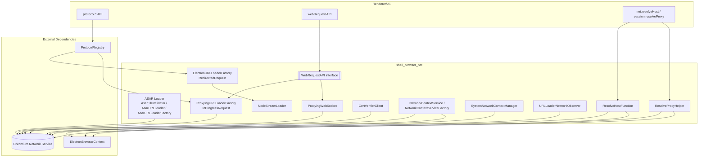
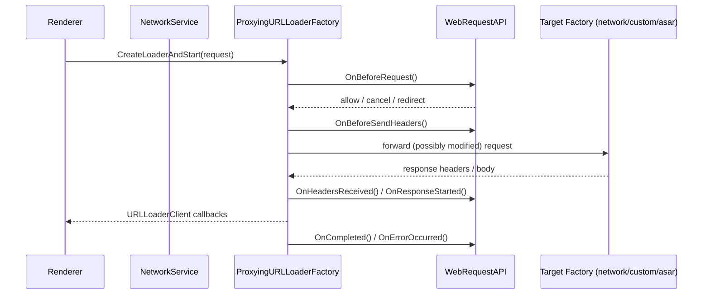

# Networking Layer (`shell_browser_net`)

## Purpose

The `shell_browser_net` module implements Electron's browser-process networking subsystem. It sits between Chromium's Network Service and Electron's higher-level JavaScript APIs (`protocol`, `session`, `net`, `webRequest`), providing the C++ plumbing that:

- Serves files packed inside **ASAR archives** through the standard `file://` URL loading pipeline, including cryptographic integrity validation.
- Implements **custom protocol registration** (`protocol.handle`/`registerXXXProtocol`) via a generic `URLLoaderFactory` that can serve buffers, strings, files, HTTP responses, or Node.js streams.
- **Intercepts and proxies** every network request and WebSocket handshake so that the `webRequest` API (`onBeforeRequest`, `onHeadersReceived`, etc.) and custom protocol interception can observe/modify traffic before it reaches the network.
- Manages **per-BrowserContext and system-wide `NetworkContext`** instances, including proxy configuration and TLS/cert-verifier wiring.
- Provides **DNS resolution** (`net.resolveHost`) and **proxy resolution** (`session.resolveProxy`) helpers backed by the Network Service's Mojo interfaces.
- Observes/authenticates network-level events (auth challenges, SSL errors, clear-site-data) through `URLLoaderNetworkObserver`.

This module is a child of the broader [Networking_Layer](Networking_Layer.md) group and works closely with [Protocol_Registry](Protocol_Registry.md), which owns the registered/intercepted protocol handler maps consumed here, and with [Browser_Context_&_Session_Management](shell_browser_context.md), which owns the `ElectronBrowserContext` that most of these classes take as a dependency.

## Architecture Overview

### Request flow (simplified)

## Sub-modules

| Sub-module | Description |
|---|---|
| [shell_browser_net_asar](shell_browser_net_asar.md) | Serves files from ASAR archives through the `file://` scheme, with streaming integrity (hash) validation. |
| [shell_browser_net_url_loader](shell_browser_net_url_loader.md) | Generic `URLLoaderFactory` implementation backing the JS `protocol` API (buffer/string/file/http/stream responses) and Node.js `Readable` stream bridging. |
| [shell_browser_net_proxying](shell_browser_net_proxying.md) | Intercepts HTTP(S) requests and WebSocket handshakes to implement the `webRequest` API and custom-protocol interception. |
| [shell_browser_net_context](shell_browser_net_context.md) | Per-`BrowserContext` and system-wide `NetworkContext` creation/configuration, including proxy config and cert verification wiring. |
| [shell_browser_net_resolution](shell_browser_net_resolution.md) | DNS host resolution, proxy resolution, and network-service-level event observation (auth, SSL errors, clear-site-data). |

## How this module fits into the system

- **[Protocol_Registry](Protocol_Registry.md)** owns the `HandlersMap` of registered/intercepted scheme handlers that `ElectronURLLoaderFactory` and `ProxyingURLLoaderFactory` consume to decide how to serve or intercept a given scheme.
- **[Browser_Context_&_Session_Management](shell_browser_context.md)** (`ElectronBrowserContext`) is the owning object for `ResolveProxyHelper`, `NetworkContextService`, and supplies the `SharedURLLoaderFactory` used throughout this module. The `session` and `net` JS APIs documented in [shell_browser_api_session_net](shell_browser_api_session_net.md) call directly into `ResolveProxyHelper`, `ResolveHostFunction`, and the protocol/session Mojo APIs implemented here.
- **[Extensions_Subsystem](shell_browser_extensions_core.md)** WebRequest-related extension APIs share the same `WebRequestAPI` interface consumed by `ProxyingURLLoaderFactory`/`ProxyingWebSocket`.
- **[Common_Native_Gin_Infrastructure](Asar.md)** provides the `asar::Archive`/`IntegrityPayload` types consumed by `AsarFileValidator` and the ASAR URL loader for archive parsing and integrity metadata.
- **[Browser_Process_Core_&_Lifecycle](shell_browser_main_parts_client_core_browser_client.md)** (`ElectronBrowserClient`) wires `ProxyingURLLoaderFactory`, `ProxyingWebSocket`, and `URLLoaderNetworkObserver` into Content's URL-loading and WebSocket-creation hooks.
