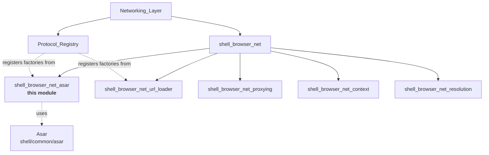
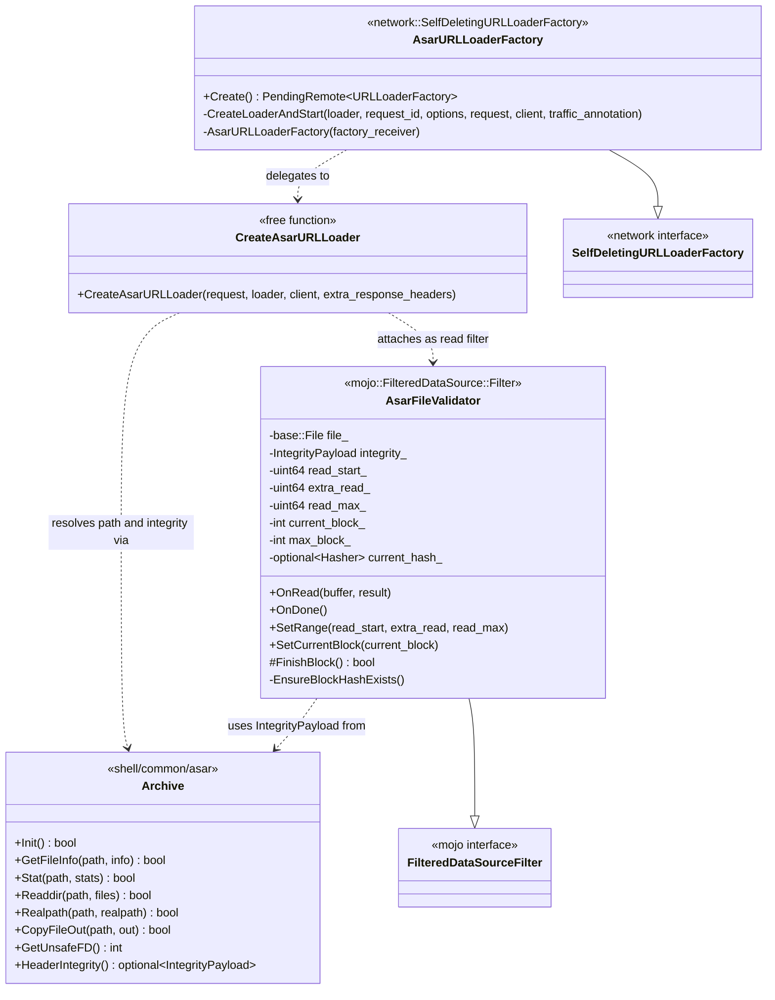
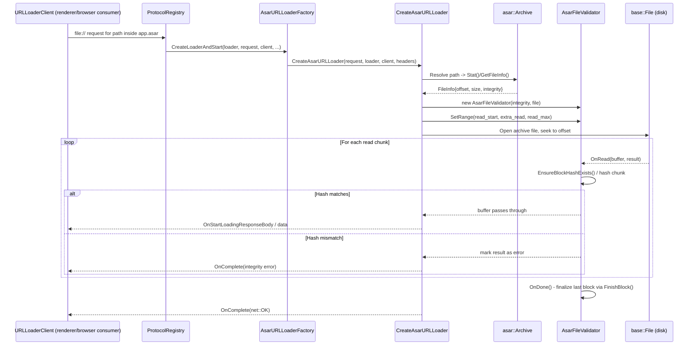
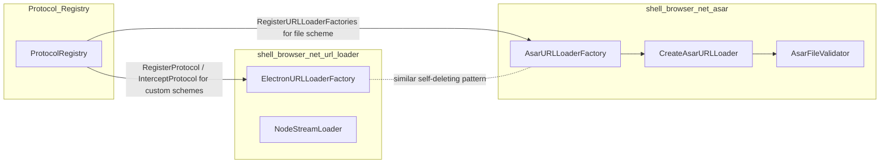
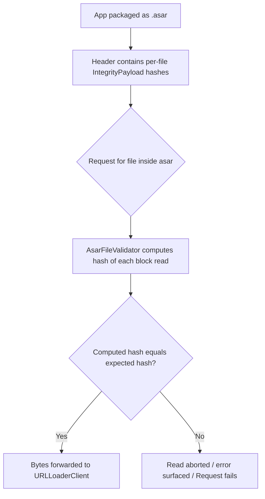

# `shell_browser_net_asar` Module Documentation

## Introduction

The **`shell_browser_net_asar`** module is a leaf sub-module of Electron's
[Networking Layer](Networking_Layer.md) (specifically of the
[`shell_browser_net`](shell_browser_net.md) group). It is responsible for
serving content that lives **inside `.asar` archives** through the standard
Chromium `network::mojom::URLLoader` / `URLLoaderFactory` Mojo interfaces.

When Electron packages an application, source files, resources and other
assets are frequently bundled into a single `.asar` archive (a tar-like
container format defined in the [`Asar`](Asar.md) common module). Renderer
and browser code, however, still needs to access these files as if they were
normal files on disk (e.g. via `file://` URLs, `require()`, or `fs` calls).
This module bridges that gap at the network layer: it intercepts `file://`
(and other) URL loads that target paths inside an `.asar` archive, transparently
extracts/streams the requested bytes, and — critically — **cryptographically
validates** the integrity of every byte served, protecting against tampering
of the packaged application.

The module has three primary responsibilities, one per file:

| Component | Responsibility |
|---|---|
| `AsarURLLoaderFactory` | Mojo `URLLoaderFactory` implementation that is registered for `file://`-like schemes and creates a loader for each request that targets a path inside (or outside) an asar archive. |
| `CreateAsarURLLoader` (in `asar_url_loader.h`) | Free function that does the actual work of resolving a URL to a location inside an archive (or a plain file) and starts streaming the response back to the requester. |
| `AsarFileValidator` | A `mojo::FilteredDataSource::Filter` that hashes each block of data as it is read from disk and compares it against the integrity metadata stored in the archive header, aborting the read if validation fails. |

## Position in the System

The module sits at a specific, well-scoped point in the URL-loading pipeline:
it is one of several **non-network URL loader factories** that
[`ProtocolRegistry`](Protocol_Registry.md) and
[`ElectronBrowserContext`](shell_browser_context.md) install for `file:` and
custom schemes. Once installed, any `file://` request whose path resolves
into an `.asar` file is transparently handled here rather than going through
the OS filesystem loader directly.

It depends on:
- **[`Asar`](Asar.md)** (`shell/common/asar/archive.h`, `asar_util.h`) — the
  archive-format parser that knows how to look up file offsets/sizes and
  integrity hashes (`IntegrityPayload`) inside a `.asar` container.
- Chromium's **Mojo** `network::mojom::URLLoader` / `URLLoaderFactory` /
  `SelfDeletingURLLoaderFactory` interfaces, and `mojo::FileDataSource` /
  `mojo::FilteredDataSource` for streaming file bytes with an interposed
  filter.

It is depended on by:
- **[`Protocol_Registry`](Protocol_Registry.md)**, which registers the
  factory produced by `AsarURLLoaderFactory::Create()` for handling
  `file://`-scheme non-network navigations and subresource loads.
- **[`shell_browser_context`](shell_browser_context.md)**, indirectly, since
  `ElectronBrowserContext` wires up `ProtocolRegistry` during browser
  context construction.

## Architecture

### Key design points

- **`AsarURLLoaderFactory`** follows the `SelfDeletingURLLoaderFactory`
  pattern used throughout Electron's non-network loaders: it deletes itself
  once its Mojo receiver disconnects, so callers only need to hold the
  `PendingRemote` returned by `Create()`.
- **`CreateAsarURLLoader`** is intentionally a free function (not a class)
  because loader lifetime is entirely managed via Mojo bindings
  (`PendingReceiver<URLLoader>` / `PendingRemote<URLLoaderClient>`) rather
  than an owning C++ object graph — this mirrors the pattern in the sibling
  [`shell_browser_net_url_loader`](shell_browser_net_url_loader.md) module's
  `NodeStreamLoader`.
- **`AsarFileValidator`** is a *filter*, not a data source itself. It is
  composed into a `mojo::FilteredDataSource` wrapping a
  `mojo::FileDataSource`, intercepting each `OnRead` callback to verify
  block-level hashes before data is forwarded to the client, and calling
  `OnDone` to check that the terminal/partial block was fully validated.
  This design cleanly separates *I/O* (handled by `mojo::FileDataSource`)
  from *integrity checking* (handled here), following the decorator pattern.

## Data Flow: Serving a File Inside an `.asar` Archive

### Notes on the flow

1. **Resolution** — `CreateAsarURLLoader` uses the `asar` archive APIs
   (see [`Asar`](Asar.md)) to translate the request path into either:
   - an offset/size range inside a `.asar` file (packed asset), or
   - a real filesystem path (unpacked asset, e.g. native `.node` binaries
     marked `unpacked` in `Archive::FileInfo`).
2. **Streaming with validation** — For packed files, a
   `mojo::FileDataSource` reads raw bytes from the underlying archive file
   descriptor (`Archive::GetUnsafeFD()`), and the response is wrapped in a
   `mojo::FilteredDataSource` using `AsarFileValidator` as the filter. This
   guarantees that **no unvalidated byte ever reaches the client** — even
   though the OS-level read might be optimistically buffered.
3. **Block-based hashing** — `IntegrityPayload` (from `shell/common/asar/archive.h`)
   stores a hash-per-block scheme; `AsarFileValidator` tracks `current_block_`
   / `max_block_` and accumulates `current_hash_byte_count_` /
   `total_hash_byte_count_` to know exactly when a block's hash is complete
   and can be checked (`FinishBlock()`), including the special-case partial
   final block handled in `OnDone()`.
4. **Range requests** — `SetRange(read_start, extra_read, read_max)` supports
   partial/ranged reads (e.g. HTTP Range requests or resumed streams) while
   still being able to correctly align to hash-block boundaries — `extra_read_`
   represents bytes consumed purely for hash computation that are not
   forwarded to the actual response body.

## Component Interaction Within `shell_browser_net`

`AsarURLLoaderFactory` and `ElectronURLLoaderFactory`
(from [`shell_browser_net_url_loader`](shell_browser_net_url_loader.md)) are
structural siblings: both extend
`network::SelfDeletingURLLoaderFactory` and are registered by
[`ProtocolRegistry`](Protocol_Registry.md). The key difference is scope —
`AsarURLLoaderFactory` is specialized purely for transparently reading
archive-packed application files (with integrity verification), whereas
`ElectronURLLoaderFactory` implements the full user-scriptable
`protocol.registerFileProtocol` / `registerBufferProtocol` /
`registerStreamProtocol` / `registerHttpProtocol` surface exposed to JS via
the `session.protocol` API (see
[`shell_browser_api_session_net_protocol_netlog`](shell_browser_api_session_net_protocol_netlog.md)).

## Security Model

This validator is Electron's core defense against **asar tampering
attacks**, where an attacker modifies the contents of a shipped `.asar`
archive without recomputing the application's code-signature-protected
header. Because `AsarFileValidator` re-hashes data on every read (not just
once at startup), even runtime modification of the archive file on disk
after the app has launched will be detected and the offending read will
fail rather than silently serving corrupted or malicious bytes.

## Related Modules

- [`Asar`](Asar.md) — the underlying archive format library
  (`Archive`, `IntegrityPayload`, `ScopedTemporaryFile`) consumed by this
  module to resolve paths and obtain integrity metadata.
- [`shell_browser_net`](shell_browser_net.md) — parent module grouping all
  browser-process networking components.
- [`shell_browser_net_url_loader`](shell_browser_net_url_loader.md) — sibling
  module providing the general-purpose custom-protocol URL loader
  (`ElectronURLLoaderFactory`) and Node stream loader (`NodeStreamLoader`).
- [`shell_browser_net_proxying`](shell_browser_net_proxying.md) — sibling
  module implementing `webRequest`-style request/response interception
  (`ProxyingURLLoaderFactory`, `ProxyingWebSocket`).
- [`shell_browser_net_context`](shell_browser_net_context.md) — sibling
  module managing `NetworkContextService` / `SystemNetworkContextManager`
  that ultimately own/host the network service these loaders plug into.
- [`Protocol_Registry`](Protocol_Registry.md) — the registry that installs
  `AsarURLLoaderFactory`'s produced remote for the `file:` scheme and
  dispatches other custom-scheme handlers.
- [`shell_browser_context`](shell_browser_context.md) — owns the
  `ProtocolRegistry` per `BrowserContext`/`Session`.
- [`shell_browser_api_session_net_protocol_netlog`](shell_browser_api_session_net_protocol_netlog.md) —
  JS-facing `protocol` API (`electron_api_protocol.h/.cc`) that lets user
  code register custom protocol handlers alongside the built-in asar
  handling described here.
