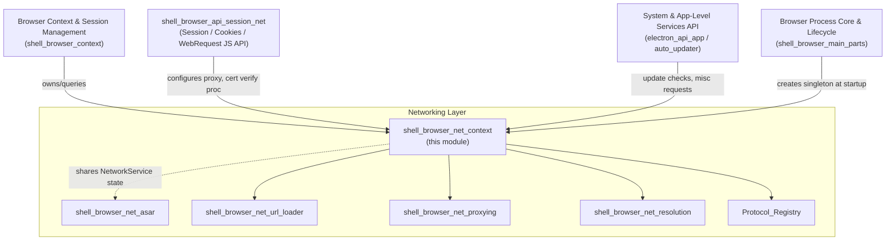
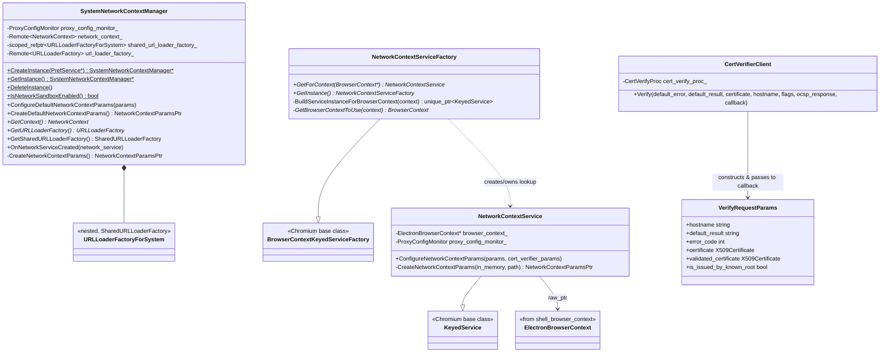
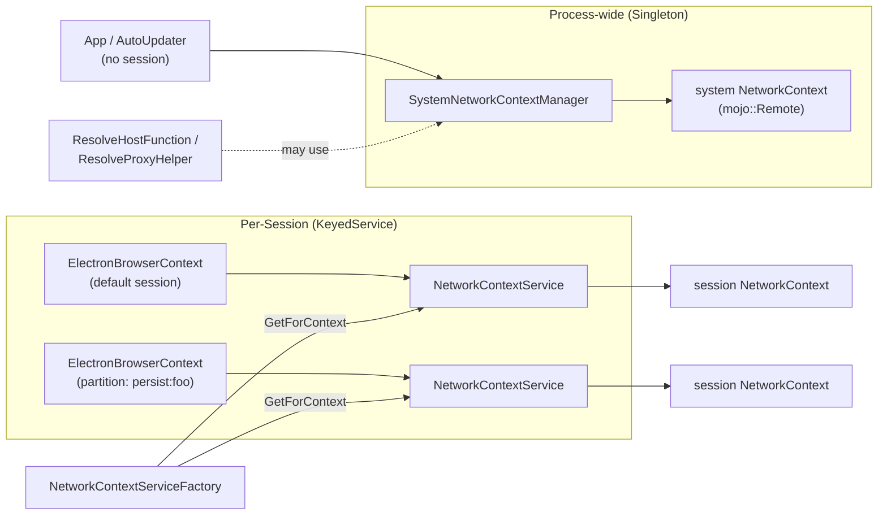
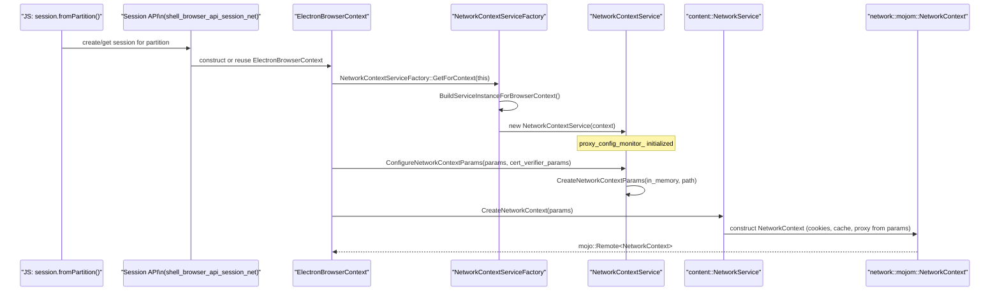
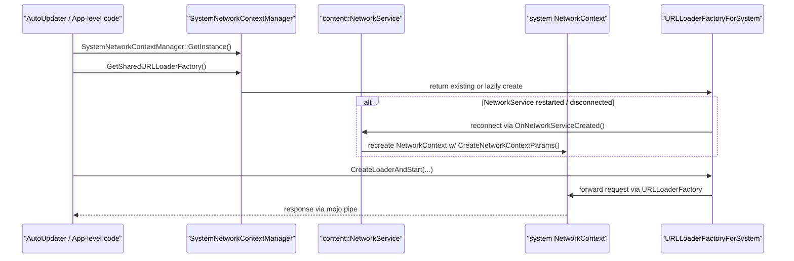
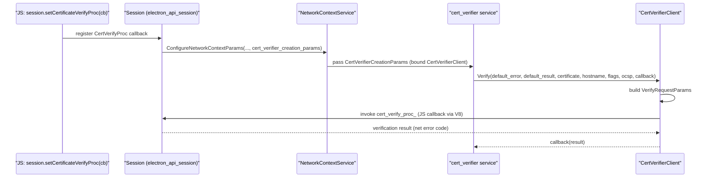
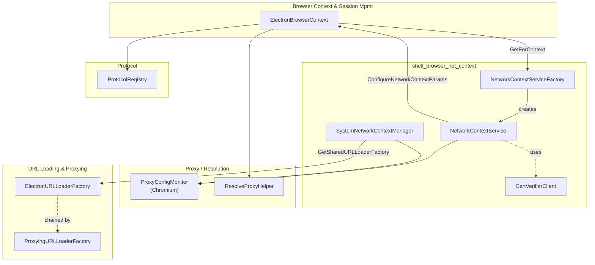

# Network Context Service (`shell_browser_net_context`)

## Introduction

The **Network Context Service** module is the layer inside Electron's C++ browser process that owns and configures Chromium's `network::mojom::NetworkContext` instances — the low-level objects that back every HTTP(S)/WebSocket request, cookie jar, cache, and proxy resolution performed by the app.

It provides two complementary responsibilities:

1. **Per-`BrowserContext` network configuration** — via `NetworkContextService` / `NetworkContextServiceFactory`, each Electron `Session` (backed by an `ElectronBrowserContext`) gets its own configured `NetworkContextParams` (cookie store location, cache path, proxy settings, HTTP auth, etc.).
2. **Process-wide ("system") networking** — via `SystemNetworkContextManager`, a singleton that owns the `NetworkContext` used for requests that are *not* tied to any particular session (e.g. update checks, crash reporting, DNS/proxy resolution helpers), and that also configures global `NetworkService` state shared by all contexts.

Additionally, `CertVerifierClient` bridges Chromium's out-of-process certificate verification service back into Electron's JS-configurable `setCertificateVerifyProc` callback mechanism, allowing custom TLS certificate trust decisions to be threaded through the network stack.

This module sits at the heart of the [Networking Layer](Networking_Layer.md) and is a direct dependency of session/browser-context management, URL loading, proxying, and host/proxy resolution.

---

## Module Position in the System

See also: [Networking_Layer.md](Networking_Layer.md) for the parent module overview, and [shell_browser_context.md](shell_browser_context.md) for how `ElectronBrowserContext` (the owner of a `NetworkContextService`) is created and managed.

---

## Core Components

| Component | File | Responsibility |
|---|---|---|
| `NetworkContextService` | `shell/browser/net/network_context_service.h` | `KeyedService` — one instance per `BrowserContext`/`ElectronBrowserContext`. Builds `NetworkContextParams` for that session (cookies, cache, proxy). |
| `NetworkContextServiceFactory` | `shell/browser/net/network_context_service_factory.h` | `BrowserContextKeyedServiceFactory` singleton that creates/looks up the `NetworkContextService` for a given `BrowserContext`. |
| `SystemNetworkContextManager` | `shell/browser/net/system_network_context_manager.h` | Global (process-wide) singleton owning the "system" `NetworkContext`, not tied to any session. Also configures global `NetworkService` parameters (e.g. HTTP auth dynamic params). |
| `SystemNetworkContextManager::URLLoaderFactoryForSystem` | (nested, same header) | `SharedURLLoaderFactory` implementation wrapping the system `NetworkContext`'s `URLLoaderFactory`, reconnecting automatically if the underlying mojo pipe disconnects. |
| `CertVerifierClient` | `shell/browser/net/cert_verifier_client.h` | Implements `network::mojom::CertVerifierClient`; receives certificate verification results from the network/cert-verifier service and forwards them to a JS-overridable `CertVerifyProc` callback. |
| `VerifyRequestParams` | `shell/browser/net/cert_verifier_client.h` | POD struct carrying hostname, default verify result, error code, certificate chain, and known-root flag into the custom verify callback. |

---

## Architecture Diagram

---

## Two Networking Scopes: Per-Session vs. System

Electron applications may have many `Session`s (default session + any custom `partition` sessions created from JS). Each maps to one `ElectronBrowserContext`. However, some browser-process work (auto-update checks, crash reporting uploads, proxy/host resolution helpers not bound to a page) needs networking **without** a session context. These two needs are served by two distinct singletons/keyed-services:

- **`NetworkContextService`** is looked up per `BrowserContext` through `NetworkContextServiceFactory::GetForContext()`, mirroring the pattern used by other per-context keyed services in Electron such as `HidChooserContextFactory`, `UsbChooserContextFactory`, and `BadgeManagerFactory` (see [Device_&_Peripheral_Access.md](Device_&_Peripheral_Access.md) and [System_&_App-Level_Services_API.md](System_&_App-Level_Services_API.md)).
- **`SystemNetworkContextManager`** is a plain singleton (`CreateInstance` / `GetInstance` / `DeleteInstance`), created once during [browser process startup](shell_browser_main_parts.md) and torn down at shutdown.

---

## Process / Data Flow

### 1. Session `NetworkContext` creation

### 2. System (session-less) request

### 3. Custom certificate verification

This flow is what backs the public `ses.setCertificateVerifyProc()` JS API, defined in [`shell_browser_api_session_net_session_core`](shell_browser_api_session_net.md).

---

## Component Interaction Overview

---

## Key Design Notes

- **`raw_ptr<ElectronBrowserContext>`**: `NetworkContextService` holds a non-owning back-reference to its owning `ElectronBrowserContext`; lifetime is managed by the `KeyedService`/`BrowserContextKeyedServiceFactory` framework, which guarantees the service is destroyed before (or alongside) its `BrowserContext`.
- **`ProxyConfigMonitor`**: Both `NetworkContextService` (per-session) and `SystemNetworkContextManager` (system-wide) embed their own `ProxyConfigMonitor` instance, since proxy configuration can differ between individual sessions (via `ses.setProxy()`) and the OS/system-level default used for session-less requests.
- **In-memory vs. persistent contexts**: `CreateNetworkContextParams(bool in_memory, const base::FilePath& path)` on `NetworkContextService` determines whether cookies/cache are written to disk (persistent partitions) or kept purely in memory (in-memory/incognito-style sessions).
- **Resilience to `NetworkService` crashes**: `SystemNetworkContextManager::URLLoaderFactoryForSystem` and `OnNetworkServiceCreated()` exist specifically to reconnect mojo pipes automatically if the underlying network process/service restarts, avoiding the need for every system-level caller to manually handle disconnection.
- **Sandboxing**: `SystemNetworkContextManager::IsNetworkSandboxEnabled()` is a static helper callable even before the singleton is constructed, used during early startup policy decisions.

---

## Related Modules

- [Networking_Layer.md](Networking_Layer.md) — parent module; overview of ASAR loading, URL loader factories, proxying, and host/proxy resolution that build on top of the `NetworkContext`s created here.
- [shell_browser_net_asar.md](shell_browser_net_asar.md) — serves `file://`/`asar://` resources through a URL loader factory registered against a `NetworkContext`.
- [shell_browser_net_url_loader.md](shell_browser_net_url_loader.md) — custom protocol and Node stream URL loader factories that plug into the network stack configured here.
- [shell_browser_net_proxying.md](shell_browser_net_proxying.md) — intercepting/proxying `URLLoaderFactory` and WebSocket implementations used to support `webRequest` and extension APIs.
- [shell_browser_net_resolution.md](shell_browser_net_resolution.md) — `ResolveHostFunction`/`ResolveProxyHelper`, which query the `NetworkContext`'s host resolver and proxy resolver.
- [Protocol_Registry.md](Protocol_Registry.md) — per-`BrowserContext` registry of custom protocol handlers, consulted when building `NetworkContextParams`.
- [shell_browser_context.md](shell_browser_context.md) — `ElectronBrowserContext`, the owning object for each `NetworkContextService` instance.
- [shell_browser_api_session_net.md](shell_browser_api_session_net.md) — JS-facing `Session`/`Cookies`/`WebRequest` APIs that ultimately configure proxy settings and certificate verification through this module.
- [System_&_App-Level_Services_API.md](System_&_App-Level_Services_API.md) — consumers of the system-wide `NetworkContext` (e.g., `AutoUpdater`).
- [shell_browser_main_parts.md](shell_browser_main_parts.md) — browser process startup sequence where `SystemNetworkContextManager::CreateInstance()` is invoked.
