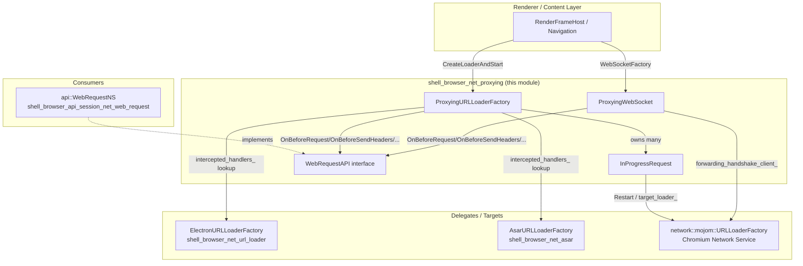
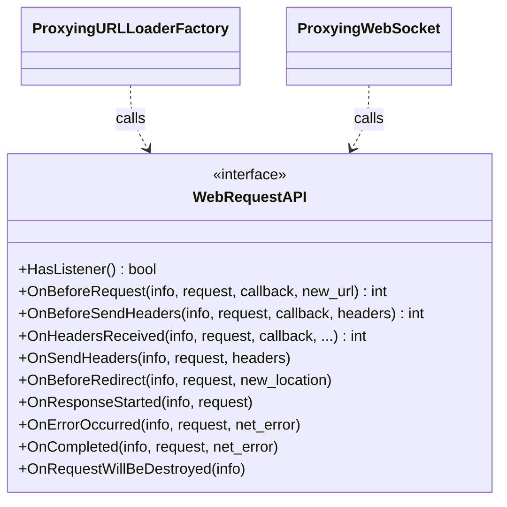
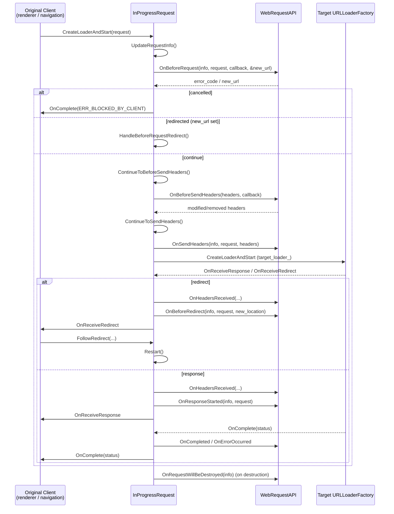
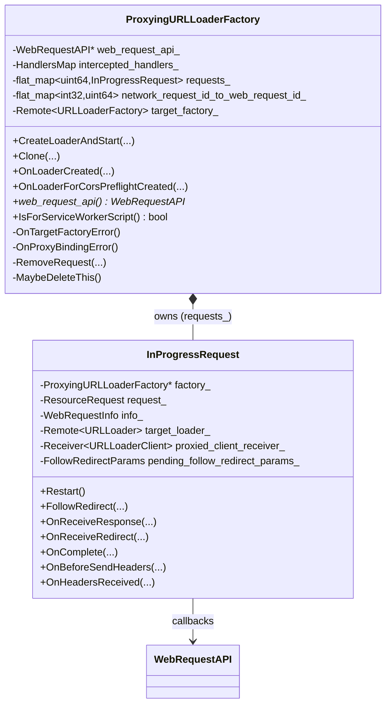
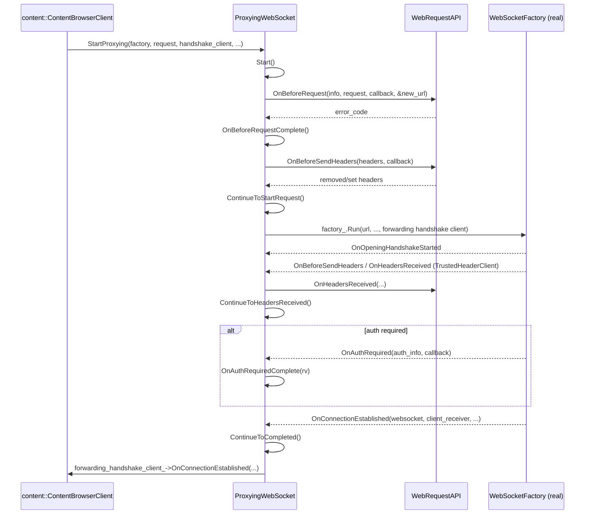
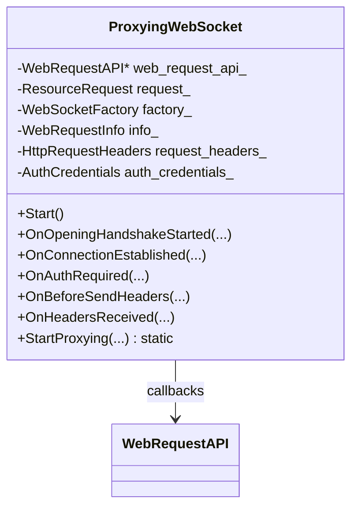
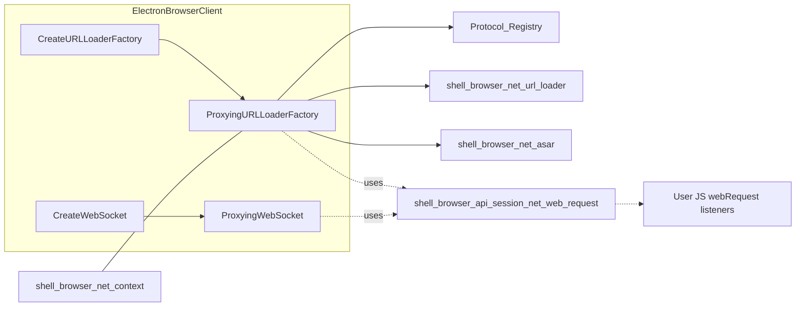

# Shell Browser Net Proxying

## Introduction

The **Shell Browser Net Proxying** module is the heart of Electron's network
interception pipeline. It sits between the Chromium `network::mojom` network
service and the rest of the browser process, giving Electron the ability to:

- Implement the `webRequest` JS module (observing/blocking/modifying
  HTTP(S) requests, responses, and headers at every stage of a request's
  lifecycle).
- Support custom/intercepted protocol handlers registered through
  `protocol.interceptXxxProtocol` (in cooperation with
  [shell_browser_net_url_loader](shell_browser_net_url_loader.md)).
- Proxy WebSocket handshakes so that the same `webRequest` event hooks fire
  for `ws://`/`wss://` connections as they do for regular HTTP requests.

It does **not** implement the JS-facing `WebRequest` API itself — that lives
in [shell_browser_api_session_net_web_request](shell_browser_api_session_net_web_request.md).
Instead, this module defines the abstract `WebRequestAPI` contract and the
Mojo-facing proxy objects (`ProxyingURLLoaderFactory`, `ProxyingWebSocket`)
that *call into* that implementation at the appropriate points in a
request's life.

This module is a direct sibling of, and closely collaborates with:

- [shell_browser_net_url_loader](shell_browser_net_url_loader.md) — custom
  protocol handling (`ElectronURLLoaderFactory`) that the proxying factory
  delegates to via `intercepted_handlers_`.
- [shell_browser_net_asar](shell_browser_net_asar.md) — serving files packed
  inside `.asar` archives through a dedicated URL loader factory.
- [shell_browser_net_context](shell_browser_net_context.md) — the
  `NetworkContextService`/`SystemNetworkContextManager` that wires these
  factories into Chromium's network service.
- [shell_browser_net_resolution](shell_browser_net_resolution.md) — DNS/proxy
  resolution helpers used elsewhere in the networking stack.
- [Protocol_Registry](Protocol_Registry.md) — the registry of custom scheme
  handlers consulted by `ProxyingURLLoaderFactory`.

## Purpose & Scope

| Concern | Component |
|---|---|
| Proxy regular URL loader requests (HTTP/HTTPS/custom schemes) and fire `webRequest` events | `ProxyingURLLoaderFactory` / `ProxyingURLLoaderFactory::InProgressRequest` |
| Proxy WebSocket handshakes and fire `webRequest` events | `ProxyingWebSocket` |
| Decouple the proxy classes from the concrete `api::WebRequestNS` implementation | `WebRequestAPI` (interface) |

Because `network::mojom::URLLoaderFactory` and `WebSocketHandshakeClient` are
Mojo interfaces implemented deep in the browser process's network
plumbing, the classes in this module are heavily asynchronous and
callback/continuation driven. Understanding the request lifecycle
state-machine is key to understanding this module.

## Architecture Overview

## Component Breakdown

### 1. `WebRequestAPI` (interface)
`shell/browser/net/web_request_api_interface.h`

A pure-virtual contract implemented by `api::WebRequestNS`
(see [shell_browser_api_session_net_web_request](shell_browser_api_session_net_web_request.md)).
It exists so that the low-level Mojo proxy classes in this module do not
need to depend on (or be compiled with) the `gin`/V8 JS binding code —
keeping the networking layer decoupled from the JS API layer.

Key methods mirror the stages of the Chrome extensions `webRequest` API:

- `HasListener()` — fast-path check to skip proxying work entirely when no
  JS listeners are registered.
- `OnBeforeRequest(info, request, callback, new_url)` — allows
  cancelling/redirecting a request before it starts.
- `OnBeforeSendHeaders(info, request, callback, headers)` — allows mutating
  request headers.
- `OnHeadersReceived(info, request, callback, original_response_headers, override_response_headers, allowed_unsafe_redirect_url)` —
  allows mutating/overriding response headers or redirecting.
- `OnSendHeaders`, `OnBeforeRedirect`, `OnResponseStarted`,
  `OnErrorOccurred`, `OnCompleted`, `OnRequestWillBeDestroyed` — lifecycle
  notifications with no ability to alter behavior (fire only).

### 2. `ProxyingURLLoaderFactory` & `InProgressRequest`
`shell/browser/net/proxying_url_loader_factory.h`

`ProxyingURLLoaderFactory` implements
`network::mojom::URLLoaderFactory` and
`network::mojom::TrustedURLLoaderHeaderClient`. It is instantiated per
frame/render-process pairing (see `render_process_id_`,
`frame_routing_id_`) and stands in front of a real target
`network::mojom::URLLoaderFactory` (`target_factory_`), which may be:

- The default Chromium network-service factory, or
- A custom scheme handler resolved through `intercepted_handlers_`
  (a `HandlersMap` populated by `protocol.interceptXxxProtocol`, see
  [Protocol_Registry](Protocol_Registry.md) and
  [shell_browser_net_url_loader](shell_browser_net_url_loader.md)).

Responsibilities:

1. **Interception dispatch** — every task-facing use case Electron cares
   about (custom protocols + `webRequest`) is funneled through
   `CreateLoaderAndStart`, which creates an `InProgressRequest`.
2. **Header client wiring** — if any `webRequest` listener needs to inspect
   or mutate headers (`has_any_extra_headers_listeners_`), requests are
   issued with `network::mojom::kURLLoadOptionUseHeaderClient` so that the
   network process calls back into `OnBeforeSendHeaders`/`OnHeadersReceived`
   via the `TrustedHeaderClient` Mojo interface bound in
   `header_client_receiver_`.
3. **Lifetime management** — tracks all in-flight requests in the
   `requests_` map (keyed by an internally generated `request_id`, distinct
   from the network stack's own `network_service_request_id`), and
   self-deletes (`MaybeDeleteThis`) once all receivers/requests are gone.
4. **CORS preflight support** — a second `InProgressRequest` constructor
   exists specifically for CORS preflight requests, which have a reduced
   lifecycle (no real network loader is created).

`InProgressRequest` is the actual per-request state machine. It implements
both `network::mojom::URLLoader` (facing the original requester) and
`network::mojom::URLLoaderClient` (facing the real/target loader), acting as
a transparent pass-through pipe that pauses at well-defined points to run
`WebRequestAPI` callbacks.

#### Request lifecycle state machine

Key internal helper methods and their roles:

- `UpdateRequestInfo()` / `RestartInternal()` — (re)build the
  `extensions::WebRequestInfo` snapshot and kick off (or restart, after a
  redirect) the pipeline from the top.
- `ContinueToBeforeSendHeaders` → `ContinueToSendHeaders` →
  `ContinueToStartRequest` — the "request phase" continuation chain, each
  step corresponding to one `WebRequestAPI` callback, chained via
  `net::CompletionOnceCallback`.
- `ContinueToHandleOverrideHeaders` → `ContinueToResponseStarted` /
  `ContinueToBeforeRedirect` — the "response phase" continuation chain.
- `HandleResponseOrRedirectHeaders` — shared logic entered whenever
  response headers arrive (whether the outcome is a normal response or a
  redirect), used to invoke `OnHeadersReceived`.
- `FollowRedirectParams` (nested struct) — buffers the `FollowRedirect()`
  arguments from the original client when
  `has_any_extra_headers_listeners_` is false, so they can later be merged
  with any header modifications extensions made.
- `OnRequestError` — central error/cancellation path, ensures
  `OnErrorOccurred`/`OnCompleted` fire and the client pipe is torn down
  cleanly.

### 3. `ProxyingWebSocket`
`shell/browser/net/proxying_websocket.h`

`ProxyingWebSocket` mirrors the `InProgressRequest` pattern but for the
WebSocket handshake protocol, implementing:

- `network::mojom::WebSocketHandshakeClient` — receives handshake
  lifecycle events (`OnOpeningHandshakeStarted`, `OnConnectionEstablished`,
  `OnFailure`) from the real `WebSocketFactory`.
- `network::mojom::WebSocketAuthenticationHandler` — handles HTTP auth
  challenges during the handshake (`OnAuthRequired`), with an
  `AuthRequiredResponse` enum (`kNoAction`, `kSetAuth`, `kCancelAuth`,
  `kIoPending`) describing how the challenge should be resolved,
  potentially asynchronously.
- `network::mojom::TrustedHeaderClient` — same header
  interception mechanism as `InProgressRequest`, gated by
  `has_extra_headers_`.

Because a WebSocket connection is created via a factory callback
(`WebSocketFactory`) rather than a Mojo interface bound directly to a
target, its constructor takes the `factory` callback itself and invokes it
after running through the `OnBeforeRequest`/`OnBeforeSendHeaders`
pipeline — see `ContinueToStartRequest`.

The static `StartProxying(...)` factory method is the primary entry point
used by `ElectronBrowserClient`
(see [shell_browser_main_parts_client_core_browser_client](shell_browser_main_parts_client_core_browser_client.md))
when Chromium requests a `WebSocketFactory` be wrapped.

#### WebSocket handshake flow

## How This Module Fits Into the Bigger Picture

- **`ElectronBrowserClient`** (documented in
  [shell_browser_main_parts_client_core_browser_client](shell_browser_main_parts_client_core_browser_client.md))
  is the glue that Chromium's `content` layer calls into
  (`CreateURLLoaderFactory`/`WillCreateURLLoaderFactory`,
  `CreateWebSocket`) to obtain proxied factories. It constructs
  `ProxyingURLLoaderFactory` and `ProxyingWebSocket` instances, injecting
  the concrete `WebRequestAPI*` obtained from the active `Session`'s
  `WebRequest` object.
- **`Session`/`WebRequest` JS API**
  ([shell_browser_api_session_net_web_request](shell_browser_api_session_net_web_request.md))
  implements `WebRequestAPI` and is where user JS callbacks
  (`session.webRequest.onBeforeRequest`, etc.) are actually invoked and
  their return values translated back into the `int`/`GURL*` out-params
  expected by this module.
- **Custom protocol handlers**
  ([shell_browser_net_url_loader](shell_browser_net_url_loader.md),
  [Protocol_Registry](Protocol_Registry.md)) are consulted by
  `ProxyingURLLoaderFactory` through the `intercepted_handlers_` map to
  decide whether a request should be redirected to a JS-defined handler
  instead of the normal network path.
- **`.asar` archive serving**
  ([shell_browser_net_asar](shell_browser_net_asar.md)) is one of several
  possible "target factories" that a proxied request can ultimately reach.

## Key Design Notes

- **Decoupling via interface**: `WebRequestAPI` deliberately avoids any
  dependency on `gin`/V8 types, keeping the proxying classes usable in
  contexts where the JS engine isn't relevant (e.g. potential future
  service-only builds), and keeping compile-time dependencies of the
  low-level networking code minimal.
- **Two levels of request identity**: internally generated `request_id`
  (stable across redirects, used as the key into `requests_` and exposed
  to the `WebRequestAPI`) vs. `network_service_request_id`/
  `network::mojom` in/out request IDs (only meaningful for the current
  leg of the request). `network_request_id_to_web_request_id_` bridges
  the two so `OnLoaderCreated`/`OnLoaderForCorsPreflightCreated` (identified
  by the network-service ID) can be matched back to the correct
  `InProgressRequest`.
- **Header client is opt-in per request**: `has_any_extra_headers_listeners_`
  is computed from whether any `webRequest` listener actually needs to see
  headers; this avoids the overhead of the `TrustedHeaderClient` Mojo round
  trip for requests nobody cares about.
- **Self-deleting factories**: Both `ProxyingURLLoaderFactory` (via
  `MaybeDeleteThis`) and the underlying `ElectronURLLoaderFactory`
  ([shell_browser_net_url_loader](shell_browser_net_url_loader.md)) follow
  Chromium's `SelfDeletingURLLoaderFactory`-style pattern: once all Mojo
  bindings/receivers are dropped, the object frees itself — there is no
  external owner keeping these alive.
- **CORS preflight special-casing**: `InProgressRequest` has a reduced
  constructor/code path for CORS preflight requests since they never reach
  a "real" target loader — they exist purely so `webRequest` events fire
  consistently for preflights too.

## Summary

This module has no further sub-modules of its own (it is a small, cohesive
pair of proxy classes plus one interface), so no additional documentation
pages are generated beneath it. Refer to the sibling modules linked above
for the full picture of how requests reach these proxies and where they
ultimately go.
