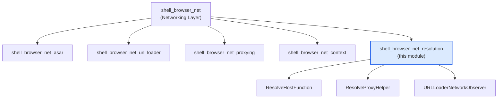
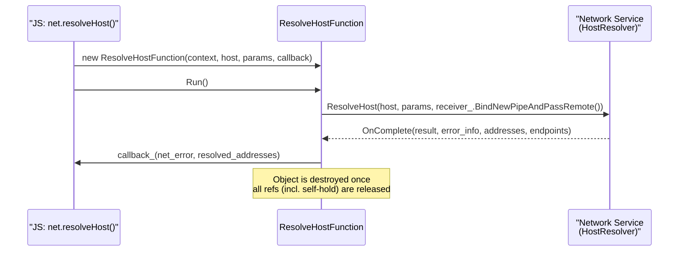
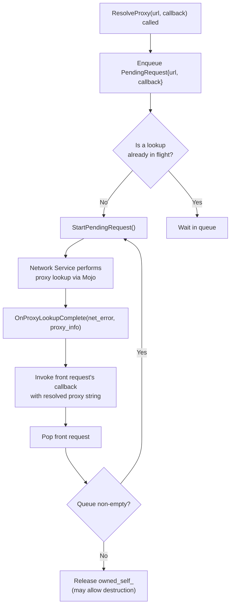
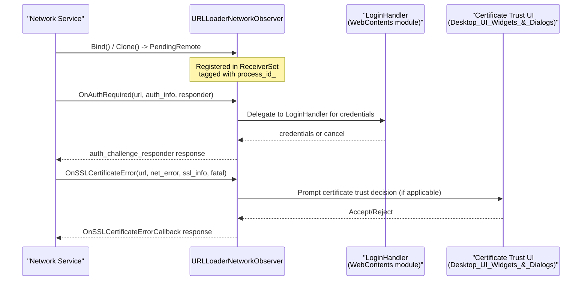
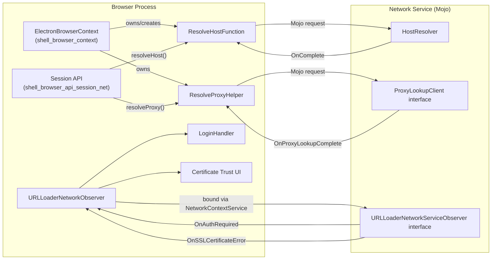
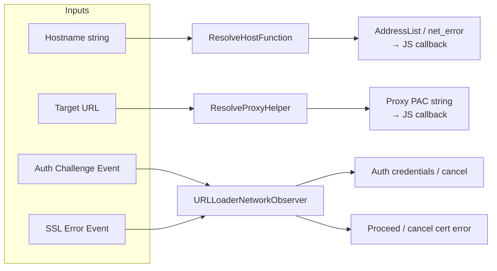

# Shell Browser Net Resolution

## Introduction

The **Shell Browser Net Resolution** module is a focused subsystem within Electron's [Networking Layer](shell_browser_net.md) that handles three distinct but related network resolution concerns in the browser process:

1. **DNS Host Resolution** (`ResolveHostFunction`) — resolves hostnames to IP addresses on behalf of renderer/JS-facing APIs (e.g. `net.resolveHost()`),
2. **Proxy Resolution** (`ResolveProxyHelper`) — determines the proxy configuration that should be used for a given URL (e.g. `session.resolveProxy()`),
3. **URL Loader Network Observation** (`URLLoaderNetworkObserver`) — implements the Chromium network service's `URLLoaderNetworkServiceObserver` interface to intercept and respond to network-level events such as authentication challenges, SSL certificate errors, and site-data clearing requests.

All three components act as bridges between Electron's browser-process code and the Chromium **Network Service**, which typically runs out-of-process (or in-process, depending on configuration) and communicates via Mojo IPC. This module effectively translates low-level network service callbacks into higher-level, easier-to-consume patterns (callbacks, queued requests, or IPC observation) usable by the rest of Electron.

This document describes the purpose, design and interactions of each component, along with how they fit into the surrounding networking and browser-context architecture.

---

## Module Position in the System

`shell_browser_net_resolution` is a child module of [`shell_browser_net`](shell_browser_net.md) (the broader **Networking Layer**), which itself sits underneath [`Browser_Context_&_Session_Management`](shell_browser_context.md). It is a sibling of:

- [`shell_browser_net_asar`](shell_browser_net_asar.md) — asar archive URL loading
- [`shell_browser_net_url_loader`](shell_browser_net_url_loader.md) — custom/electron URL loader factories
- [`shell_browser_net_proxying`](shell_browser_net_proxying.md) — request/response proxying and web-request interception
- [`shell_browser_net_context`](shell_browser_net_context.md) — `NetworkContextService` and `SystemNetworkContextManager`

---

## Core Components

### 1. `ResolveHostFunction`

**Purpose:** Performs a single asynchronous DNS resolution request against the network service's `HostResolver` and reports the result back via callback. It is the browser-process backing implementation for Electron's public `net.resolveHost(host, options)` JavaScript API (exposed from [`Common_API`](Common_API.md)'s URL/net bindings and [`shell_browser_context`](shell_browser_context.md)'s browser context).

**Design characteristics:**
- Reference-counted (`base::RefCountedThreadSafe`) so it can outlive the caller while a Mojo request is in flight.
- Implements `network::ResolveHostClientBase`, receiving the `OnComplete` callback from the network service.
- Holds a `raw_ptr` (weak, non-owning) to the owning `ElectronBrowserContext` (see [`shell_browser_context`](shell_browser_context.md)) — the context that supplies the network context/host resolver used for the lookup.
- Uses a `mojo::Receiver<network::mojom::ResolveHostClient>` bound to itself to receive completion notifications directly from the network service.
- Sequence-checked (`SEQUENCE_CHECKER`) to ensure correct thread/sequence usage.

**Key members:**
| Member | Type | Description |
|---|---|---|
| `browser_context_` | `raw_ptr<ElectronBrowserContext>` | Weak reference to the context providing network resources |
| `host_` | `std::string` | Hostname to resolve |
| `params_` | `network::mojom::ResolveHostParametersPtr` | Resolution parameters (e.g., DNS query type, source) |
| `callback_` | `ResolveHostCallback` | Invoked with `(net_error, optional<AddressList>)` on completion |
| `receiver_` | `mojo::Receiver<...>` | Bound to self; receives `OnComplete` |

**Lifecycle / Sequence:**

**Relationship to other modules:**
- Consumed by JS API bindings (see [`Common_API`](Common_API.md) — `electron_api_url_loader.h` / net APIs) that expose `resolveHost` to renderer/main-process JS.
- Depends on [`shell_browser_context`](shell_browser_context.md)'s `ElectronBrowserContext` for the network context.

---

### 2. `ResolveProxyHelper`

**Purpose:** Resolves the proxy configuration Chromium's network service would use for a given URL, exposing this to Electron's JS-facing `session.resolveProxy(url)` API. Unlike `ResolveHostFunction`, which handles a single request per instance, `ResolveProxyHelper` is designed as a **long-lived, queued request processor** — one helper instance (typically owned by the browser context/session) serially processes many proxy-lookup requests over its lifetime.

**Design characteristics:**
- Reference-counted (`base::RefCountedThreadSafe`), implements `network::mojom::ProxyLookupClient`.
- Maintains an internal FIFO queue (`base::circular_deque<PendingRequest>`) of pending lookups; only one lookup is in flight via `receiver_` at a time.
- Uses a **self-reference** (`owned_self_`) while a lookup is outstanding, ensuring the object isn't destroyed mid-request even if all external references drop.
- Holds a weak `raw_ptr<ElectronBrowserContext>` for accessing network context proxy-resolution services.

**Key members:**
| Member | Type | Description |
|---|---|---|
| `pending_requests_` | `base::circular_deque<PendingRequest>` | Queue of `{url, callback}` pairs awaiting resolution |
| `owned_self_` | `scoped_refptr<ResolveProxyHelper>` | Keeps object alive during an outstanding lookup |
| `receiver_` | `mojo::Receiver<network::mojom::ProxyLookupClient>` | Bound to self for `OnProxyLookupComplete` |
| `browser_context_` | `raw_ptr<ElectronBrowserContext>` | Weak reference to owning browser context |

**`PendingRequest` inner struct:** Simple move-only value type pairing a `GURL` with a `ResolveProxyCallback` (`base::OnceCallback<void(std::string)>`).

**Processing flow:**

**Relationship to other modules:**
- Owned/used by `Session`/`ElectronBrowserContext` objects in [`shell_browser_api_session_net`](shell_browser_api_session_net.md) and [`shell_browser_context`](shell_browser_context.md) to implement `session.resolveProxy()`.
- Complements `ProxyingURLLoaderFactory` in [`shell_browser_net_proxying`](shell_browser_net_proxying.md), though that module intercepts requests rather than performing standalone lookups.

---

### 3. `URLLoaderNetworkObserver`

**Purpose:** Implements `network::mojom::URLLoaderNetworkServiceObserver`, the Mojo interface the network service uses to notify the browser process of loader-level network events tied to a specific process/render context — most notably **HTTP authentication challenges**, **SSL certificate errors**, and **Clear-Site-Data** header handling. This is a critical integration point that allows Electron's browser process to intercept and drive the response to these network events (e.g., showing a login dialog, deciding whether to proceed past a cert error).

**Design characteristics:**
- Not ref-counted; instead uses `mojo::ReceiverSet` to support **multiple concurrent bindings** (`Bind()` can be called repeatedly, and `Clone()` allows the network service to create additional connected observers, e.g., per subframe or per fetch context).
- Tracks an associated `process_id_` (`base::ProcessId`) — used to correlate observer callbacks with the renderer/utility process that triggered them.
- Implements a long list of `URLLoaderNetworkServiceObserver` overrides; most are no-ops (defined inline) while the security/auth-critical ones (`OnAuthRequired`, `OnSSLCertificateError`, `OnClearSiteData`, `OnLoadingStateUpdate`, `OnSharedStorageHeaderReceived`) are implemented out-of-line.
- Uses `base::WeakPtrFactory` for safe async callback handling.

**Key members:**
| Member | Type | Description |
|---|---|---|
| `receivers_` | `mojo::ReceiverSet<network::mojom::URLLoaderNetworkServiceObserver>` | Supports multiple simultaneous Mojo bindings |
| `process_id_` | `base::ProcessId` | Identifies which process this observer instance is servicing |
| `weak_factory_` | `base::WeakPtrFactory<URLLoaderNetworkObserver>` | Safe weak-pointer generation for async operations |

**Key overridden events:**

| Event | Responsibility |
|---|---|
| `OnAuthRequired` | Triggered when a URL load requires HTTP auth; typically routed to Electron's [`LoginHandler`](WebContents_Rendering_&_Communication.md) (`shell/browser/login_handler.h`) to prompt the user or supply saved credentials. |
| `OnSSLCertificateError` | Invoked on SSL cert validation failure; the response callback determines whether to proceed, cancel, or defer to a user-facing certificate-trust UI (see [`UI_Dialogs`](UI_Dialogs.md) `certificate_trust.h`). |
| `OnClearSiteData` | Handles `Clear-Site-Data` response headers, coordinating storage/cookie clearing (ties into [`shell_browser_context`](shell_browser_context.md) storage partition APIs). |
| `OnLoadingStateUpdate` | Provides load progress/state info to the browser process. |
| `OnSharedStorageHeaderReceived` | Supports the Shared Storage web platform feature. |
| `Clone` | Allows creation of an additional connected `URLLoaderNetworkServiceObserver` receiver — used when the network service needs to hand off/duplicate observation for a related loader context. |

**Interaction diagram:**

**Relationship to other modules:**
- Bound per network-context/process by [`shell_browser_net_context`](shell_browser_net_context.md)'s `NetworkContextService`/`SystemNetworkContextManager`, which supply the observer to the network service when creating `URLLoaderFactory`/`NetworkContext` instances.
- Cooperates with [`Web_Contents`](Web_Contents.md) and [`WebContents_Rendering_&_Communication`](shell_browser_api_webcontents.md)'s `LoginHandler` for authentication UI flows.
- Cooperates with [`UI_Dialogs`](UI_Dialogs.md)'s `certificate_trust.h` for SSL error UI decisions.

---

## Cross-Component Architecture

Although the three classes address different concerns, they share a common pattern: **each acts as a Mojo client/observer for a Chromium network-service interface**, translating low-level, potentially multi-process network events into Electron's callback- or promise-based APIs.

---

## Data Flow Summary

---

## Threading & Lifetime Considerations

- All three classes interact with Mojo receivers bound on the sequence they were created on and are guarded (explicitly via `SEQUENCE_CHECKER` in `ResolveHostFunction`, implicitly via ref-counting/weak-ptr patterns in the others).
- `ResolveHostFunction` and `ResolveProxyHelper` use `base::RefCountedThreadSafe` — they can be safely passed across threads by `scoped_refptr`, but Mojo calls must still occur on the bound sequence.
- `ResolveProxyHelper`'s `owned_self_` self-reference is a common Electron/Chromium idiom to keep an object alive purely for the duration of an in-flight async Mojo operation, even if the original caller (e.g., a JS promise wrapper) has already released its reference.
- `URLLoaderNetworkObserver` deliberately supports multiple simultaneous receivers (`ReceiverSet`) since a single browser context may need to service observer callbacks from several network-context bindings (e.g., multiple renderer processes) concurrently — the `process_id_` field allows call sites to disambiguate.

---

## Related Modules

- [`shell_browser_net`](shell_browser_net.md) — Parent module; overview of Electron's full networking layer.
- [`shell_browser_net_context`](shell_browser_net_context.md) — Creates/owns `NetworkContext` instances and wires up `URLLoaderNetworkObserver`.
- [`shell_browser_net_proxying`](shell_browser_net_proxying.md) — Request/response interception (`webRequest` API), a complementary but distinct concern from proxy *resolution*.
- [`shell_browser_net_asar`](shell_browser_net_asar.md) — Asar-archive-backed URL loading.
- [`shell_browser_context`](shell_browser_context.md) — `ElectronBrowserContext`, the primary owner/consumer of these resolution helpers.
- [`shell_browser_api_session_net`](shell_browser_api_session_net.md) — JS-facing `Session` API (`resolveProxy`, cookie/net-log/service-worker APIs) that surfaces this module's functionality to user code.
- [`Web_Contents`](Web_Contents.md) / [`shell_browser_api_webcontents`](shell_browser_api_webcontents.md) — Hosts `LoginHandler`, consumed by `URLLoaderNetworkObserver::OnAuthRequired`.
- [`UI_Dialogs`](UI_Dialogs.md) — Hosts `certificate_trust.h`, consumed by `URLLoaderNetworkObserver::OnSSLCertificateError`.
- [`Common_API`](Common_API.md) — JS/Gin bindings (e.g., `electron_api_url_loader.h`) that may leverage host/proxy resolution results.
