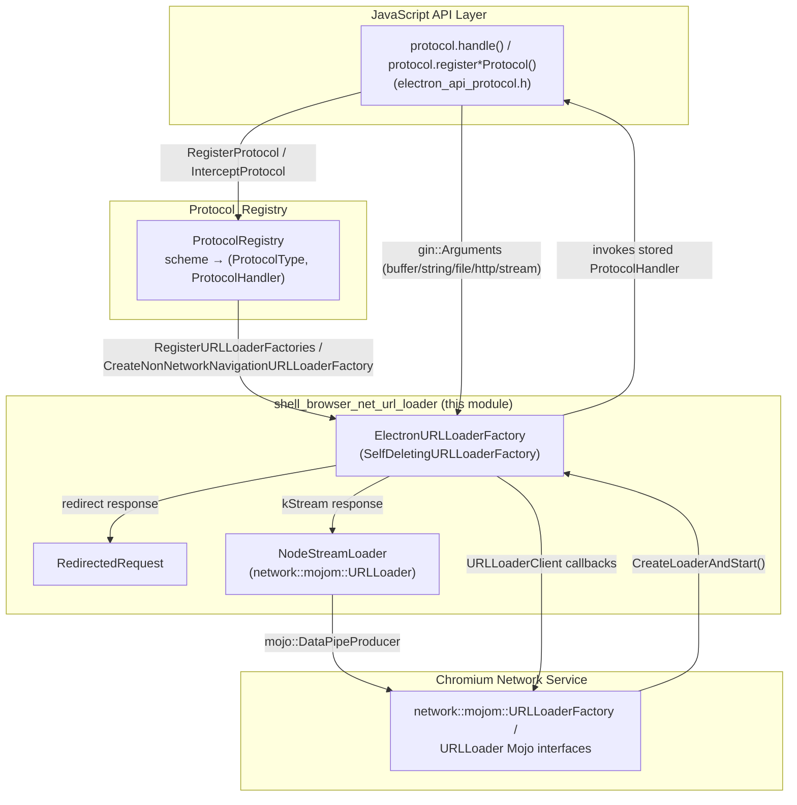
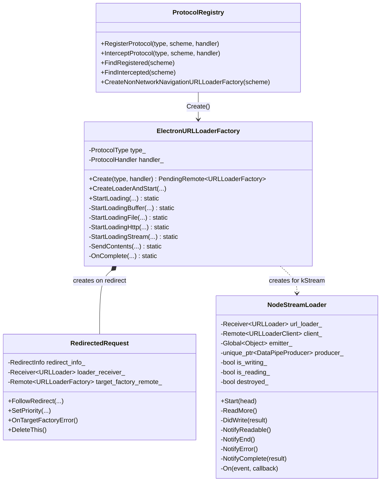
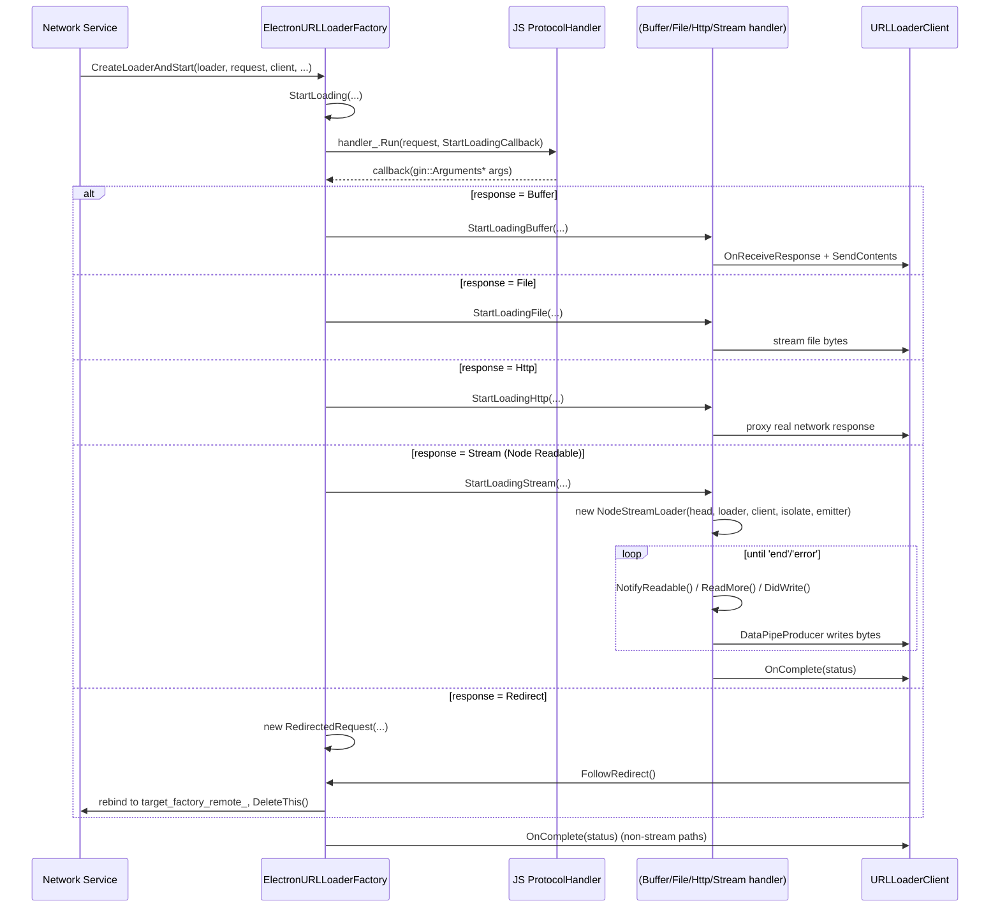
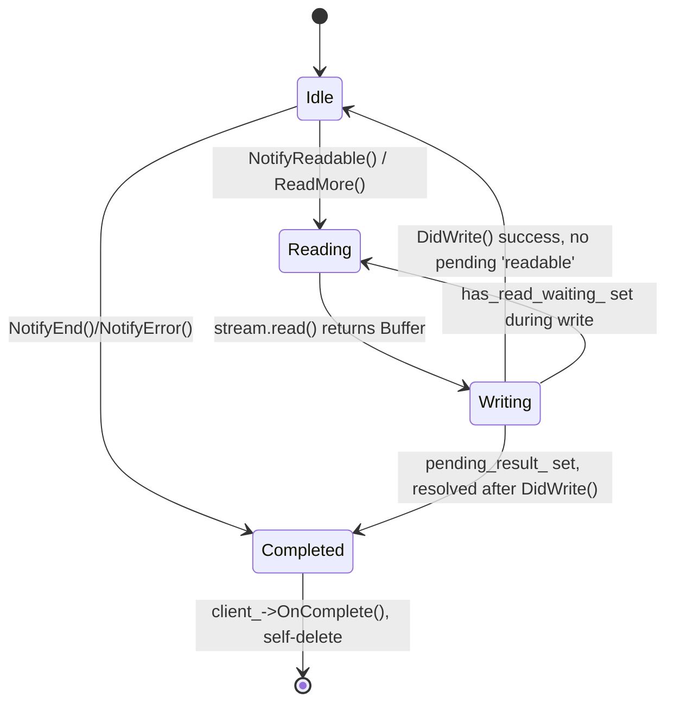

# Shell Browser Net URL Loader

## Introduction

The **shell_browser_net_url_loader** module implements the two low-level `network::mojom::URLLoader` / `network::mojom::URLLoaderFactory` bridges that let Electron's JavaScript-level custom protocol handlers (`protocol.handle`, `protocol.registerStringProtocol`, `protocol.registerBufferProtocol`, `protocol.registerStreamProtocol`, etc.) actually service network requests coming from Chromium's Network Service.

It is the "glue" layer that turns a user-supplied JavaScript callback into a fully-fledged Mojo `URLLoader` that can stream bytes (from a `Buffer`, a `File`, an `http` request, or a Node.js `Readable` stream) back to the renderer/browser code that issued the request. It sits directly beneath [Protocol_Registry](Protocol_Registry.md) and the JS-facing [electron_api_protocol](shell_browser_api_session_net_protocol_netlog.md) binding, and is a sibling of [shell_browser_net_asar](shell_browser_net_asar.md) (which serves `asar://`-packaged files) and [shell_browser_net_proxying](shell_browser_net_proxying.md) (which intercepts/proxies *existing* network requests rather than serving brand-new custom-protocol ones).

This document covers the two core components of the module:

| Component | File | Responsibility |
|---|---|---|
| `ElectronURLLoaderFactory` (+ nested `RedirectedRequest`) | `shell/browser/net/electron_url_loader_factory.h` | Self-deleting `URLLoaderFactory` implementation that dispatches requests to a registered `ProtocolHandler` and converts the JS-provided response description (buffer/string/file/http/stream) into Mojo `URLLoader` semantics. |
| `NodeStreamLoader` | `shell/browser/net/node_stream_loader.h` | A self-owning `URLLoader` that pumps a Node.js `Readable` stream (in *paused mode*) through a Mojo data pipe to the requesting client. |

---

## Purpose & Core Functionality

### Why this module exists

Electron exposes a JS API (`protocol.handle`/legacy `protocol.register*Protocol`) that lets application code respond to requests for custom schemes (`app://`, `myapp://`, etc.) or even intercept built-in schemes (`http://`, `file://`). Chromium's Network Service, however, only understands Mojo `URLLoaderFactory`/`URLLoader` interfaces. This module is the adapter:

1. JS registers a scheme + `ProtocolHandler` callback via [`electron_api_protocol`](shell_browser_api_session_net_protocol_netlog.md), which stores it in the [`ProtocolRegistry`](Protocol_Registry.md).
2. When the Network Service (or Electron's own code) needs a `URLLoaderFactory` for that scheme, `ElectronURLLoaderFactory::Create()` produces a `mojo::PendingRemote<URLLoaderFactory>` bound to a new `ElectronURLLoaderFactory` instance.
3. Every `CreateLoaderAndStart()` call invokes the JS `ProtocolHandler`, which eventually calls back into C++ (via `gin::Arguments`) with one of five response "shapes": buffer, string, file, http-redirect-to-a-real-request, or Node stream.
4. Depending on the shape, `ElectronURLLoaderFactory` either finishes the response itself (buffer/string), delegates to a `net::URLRequest`-based file/HTTP helper, or constructs a `NodeStreamLoader` to stream a Node `Readable`.

### `ElectronURLLoaderFactory`

* Inherits from `network::SelfDeletingURLLoaderFactory`, meaning it deletes itself once all its Mojo receivers/remotes disconnect — there is no explicit owner keeping it alive.
* Constructed with a `ProtocolType` (`kBuffer`, `kString`, `kFile`, `kHttp`, `kStream`, `kFree`) and a `ProtocolHandler` (a `RepeatingCallback<void(const ResourceRequest&, StartLoadingCallback)>`).
  * The legacy, type-specific `protocol.register*Protocol` APIs bind a fixed `ProtocolType`. The modern `protocol.handle` API uses `kFree`, allowing the JS handler to return *any* response shape per-request.
* `CreateLoaderAndStart()` is the `URLLoaderFactory` entry point invoked by Mojo/Network Service; it forwards to the static `StartLoading()` helper.
* `StartLoading()` invokes the stored `ProtocolHandler`, passing a `StartLoadingCallback` that resumes execution in C++ once the JS handler has produced a `gin::Arguments*` describing the response.
* Static per-shape dispatchers:
  * `StartLoadingBuffer` — writes a `v8::ArrayBufferView` directly into a `SendContents()` helper.
  * `StartLoadingFile` — reads from disk (respecting range headers) and streams the file's bytes.
  * `StartLoadingHttp` — creates a genuine outgoing `net::URLRequest`/`SimpleURLLoader`-style request to fulfill the response from a real HTTP(S) resource, honoring `session` and other options passed from JS.
  * `StartLoadingStream` — hands off to `NodeStreamLoader` for streaming a Node.js `Readable`.
* `RedirectedRequest` is a small internal `URLLoader` implementation used when a protocol handler issues a redirect: it holds the pending `URLLoader` receiver open until the client calls `FollowRedirect()`, at which point it rebinds to a freshly created request against the *target* factory (unbinding itself and deleting via `DeleteThis()`).
* `OnComplete()` centralizes calling `URLLoaderClient::OnComplete()` with a `URLLoaderCompletionStatus`.

### `NodeStreamLoader`

* A self-managing `network::mojom::URLLoader` (deletes itself when the Mojo connection ends or the stream finishes).
* Bridges a V8/Node `Readable` stream object (`v8::Local<v8::Object> emitter`) to a `mojo::DataPipeProducer`, using **paused mode** reading — i.e., it manually calls `stream.read()` rather than letting the stream free-flow — to avoid buffering the entire response in memory.
* Subscribes to the stream's `data`-equivalent lifecycle via the `On()` helper, which registers JS-level event listeners (`readable`, `end`, `error`) and stores them in `handlers_` so they can be removed later.
* Core read/write loop:
  1. `NotifyReadable()` — invoked when the JS stream emits `readable`; triggers `ReadMore()` if not already reading/writing.
  2. `ReadMore()` — calls into the stream's `read()` method, obtaining a `Buffer` to write.
  3. `producer_->Write(...)` writes the buffer to the pipe; `DidWrite()` is the completion callback, which either writes more or stops if there's nothing pending.
  4. `NotifyEnd()` / `NotifyError()` — invoked on stream `end`/`error` events; sets `destroyed_` and calls `NotifyComplete()`.
  5. `NotifyComplete(result)` — sends `net::OK` or an error code back to the client via `client_->OnComplete()`; if a write is still in-flight, the result is deferred (`pending_result_`) until the write completes.
* Because it holds `v8::Global` handles into the isolate (`emitter_`, `buffer_`, and per-event handler callbacks), it must run entirely on the same thread/isolate as the JS engine — this is why it lives in `shell/browser/net` rather than in a network-service-only utility class.

---

## Architecture

---

## Component Relationships

---

## Data Flow: Handling a Custom-Protocol Request

---

## NodeStreamLoader Internal State Machine

---

## Integration with the Rest of the System

* **[Protocol_Registry](Protocol_Registry.md)** — owns the map of scheme → `(ProtocolType, ProtocolHandler)` and is the sole caller of `ElectronURLLoaderFactory::Create()`, both for "registered" custom protocols and "intercepted" built-in protocols. It also exposes `CreateNonNetworkNavigationURLLoaderFactory()` used during navigation.
* **[shell_browser_api_session_net_protocol_netlog](shell_browser_api_session_net_protocol_netlog.md)** (`electron_api_protocol.h`/`.cc`) — the JS-facing `Protocol` object that application code calls (`protocol.handle`, `protocol.registerStringProtocol`, etc.). It builds the `ProtocolHandler` callbacks that `ElectronURLLoaderFactory` eventually invokes, and owns the `CustomScheme`/`SchemeOptions` structures describing scheme privileges.
* **[shell_browser_net_asar](shell_browser_net_asar.md)** — a sibling factory (`AsarURLLoaderFactory`) that serves files packed inside `.asar` archives; conceptually similar (`SelfDeletingURLLoaderFactory`-style pattern) but specialized for the `asar:`/`file:` archive format rather than arbitrary JS handlers.
* **[shell_browser_net_proxying](shell_browser_net_proxying.md)** — `ProxyingURLLoaderFactory`/`ProxyingWebSocket` intercept and modify *outgoing* network requests (e.g., for `webRequest` API and extensions), which is a different concern from *originating* custom-protocol responses handled here. A request can pass through both layers: proxying observes the request, then this module's factory may ultimately serve it if the scheme is custom.
* **[Common_API](Common_API.md)** (`electron_api_url_loader.h` — `SimpleURLLoaderWrapper`) — used by `StartLoadingHttp()` style flows and by the JS `net.request`/`ClientRequest` API when a custom protocol handler wants to make an internal HTTP(S) request as part of producing a response.
* **[Gin_Helper](Gin_Helper.md)** — `gin::Arguments`, `gin_helper::Dictionary`, and `gin_helper::Promise` are used throughout `ElectronURLLoaderFactory`'s static helpers to marshal data between the V8/JS response description and C++ Mojo structures.
* **[shell_browser_net](shell_browser_net.md)** (parent module) — groups this module together with `asar`, `proxying`, `context` (network context/service management), and `resolution` (host/proxy resolution) sub-modules that collectively implement Electron's networking stack in the browser process.

---

## Key Design Notes

1. **Self-deleting lifetimes.** Both `ElectronURLLoaderFactory` (via `SelfDeletingURLLoaderFactory`) and `NodeStreamLoader` manage their own lifetime tied to Mojo connection state, avoiding the need for external owners to track every in-flight custom-protocol request.
2. **Multiple response shapes, one factory.** Rather than having five separate factory classes, `ElectronURLLoaderFactory` is parameterized by `ProtocolType`; the `kFree` type (used by the modern `protocol.handle` API) allows the JS handler to decide the shape per-request dynamically.
3. **Paused-mode streaming avoids buffering.** `NodeStreamLoader` deliberately uses Node's paused-stream mode (manual `.read()` calls) instead of `data` events, so it never has to buffer more than one chunk in memory while waiting for the Mojo data pipe to accept more bytes — important for large file/stream responses.
4. **Redirect handling defers to a new factory.** Rather than reimplementing redirect chains itself, `RedirectedRequest` simply keeps the original `URLLoader` receiver alive until `FollowRedirect()` is called, then binds a completely new request against a target factory remote — reusing existing Network Service / Mojo redirect semantics.
