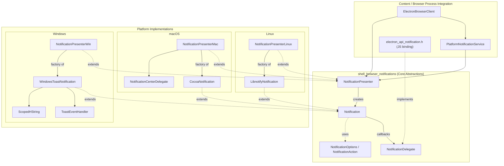
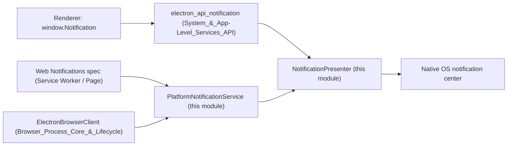
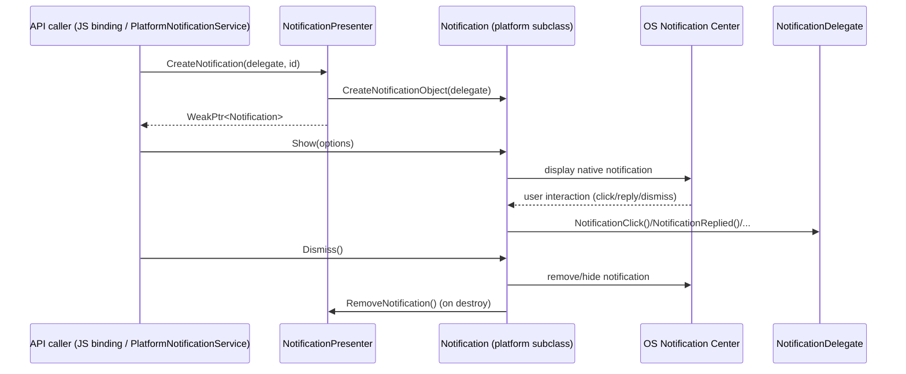

# Shell Browser Notifications

## Purpose

The `shell_browser_notifications` module implements Electron's cross-platform
**native desktop notification** system. It provides the abstraction layer
(`Notification`, `NotificationPresenter`, `NotificationDelegate`) that the
rest of the browser process uses to display, update, and dismiss OS-level
notifications, together with concrete platform implementations for **Linux**
(libnotify/D-Bus), **macOS** (`NSUserNotification`/Notification Center), and
**Windows** (WinRT Toast Notifications).

This module is the native backend behind the JavaScript `Notification` API
(exposed via `shell/browser/api/electron_api_notification.h`, part of
[shell_browser_api_system_device_system_integration_notifications_theme](shell_browser_api_system_device_system_integration_notifications_theme.md))
and is wired into the content layer through
`PlatformNotificationService`, which is owned by
[ElectronBrowserClient](shell_browser_main_parts_client_core_browser_client.md).

## Architecture Overview

The module follows a **Presenter/Factory pattern**: a single
`NotificationPresenter` (one platform-specific subclass per OS) is the
factory and registry for `Notification` objects. Each `Notification`
subclass encapsulates the platform-native notification object and toolkit
calls, while a `NotificationDelegate` (implemented by the JS-facing
`electron_api_notification` binding) receives lifecycle callbacks (click,
reply, dismiss, action, failure).

## High-Level Functionality

The module is organized into four sub-areas:

1. **Core Notification Abstractions** — platform-agnostic base classes
   defining the notification lifecycle, options, and the presenter/delegate
   contracts, plus the `content::PlatformNotificationService` bridge used by
   the Web Notifications API.
   See [shell_browser_notifications_core](shell_browser_notifications_core.md).

2. **Linux Notifications** — a `libnotify`/D-Bus based implementation using
   `NotifyNotification` and GLib signals.
   See [shell_browser_notifications_linux](shell_browser_notifications_linux.md).

3. **macOS Notifications** — an `NSUserNotification`/Notification Center
   based implementation, including the Objective-C delegate that bridges
   Cocoa callbacks back into C++.
   See [shell_browser_notifications_mac](shell_browser_notifications_mac.md).

4. **Windows Notifications** — a WinRT Toast Notification implementation
   using COM/WRL, XML toast templates, and event handler callbacks.
   See [shell_browser_notifications_windows](shell_browser_notifications_windows.md).

## How It Fits Into the Overall System

* **Upstream callers**: The JavaScript `Notification` API implementation
  (`electron_api_notification.h`) and Chromium's `PlatformNotificationService`
  interface (used for Web Notifications from renderers/service workers) both
  create and interact with `Notification` objects through the presenter.
* **Ownership**: `ElectronBrowserClient` (see
  [shell_browser_main_parts_client_core_browser_client](shell_browser_main_parts_client_core_browser_client.md))
  owns both the `PlatformNotificationService` and the single
  `NotificationPresenter` instance for the process, created once via
  `NotificationPresenter::Create()` which picks the correct OS-specific
  subclass at compile time.
* **Windows-specific helper**: `ScopedHString`
  (`shell/browser/win/scoped_hstring.h`, documented in
  [Win_Scoped_HString](Win_Scoped_HString.md), a sibling module under
  Platform-Specific Integration) is reused by `WindowsToastNotification`
  for WinRT string marshaling.

## Notification Lifecycle (Sequence)

## Key Design Points

- **Factory selection at compile time**: `NotificationPresenter::Create()`
  is implemented per-platform (Linux/macOS/Windows source files not shown
  here) and returns the appropriate subclass, keeping the rest of the
  browser process platform-agnostic.
- **Weak-pointer safety**: `Notification::GetWeakPtr()` allows callers (and
  platform event handlers such as Windows' `ToastEventHandler`) to safely
  reference a notification that might be destroyed asynchronously by the OS.
- **Self-destruction**: Notifications call `Destroy()` on themselves once
  dismissed/removed, and the owning `NotificationPresenter` is notified via
  `RemoveNotification` to keep its `notifications()` set accurate.
- **Options struct**: `NotificationOptions` is a platform-superset structure
  (includes Linux `urgency`, Windows `toast_xml`, action buttons, replies)
  consumed differently by each platform's `Show()` implementation.
