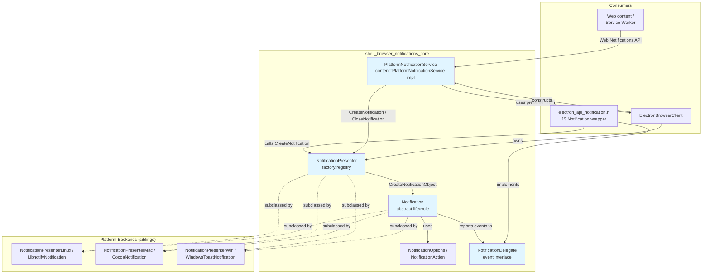
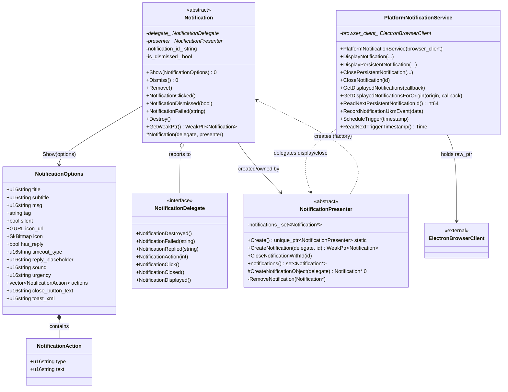
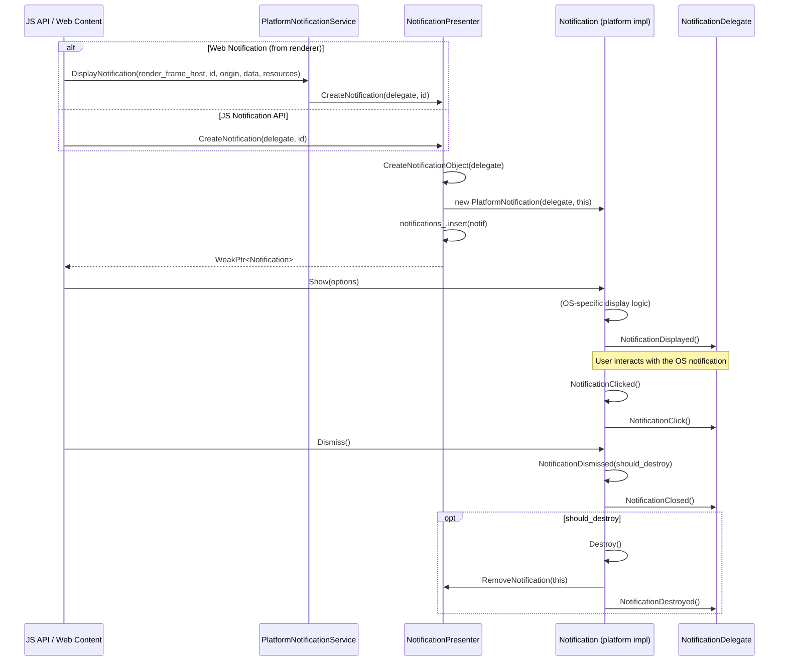
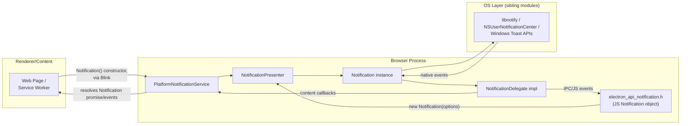

# Shell Browser Notifications — Core

## Introduction

The **`shell_browser_notifications_core`** module defines the cross-platform abstraction layer for desktop notifications in Electron's browser process. It provides the base classes and interfaces that every platform-specific notification backend (Linux/libnotify, macOS/NSUserNotificationCenter, Windows/Toast) must implement, as well as the glue code (`PlatformNotificationService`) that connects Chromium's Web Notification content layer to Electron's native notification presenters.

This module is intentionally platform-agnostic — it contains no OS-specific code. Instead, it establishes:

- **`Notification`** — the abstract base class representing a single displayed notification and its lifecycle events.
- **`NotificationDelegate`** — the observer interface used to relay notification events (click, close, reply, action, etc.) back to the caller (typically the JS-facing `Notification` API object or a `content::RenderFrameHost`-backed handler for Web Notifications).
- **`NotificationPresenter`** — the factory/registry that creates and tracks `Notification` instances, and is subclassed per-platform to construct the correct concrete `Notification` type.
- **`PlatformNotificationService`** — the Chromium `content::PlatformNotificationService` implementation that bridges the Web Notifications API (used by web pages/renderer content) into the presenter/notification pipeline.

It sits inside the larger [Platform-Specific Integration](shell_browser_notifications.md) area of the codebase, acting as the common contract that the OS-specific notification children implement.

---

## Module Purpose & Scope

| Responsibility | Description |
|---|---|
| Define notification lifecycle | Show, Dismiss, Remove, click/action/reply/close/failed callbacks |
| Define notification data model | `NotificationOptions`, `NotificationAction` structs describing title, body, icon, sound, buttons, etc. |
| Provide presenter/factory pattern | `NotificationPresenter` owns and tracks live `Notification*` instances, exposing `CreateNotification`/`CloseNotificationWithId` |
| Bridge to Chromium content layer | `PlatformNotificationService` implements Chromium's notification service interface for Web Notifications triggered by web content |
| Decouple platform backends | Linux/Mac/Windows notification modules subclass `Notification`/`NotificationPresenter` without this module needing to know about them |

This module does **not** implement any actual OS notification UI — see the sibling modules:
- [shell_browser_notifications_linux.md](shell_browser_notifications_linux.md)
- [shell_browser_notifications_mac.md](shell_browser_notifications_mac.md)
- [shell_browser_notifications_windows.md](shell_browser_notifications_windows.md)

---

## Core Components

### `Notification` (notification.h)

Abstract base class representing a single native notification instance.

- **Construction**: protected constructor `Notification(NotificationDelegate*, NotificationPresenter*)` — only derived platform classes can be instantiated (via `NotificationPresenter::CreateNotificationObject`).
- **Pure virtual API**:
  - `Show(const NotificationOptions&)` — display the notification using the given options.
  - `Dismiss()` — request removal; may or may not fully destroy the OS-level toast depending on platform behavior.
- **Overridable**:
  - `Remove()` — cleans up any remaining OS resources after dismissal (default no-op; overridden e.g. on Windows where dismissal doesn't always fully clear resources).
- **Event helpers** (called by platform subclasses to report native events up to the delegate):
  - `NotificationClicked()`
  - `NotificationDismissed(bool should_destroy = true)`
  - `NotificationFailed(const std::string& error = "")`
- **Lifecycle management**: `Destroy()` deletes `this`; `GetWeakPtr()` supports safe async references since notifications may be destroyed asynchronously by the OS or the user.
- **Identity/state accessors**: `notification_id()`, `is_dismissed()`, `delegate()`, `presenter()`.
- Non-copyable.

### `NotificationOptions` / `NotificationAction` (notification.h)

Plain data structs passed into `Notification::Show`:

- `NotificationOptions` — title, subtitle, message body, tag (for replacing/coalescing notifications), silent flag, icon (URL or bitmap), reply support (`has_reply`, `reply_placeholder`), sound, Linux `urgency`, list of `NotificationAction` buttons, close-button text, and a raw `toast_xml` override (Windows Toast templating).
- `NotificationAction` — a single action button descriptor (`type`, `text`).

These structs are populated by the [JS-facing Notification API](shell_browser_api_system_device_system_integration_notifications_theme.md) (`electron_api_notification.h`) and by `PlatformNotificationService` for Web Notifications.

### `NotificationDelegate` (notification_delegate.h)

Pure interface (all methods have empty default implementations) implemented by whoever wants to observe notification events:

- `NotificationDestroyed()`
- `NotificationFailed(const std::string& error)`
- `NotificationReplied(const std::string& reply)`
- `NotificationAction(int index)`
- `NotificationClick()`
- `NotificationClosed()`
- `NotificationDisplayed()`

Protected constructor/destructor — intended to be used as a mixin/base for delegate implementations (e.g., the JS `Notification` wrapper object, or a Web-Notification-specific delegate created by `PlatformNotificationService`).

### `NotificationPresenter` (notification_presenter.h)

Factory and registry for `Notification` objects:

- `static std::unique_ptr<NotificationPresenter> Create()` — platform-selected factory function; each platform module (Linux/Mac/Windows) provides its own `.cc` implementation of this static method returning the concrete presenter subclass.
- `CreateNotification(NotificationDelegate*, const std::string& notification_id)` — creates a new `Notification` via the protected pure-virtual `CreateNotificationObject(delegate)`, tags it with `notification_id`, registers it internally, and returns a `base::WeakPtr<Notification>`.
- `CloseNotificationWithId(const std::string& notification_id)` — looks up and dismisses a live notification by id (used to replace/coalesce notifications sharing a tag/id).
- `notifications()` — read accessor for the set of currently-tracked `Notification*`.
- `RemoveNotification(Notification*)` (private, friended to `Notification`) — called back when a `Notification` is destroyed, to keep the tracked set consistent.
- Protected default constructor and pure-virtual `CreateNotificationObject` — subclassed once per platform.

### `PlatformNotificationService` (platform_notification_service.h)

Implements Chromium's `content::PlatformNotificationService` interface, allowing web content (regular pages and service workers) to trigger native notifications through the standard [Web Notifications API](https://notifications.spec.whatwg.org/).

- Constructed with an `ElectronBrowserClient*` (see [shell_browser_main_parts_client_core_browser_client](shell_browser_main_parts_client_core_browser_client.md)), which owns/provides access to the app-wide `NotificationPresenter`.
- `DisplayNotification(...)` — handles non-persistent (page-lifetime) notifications from a `RenderFrameHost`.
- `DisplayPersistentNotification(...)` / `ClosePersistentNotification(...)` — persistent (Service-Worker-driven) notifications; currently no-ops in Electron.
- `CloseNotification(...)` — closes a displayed notification by id.
- `GetDisplayedNotifications[ForOrigin](...)` — queries which notifications are currently shown.
- `ReadNextPersistentNotificationId()`, `RecordNotificationUkmEvent(...)`, `ScheduleTrigger(...)`, `ReadNextTriggerTimestamp()` — stub/metrics/trigger-scheduling hooks required by the Chromium interface but largely unused/minimally implemented by Electron (no persistent notification database).

---

## Architecture Diagram

---

## Class Relationships

---

## Notification Lifecycle (Sequence)

Two distinct entry points create notifications: the JS `Notification` API (app-triggered) and the Web Notifications content path (page-triggered). Both converge on `NotificationPresenter`/`Notification`.

---

## Data Flow: Web Notifications vs. JS API

---

## Integration Points

| Related Module | Relationship |
|---|---|
| [shell_browser_notifications_linux](shell_browser_notifications_linux.md) | Implements `NotificationPresenterLinux` (subclass of `NotificationPresenter`) and `LibnotifyNotification` (subclass of `Notification`) using libnotify/D-Bus. |
| [shell_browser_notifications_mac](shell_browser_notifications_mac.md) | Implements `NotificationPresenterMac` and `CocoaNotification` using macOS's notification center APIs. |
| [shell_browser_notifications_windows](shell_browser_notifications_windows.md) | Implements `NotificationPresenterWin` and `WindowsToastNotification`, including WinRT toast XML templating and `ScopedHString` helpers from [Win_Scoped_HString](Win_Scoped_HString.md). |
| [shell_browser_main_parts_client_core_browser_client](shell_browser_main_parts_client_core_browser_client.md) | `ElectronBrowserClient` owns the process-wide `NotificationPresenter` and constructs `PlatformNotificationService`, wiring this module into Chromium's content layer (see `PlatformNotificationService` in `ElectronBrowserClient`'s member list). |
| [shell_browser_api_system_device_system_integration_notifications_theme](shell_browser_api_system_device_system_integration_notifications_theme.md) | Exposes the `Notification` JS object (`electron_api_notification.h`) that end-user Electron apps use; this JS wrapper implements `NotificationDelegate` and drives `NotificationPresenter::CreateNotification`. |
| [shell_browser_ipc_handlers](shell_browser_ipc_handlers.md) | Web-Notification permission checks and IPC plumbing for renderer-triggered notifications flow through `WebContentsPermissionHelper` and related IPC handlers before reaching `PlatformNotificationService`. |

---

## Design Notes

- **Weak-pointer safety**: Because native notification UIs are managed asynchronously by the OS (and may be dismissed by the user at any time, independent of the C++ object's lifetime), `NotificationPresenter::CreateNotification` returns a `base::WeakPtr<Notification>` rather than a raw/owning pointer. Callers must always check validity before use.
- **Presenter-owns-notifications pattern**: `NotificationPresenter` maintains the authoritative set of live `Notification*` objects (`notifications_`) and is notified via the private, friended `RemoveNotification` when a `Notification::Destroy()` occurs — this keeps bookkeeping centralized rather than duplicated per-platform.
- **Two lifecycle exits**: `Dismiss()` (called by app/user action or platform event) vs. `Remove()` (best-effort platform cleanup after dismissal) — some platforms (Windows) need both because dismissal doesn't always release OS-level toast resources immediately.
- **Interface segregation**: `NotificationDelegate` intentionally has all-empty default method bodies so implementers (JS wrapper, Web Notification internal delegate) only override the events they care about.
- **`PlatformNotificationService` as adapter**: It does not implement notification display logic itself — it simply translates Chromium `content::PlatformNotificationService` calls into `NotificationPresenter`/`Notification` calls, keeping Electron's notification abstraction independent of Chromium's internal API churn.
