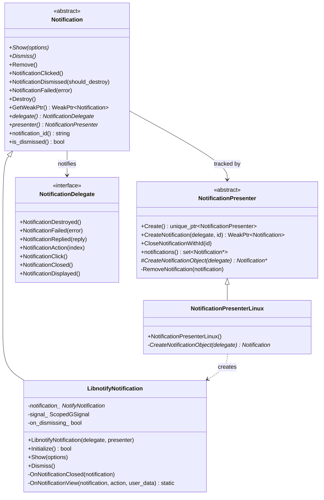
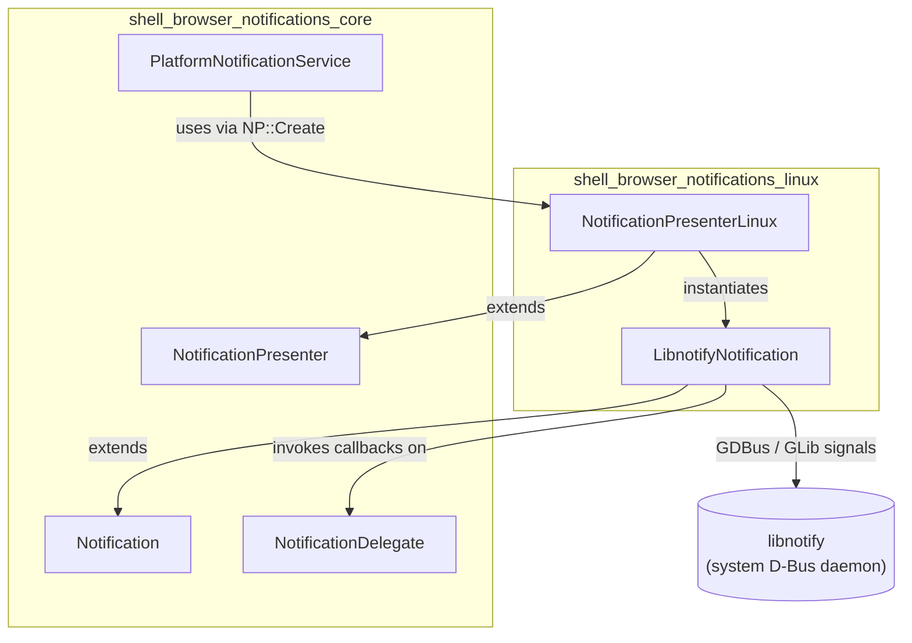
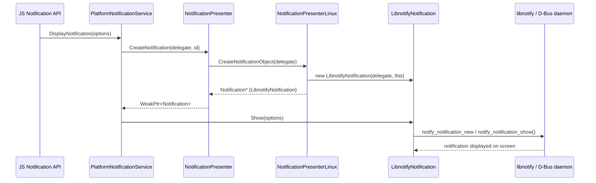
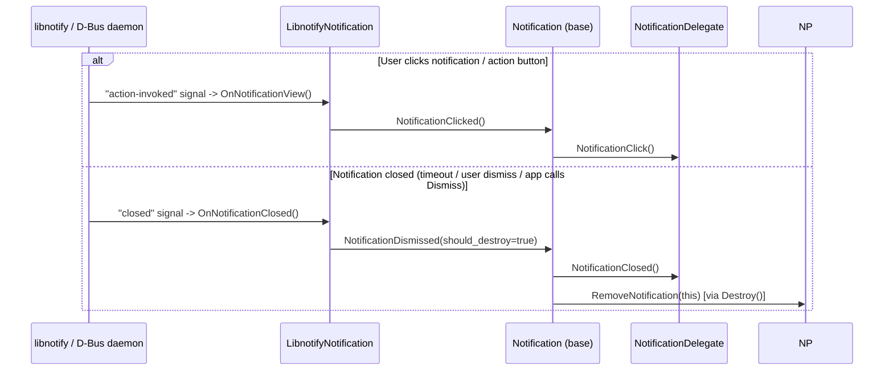

# Shell Browser Notifications — Linux

## Introduction

The **`shell_browser_notifications_linux`** module provides the Linux-specific implementation of Electron's cross-platform desktop notification system. It bridges the platform-agnostic [`shell_browser_notifications_core`](shell_browser_notifications_core.md) abstractions (`Notification`, `NotificationPresenter`, `NotificationDelegate`) with the native **libnotify** D-Bus notification service used by most Linux desktop environments (GNOME, KDE, etc.).

This module is one of three platform backends for the notification subsystem — the others being [`shell_browser_notifications_mac`](shell_browser_notifications_mac.md) and [`shell_browser_notifications_windows`](shell_browser_notifications_windows.md). All three implement the same abstract interfaces defined in the core module, allowing the rest of Electron (including the [`System_&_App-Level_Services_API`](shell_browser_api_system_device_system_integration_notifications_theme.md) `Notification` JS binding and the Web Notifications API via [`PlatformNotificationService`](shell_browser_notifications_core.md)) to remain platform-independent.

The module consists of exactly two classes:

| Component | Role |
|---|---|
| `NotificationPresenterLinux` | Factory/manager that creates Linux `Notification` objects and tracks active notifications |
| `LibnotifyNotification` | Concrete `Notification` implementation that talks to the system libnotify daemon over D-Bus |

---

## Purpose & Core Functionality

* **Native notification rendering**: Displays desktop notifications using `libnotify`, the de-facto standard D-Bus notification API on Linux.
* **Lifecycle management**: Handles showing, dismissing, and cleanup of notifications, including tracking whether a notification is in the process of being dismissed to avoid duplicate callbacks.
* **Event bridging**: Converts native libnotify signals (closed, action/button clicked) into calls on the generic `Notification` base class, which in turn notifies the `NotificationDelegate` (typically the JS-facing `Notification` API object or the Web Notifications bridge).
* **Runtime availability check**: `LibnotifyNotification::Initialize()` performs a runtime check (dynamic loading of the libnotify shared library) so Electron can gracefully fall back to no-op or other options if libnotify isn't available on the system.

---

## Architecture

### Class Structure



### Module Dependency Diagram



See [`shell_browser_notifications_core`](shell_browser_notifications_core.md) for the platform-agnostic base classes, and the sibling backends [`shell_browser_notifications_mac`](shell_browser_notifications_mac.md) / [`shell_browser_notifications_windows`](shell_browser_notifications_windows.md) for how other platforms fulfill the same contract.

---

## Component Details

### `NotificationPresenterLinux`

Defined in `shell/browser/notifications/linux/notification_presenter_linux.h`.

A thin factory that implements the single abstract method required by `NotificationPresenter`:

```cpp
Notification* CreateNotificationObject(NotificationDelegate* delegate) override;
```

This method constructs and returns a new `LibnotifyNotification`, passing itself as the owning presenter. The base `NotificationPresenter::CreateNotification()` wraps this call, assigns a `notification_id`, and tracks the resulting object in its internal `notifications_` set so it can later be looked up and closed by ID (`CloseNotificationWithId`).

`NotificationPresenterLinux` is selected by platform build configuration as the concrete presenter returned by `NotificationPresenter::Create()` on Linux builds (the equivalent factory calls exist for `NotificationPresenterMac` and `NotificationPresenterWin` on other platforms).

### `LibnotifyNotification`

Defined in `shell/browser/notifications/linux/libnotify_notification.h`.

Wraps a single native `NotifyNotification*` object from `libnotify`.

**Key members:**
- `notification_` — raw pointer to the underlying `NotifyNotification` C object (memory managed via GLib's reference counting, hence `RAW_PTR_EXCLUSION`).
- `signal_` — a `ScopedGSignal` handle that manages the lifetime of the GLib signal connection (e.g., the `closed` signal), ensuring the callback is automatically disconnected when the object is destroyed.
- `on_dismissing_` — guards against re-entrant/duplicate dismissal logic when `Dismiss()` triggers the `closed` signal itself.

**Key methods:**

| Method | Description |
|---|---|
| `Initialize()` (static) | Attempts to dynamically load the libnotify shared library via `library_loaders/libnotify_loader.h`. Returns `false` if libnotify isn't installed, allowing graceful degradation. |
| `Show(const NotificationOptions&)` | Builds a `NotifyNotification` from the title, body, icon, and actions specified in `options`, connects to its `closed`/action GLib signals, and calls `notify_notification_show()`. |
| `Dismiss()` | Calls `notify_notification_close()` on the native object and sets `on_dismissing_` to suppress duplicate dismissal callbacks. |
| `OnNotificationClosed(NotifyNotification*)` | Private GLib signal handler invoked when the native notification is closed (by user or timeout). Forwards to `Notification::NotificationDismissed()`. |
| `OnNotificationView(...)` (static) | Static GLib callback triggered when the user activates a notification action/button; resolves `user_data` back to the owning `LibnotifyNotification` and forwards to `Notification::NotificationClicked()`. |

---

## Data Flow / Interaction

### Notification Creation & Display



### User Interaction & Dismissal



---

## Integration with the Rest of the System

* **Upward integration**: The Linux backend is transparently selected via `NotificationPresenter::Create()`. Callers such as `PlatformNotificationService` (part of [`shell_browser_notifications_core`](shell_browser_notifications_core.md), invoked from [`ElectronBrowserClient`](shell_browser_main_parts_client_core_browser_client.md)) and the JS-facing `Notification` object (in [`shell_browser_api_system_device_system_integration_notifications_theme`](shell_browser_api_system_device_system_integration_notifications_theme.md)) do not need platform-specific code — they operate purely against the `Notification` / `NotificationPresenter` / `NotificationDelegate` interfaces.
* **Delegate implementations**: `NotificationDelegate` is typically implemented by:
  - The native `electron.Notification` JS API wrapper, forwarding events (`click`, `close`, `action`, `reply`) back to renderer/main-process JS listeners.
  - The Web Notifications API bridge used for `PlatformNotificationService::DisplayNotification`, which surfaces events back to the originating web page/service worker.
* **Build-time dependency**: This module requires `libnotify` (and its GLib/GObject signal machinery) to be present on the build/runtime system; `Initialize()` performs a soft dependency check so Electron apps can run (without native notifications) even when libnotify is missing.

---

## Related Modules

- [`shell_browser_notifications_core`](shell_browser_notifications_core.md) — Platform-agnostic base classes (`Notification`, `NotificationPresenter`, `NotificationDelegate`, `PlatformNotificationService`) that this module extends.
- [`shell_browser_notifications_mac`](shell_browser_notifications_mac.md) — macOS equivalent using `NSUserNotificationCenter`/`UNUserNotificationCenter`.
- [`shell_browser_notifications_windows`](shell_browser_notifications_windows.md) — Windows equivalent using WinRT Toast Notifications.
- [`shell_browser_api_system_device_system_integration_notifications_theme`](shell_browser_api_system_device_system_integration_notifications_theme.md) — The JS-exposed `Notification` API that consumes this backend indirectly through the core presenter interfaces.
- [`shell_browser_main_parts_client_core_browser_client`](shell_browser_main_parts_client_core_browser_client.md) — Owns `PlatformNotificationService`, which is the primary consumer of the presenter/notification abstraction for Web Notifications.
- [`Platform-Specific_Integration`](shell_browser_linux.md) — Sibling Linux-specific integrations (e.g., Unity launcher service) within the broader platform integration layer.
