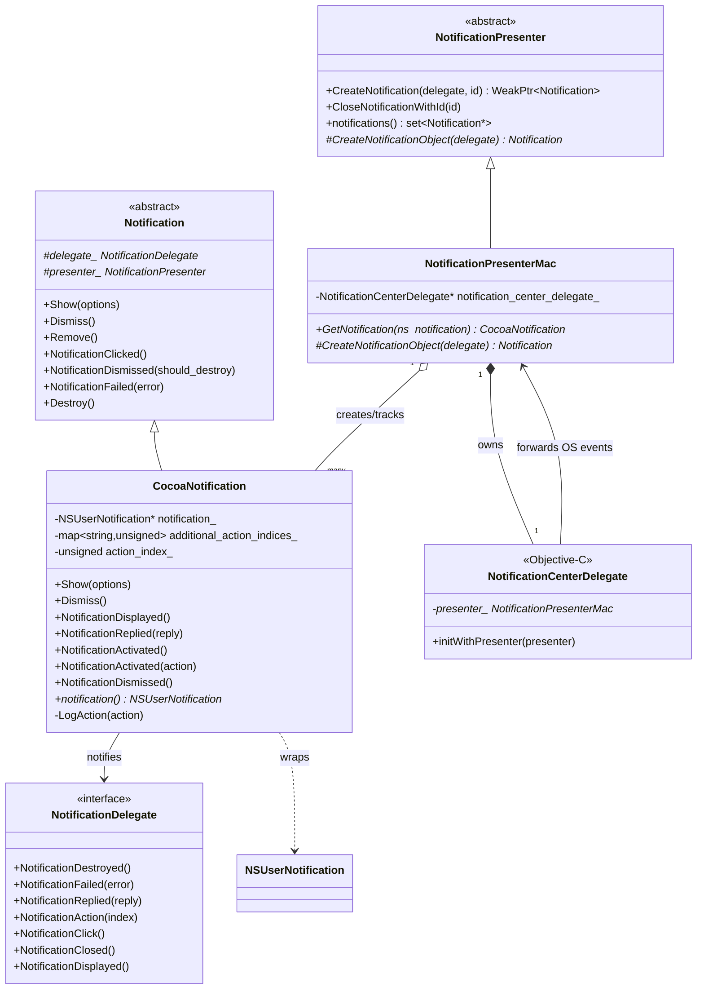
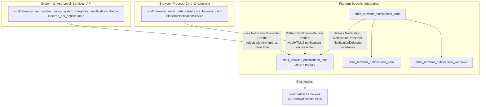
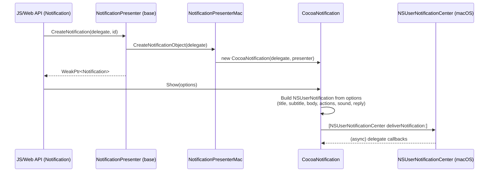
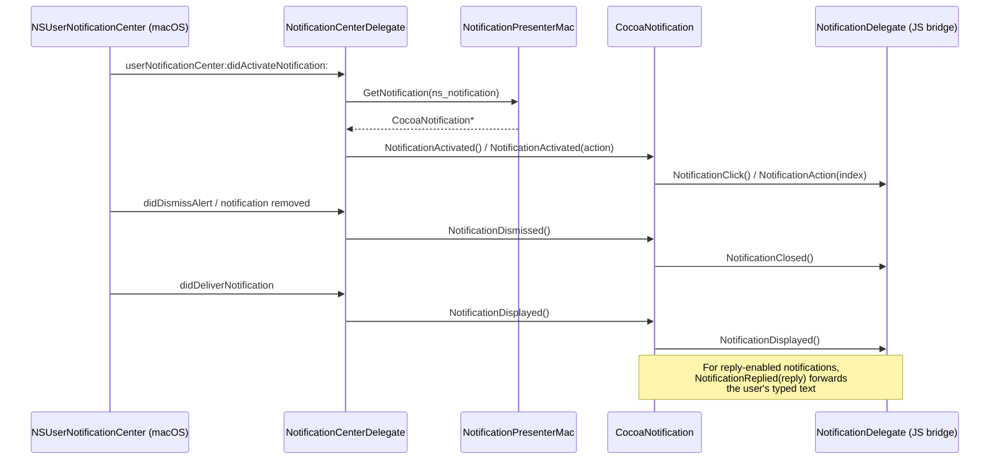
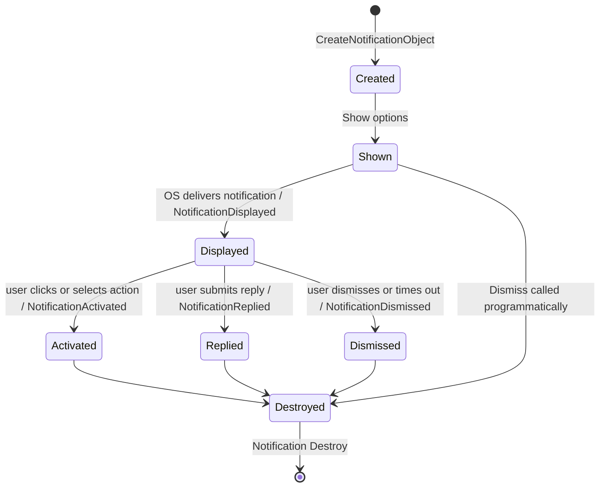
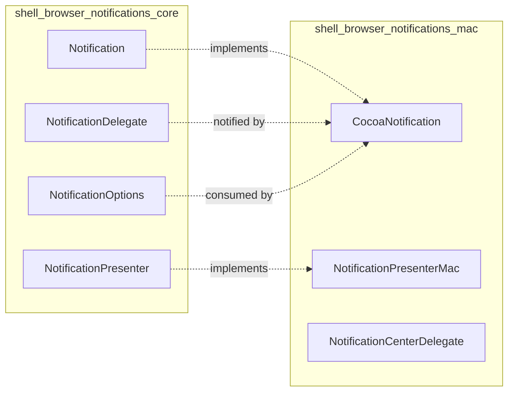

# macOS Notifications (`shell_browser_notifications_mac`)

## Introduction

The `shell_browser_notifications_mac` module provides the macOS-specific implementation of Electron's cross-platform desktop notification system. It bridges the platform-agnostic notification abstractions defined in [`shell_browser_notifications_core`](shell_browser_notifications_core.md) with Apple's native `NSUserNotification` / `NSUserNotificationCenter` APIs, allowing Electron applications to display, update, and respond to native macOS notification banners and alerts.

This module is one of three platform back-ends for the notification subsystem — its siblings are [`shell_browser_notifications_linux`](shell_browser_notifications_linux.md) (libnotify-based) and [`shell_browser_notifications_windows`](shell_browser_notifications_windows.md) (Windows Toast-based). All three implement the same abstract interfaces (`Notification` and `NotificationPresenter`) so that upper layers of Electron (such as the `Notification` JS API) can remain platform-independent.

> **Note:** The module relies on the deprecated `NSUserNotification` API (rather than the newer `UserNotifications.framework`). This is intentional and wrapped with compiler pragma suppressions (`-Wdeprecated-declarations`) throughout the code.

---

## Purpose & Core Functionality

The module has three primary responsibilities:

1. **Presenting notifications** — `NotificationPresenterMac` manages the lifecycle of all active macOS notifications for the application, acting as the factory and registry for `CocoaNotification` instances.
2. **Wrapping native notifications** — `CocoaNotification` wraps an `NSUserNotification` object, translating Electron's notification options (title, body, actions, sound, etc.) into native Cocoa notification properties, and forwards native lifecycle events back into Electron's delegate system.
3. **Routing OS callbacks** — `NotificationCenterDelegate` (an Objective-C class conforming to `NSUserNotificationCenterDelegate`) receives callbacks directly from macOS's notification center (e.g., a user clicking or dismissing a notification) and routes them to the appropriate `NotificationPresenterMac`/`CocoaNotification` instance.

---

## Component Architecture

### Class/Component Overview

| Component | Type | File | Responsibility |
|---|---|---|---|
| `NotificationPresenterMac` | C++ class | `notification_presenter_mac.h` | Concrete `NotificationPresenter` for macOS; creates `CocoaNotification` objects and looks them up by native `NSUserNotification` handle |
| `CocoaNotification` | C++ class | `cocoa_notification.h` | Concrete `Notification` for macOS; owns and controls an `NSUserNotification`, handles show/dismiss/reply/action lifecycle |
| `NotificationCenterDelegate` | Objective-C class | `notification_center_delegate.h` | Implements `NSUserNotificationCenterDelegate`; receives raw OS-level notification center events and forwards them to `NotificationPresenterMac` |

### Class Diagram

---

## Dependency Relationships

This module depends heavily on the platform-agnostic notification core, and is consumed indirectly by the system/app-level Notification API.

Key upstream dependency:
- [`shell_browser_notifications_core`](shell_browser_notifications_core.md): defines the abstract `Notification`, `NotificationPresenter`, and `NotificationDelegate` classes that this module implements.

Key downstream consumers:
- [`shell_browser_api_system_device_system_integration_notifications_theme`](shell_browser_api_system_device_system_integration_notifications_theme.md) — the JS-exposed `Notification` API (`electron_api_notification.h`) uses `NotificationPresenter::Create()`, which on macOS instantiates `NotificationPresenterMac`.
- [`shell_browser_main_parts_client_core_browser_client`](shell_browser_main_parts_client_core_browser_client.md) — `PlatformNotificationService` (part of `ElectronBrowserClient`) uses the presenter to display web-platform (HTML5) notifications triggered from renderer content.

---

## Data Flow & Process Interaction

### Notification Creation Flow

### OS Event Routing Flow

### Lifecycle State Diagram

---

## Component Details

### `NotificationPresenterMac`
Concrete implementation of the abstract `NotificationPresenter` (see [`shell_browser_notifications_core`](shell_browser_notifications_core.md)). Responsibilities:

- Owns a single `NotificationCenterDelegate` instance (`notification_center_delegate_`), which is registered as the `NSUserNotificationCenter`'s delegate for the process.
- Implements `CreateNotificationObject()` to instantiate a new `CocoaNotification` for each notification request.
- Provides `GetNotification(NSUserNotification*)` — a reverse lookup used by `NotificationCenterDelegate` to map a raw native notification object back to the owning `CocoaNotification` wrapper, since macOS callbacks only supply the `NSUserNotification` pointer, not the C++ object.

### `CocoaNotification`
Concrete implementation of the abstract `Notification`. Responsibilities:

- Holds a strong reference to the native `NSUserNotification*` (`notification_`).
- `Show(options)`: populates the native notification's title, subtitle, informative text, sound name, and reply/action UI based on `NotificationOptions`, then submits it to the notification center.
- `Dismiss()`: removes the notification from the notification center.
- Event forwarding methods (called by `NotificationCenterDelegate`):
  - `NotificationDisplayed()` → base class equivalent notifies `NotificationDelegate::NotificationDisplayed()`
  - `NotificationReplied(reply)` → forwards typed reply text
  - `NotificationActivated()` / `NotificationActivated(action)` → handles default click vs. specific action button click (tracked via `additional_action_indices_` and `action_index_`)
  - `NotificationDismissed()` → forwards dismissal
- `LogAction(action)`: internal helper for diagnostic logging of notification interactions.

### `NotificationCenterDelegate`
An Objective-C object conforming to `NSUserNotificationCenterDelegate`. It is the only entry point through which macOS communicates notification center events back into Electron's C++ code:

- Holds a raw, non-owning pointer (`raw_ptr`) back to its owning `NotificationPresenterMac`.
- Initialized via `initWithPresenter:`.
- Implements the various `NSUserNotificationCenterDelegate` protocol methods (e.g., `didActivateNotification:`, `didDeliverNotification:`, `shouldPresentNotification:`) which, in the `.mm` implementation (not shown here), look up the corresponding `CocoaNotification` via `NotificationPresenterMac::GetNotification` and invoke the appropriate lifecycle method on it.

---

## Relationship to the Broader Notification Subsystem

At build time, Electron's build configuration selects exactly one platform notification back-end (mac, Linux/libnotify, or Windows Toast) to link into the final binary, based on the target OS. The rest of Electron — including the JS `Notification` API and the `PlatformNotificationService` used for web notifications — interacts only with the abstract `Notification`/`NotificationPresenter` interfaces from [`shell_browser_notifications_core`](shell_browser_notifications_core.md), remaining unaware of which concrete platform implementation is active.

---

## Related Modules

- [`shell_browser_notifications_core`](shell_browser_notifications_core.md) — abstract interfaces implemented by this module
- [`shell_browser_notifications_linux`](shell_browser_notifications_linux.md) — sibling Linux/libnotify implementation
- [`shell_browser_notifications_windows`](shell_browser_notifications_windows.md) — sibling Windows Toast implementation
- [`shell_browser_api_system_device_system_integration_notifications_theme`](shell_browser_api_system_device_system_integration_notifications_theme.md) — JS-facing `Notification` API consuming this back-end
- [`shell_browser_main_parts_client_core_browser_client`](shell_browser_main_parts_client_core_browser_client.md) — `ElectronBrowserClient`'s `PlatformNotificationService`, used for web/HTML5 notifications
- [`shell_browser_mac`](shell_browser_mac.md) — other macOS-specific browser integrations (e.g., In-App Purchase)
