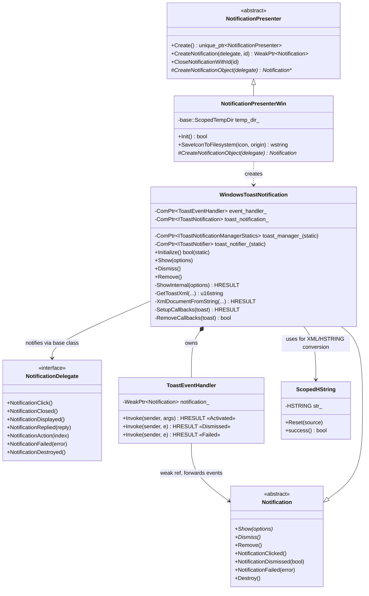
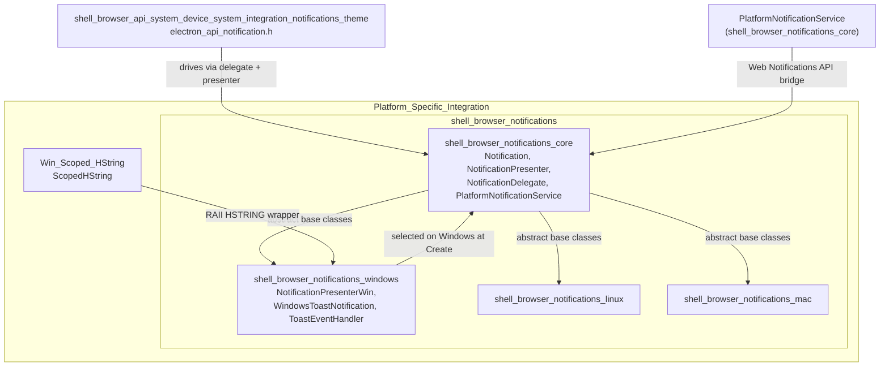
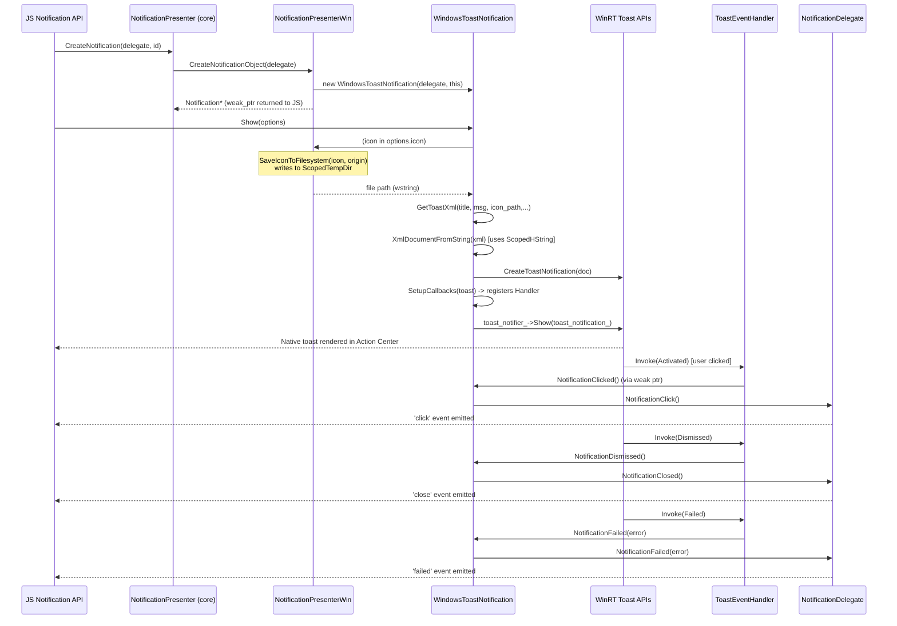
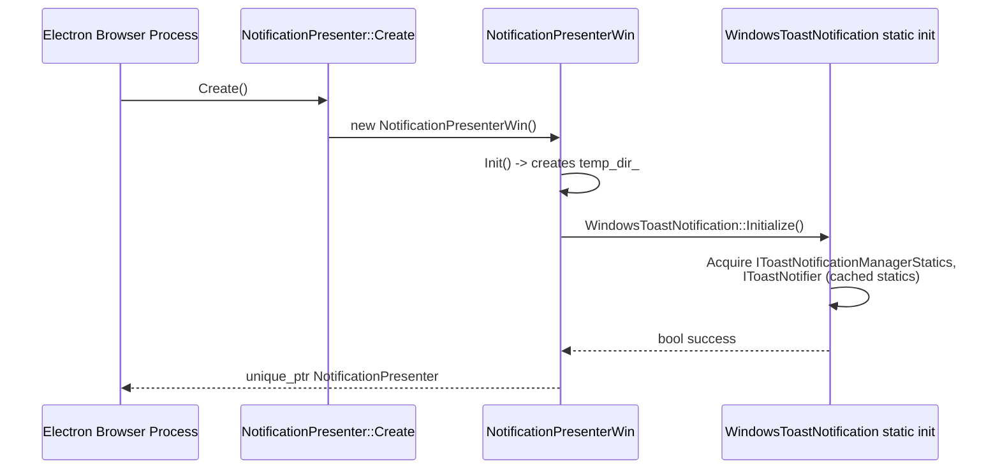

# Windows Notifications (`shell_browser_notifications_windows`)

## Introduction

The **Windows Notifications** module is the Windows-specific backend of Electron's cross-platform notification system. It implements the platform contracts defined in [shell_browser_notifications_core](shell_browser_notifications_core.md) by wrapping the **Windows Runtime (WinRT) Toast Notification API** (`Windows.UI.Notifications`), allowing Electron applications to display native Action Center toasts on Windows, receive click/dismiss/failure callbacks, and manage notification icons on disk.

It is one of three OS-specific implementations of the notification presenter abstraction — the others being [shell_browser_notifications_linux](shell_browser_notifications_linux.md) (libnotify) and [shell_browser_notifications_mac](shell_browser_notifications_mac.md) (`NSUserNotification`/`UNUserNotificationCenter`). All three are selected at build/runtime via `NotificationPresenter::Create()` and are siblings under the parent [shell_browser_notifications](shell_browser_notifications.md) module, which itself belongs to the broader [Platform-Specific_Integration](Platform-Specific_Integration.md) subsystem.

This module contains two core translation units:

| File | Responsibility |
|---|---|
| `notification_presenter_win.h` | Windows-specific `NotificationPresenter` factory/manager; handles icon persistence to a temp directory so WinRT toasts (which require file URIs) can render images. |
| `windows_toast_notification.h` | Windows-specific `Notification` implementation; builds toast XML, registers with the WinRT `ToastNotificationManager`, and relays native COM events back into Electron's delegate model. |

---

## 1. Purpose and Core Functionality

### 1.1 `NotificationPresenterWin`

`NotificationPresenterWin` is the Windows subclass of the abstract [`NotificationPresenter`](shell_browser_notifications_core.md) defined in the core notifications module. Its responsibilities are:

- **Factory role**: Implements `CreateNotificationObject()` to produce `WindowsToastNotification` instances on request from the shared `NotificationPresenter::CreateNotification()` method.
- **Icon materialization**: WinRT Toast XML can only reference images via a local file path/URI (it cannot embed raw bitmap data or use arbitrary web URLs directly in all cases). `SaveIconToFilesystem(const SkBitmap& icon, const GURL& origin)` writes the given `SkBitmap` to a file inside a `base::ScopedTempDir` (`temp_dir_`) and returns the resulting Windows path (`std::wstring`) for embedding into the toast XML `<image>` tag.
- **Lifecycle**: `Init()` prepares the temporary directory used for icon storage; the directory (and its contents) is automatically cleaned up when the presenter — and therefore `temp_dir_` — is destroyed.

### 1.2 `WindowsToastNotification`

`WindowsToastNotification` is the Windows subclass of the abstract [`Notification`](shell_browser_notifications_core.md) base class. It encapsulates a single native toast's lifecycle:

- **Static initialization**: `WindowsToastNotification::Initialize()` acquires the process-wide COM interfaces `IToastNotificationManagerStatics` and `IToastNotifier` (cached as static `ComPtr` members `toast_manager_` / `toast_notifier_`), shared by all toast instances. This is called once by `NotificationPresenterWin` during startup.
- **Showing**: `Show(const NotificationOptions& options)` triggers `ShowInternal()`, which:
  1. Builds a toast XML payload via `GetToastXml()` (title, message, icon path, timeout type, silent flag).
  2. Parses the XML into a WinRT `IXmlDocument` via `XmlDocumentFromString()`.
  3. Creates the `IToastNotification` COM object from that document.
  4. Registers activation/dismissal/failure callbacks through `SetupCallbacks()`.
  5. Submits the toast to the OS via the cached `IToastNotifier::Show()`.
- **Dismissing/Removing**: `Dismiss()` asks the OS notifier to hide the toast; `Remove()` performs any additional native cleanup needed because Windows toasts aren't always fully removed on dismiss alone.
- **Event bridging**: Native WinRT callbacks (`Activated`, `Dismissed`, `Failed`) are not delivered directly to `WindowsToastNotification`; instead, a companion COM object, `ToastEventHandler`, subscribes to them and forwards results to the appropriate `Notification::NotificationClicked()`, `NotificationDismissed()`, or `NotificationFailed()` base-class methods, which in turn invoke the registered [`NotificationDelegate`](shell_browser_notifications_core.md) callbacks (`NotificationClick`, `NotificationClosed`, `NotificationFailed`, etc.) consumed by the JS-facing [`Notification` API](shell_browser_api_system_device_system_integration_notifications_theme.md).

### 1.3 `ToastEventHandler`

A small COM `RuntimeClass` that implements three WinRT typed event handler interfaces simultaneously:

- `DesktopToastActivatedEventHandler` — user clicked the toast (or a toast action button).
- `DesktopToastDismissedEventHandler` — user or system dismissed the toast.
- `DesktopToastFailedEventHandler` — the OS failed to display the toast.

It holds only a `base::WeakPtr<Notification>` to avoid dangling references if the owning `WindowsToastNotification` is destroyed before Windows delivers a queued event. `SetupCallbacks()` / `RemoveCallbacks()` in `WindowsToastNotification` manage the `EventRegistrationToken`s (`activated_token_`, `dismissed_token_`, `failed_token_`) used to attach/detach this handler from the underlying `IToastNotification`.

### 1.4 `ScopedHString`

`ScopedHString` (declared in [Win_Scoped_HString](Win_Scoped_HString.md), forward-declared here) is a small RAII wrapper around the Windows `HSTRING` type used throughout WinRT COM interop. `WindowsToastNotification` relies on it to safely convert `std::wstring`/`wchar_t*` XML strings into `HSTRING`s required by WinRT XML/Toast APIs, automatically releasing the underlying string resource on destruction.

---

## 2. Architecture

### 2.1 Class / Inheritance Diagram

### 2.2 Module Dependency Diagram

### 2.3 Notification Presentation Sequence

### 2.4 Icon Handling Data Flow

```mermaid
flowchart LR
    A["SkBitmap icon + GURL origin"] --> B["NotificationPresenterWin::SaveIconToFilesystem"]
    B --> C["base::ScopedTempDir temp_dir_"]
    C --> D["Image file written to disk"]
    D --> E["std::wstring file path"]
    E --> F["WindowsToastNotification::GetToastXml"]
    F --> G["image tag in Toast XML"]
    G --> H["WinRT ToastNotification rendered with icon"]
```

---

## 3. Component Interaction & Lifecycle

### 3.1 Startup / Registration

### 3.2 Ownership Model

- `NotificationPresenterWin` owns the temp directory used for icon storage; it does **not** own individual `Notification` objects directly — ownership/tracking of active notifications is managed generically by the base `NotificationPresenter::notifications_` set (see [shell_browser_notifications_core](shell_browser_notifications_core.md)).
- `WindowsToastNotification` owns its `ToastEventHandler` (`ComPtr<ToastEventHandler> event_handler_`) and the native `IToastNotification` COM object.
- `ToastEventHandler` never owns the `Notification`; it holds a `base::WeakPtr` specifically so that if the toast/notification is destroyed (e.g., app shutdown, JS-side GC) while a WinRT event is in flight, the handler safely no-ops instead of dereferencing a dangling pointer.
- `toast_manager_` and `toast_notifier_` are **process-wide static singletons** shared across all `WindowsToastNotification` instances, initialized once and reused for the lifetime of the browser process.

---

## 4. Integration with the Rest of the System

- **JS-facing API**: The public `Notification` constructor exposed to renderer/main-process JS is implemented in [shell_browser_api_system_device_system_integration_notifications_theme](shell_browser_api_system_device_system_integration_notifications_theme.md) (`electron_api_notification.h`). That layer creates a `NotificationDelegate` implementation and calls into the platform-agnostic `NotificationPresenter`/`Notification` interfaces documented in [shell_browser_notifications_core](shell_browser_notifications_core.md) — this module supplies the concrete Windows behavior behind those interfaces.
- **Web Notifications**: `PlatformNotificationService` (also in [shell_browser_notifications_core](shell_browser_notifications_core.md)) bridges the Chromium Web Notifications API (used by web pages loaded in `WebContents`) to the same `NotificationPresenter`/`Notification` abstraction, meaning both native app notifications and web-page notifications flow through `NotificationPresenterWin`/`WindowsToastNotification` on Windows.
- **Windows COM/WinRT interop utilities**: `ScopedHString`, from [Win_Scoped_HString](Win_Scoped_HString.md), is a small but essential utility shared with other Windows-specific native modules (e.g. jump lists, taskbar features in [Windows_UI_(Desktop_Widgets)](Windows_UI_%28Desktop_Widgets%29.md)) for safely working with WinRT string marshalling.
- **Sibling platform implementations**: For behavior comparison/parity, see [shell_browser_notifications_linux](shell_browser_notifications_linux.md) (libnotify-based) and [shell_browser_notifications_mac](shell_browser_notifications_mac.md) (`UNUserNotificationCenter`-based), which implement the same `NotificationPresenter`/`Notification` contract for their respective platforms.

---

## 5. Key Design Notes

- **Why icons must be saved to disk**: The WinRT Toast Notification XML schema requires an `<image src="...">` attribute pointing to a local file path or a `ms-appx://` resource — it cannot inline raw pixel data. `NotificationPresenterWin::SaveIconToFilesystem` exists solely to bridge Chromium's in-memory `SkBitmap` icon representation to a file the WinRT APIs can consume, using a temp directory (`base::ScopedTempDir`) that is automatically cleaned up.
- **COM lifetime safety**: Because toast events are delivered asynchronously by the OS (potentially after significant delay, e.g., after the app leaves foreground or even after some C++ objects are torn down), `ToastEventHandler` deliberately uses a `base::WeakPtr<Notification>` rather than a raw or strong pointer, and `WindowsToastNotification::RemoveCallbacks()` explicitly unregisters the `EventRegistrationToken`s before destruction to prevent stale callbacks.
- **Static COM singletons**: `toast_manager_` / `toast_notifier_` being static avoids repeatedly re-querying the WinRT activation factory for every single toast, which is comparatively expensive; `WindowsToastNotification::Initialize()` performs this setup once per process.
