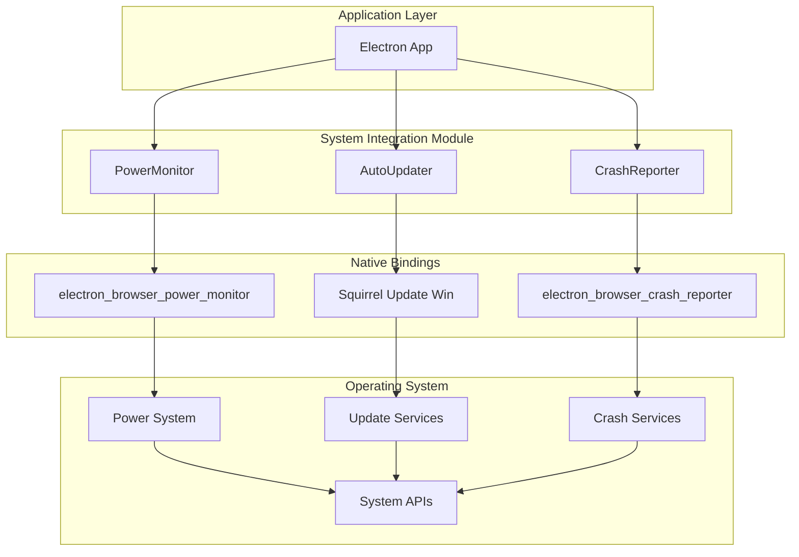
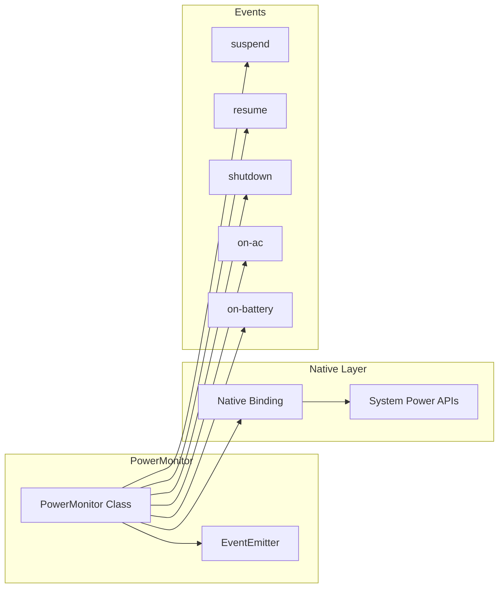
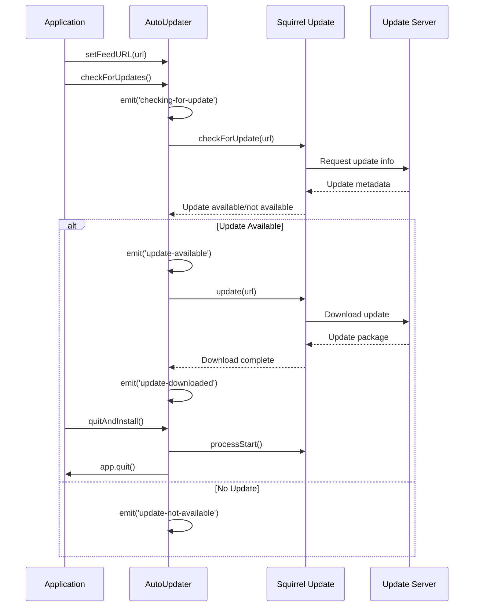
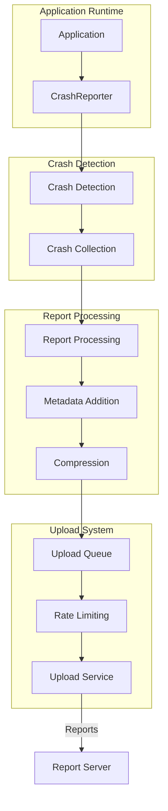
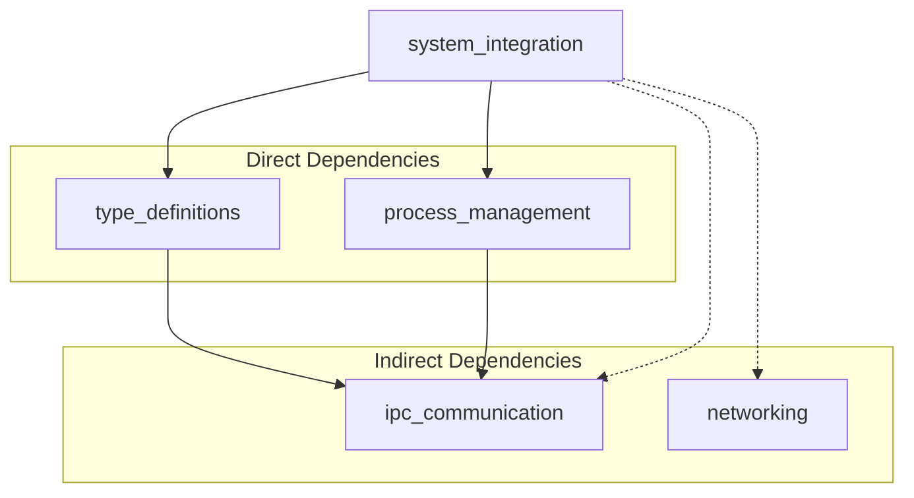
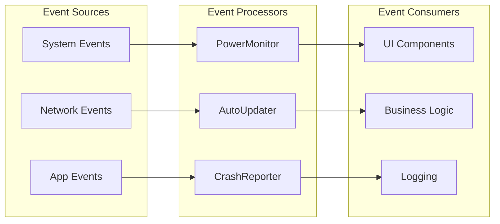
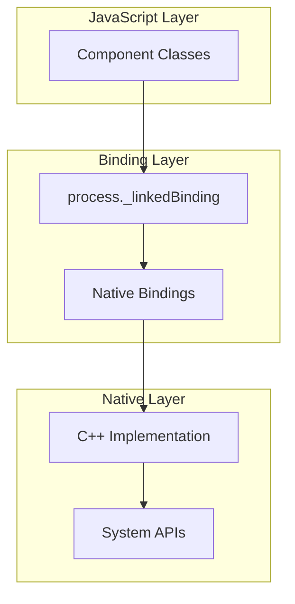

# System Integration Module

The system_integration module provides essential system-level integration capabilities for Electron applications, enabling deep interaction with the operating system through power management, automatic updates, and crash reporting functionality.

## Overview

This module serves as the bridge between Electron applications and the underlying operating system, providing three critical system integration services:

- **Power Management**: Monitor system power states, battery status, and thermal conditions
- **Auto-Updates**: Handle application updates through platform-specific update mechanisms
- **Crash Reporting**: Collect and report application crashes for debugging and monitoring

## Architecture



## Core Components

### PowerMonitor

The PowerMonitor component provides real-time monitoring of system power states and battery conditions.

**Key Features:**
- System idle state detection
- Battery power monitoring
- Thermal state tracking
- Power event notifications (suspend, resume, shutdown)

**Architecture:**


**Key Methods:**
- `getSystemIdleState(idleThreshold)`: Check if system is idle
- `getCurrentThermalState()`: Get current thermal state
- `getSystemIdleTime()`: Get system idle duration
- `isOnBatteryPower()`: Check battery power status

### AutoUpdater

The AutoUpdater component manages application updates through platform-specific update mechanisms.

**Key Features:**
- Automatic update checking
- Update download and installation
- Platform-specific update handling (Squirrel for Windows)
- Update progress notifications

**Update Flow:**


### CrashReporter

The CrashReporter component handles crash data collection and reporting for debugging and monitoring purposes.

**Key Features:**
- Crash data collection
- Automatic crash reporting
- Custom metadata attachment
- Upload management and rate limiting

**Crash Reporting Flow:**


## Dependencies

### Internal Dependencies

The system_integration module has dependencies on several other modules:



**Key Dependencies:**
- **[type_definitions](type_definitions.md)**: TypeScript definitions for Electron APIs
- **[process_management](process_management.md)**: Process lifecycle management
- **[ipc_communication](ipc_communication.md)**: Inter-process communication (indirect)
- **[networking](networking.md)**: Network operations for updates (indirect)

### External Dependencies

- **Native Bindings**: Platform-specific native code for system integration
- **Squirrel**: Windows update framework
- **Operating System APIs**: Power management, crash reporting, and update services

## Integration Patterns

### Event-Driven Architecture

All system integration components follow an event-driven pattern:



### Singleton Pattern

Each component is implemented as a singleton to ensure consistent system state:

```typescript
// PowerMonitor singleton
module.exports = new PowerMonitor();

// AutoUpdater singleton
export default new AutoUpdater();

// CrashReporter singleton
export default new CrashReporter();
```

### Native Binding Integration

Components integrate with native system APIs through Node.js bindings:



## Usage Patterns

### Power Management Integration

```typescript
import { powerMonitor } from 'electron';

// Monitor power events
powerMonitor.on('suspend', () => {
    // Handle system suspend
});

powerMonitor.on('resume', () => {
    // Handle system resume
});

// Check battery status
if (powerMonitor.isOnBatteryPower()) {
    // Optimize for battery usage
}
```

### Auto-Update Integration

```typescript
import { autoUpdater } from 'electron';

// Configure update feed
autoUpdater.setFeedURL({
    url: 'https://updates.example.com'
});

// Handle update events
autoUpdater.on('update-available', () => {
    // Notify user of available update
});

autoUpdater.on('update-downloaded', () => {
    // Prompt user to restart
    autoUpdater.quitAndInstall();
});

// Check for updates
autoUpdater.checkForUpdates();
```

### Crash Reporting Integration

```typescript
import { crashReporter } from 'electron';

// Start crash reporting
crashReporter.start({
    productName: 'MyApp',
    companyName: 'MyCompany',
    submitURL: 'https://crashes.example.com',
    uploadToServer: true
});

// Add custom metadata
crashReporter.addExtraParameter('user-id', userId);
```

## Platform Considerations

### Windows
- Uses Squirrel for auto-updates
- Integrates with Windows power management APIs
- Supports Windows Error Reporting for crashes

### macOS
- Uses built-in update mechanisms
- Integrates with macOS power management
- Supports Apple's crash reporting system

### Linux
- Custom update handling required
- Uses D-Bus for power management
- Supports standard Linux crash reporting

## Security Considerations

### Update Security
- Validates update signatures
- Uses HTTPS for update downloads
- Implements rate limiting to prevent abuse

### Crash Report Privacy
- Filters sensitive information from crash reports
- Supports opt-out mechanisms
- Implements data retention policies

### Power Management Security
- Requires appropriate system permissions
- Handles privilege escalation safely
- Validates system state information

## Performance Considerations

### Resource Usage
- Minimal memory footprint through singleton pattern
- Efficient event handling with native bindings
- Lazy initialization of system monitors

### Update Performance
- Background update downloads
- Incremental update support
- Bandwidth-aware update scheduling

### Crash Reporting Performance
- Asynchronous crash report generation
- Compressed report uploads
- Rate-limited reporting to prevent system overload

## Error Handling

### Graceful Degradation
- Continues operation when system APIs are unavailable
- Provides fallback mechanisms for critical functionality
- Logs errors without crashing the application

### Error Recovery
- Automatic retry mechanisms for network operations
- State recovery after system events
- Robust error propagation to application layer

## Testing Considerations

For testing strategies and utilities, refer to the [build_and_testing](build_and_testing.md) module documentation.

## Related Modules

- **[process_management](process_management.md)**: Process lifecycle and utility process management
- **[ipc_communication](ipc_communication.md)**: Inter-process communication for system events
- **[networking](networking.md)**: Network operations for update downloads
- **[type_definitions](type_definitions.md)**: TypeScript definitions for system integration APIs