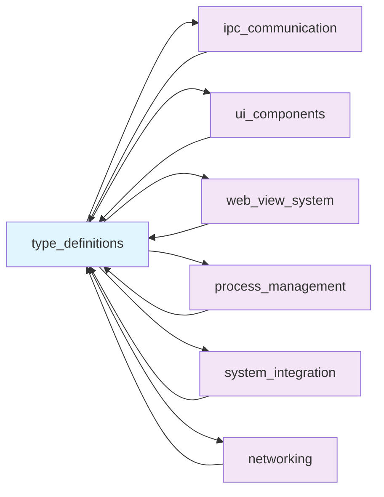
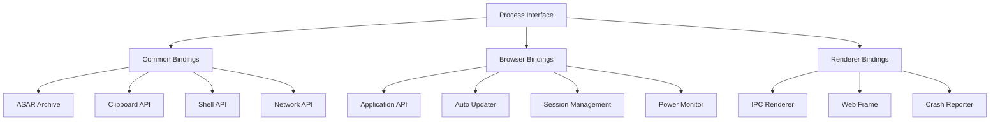
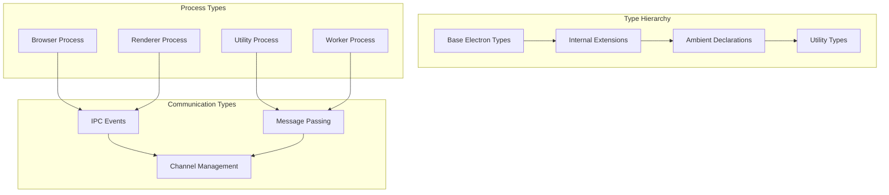
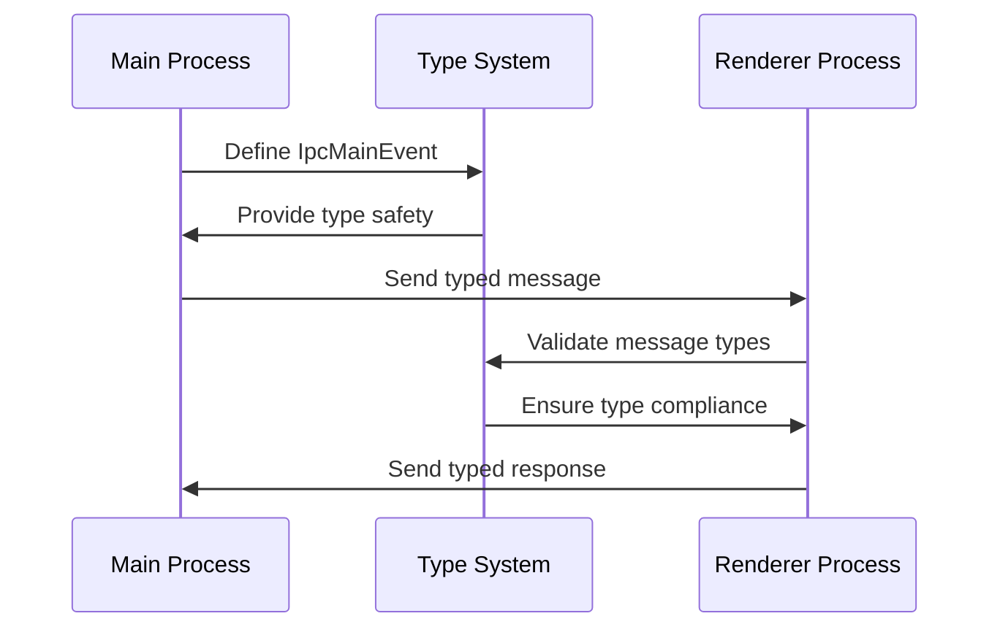
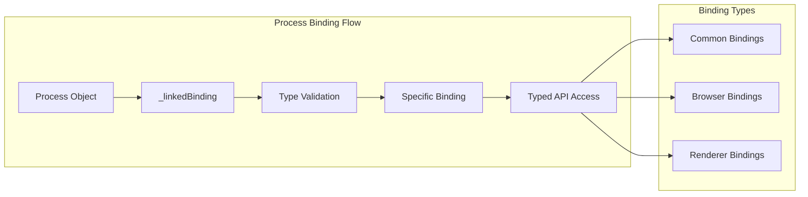
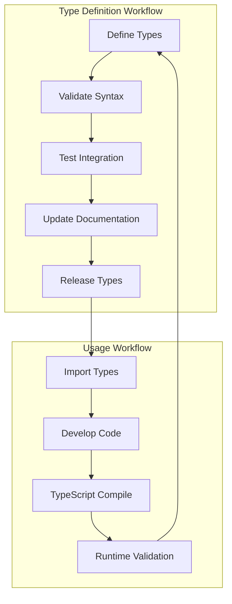

# Type Definitions Module

The type_definitions module provides comprehensive TypeScript type definitions for Electron's internal APIs and ambient environment. It serves as the foundational type system that enables type safety across the entire Electron framework, defining interfaces for internal components, process bindings, and runtime environments.

## Architecture Overview

```mermaid
graph TB
    subgraph "Type Definitions Module"
        subgraph "Internal Electron Types"
            IpcMainEvent[IpcMainEvent]
            WebFrameMain[WebFrameMain]
            BrowserWindow[BrowserWindow Extensions]
            WebContents[WebContents Extensions]
        end
        
        subgraph "Ambient Environment Types"
            Process[Process Extensions]
            Global[Global Interface]
            NodeJS[NodeJS Extensions]
        end
        
        subgraph "Chrome Extension Types"
            ChromeTabs[Chrome.Tabs]
            ExecuteScript[ExecuteScriptDetails]
        end
        
        subgraph "Web Standards Types"
            TrustedTypes[TrustedTypes]
            MessagePort[MessagePort Extensions]
        end
    end
    
    subgraph "External Dependencies"
        ElectronAPI[Electron Public API]
        NodeAPI[Node.js API]
        WebAPI[Web Standards API]
    end
    
    IpcMainEvent --> ElectronAPI
    WebFrameMain --> ElectronAPI
    BrowserWindow --> ElectronAPI
    WebContents --> ElectronAPI
    Process --> NodeAPI
    Global --> NodeAPI
    ChromeTabs --> WebAPI
    TrustedTypes --> WebAPI
```



## Module Dependencies



## Core Components

### Internal Electron Type Definitions

#### IpcMainEvent Interface
Extends the standard Electron IpcMainEvent with internal communication capabilities:

```typescript
interface IpcMainEvent {
    _replyChannel: ReplyChannel;
    frameTreeNodeId?: number;
}
```

**Key Features:**
- Internal reply channel management for IPC communication
- Frame tree node identification for multi-frame scenarios
- Integration with [ipc_communication](ipc_communication.md) module

#### WebFrameMain Extensions
Provides internal methods for frame-level communication:

```typescript
interface WebFrameMain {
    _send(internal: boolean, channel: string, args: any): void;
    _sendInternal(channel: string, ...args: any[]): void;
    _postMessage(channel: string, message: any, transfer?: any[]): void;
    _lifecycleStateForTesting: string;
}
```

**Capabilities:**
- Internal message sending with channel isolation
- Post message API for transferable objects
- Lifecycle state tracking for testing scenarios

#### BrowserWindow Internal Methods
Extends BrowserWindow with deprecated and internal methods:

```typescript
interface BrowserWindow {
    // Developer tools management
    openDevTools(options?: Electron.OpenDevToolsOptions): void;
    closeDevTools(): void;
    isDevToolsOpened(): void;
    
    // Background throttling control
    setBackgroundThrottling(allowed: boolean): void;
    
    // Element inspection
    inspectElement(x: number, y: number): void;
}
```

#### WebContents Factory
Provides factory methods for WebContents creation:

```typescript
class WebContents extends Electron.WebContents {
    static create(opts?: Electron.WebPreferences): Electron.WebContents;
}
```

### Ambient Environment Types

#### Process Extensions
Extends Node.js Process with Electron-specific bindings:



**Binding Categories:**
- **Common Bindings**: Shared across all process types (ASAR, clipboard, shell, net)
- **Browser Bindings**: Main process specific (app, session, power monitor)
- **Renderer Bindings**: Renderer process specific (IPC, web frame)

#### Global Interface Extensions
Defines global scope extensions for Node.js compatibility:

```typescript
interface Global {
    require: NodeRequire;
    module: NodeModule;
    __filename: string;
    __dirname: string;
}
```

## Type System Architecture



## Integration Patterns

### IPC Communication Integration
The type definitions provide the foundation for type-safe IPC communication:



### Process Binding System
Demonstrates how process bindings are typed and accessed:



## Web Standards Integration

### Trusted Types Support
Provides comprehensive support for Web Trusted Types API:

```typescript
interface TrustedTypePolicyFactory {
    createPolicy(policyName: string, policyOptions: TrustedTypePolicyOptions): TrustedTypePolicy;
    isHTML(value: any): boolean;
    isScript(value: any): boolean;
    isScriptURL(value: any): boolean;
}
```

### Chrome Extension Compatibility
Defines types for Chrome extension APIs compatibility:

```typescript
namespace Chrome.Tabs {
    interface ExecuteScriptDetails {
        code?: string;
        file?: string;
        allFrames?: boolean;
        runAt?: 'document-start' | 'document-end' | 'document_idle';
    }
}
```

## Development Workflow



## Security Considerations

### Type Safety Enforcement
- **Internal API Isolation**: Internal methods are clearly marked with underscore prefixes
- **Process Boundary Types**: Different process types have distinct binding interfaces
- **Channel Validation**: IPC channels are typed to prevent message injection

### Trusted Types Integration
- **XSS Prevention**: Trusted Types API integration helps prevent cross-site scripting
- **Content Security**: Type-safe HTML, Script, and ScriptURL handling
- **Policy Management**: Centralized trusted type policy creation and management

## Performance Implications

### Compile-Time Optimization
- **Type Elimination**: TypeScript types are eliminated at compile time
- **Tree Shaking**: Unused type definitions don't affect runtime performance
- **Static Analysis**: Enables better static analysis and optimization

### Runtime Considerations
- **Binding Efficiency**: Typed bindings provide efficient native API access
- **Memory Management**: Type definitions don't add runtime memory overhead
- **Validation Overhead**: Runtime type validation is minimal and optional

## Related Modules

- **[ipc_communication](ipc_communication.md)**: Uses IPC type definitions for message passing
- **[ui_components](ui_components.md)**: Relies on BrowserWindow and WebContents types
- **[web_view_system](web_view_system.md)**: Uses WebContents and WebFrame type extensions
- **[process_management](process_management.md)**: Utilizes Process binding type definitions
- **[system_integration](system_integration.md)**: Depends on system-level binding types
- **[networking](networking.md)**: Uses network-related type definitions and bindings

## Best Practices

### Type Definition Guidelines
1. **Namespace Organization**: Use appropriate namespaces (Electron, ElectronInternal, NodeJS)
2. **Internal API Marking**: Prefix internal APIs with underscore
3. **Process-Specific Types**: Separate types by process context when applicable
4. **Backward Compatibility**: Maintain compatibility with existing type definitions

### Usage Recommendations
1. **Import Specificity**: Import only required type definitions
2. **Type Assertions**: Use type assertions carefully with internal APIs
3. **Process Context**: Ensure types match the target process context
4. **Version Compatibility**: Check type definition versions against Electron versions

## Future Considerations

### Type System Evolution
- **Enhanced Process Types**: More granular process-specific type definitions
- **Improved IPC Types**: Better type safety for IPC message validation
- **Web Standards Alignment**: Continued alignment with evolving web standards
- **Performance Types**: Types for performance monitoring and optimization

### Integration Enhancements
- **Cross-Module Types**: Better type sharing between modules
- **Runtime Validation**: Optional runtime type validation for development
- **Documentation Generation**: Automated documentation from type definitions
- **Testing Integration**: Enhanced testing support with type-aware test utilities