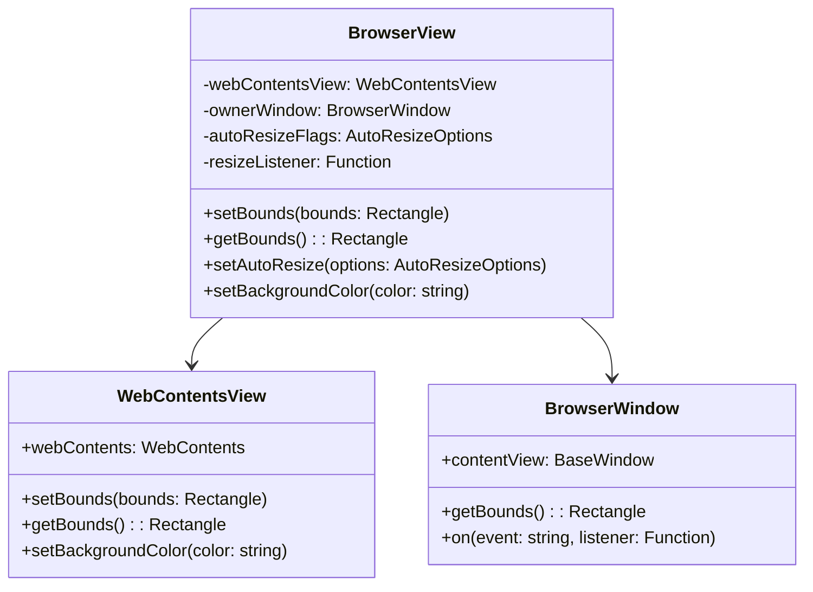
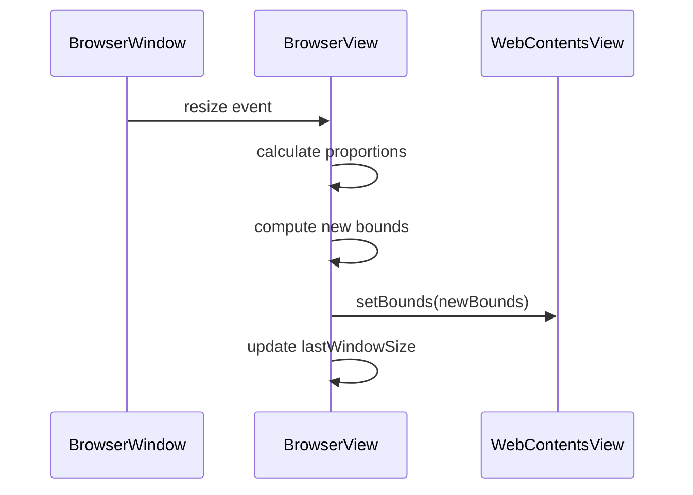
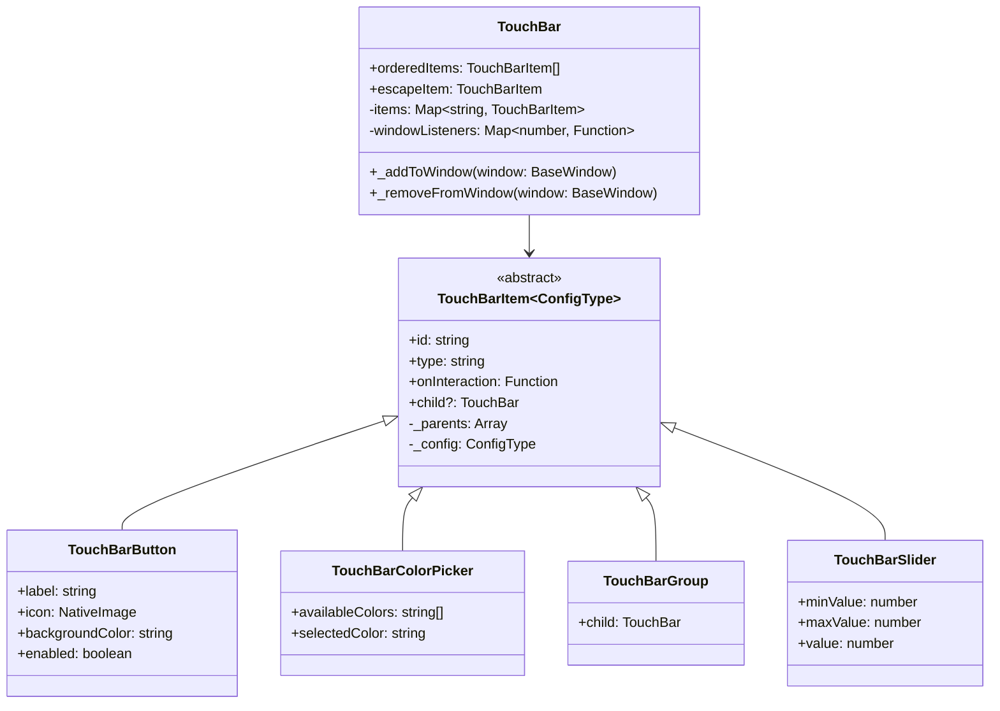
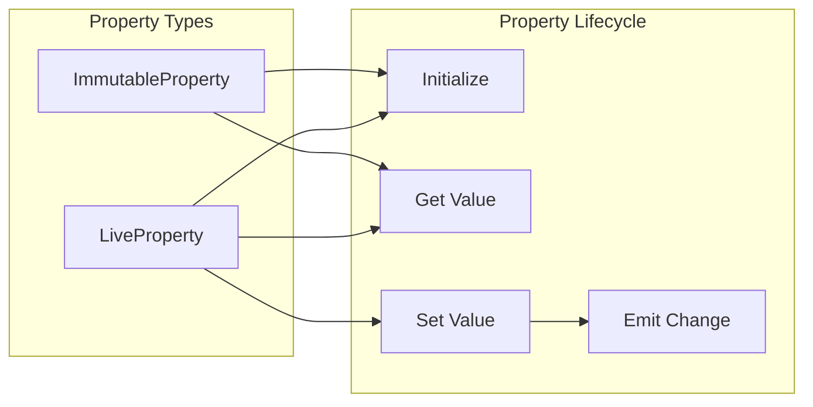
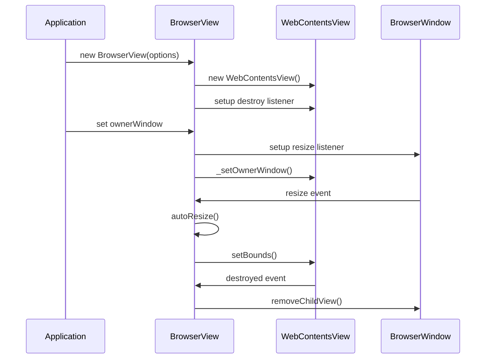
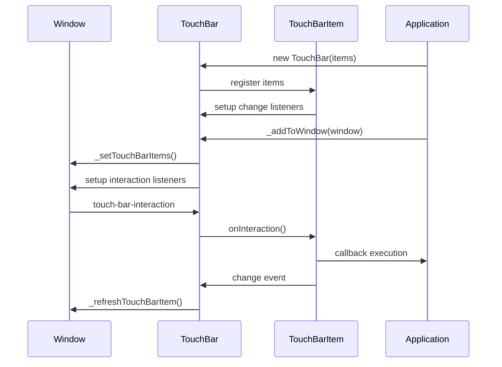
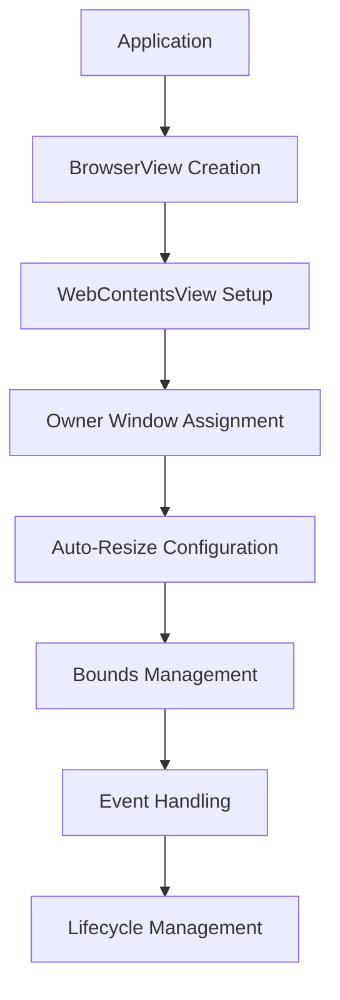
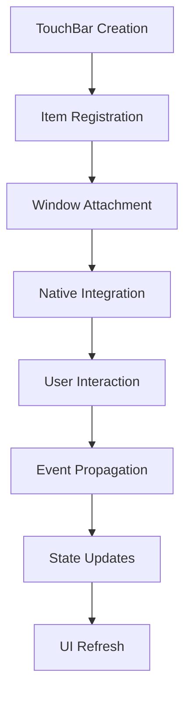

# UI Components Module

The UI Components module provides essential user interface elements and controls for Electron applications, focusing on native UI components that integrate seamlessly with the operating system. This module handles browser views, macOS Touch Bar functionality, and system sharing capabilities.

## Architecture Overview

```mermaid
graph TB
    subgraph "UI Components Module"
        BV[BrowserView]
        TB[TouchBar]
        SM[ShareMenu]
        
        subgraph "TouchBar Components"
            TBB[TouchBarButton]
            TBCP[TouchBarColorPicker]
            TBG[TouchBarGroup]
            TBL[TouchBarLabel]
            TBP[TouchBarPopover]
            TBS[TouchBarSlider]
            TBSP[TouchBarSpacer]
            TBSC[TouchBarSegmentedControl]
            TBSR[TouchBarScrubber]
            TBOP[TouchBarOtherItemsProxy]
        end
    end
    
    subgraph "Dependencies"
        WCV[WebContentsView]
        BW[BrowserWindow]
        WC[WebContents]
        M[Menu]
    end
    
    BV --> WCV
    BV --> BW
    BV --> WC
    TB --> TBB
    TB --> TBCP
    TB --> TBG
    TB --> TBL
    TB --> TBP
    TB --> TBS
    TB --> TBSP
    TB --> TBSC
    TB --> TBSR
    TB --> TBOP
    SM --> M
    SM --> BW
```



## Core Components

### BrowserView

The `BrowserView` class provides a way to embed web content within a `BrowserWindow` with precise control over positioning and sizing.

**Key Features:**
- **Web Content Embedding**: Wraps `WebContentsView` for web content display
- **Auto-Resize Functionality**: Automatically adjusts size based on parent window changes
- **Bounds Management**: Precise control over position and dimensions
- **Owner Window Integration**: Seamless integration with parent `BrowserWindow`

**Architecture:**


**Auto-Resize System:**


### TouchBar System

The TouchBar system provides comprehensive support for macOS Touch Bar functionality with a rich set of interactive components.

**Component Hierarchy:**


**Property Management System:**
The TouchBar components use a sophisticated property management system with decorators:

- **`@ImmutableProperty`**: Properties that cannot be changed after initialization
- **`@LiveProperty`**: Properties that can be updated and trigger change events



### ShareMenu

The `ShareMenu` class provides system-level sharing functionality, integrating with the operating system's native sharing mechanisms.

**Features:**
- **System Integration**: Uses native OS sharing dialogs
- **Menu-based Interface**: Built on top of Electron's Menu system
- **Popup Management**: Control over share menu display and dismissal

## Component Interactions

### BrowserView Lifecycle



### TouchBar Event Flow



## Integration Points

### With Type Definitions Module
- Utilizes `BrowserWindow`, `WebContents`, and `WebContentsView` type definitions
- Depends on Touch Bar related type definitions from [type_definitions.md](type_definitions.md)

### With System Integration Module
- ShareMenu integrates with system-level sharing mechanisms
- Coordinates with native menu systems via [system_integration.md](system_integration.md)

### With IPC Communication Module
- BrowserView web contents communicate through IPC channels
- Touch Bar interactions may trigger IPC events to renderer processes
- See [ipc_communication.md](ipc_communication.md) for communication patterns

## Data Flow Patterns

### BrowserView Data Flow


### TouchBar Data Flow


## Error Handling and Edge Cases

### BrowserView Error Scenarios
- **Invalid Bounds**: Validation of rectangle parameters
- **Owner Window Lifecycle**: Handling window closure during BrowserView lifetime
- **Auto-Resize Edge Cases**: Division by zero protection in proportion calculations

### TouchBar Error Scenarios
- **Duplicate Items**: Prevention of adding same TouchBarItem multiple times
- **Multiple OtherItemsProxy**: Enforcement of single proxy per TouchBar
- **Invalid Configurations**: Type checking and validation of constructor options

## Performance Considerations

### BrowserView Optimizations
- **Lazy Proportion Calculation**: Auto-resize proportions calculated only when needed
- **Event Listener Management**: Proper cleanup to prevent memory leaks
- **Bounds Caching**: Efficient bounds management to minimize layout thrashing

### TouchBar Optimizations
- **Item Registration**: Efficient mapping and lookup of TouchBar items
- **Change Event Batching**: Optimized event propagation for UI updates
- **Memory Management**: Proper cleanup of event listeners and references

## Usage Examples

### BrowserView Implementation
```typescript
// Create a BrowserView with web preferences
const view = new BrowserView({
  webPreferences: {
    nodeIntegration: false,
    contextIsolation: true
  }
});

// Set bounds and auto-resize behavior
view.setBounds({ x: 0, y: 0, width: 800, height: 600 });
view.setAutoResize({ width: true, height: true });

// Attach to window
window.setBrowserView(view);
```

### TouchBar Implementation
```typescript
// Create TouchBar with various components
const touchBar = new TouchBar({
  items: [
    new TouchBar.TouchBarButton({
      label: 'Action',
      click: () => console.log('Button clicked')
    }),
    new TouchBar.TouchBarSlider({
      label: 'Volume',
      minValue: 0,
      maxValue: 100,
      change: (value) => console.log('Volume:', value)
    })
  ]
});

// Attach to window
window.setTouchBar(touchBar);
```

## Future Considerations

### Potential Enhancements
- **Cross-Platform TouchBar**: Extending TouchBar concepts to other platforms
- **Advanced BrowserView Features**: Enhanced positioning and animation capabilities
- **Improved ShareMenu**: Extended sharing options and customization

### Architectural Evolution
- **Component Composition**: More flexible component composition patterns
- **State Management**: Enhanced state synchronization between components
- **Performance Monitoring**: Built-in performance metrics and optimization hints

This module serves as the foundation for native UI integration in Electron applications, providing the essential building blocks for creating rich, platform-native user interfaces while maintaining cross-platform compatibility where possible.