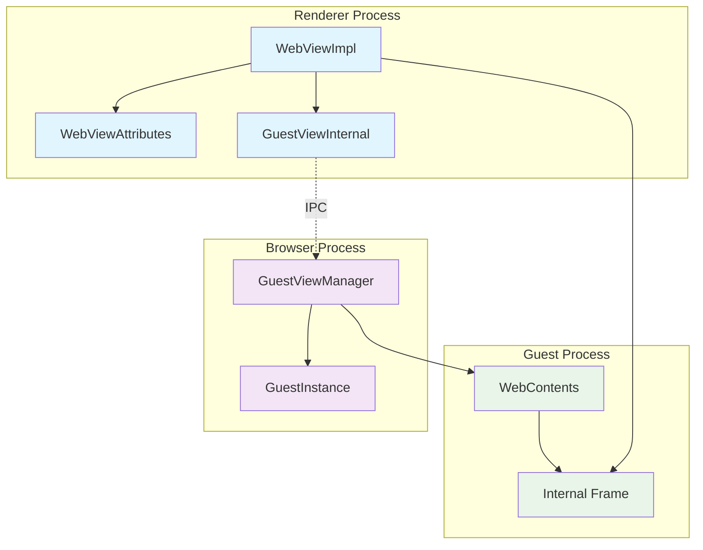
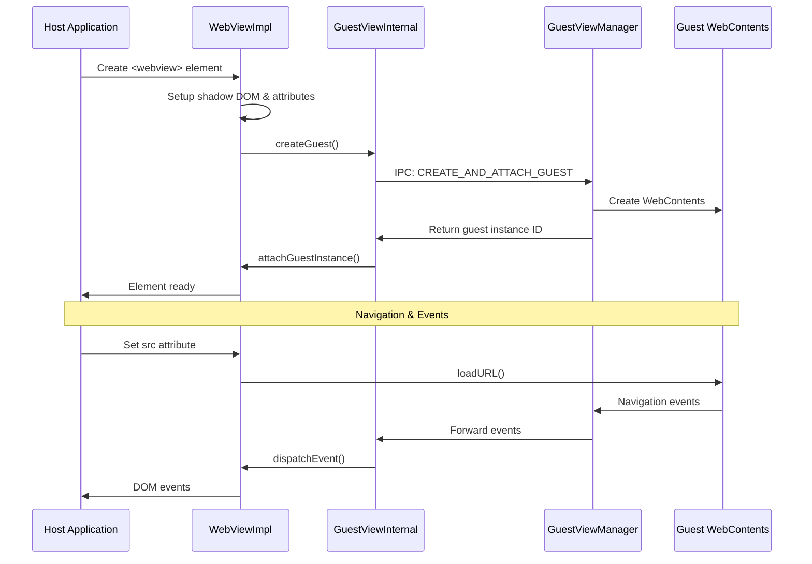
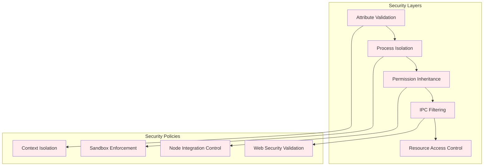
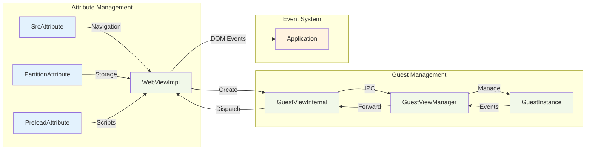

# Web View System Module

The Web View System module provides a comprehensive framework for embedding and managing web content within Electron applications through the `<webview>` HTML tag. This module enables secure, isolated web content rendering with fine-grained control over permissions, navigation, and communication between the host application and embedded content.

## Core Architecture

The Web View System operates through a sophisticated multi-process architecture that maintains security boundaries while enabling rich interaction capabilities. The system consists of renderer-side components that manage the `<webview>` element lifecycle and browser-side components that handle guest process management and security enforcement.



## Component Overview

### Renderer Process Components

#### WebViewImpl
The core implementation class that manages the `<webview>` element lifecycle, handling DOM integration, attribute management, and guest process communication.

**Key Responsibilities:**
- Shadow DOM creation and management
- Internal iframe element lifecycle
- Event handling and propagation
- Guest instance attachment coordination
- Navigation state management

#### WebViewAttributes
A comprehensive attribute management system that handles `<webview>` element attributes with specialized validation, mutation handling, and security enforcement.

**Supported Attributes:**
- `src`: Navigation URL with security validation
- `partition`: Storage partition isolation
- `preload`: Preload script specification
- `nodeintegration`: Node.js integration control
- `webpreferences`: Web preferences configuration
- Security attributes: `disablewebsecurity`, `allowpopups`
- Feature toggles: `plugins`, `blinkfeatures`

#### GuestViewInternal
The communication bridge between renderer and browser processes, handling IPC message routing, method invocation, and event delegation.

### Browser Process Components

#### GuestViewManager
The central orchestrator for guest process lifecycle management, security policy enforcement, and embedder-guest relationship coordination.

**Core Functions:**
- Guest WebContents creation and configuration
- Security inheritance from embedder
- Event forwarding and filtering
- Resource cleanup and lifecycle management

#### GuestInstance
Represents the relationship between an embedder WebContents and its guest WebContents, maintaining state and facilitating communication.

## Data Flow Architecture



## Security Model

The Web View System implements a multi-layered security architecture:



### Security Features

1. **Process Isolation**: Each `<webview>` runs in a separate process with restricted capabilities
2. **Permission Inheritance**: Security-critical preferences inherit from the embedder
3. **Attribute Validation**: Strict validation of security-sensitive attributes
4. **IPC Message Filtering**: Controlled communication channels with validation
5. **Resource Access Control**: File system and network access restrictions

## Integration Points

### IPC Communication Module
The Web View System heavily integrates with the [IPC Communication](ipc_communication.md) module for:
- Guest process creation and management
- Event forwarding between processes
- Method invocation and property access
- Security validation and filtering

### Type Definitions Module
Leverages [Type Definitions](type_definitions.md) for:
- WebContents and BrowserWindow interfaces
- IPC event type definitions
- Process and global type declarations

### Process Management Module
Coordinates with [Process Management](process_management.md) for:
- Guest process lifecycle management
- Resource cleanup and monitoring
- Inter-process communication setup

## Component Interaction Flow



## API Surface

### WebView Element Methods
```typescript
// Navigation
webview.loadURL(url: string, options?: LoadURLOptions): Promise<void>
webview.reload(): void
webview.stop(): void

// History
webview.goBack(): void
webview.goForward(): void
webview.goToIndex(index: number): void

// Content
webview.insertCSS(css: string): Promise<string>
webview.executeJavaScript(code: string): Promise<any>

// Communication
webview.send(channel: string, ...args: any[]): void
webview.sendInputEvent(event: InputEvent): void
```

### Event Handling
```typescript
// Navigation events
webview.addEventListener('did-start-loading', handler)
webview.addEventListener('did-stop-loading', handler)
webview.addEventListener('did-finish-load', handler)
webview.addEventListener('did-fail-load', handler)

// Content events
webview.addEventListener('dom-ready', handler)
webview.addEventListener('page-title-updated', handler)
webview.addEventListener('page-favicon-updated', handler)

// Communication events
webview.addEventListener('ipc-message', handler)
webview.addEventListener('console-message', handler)
```

## Configuration and Customization

### Web Preferences
The system supports comprehensive web preference configuration:

```typescript
interface WebViewWebPreferences {
  nodeIntegration?: boolean
  nodeIntegrationInSubFrames?: boolean
  contextIsolation?: boolean
  sandbox?: boolean
  webSecurity?: boolean
  allowRunningInsecureContent?: boolean
  plugins?: boolean
  experimentalFeatures?: boolean
}
```

### Attribute Configuration
```html
<webview 
  src="https://example.com"
  partition="persist:example"
  preload="./preload.js"
  nodeintegration="false"
  webpreferences="contextIsolation=true,sandbox=true"
  allowpopups="false"
  disablewebsecurity="false">
</webview>
```

## Performance Considerations

### Memory Management
- Automatic cleanup of guest instances on destruction
- Event listener deregistration on detachment
- Efficient attribute mutation handling
- Resource pooling for frequent operations

### Process Optimization
- Lazy guest process creation
- Efficient IPC message batching
- Minimal cross-process data transfer
- Optimized event forwarding

## Error Handling and Debugging

### Common Error Scenarios
1. **Invalid Partition**: Malformed partition strings
2. **Navigation Failures**: Network or security errors
3. **Preload Script Issues**: File access or execution errors
4. **IPC Communication Failures**: Process termination or message corruption

### Debugging Features
- Comprehensive error logging with context
- Event tracing for lifecycle debugging
- Security violation reporting
- Performance metrics collection

## Best Practices

### Security
1. Always use `contextIsolation=true` for production
2. Minimize `nodeIntegration` usage
3. Validate all user-provided URLs
4. Use persistent partitions for session management
5. Implement proper CSP headers

### Performance
1. Reuse webview instances when possible
2. Implement proper cleanup in event handlers
3. Use efficient IPC message patterns
4. Monitor memory usage in long-running applications

### Development
1. Use TypeScript for better type safety
2. Implement comprehensive error handling
3. Test across different security configurations
4. Monitor for memory leaks in development

The Web View System module provides a robust, secure, and flexible foundation for embedding web content in Electron applications, with comprehensive security controls and efficient process management capabilities.