# Application Management Module

## Introduction

The Application Management module serves as the central orchestrator and entry point for the Git Credential Manager (GCM) system. It provides the core application framework that manages the lifecycle of credential operations, coordinates between different host providers, and handles the command-line interface that Git uses to interact with the credential manager.

This module is responsible for initializing the application context, registering host providers (GitHub, GitLab, Bitbucket, Azure Repos), managing command routing, and providing configuration services. It acts as the glue that binds together all other modules in the system while maintaining a clean separation of concerns.

Beyond the core orchestration, the Application Management module also encompasses the UI framework components that provide both graphical and command-line interfaces for user interactions, making it a comprehensive solution for credential management across different platforms and interaction modes.

## Architecture Overview

The Application Management module follows a comprehensive layered architecture that encompasses both core application logic and user interface management:

```mermaid
graph TB
    subgraph "Application Management Layer"
        APP[Application<br/>src.shared.Core.Application.Application]
        CTX[CommandContext<br/>src.shared.Core.CommandContext.CommandContext]
        ICTX[ICommandContext<br/>src.shared.Core.CommandContext.ICommandContext]
        ICP[ICommandProvider<br/>src.shared.Core.Commands.ProviderCommand.ICommandProvider]
        PC[ProviderCommand<br/>src.shared.Core.Commands.ProviderCommand.ProviderCommand]
        IA[InputArguments<br/>src.shared.Core.InputArguments.InputArguments]
    end

    subgraph "UI Framework Layer"
        AA[AvaloniaApp<br/>src.shared.Core.UI.AvaloniaApp.axaml.AvaloniaApp]
        HA[HelperApplication<br/>src.shared.Core.UI.HelperApplication.HelperApplication]
        DISP[Dispatcher<br/>src.shared.Core.UI.Dispatcher.Dispatcher]
        IDJ[IDispatcherJob<br/>src.shared.Core.UI.Dispatcher.IDispatcherJob]
    end

    subgraph "External Dependencies"
        HPR[HostProviderRegistry<br/>src.shared.Core.HostProviderRegistry.HostProviderRegistry]
        CS[ConfigurationService<br/>src.shared.Core.ConfigurationService.ConfigurationService]
        HC[Host Providers]
        CMD[Core Commands]
        DIAG[Diagnostics]
    end

    CTX -.implements.-> ICTX
    APP --> CTX
    APP --> HPR
    APP --> CS
    APP --> CMD
    APP --> DIAG
    ICP -.creates.-> PC
    HC --registers--> APP
    
    APP -.-> HA
    HA -.-> AA
    DISP -.-> IDJ
    
    style APP fill:#f9f,stroke:#333,stroke-width:4px
    style CTX fill:#bbf,stroke:#333,stroke-width:2px
    style ICTX fill:#bbf,stroke:#333,stroke-width:2px
    style AA fill:#bfb,stroke:#333,stroke-width:2px
    style HA fill:#bfb,stroke:#333,stroke-width:2px
```

## Core Components

### Application Class

The `Application` class is the central component that inherits from `ApplicationBase` and implements `IConfigurableComponent`. It serves as the main entry point and orchestrator for the entire credential management system.

**Key Responsibilities:**
- Host provider registration and management
- Command-line interface setup and routing
- Configuration management integration
- Diagnostic service coordination
- Exception handling and error reporting

**Key Methods:**
- `RegisterProvider()`: Registers host providers with optional priority, commands, and diagnostics
- `RunInternalAsync()`: Main application execution loop that sets up the command-line parser
- `ConfigureAsync()`: Configures Git to use GCM as the credential helper
- `UnconfigureAsync()`: Removes GCM configuration from Git

### CommandContext and ICommandContext

The `CommandContext` class implements `ICommandContext` and provides the execution environment for all credential operations. It initializes platform-specific services and manages the lifecycle of core dependencies.

**Key Features:**
- Platform detection and service initialization (Windows, macOS, Linux)
- Git executable location and configuration
- Service container for all core dependencies
- Resource management and disposal

**Platform-Specific Initialization:**
- **Windows**: Uses Windows-specific implementations for file system, environment, session management, and credential storage
- **macOS**: Leverages macOS-specific services including Keychain integration
- **Linux**: Utilizes Linux-specific implementations with Secret Service support

### InputArguments

The `InputArguments` class represents the input data stream from Git, providing structured access to credential query parameters such as protocol, host, path, username, and password.

**Key Capabilities:**
- Multi-value argument support
- URI construction and parsing
- Host and port extraction
- WWW-Authenticate header parsing

### UI Framework Components

#### AvaloniaApp
The `AvaloniaApp` class extends the Avalonia Application framework to provide cross-platform UI capabilities for credential prompts and user interactions. It manages the application lifecycle and provides the main window functionality for graphical credential operations.

**Key Features:**
- Cross-platform UI initialization using Avalonia framework
- Main window management through dependency injection
- About dialog integration
- Application lifetime management

#### HelperApplication
The `HelperApplication` class extends `ApplicationBase` to provide command-line interface functionality for scenarios where GUI prompts are disabled or unavailable. It bridges the gap between command-line operations and UI requirements.

**Key Capabilities:**
- Command-line argument processing
- Exception handling with formatted error output
- Dictionary-based error reporting
- Integration with the broader application context

#### Dispatcher and IDispatcherJob
The `Dispatcher` class manages UI thread operations and ensures thread-safe access to UI components across different platforms. It implements a sophisticated job queue system for managing UI operations.

**Threading Architecture:**
- Main thread association and verification
- Job queue management with cancellation support
- Thread-safe operation posting and execution
- Synchronous and asynchronous operation support

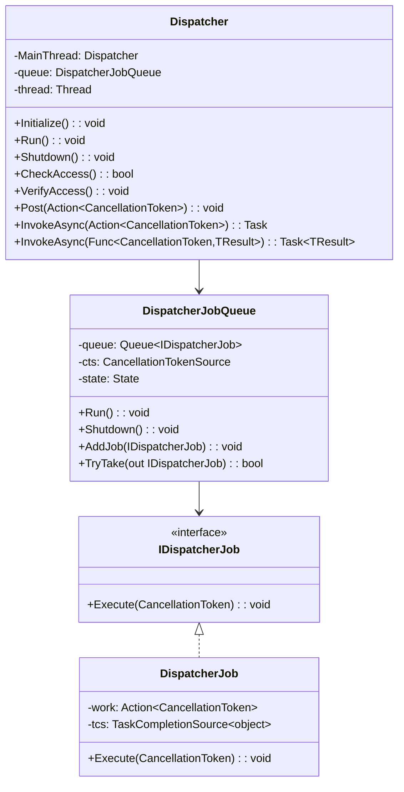

## UI Threading Model and Architecture

The Application Management module implements a sophisticated threading model to handle both command-line and graphical user interfaces:

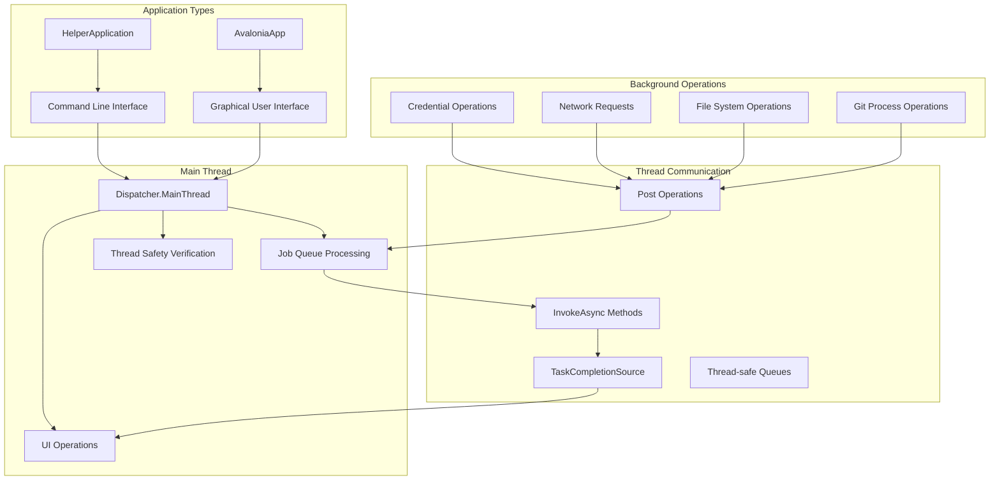

### Thread Safety Mechanisms

The Dispatcher implementation provides several mechanisms to ensure thread safety:

1. **Access Verification**: `CheckAccess()` and `VerifyAccess()` methods ensure operations run on the correct thread
2. **Job Queue Management**: Thread-safe queue operations with proper locking
3. **Cancellation Support**: Proper cancellation token propagation throughout the job queue
4. **State Management**: Clear state transitions to prevent race conditions

### UI Operation Flow

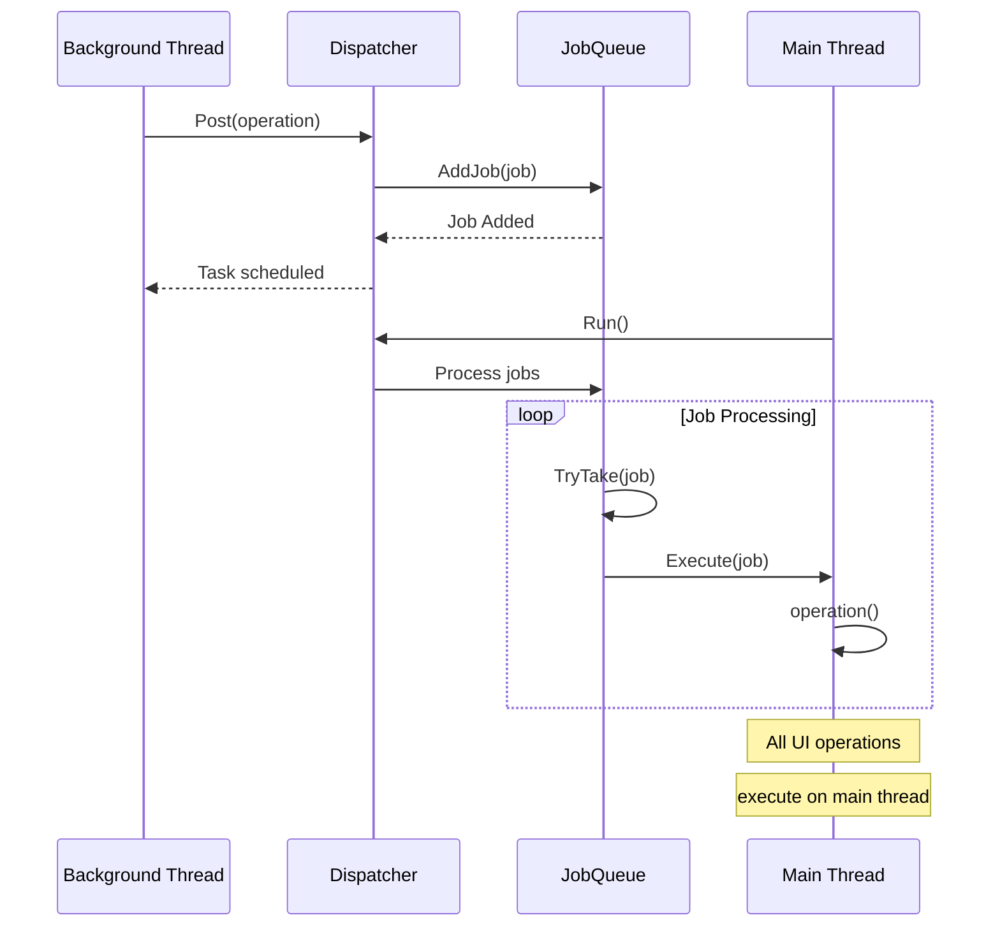

## Cross-Platform UI Integration

The UI framework components provide seamless integration across different platforms:

### Platform-Specific UI Initialization
- **Windows**: Integrates with Windows Terminal and system prompts
- **macOS**: Leverages native macOS UI components and Keychain integration
- **Linux**: Uses Secret Service for credential storage with appropriate UI prompts

### UI Mode Selection
The Application Management module automatically selects the appropriate UI mode based on:
- Command-line flags (e.g., `--no-ui`)
- Platform capabilities
- User preferences
- Runtime environment constraints

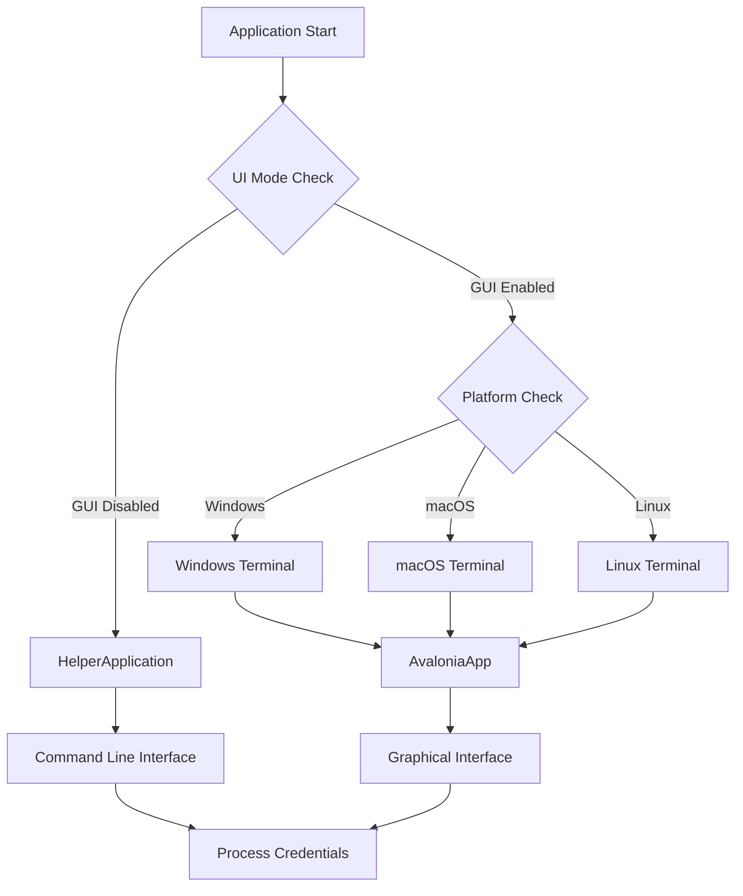

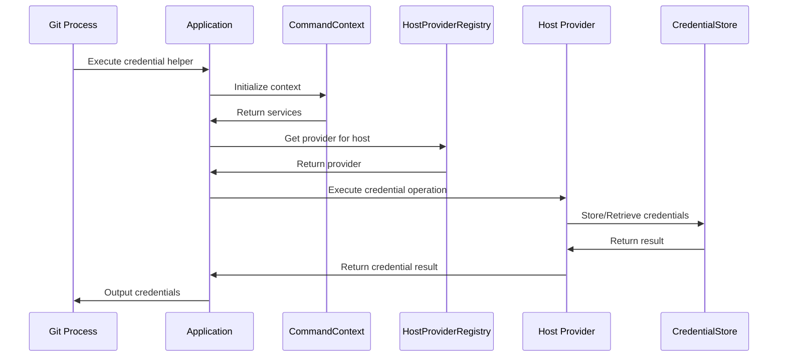

## Command Processing Flow

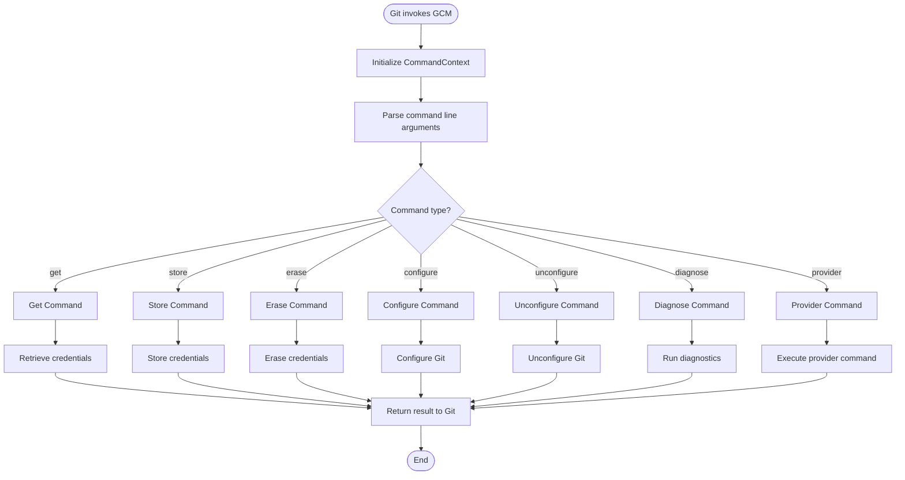

## Detailed Application Implementation

The `Application` class serves as the central orchestrator with sophisticated integration capabilities:

### Provider Registration Architecture

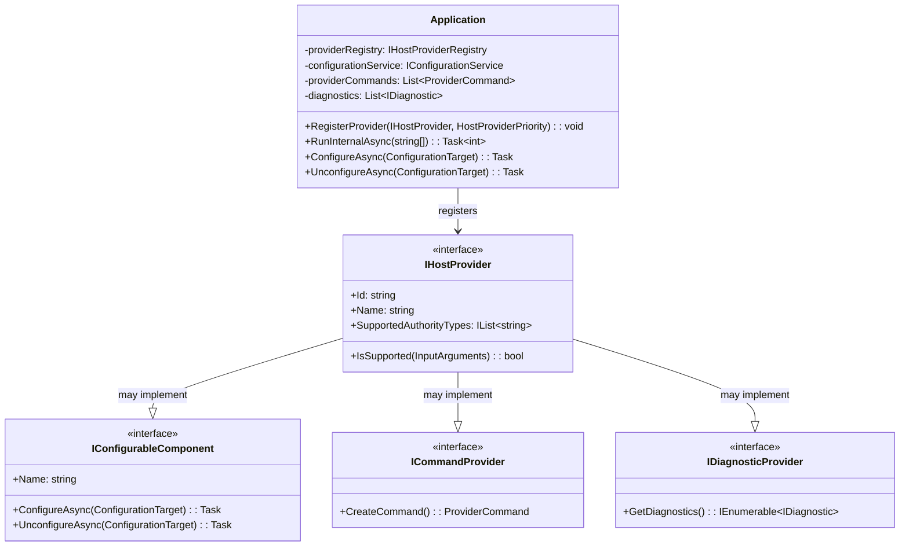

### Command Processing Pipeline

The Application class implements a comprehensive command processing pipeline that handles various credential operations:

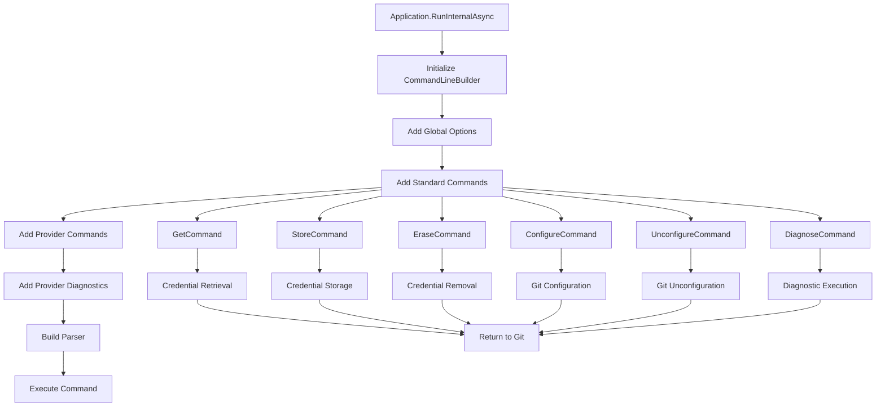

### Git Configuration Management

The Application class provides sophisticated Git configuration management with cross-platform path handling:

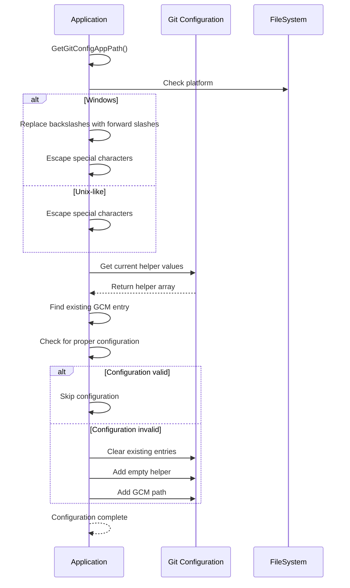

### Exception Handling and Error Reporting

The Application class implements comprehensive exception handling with platform-specific error formatting:

```csharp
// Exception handling strategy
switch (ex)
{
    case GitException gitEx:
        // Git-specific errors with exit codes
        Context.Streams.Error.WriteLine("fatal: {0} [{1}]", gitEx.Message, gitEx.ExitCode);
        Context.Streams.Error.WriteLine(gitEx.GitErrorMessage);
        break;
        
    case InteropException interopEx:
        // Platform interoperation errors
        Context.Streams.Error.WriteLine("fatal: {0} [0x{1:x}]", interopEx.Message, interopEx.ErrorCode);
        break;
        
    default:
        // General exceptions
        Context.Streams.Error.WriteLine("fatal: {0}", ex.Message);
        break;
}
```

### Integration with Core Services

The Application class integrates with multiple core services through the CommandContext:

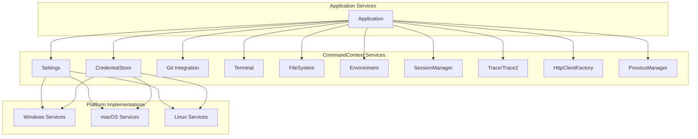

## Integration with Other Modules

### Authentication System Integration
The Application Management module coordinates with the [Authentication System](Authentication System.md) through host providers that implement authentication mechanisms:
- Delegates authentication requests to appropriate providers
- Manages authentication flow state
- Handles OAuth2 and basic authentication protocols

### Host Provider Framework Integration
Works closely with the [Host Provider Framework](Host Provider Framework.md) to:
- Register and prioritize host providers
- Route credential operations to appropriate providers
- Support provider-specific commands and diagnostics

### Configuration Service Integration
Integrates with the [Configuration Service](Configuration Service.md) to:
- Manage application-level configuration
- Allow providers to register as configurable components
- Handle Git configuration updates

### Cross-Platform Support
Leverages [Cross-Platform Support](Cross-Platform Support.md) for:
- Platform-specific service initialization
- Native credential storage integration
- Terminal and UI interactions

## Key Features

### 1. Provider Registration and Management
```csharp
public void RegisterProvider(IHostProvider provider, HostProviderPriority priority)
```
- Supports priority-based provider selection
- Automatic configurable component registration
- Command and diagnostic service integration

### 2. Command-Line Interface
- Standard Git credential commands (get, store, erase)
- Configuration management commands (configure, unconfigure)
- Diagnostic command with provider-specific tests
- Provider-specific custom commands

### 3. Exception Handling
- Platform-specific error formatting
- Git exception handling with exit codes
- Interop exception management
- Stack trace integration with tracing

### 4. Git Configuration Management
- Automatic Git credential helper setup
- Path normalization for cross-platform compatibility
- Configuration level targeting (system vs. global)
- Safe configuration removal

## Usage Patterns

### Basic Application Initialization
```csharp
var context = new CommandContext();
var application = new Application(context);
// Register providers
application.RegisterProvider(new GitHubHostProvider(context), HostProviderPriority.Normal);
// Run application
return await application.RunAsync(args);
```

### Provider Registration with Custom Commands
```csharp
// Provider implements ICommandProvider
var provider = new CustomHostProvider(context);
application.RegisterProvider(provider, HostProviderPriority.High);
// Custom commands automatically available via CLI
```

### Configuration Management
```csharp
// Configure Git to use GCM
await application.ConfigureAsync(ConfigurationTarget.Global);
// Remove GCM configuration
await application.UnconfigureAsync(ConfigurationTarget.Global);
```

## Error Handling and Diagnostics

The Application Management module provides comprehensive error handling:

1. **Exception Classification**: Different handling for Git, Interop, and general exceptions
2. **Error Reporting**: Formatted error messages to stderr with appropriate exit codes
3. **Trace Integration**: Stack traces and detailed error information when tracing is enabled
4. **Diagnostic Support**: Integration with diagnostic services for troubleshooting

## Security Considerations

- **Path Validation**: Secure handling of application paths in Git configuration
- **Credential Isolation**: Proper separation between different host providers
- **Error Sanitization**: Careful handling of error messages to prevent information leakage
- **Resource Management**: Proper disposal of sensitive resources and credentials

## Performance Characteristics

- **Lazy Initialization**: Services initialized only when needed
- **Provider Caching**: Efficient provider lookup and registration
- **Minimal Overhead**: Lightweight command parsing and routing
- **Resource Pooling**: Reuse of HTTP clients and other resources

## Future Considerations

The Application Management module is designed for extensibility:
- New host providers can be added without core changes
- Additional command types can be introduced
- Platform support can be extended
- Diagnostic capabilities can be enhanced

This modular design ensures that the Application Management module remains the stable core of the Git Credential Manager while allowing for continuous evolution of provider-specific functionality.

## Summary and Key Architectural Decisions

The Application Management module represents a sophisticated orchestration layer that demonstrates several key architectural principles:

### 1. **Separation of Concerns**
The module cleanly separates application lifecycle management, UI handling, command processing, and provider coordination into distinct but integrated components.

### 2. **Cross-Platform Abstraction**
Through the CommandContext and platform-specific service implementations, the module provides a unified interface while supporting Windows, macOS, and Linux-specific functionality.

### 3. **Extensible Provider Model**
The provider registration system allows for dynamic registration of host providers with support for custom commands, diagnostics, and configuration management.

### 4. **Thread-Safe UI Architecture**
The Dispatcher implementation ensures that UI operations are properly synchronized across threads while maintaining responsive user interfaces.

### 5. **Comprehensive Error Handling**
The exception handling strategy provides appropriate error formatting and reporting for different types of failures, from Git-specific errors to platform interoperation issues.

### 6. **Configuration Management**
The module handles Git configuration with proper path normalization and cross-platform compatibility, ensuring seamless integration with Git's credential helper system.

### 7. **Performance Optimization**
Through lazy initialization, resource pooling, and efficient command routing, the module minimizes overhead while providing rich functionality.

This architecture makes the Application Management module both robust and flexible, capable of supporting current credential management needs while providing a foundation for future enhancements and new authentication mechanisms.

## References

- [Authentication System](Authentication%20System.md) - For detailed authentication provider integration
- [Configuration and Settings](Configuration%20and%20Settings.md) - For configuration service details
- [Cross-Platform Support](Cross-Platform%20Support.md) - For platform-specific implementations
- [UI Framework](UI%20Framework.md) - For additional UI component details
- [Host Provider Framework](Host%20Provider%20Framework.md) - For provider registration and management
- [Credential Management](Credential%20Management.md) - For credential storage mechanisms
- [Git Integration](Git%20Integration.md) - For Git process interaction details
- [Configuration Service](Configuration%20Service.md) - For configuration management details