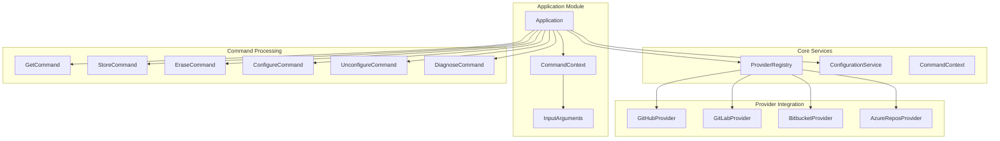
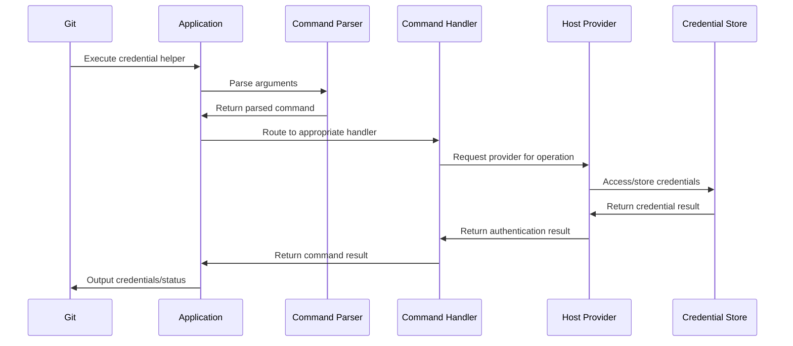
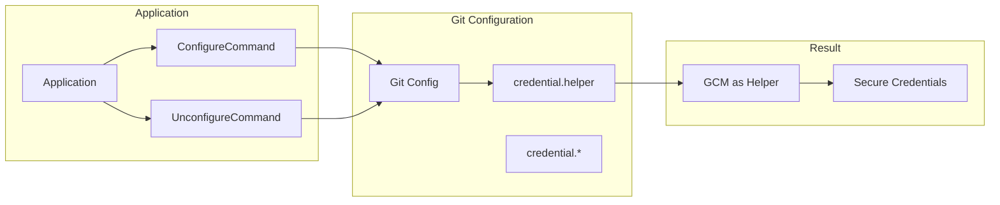

# Application Module

## Overview

The Application module serves as the central orchestrator and entry point for the Git Credential Manager (GCM). It provides the main application framework that coordinates all credential management operations, command processing, and provider integration. This module is responsible for initializing the application context, managing the command-line interface, and orchestrating the interaction between various subsystems including authentication, credential storage, and platform-specific services.

## Purpose

The Application module's primary responsibilities include:

- **Command Orchestration**: Managing the command-line interface and routing commands to appropriate handlers
- **Provider Management**: Registering and coordinating host providers (GitHub, GitLab, Bitbucket, Azure Repos)
- **Application Lifecycle**: Managing the application startup, configuration, and shutdown procedures
- **Cross-Platform Abstraction**: Providing a unified interface for platform-specific operations
- **Configuration Management**: Handling Git configuration integration and credential helper setup

## Architecture

## Core Components

### Application Class
The main application class that inherits from `ApplicationBase` and implements `IConfigurableComponent`. It serves as the central coordinator for:

- **Provider Registration**: Dynamically registers host providers with priority-based ordering
- **Command Routing**: Maps command-line arguments to appropriate command handlers
- **Configuration Management**: Handles Git credential helper configuration and setup
- **Exception Handling**: Provides centralized error handling with platform-specific formatting

### CommandContext Interface
Provides the execution environment for Git credential helper commands, encapsulating:

- **Platform Services**: File system, environment, terminal, and session management
- **Git Integration**: Direct interface to Git processes and configuration
- **Credential Storage**: Secure credential store abstraction
- **Tracing and Diagnostics**: Comprehensive logging and performance monitoring

### InputArguments Class
Represents and parses input data streamed from Git, providing:

- **Protocol Parsing**: Extracts protocol, host, path, and authentication details
- **URI Construction**: Builds complete remote repository URIs
- **Multi-value Support**: Handles complex input with multiple values per key
- **Validation**: Ensures required fields are present and valid

## Command Processing Flow

## Sub-modules

The Application module integrates with several specialized sub-modules:

### [Commands](Commands.md)
Handles the core credential operations (get, store, erase) and system management commands (configure, diagnose).

### [HostProviderFramework](HostProviderFramework.md)
Manages the registration and lifecycle of host-specific providers that handle authentication for different Git hosting services.

### [Authentication](Authentication.md)
Provides various authentication mechanisms including Basic, OAuth2, Microsoft Authentication, and Windows Integrated Authentication.

### [OAuth2](OAuth2.md)
Implements OAuth2 flow support with device code and authorization code grants for modern authentication scenarios.

### [CredentialManagement](CredentialManagement.md)
Manages secure credential storage across different platforms using native credential stores (Windows Credential Manager, macOS Keychain, Linux Secret Service).

### [Configuration](Configuration.md)
Handles Git configuration integration and manages application settings across system and user levels.

### [Platform](Platform.md)
Provides platform-specific abstractions for file system, environment, terminal, and session management.

### [GitIntegration](GitIntegration.md)
Manages direct interaction with Git processes, configuration, and repository operations.

### [Tracing](Tracing.md)
Provides comprehensive logging and performance monitoring capabilities for debugging and diagnostics.

### [UI](UI.md)
Manages user interface components including dialogs, prompts, and authentication flows.

### [Utilities](Utilities.md)
Provides utility services such as HTTP client factory, INI file parsing, and terminal menu systems.

## External Provider Modules

The Application module also integrates with external provider modules:

### [BitbucketProvider](BitbucketProvider.md)
Provides specialized authentication and integration for Bitbucket Cloud and Data Center repositories.

### [GitHubProvider](GitHubProvider.md)
Offers advanced GitHub-specific authentication features including two-factor authentication and account selection.

### [GitLabProvider](GitLabProvider.md)
Implements GitLab-specific authentication and credential management capabilities.

### [AzureReposProvider](AzureReposProvider.md)
Manages authentication for Azure DevOps and Azure Repos with Azure AD integration.

## Configuration Integration

The Application module integrates deeply with Git's configuration system:

## Platform Support

The Application module provides comprehensive cross-platform support:

- **Windows**: Full integration with Windows Credential Manager, DPAPI, and Windows-specific authentication
- **macOS**: Native Keychain integration and macOS-specific services
- **Linux**: Secret Service support with GPG pass backend fallback

## Error Handling

The module implements sophisticated error handling with:

- **Exception Classification**: Different handling for Git exceptions, interop exceptions, and general errors
- **Platform-Specific Formatting**: Tailored error messages for different platforms
- **Stack Trace Integration**: Optional detailed debugging information
- **Graceful Degradation**: Continues operation even when some providers fail

## Security Considerations

The Application module implements several security measures:

- **Secure Credential Storage**: Uses platform-native secure storage mechanisms
- **Path Validation**: Ensures safe path handling across platforms
- **Input Sanitization**: Validates and sanitizes all input from Git
- **Configuration Protection**: Safely manages Git configuration changes

## Performance Features

- **Lazy Initialization**: Components are initialized only when needed
- **Provider Caching**: Registered providers are cached for performance
- **Efficient Command Routing**: Direct command-to-handler mapping
- **Minimal Overhead**: Streamlined execution path for credential operations

This module serves as the foundation for all Git Credential Manager operations, providing a robust, secure, and extensible platform for credential management across different Git hosting services and platforms.