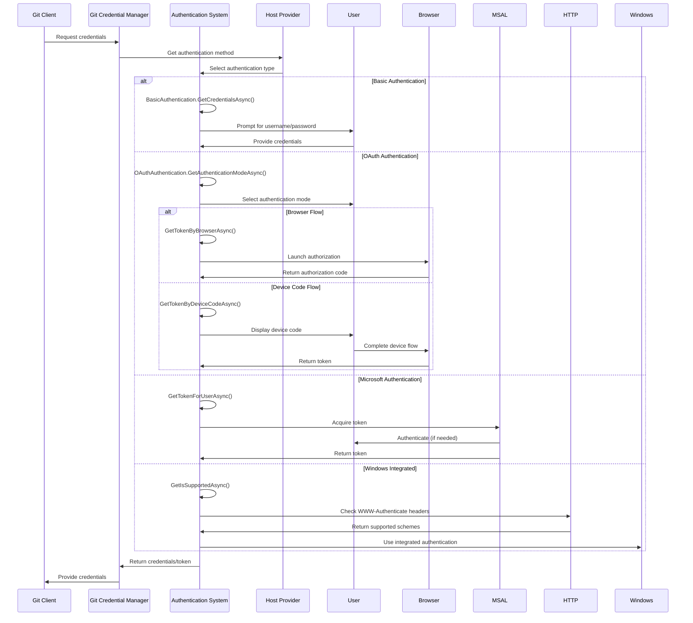

# Authentication System

## Overview

The Authentication System module is a comprehensive authentication framework that provides multiple authentication mechanisms for Git credential management. It supports various authentication protocols including Basic Authentication, OAuth 2.0, Microsoft Authentication (MSAL), and Windows Integrated Authentication. The module is designed to handle authentication across different Git hosting platforms while providing a unified interface for credential acquisition and management.

## Architecture

```mermaid
graph TB
    subgraph "Authentication System"
        BA[Basic Authentication]
        OA[OAuth Authentication]
        MA[Microsoft Authentication]
        WIA[Windows Integrated Authentication]
        
        BA --> |"implements"| IBA[IBasicAuthentication]
        OA --> |"implements"| IOA[IOAuthAuthentication]
        MA --> |"implements"| IMA[IMicrosoftAuthentication]
        WIA --> |"implements"| IWIA[IWindowsIntegratedAuthentication]
        
        OA --> |"uses"| O2C[OAuth2Client]
        OA --> |"uses"| O2WB[OAuth2WebBrowser]
        MA --> |"uses"| MSAL[MSAL Library]
        WIA --> |"uses"| HTTP[HTTP Client]
    end
    
    subgraph "Core Dependencies"
        CC[CommandContext]
        SM[SessionManager]
        TS[Terminal]
        UI[UI Framework]
    end
    
    BA --> CC
    OA --> CC
    MA --> CC
    WIA --> CC
    
    BA --> SM
    OA --> SM
    MA --> SM
    
    BA --> TS
    OA --> TS
    MA --> TS
    
    BA --> UI
    OA --> UI
    MA --> UI
```



## Core Components

### Authentication Methods

The module provides four primary authentication methods:

1. **Basic Authentication** - Traditional username/password authentication
2. **OAuth Authentication** - OAuth 2.0 flows including browser and device code
3. **Microsoft Authentication** - Azure AD and Microsoft Account authentication via MSAL
4. **Windows Integrated Authentication** - Kerberos/NTLM authentication

### Key Interfaces

- `IAuthentication` - Base interface for all authentication methods
- `IBasicAuthentication` - Interface for basic credential authentication
- `IOAuthAuthentication` - Interface for OAuth 2.0 authentication flows
- `IMicrosoftAuthentication` - Interface for Microsoft identity platform authentication
- `IWindowsIntegratedAuthentication` - Interface for Windows integrated authentication

## Sub-modules

### Basic Authentication
Handles traditional username/password authentication with support for:
- GUI prompts via Avalonia UI
- Terminal-based prompts
- Helper application integration
- Credential validation

**Documentation**: [Basic Authentication](Basic%20Authentication.md)

### OAuth Authentication
Implements OAuth 2.0 authentication flows including:
- Authorization Code flow with PKCE
- Device Code flow
- Browser-based authentication
- Token refresh mechanisms
- Cryptographic code generation
- Web browser integration

**Documentation**: [OAuth Authentication](OAuth%20Authentication.md)

### Microsoft Authentication
Integrates with Microsoft Identity Platform via MSAL:
- Azure AD authentication
- Microsoft Account support
- Managed Identity support
- Service Principal authentication
- Token caching and silent acquisition
- Multi-factor authentication support

**Documentation**: [Microsoft Authentication](Microsoft%20Authentication.md)

### Windows Integrated Authentication
Provides Windows-specific authentication:
- Kerberos authentication
- NTLM authentication
- Negotiate protocol support
- Automatic detection of supported schemes
- HTTP WWW-Authenticate header inspection

**Documentation**: [Windows Integrated Authentication](Windows%20Integrated%20Authentication.md)

## Authentication Flow



## Integration Points

### Host Provider Integration
The Authentication System integrates with various Git hosting providers:
- **GitHub Provider**: Uses OAuth authentication with GitHub-specific endpoints
- **GitLab Provider**: Implements GitLab OAuth flows
- **Bitbucket Provider**: Supports both cloud and data center authentication
- **Azure Repos Provider**: Uses Microsoft authentication for Azure DevOps

### UI Framework Integration
- Avalonia UI for cross-platform graphical interfaces
- Terminal-based prompts for command-line environments
- Helper application support for custom UI implementations

### Credential Management
- Integration with [Credential Management](Credential%20Management.md) module for secure storage
- Support for various credential stores (Windows Credential Manager, macOS Keychain, Linux Secret Service)
- Token caching and refresh mechanisms

## Configuration

The Authentication System supports various configuration options:

```ini
[credential]
    # Authentication method preferences
    authMode = auto|basic|oauth|microsoft|integrated
    
    # UI preferences
    guiPrompts = true|false
    terminalPrompts = true|false
    
    # Microsoft Authentication specific
    msAuthFlow = auto|embedded|system|devicecode
    msAuthUseBroker = true|false
    useMsAuthDefaultAccount = true|false
    
    # OAuth specific
    oauthAuthModes = browser|devicecode|all
```

## Security Features

- PKCE (Proof Key for Code Exchange) support for OAuth flows
- Secure token storage and caching
- Automatic token refresh
- Certificate-based authentication for service principals
- Integration with platform-specific secure storage

## Platform Support

| Authentication Method | Windows | macOS | Linux | Notes |
|----------------------|---------|--------|--------|-------|
| Basic Authentication | ✓ | ✓ | ✓ | Universal support |
| OAuth 2.0 | ✓ | ✓ | ✓ | Browser and device code flows |
| Microsoft Auth | ✓ | ✓ | ✓ | Full MSAL integration |
| Windows Integrated | ✓ | ✗ | ✗ | Windows-specific |

## Error Handling

The module implements comprehensive error handling:
- User cancellation detection
- Network error recovery
- Authentication failure reporting
- Detailed trace logging
- Platform-specific error translation

## Dependencies

- **Core Application Framework**: For command context and settings
- **UI Framework**: For user interaction
- **Credential Management**: For secure credential storage
- **Cross-Platform Support**: For platform-specific implementations
- **Tracing and Diagnostics**: For logging and troubleshooting

## Usage Examples

### Basic Authentication
```csharp
var basicAuth = new BasicAuthentication(context);
var credential = await basicAuth.GetCredentialsAsync("https://github.com", "username");
```

### OAuth Authentication
```csharp
var oauthAuth = new OAuthAuthentication(context);
var mode = await oauthAuth.GetAuthenticationModeAsync("https://github.com", OAuthAuthenticationModes.All);
var token = await oauthAuth.GetTokenByBrowserAsync(oauthClient, scopes);
```

### Microsoft Authentication
```csharp
var msAuth = new MicrosoftAuthentication(context);
var result = await msAuth.GetTokenForUserAsync(authority, clientId, redirectUri, scopes, username);
```

## Related Documentation

- [Basic Authentication](Basic%20Authentication.md) - Detailed basic authentication documentation
- [OAuth Authentication](OAuth%20Authentication.md) - OAuth 2.0 implementation details
- [Microsoft Authentication](Microsoft%20Authentication.md) - MSAL integration guide
- [Windows Integrated Authentication](Windows%20Integrated%20Authentication.md) - Windows-specific authentication
- [Credential Management](Credential%20Management.md) - Credential storage and management
- [Host Provider Framework](Host%20Provider%20Framework.md) - Provider integration framework