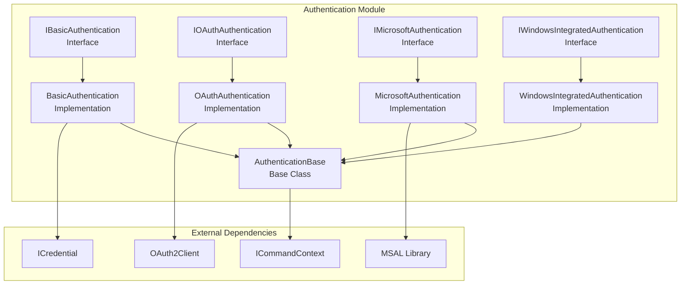
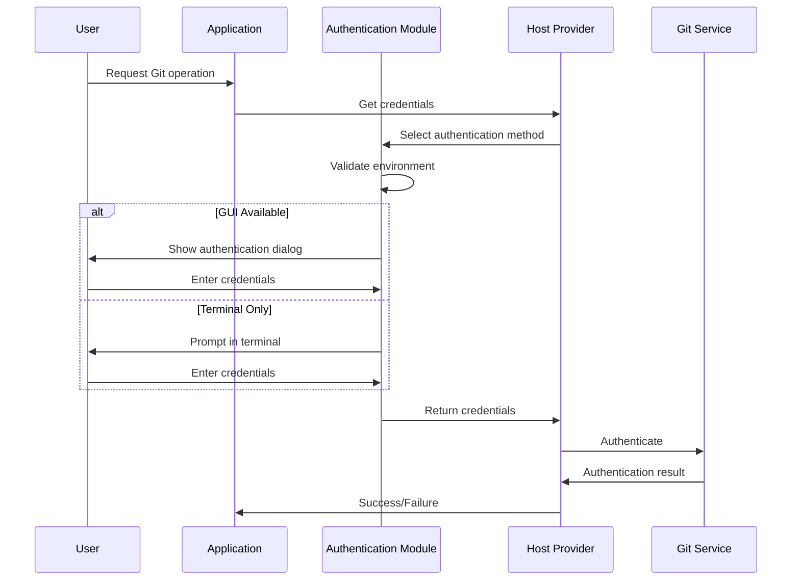
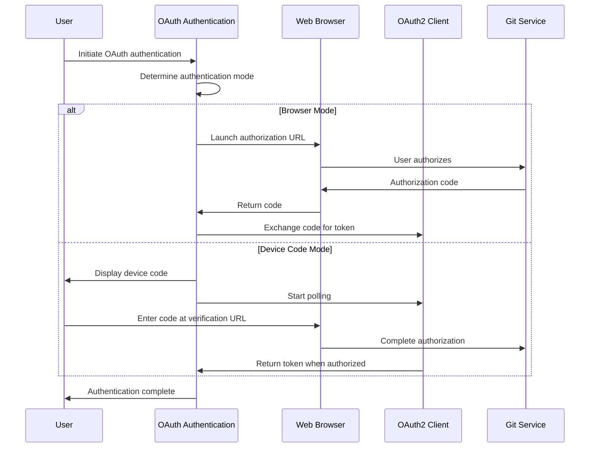
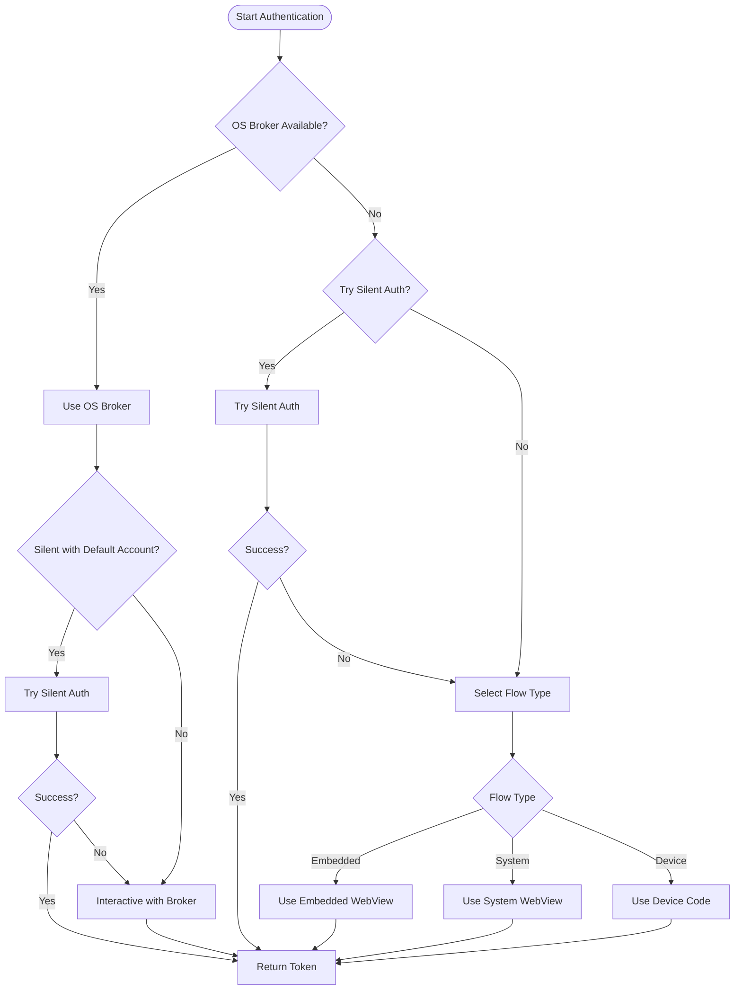

# Authentication Module Documentation

## Introduction

The Authentication module is a core component of the Git Credential Manager that provides a unified interface for handling various authentication methods across different Git hosting platforms. It abstracts the complexity of different authentication protocols and provides a consistent API for authenticating users with Git services.

The module supports multiple authentication mechanisms including Basic Authentication, OAuth 2.0, Microsoft Authentication (Azure AD/MSA), and Windows Integrated Authentication, making it versatile for different enterprise and personal Git hosting scenarios.

## Architecture Overview

The Authentication module follows a strategy pattern design, where each authentication method is implemented as a separate service that implements a common interface. This design allows for easy extension and maintenance of different authentication protocols.



## Core Components

### Authentication Base Class
All authentication implementations inherit from `AuthenticationBase`, which provides common functionality such as:
- User interaction validation
- Terminal prompt handling
- UI helper integration
- Window management
- Command execution utilities

### Basic Authentication
**Interface:** `IBasicAuthentication`
**Implementation:** `BasicAuthentication`
**Authority IDs:** `basic`

Provides traditional username/password authentication with support for:
- GUI prompts via Avalonia UI
- Terminal-based prompts
- External helper applications
- Pre-filled usernames

### OAuth Authentication
**Interface:** `IOAuthAuthentication`
**Implementation:** `OAuthAuthentication`
**Modes:** Browser, Device Code

Handles OAuth 2.0 authentication flows including:
- Authorization code flow with browser
- Device code flow for headless environments
- Automatic mode selection based on environment
- Support for both interactive and non-interactive sessions

### Microsoft Authentication
**Interface:** `IMicrosoftAuthentication`
**Implementation:** `MicrosoftAuthentication`
**Authority IDs:** `msa`, `microsoft`, `aad`, `azure`, `live`

Comprehensive Microsoft identity platform integration featuring:
- User authentication (interactive and silent)
- Service principal authentication
- Managed identity support
- OS broker integration (Windows)
- Multiple authentication flows (embedded web view, system web view, device code)
- Token caching with MSAL
- MSA passthrough support

### Windows Integrated Authentication
**Interface:** `IWindowsIntegratedAuthentication`
**Implementation:** `WindowsIntegratedAuthentication`
**Authority IDs:** `integrated`, `windows`, `kerberos`, `ntlm`, `tfs`, `sso`

Provides Windows authentication mechanisms:
- Negotiate authentication
- NTLM authentication
- Kerberos support
- Automatic detection via HTTP headers

## Authentication Flows

### User Authentication Flow


### OAuth Authentication Flow


### Microsoft Authentication Flow


## Integration with Other Modules

### Credential Management
The Authentication module works closely with the [CredentialManagement](CredentialManagement.md) module to securely store and retrieve authentication tokens and credentials. After successful authentication, credentials are typically stored in the platform-specific credential store for future use.

### Platform Integration
The module leverages platform-specific capabilities through the [Platform](Platform.md) module:
- **Windows**: DPAPI, Windows Credential Manager, OS broker support
- **macOS**: Keychain integration
- **Linux**: Secret Service/libsecret support

### UI Framework
User interactions are handled through the [UI](UI.md) module, which provides:
- Avalonia-based GUI dialogs
- Terminal-based prompts
- Helper application integration
- Progress indicators

### OAuth2 Module
The [OAuth2](OAuth2.md) module provides the underlying OAuth 2.0 protocol implementation used by the OAuth authentication service, including:
- OAuth2 client implementation
- Token management
- Web browser integration
- Device code flow support

## Configuration and Settings

The Authentication module respects various configuration options that control its behavior:

### Environment Variables
- `GCM_UI_HELPER`: Specifies external helper application for UI prompts
- `GCM_MSAUTH_FLOW`: Overrides Microsoft authentication flow type
- `GCM_MSAUTH_USEBROKER`: Controls OS broker usage
- `GCM_PARENT_WINDOW`: Parent window ID for authentication dialogs

### Git Configuration
- `credential.uiHelper`: UI helper configuration
- `credential.msAuthFlow`: Microsoft authentication flow preference
- `credential.msAuthUseBroker`: OS broker preference
- `credential.useMsAuthDefaultAccount`: Default account usage

## Security Considerations

### Token Caching
The Microsoft Authentication service implements secure token caching using:
- Platform-specific secure storage (Keychain, Credential Manager, Secret Service)
- MSAL extension library for consistent cache management
- Fallback to plaintext only when secure storage is unavailable

### User Interaction Security
- Validates user interaction capabilities before showing prompts
- Respects `GIT_TERMINAL_PROMPT` and `GCM_INTERACTIVE` settings
- Supports parent window specification for proper dialog parenting
- Implements cancellation support for long-running operations

### Credential Handling
- Credentials are never logged or traced in plain text
- Secure disposal of credential objects after use
- Integration with platform-specific secure storage mechanisms

## Error Handling

The module implements comprehensive error handling for various scenarios:
- Network connectivity issues
- Invalid credentials
- Cancelled operations
- Platform-specific authentication failures
- Token cache corruption
- Missing dependencies

## Platform Support

### Windows
- Full feature support including OS broker
- Windows Credential Manager integration
- DPAPI for additional encryption
- Embedded and system web view support

### macOS
- Keychain integration for secure storage
- System web view support
- Limited embedded web view support

### Linux
- Secret Service/libsecret integration
- GPG pass store support as fallback
- System web view support only

## Usage Examples

### Basic Authentication
```csharp
var basicAuth = new BasicAuthentication(commandContext);
var credential = await basicAuth.GetCredentialsAsync("https://github.com", "username");
```

### OAuth Authentication
```csharp
var oauthAuth = new OAuthAuthentication(commandContext);
var modes = await oauthAuth.GetAuthenticationModeAsync("https://gitlab.com", OAuthAuthenticationModes.All);
if (modes == OAuthAuthenticationModes.Browser)
{
    var token = await oauthAuth.GetTokenByBrowserAsync(oauth2Client, scopes);
}
```

### Microsoft Authentication
```csharp
var msAuth = new MicrosoftAuthentication(commandContext);
var result = await msAuth.GetTokenForUserAsync(
    authority: "https://login.microsoftonline.com/common",
    clientId: "client-id",
    redirectUri: new Uri("http://localhost"),
    scopes: new[] { "https://graph.microsoft.com/.default" },
    userName: "user@example.com"
);
```

## Future Enhancements

Potential areas for future development include:
- Support for additional authentication protocols (SAML, OpenID Connect)
- Enhanced biometric authentication integration
- Improved headless authentication options
- Support for hardware security modules (HSMs)
- Enhanced multi-factor authentication support

## Related Documentation

- [CredentialManagement](CredentialManagement.md) - Secure credential storage and retrieval
- [OAuth2](OAuth2.md) - OAuth 2.0 protocol implementation
- [UI](UI.md) - User interface framework
- [Platform](Platform.md) - Platform-specific integrations
- [Commands](Commands.md) - Command execution framework