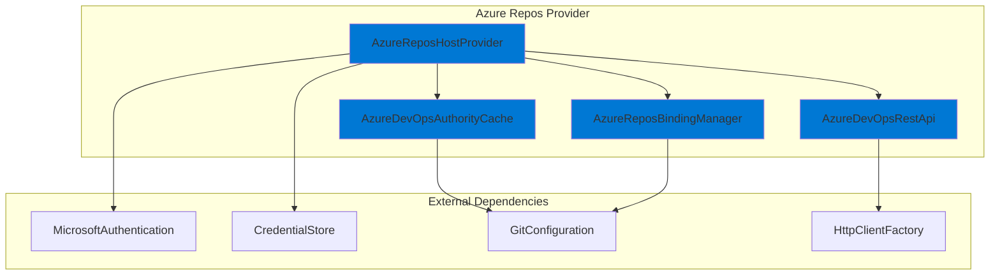
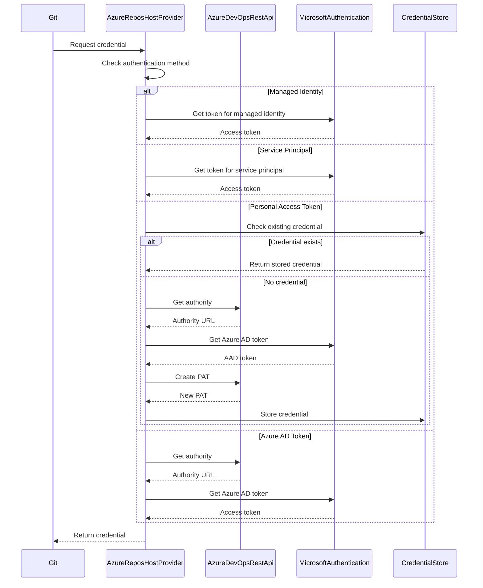

# Azure Repos Provider Module

## Overview

The Azure Repos Provider module is a specialized Git credential manager component designed to handle authentication with Azure DevOps repositories (Azure Repos). It provides seamless integration with Azure DevOps services, supporting multiple authentication methods including Microsoft authentication, personal access tokens (PATs), managed identities, and service principals.

## Purpose

This module serves as the primary interface between Git operations and Azure DevOps authentication systems, enabling secure and automated credential management for:
- Azure DevOps Services (cloud)
- Azure DevOps Server (on-premises)
- Visual Studio Team Services (legacy)

## Architecture



## Core Components

### 1. AzureReposHostProvider
The main provider class that implements `IHostProvider`, `IConfigurableComponent`, and `ICommandProvider` interfaces. It orchestrates authentication flows and credential management for Azure Repos.

**Key Responsibilities:**
- Detect Azure DevOps repository URLs
- Manage multiple authentication methods
- Handle credential storage and retrieval
- Provide command-line interface for management operations

### 2. AzureDevOpsRestApi
REST API client for communicating with Azure DevOps services.

**Key Responsibilities:**
- Query authentication authorities
- Create personal access tokens
- Handle HTTP communication with Azure DevOps APIs

### 3. AzureDevOpsAuthorityCache
Manages caching of Azure Active Directory authorities for organizations.

**Key Responsibilities:**
- Cache and retrieve authentication authorities
- Optimize authentication performance
- Manage authority cache lifecycle

### 4. AzureReposBindingManager
Manages user-to-organization bindings for Azure DevOps.

**Key Responsibilities:**
- Bind users to Azure DevOps organizations
- Manage local and global configuration bindings
- Handle sign-in/sign-out operations

## Authentication Flows



## Supported Authentication Methods

### 1. Microsoft Authentication (Default)
- Uses Azure Active Directory authentication
- Supports both MSA and AAD accounts
- Leverages Microsoft Authentication Library (MSAL)

### 2. Personal Access Tokens (PATs)
- Creates scoped tokens for repository access
- Automatically generated and managed
- Configurable via `credential.azreposCredentialType`

### 3. Managed Identity
- For Azure-hosted environments
- Uses system-assigned or user-assigned identities
- Configured via environment variables

### 4. Service Principal
- For automated scenarios
- Supports both certificate and client secret authentication
- Configured via environment variables

## Configuration

### Git Configuration
The provider automatically configures Git settings for optimal Azure Repos integration:

```bash
# For dev.azure.com URLs
git config --global credential.https://dev.azure.com.useHttpPath true
```

### Environment Variables
- `GCM_AZREPOS_CREDENTIALTYPE`: Override credential type (pat/oauth)
- `GCM_AZREPOS_MANAGEDIDENTITY`: Enable managed identity authentication
- `GCM_AZREPOS_SERVICEPRINCIPAL`: Configure service principal
- `GCM_AZREPOS_SERVICEPRINCIPAL_SECRET`: Service principal client secret
- `GCM_AZREPOS_SERVICEPRINCIPAL_CERT_THUMBPRINT`: Certificate thumbprint

## Command-Line Interface

The provider exposes several commands for management:

```bash
# List user bindings
git credential-manager azure-repos list [--show-remotes] [--verbose]

# Bind user to organization
git credential-manager azure-repos bind <organization> <username> [--local]

# Unbind user from organization
git credential-manager azure-repos unbind <organization> [--local]

# Clear authority cache
git credential-manager azure-repos clear-cache
```

## URL Support

The provider supports multiple Azure DevOps URL formats:

- `https://dev.azure.com/<organization>/<project>/_git/<repository>`
- `https://<organization>.visualstudio.com/<project>/_git/<repository>`
- Legacy Team Foundation Server URLs

## Security Features

### HTTPS Enforcement
- Warns against using unencrypted HTTP
- Provides helpful error messages for insecure connections
- Configurable via `GCM_ALLOW_UNSAFE_REMOTES`

### Token Scoping
- PATs are created with minimal required scopes
- Default scopes: `vso.code_write`, `vso.packaging`
- Scoped to specific organizations

### Authority Caching
- Caches Azure AD authorities to reduce API calls
- Automatically refreshes cache when needed
- Provides cache management commands

## Integration Points

### Core Application Framework
- Implements standard provider interfaces
- Uses shared authentication components
- Leverages common configuration management

### Microsoft Authentication System
- Integrates with Microsoft Authentication component
- Supports all Microsoft identity types
- Handles multi-tenant scenarios

### Git Integration
- Configures Git settings automatically
- Manages credential storage
- Handles remote URL parsing

## Error Handling

The provider includes comprehensive error handling for:
- Network connectivity issues
- Authentication failures
- Invalid configurations
- Missing permissions
- API rate limiting

## Performance Optimizations

- Authority caching to reduce API calls
- Efficient credential lookup
- Minimal HTTP requests
- Smart token refresh logic

## Related Documentation

- [Core Application Framework](Core%20Application%20Framework.md)
- [Authentication System](Authentication%20System.md)
- [Microsoft Authentication](Microsoft%20Authentication.md)
- [Git Integration](Git%20Integration.md)
- [Host Provider Framework](Host%20Provider%20Framework.md)

## Sub-modules

For detailed information about specific components, see:
- [AzureReposHostProvider](AzureReposHostProvider.md) - Main provider implementation with authentication orchestration
- [AzureDevOpsRestApi](AzureDevOpsRestApi.md) - REST API client for Azure DevOps services
- [AzureDevOpsAuthorityCache](AzureDevOpsAuthorityCache.md) - Authority caching and management
- [AzureReposBindingManager](AzureReposBindingManager.md) - User-to-organization binding management