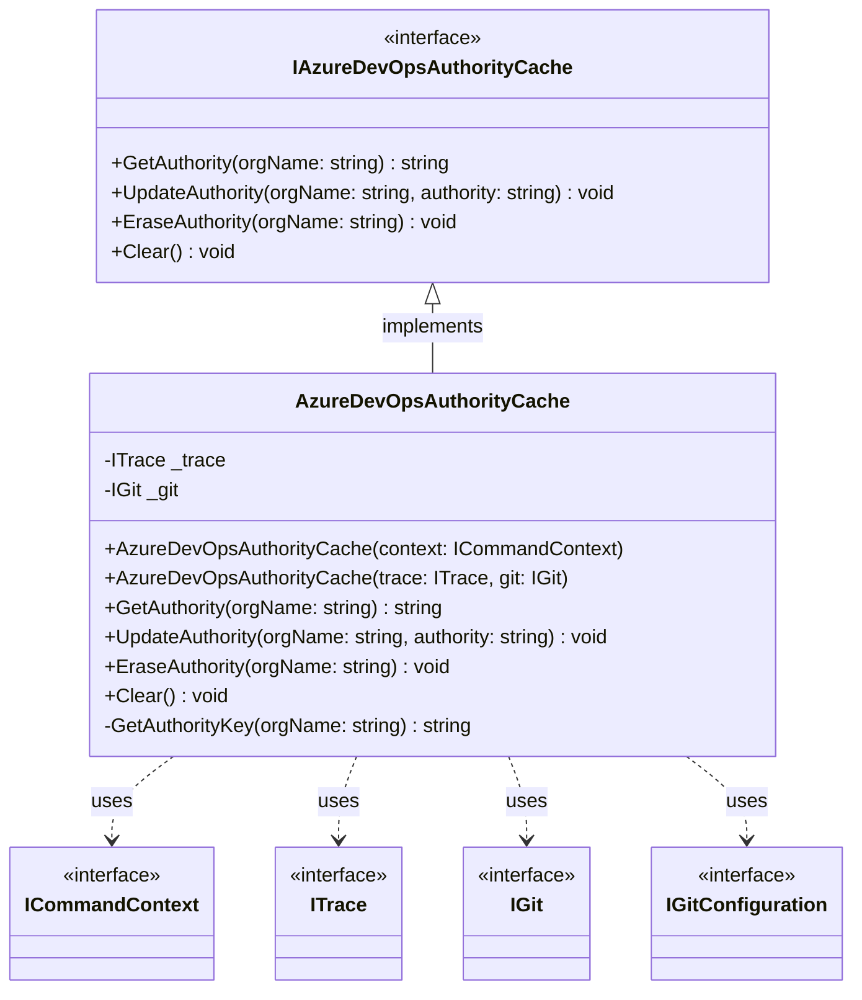
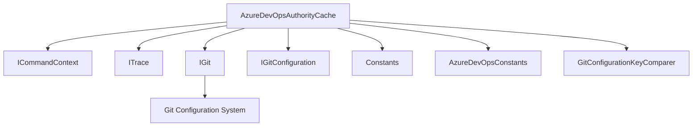
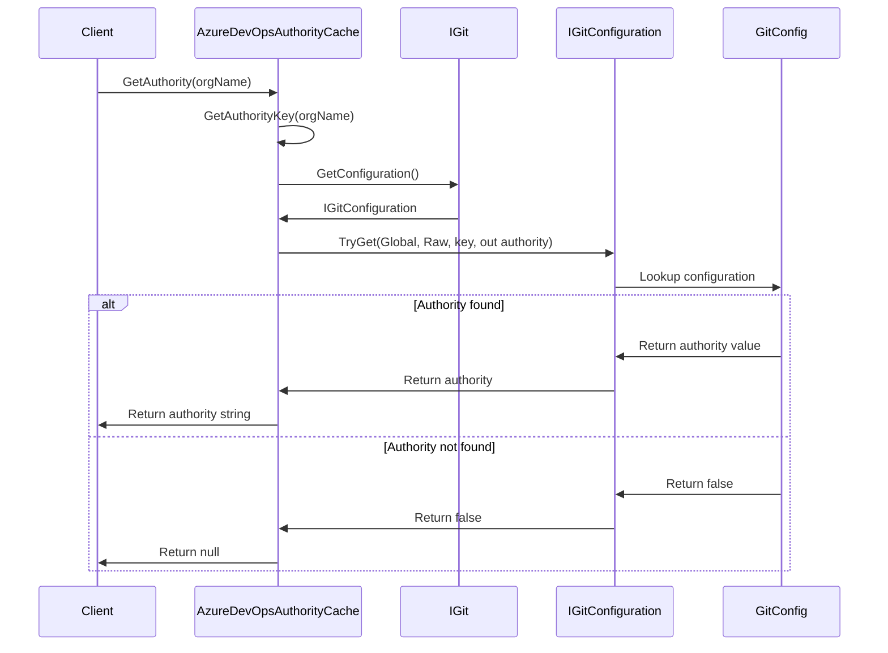
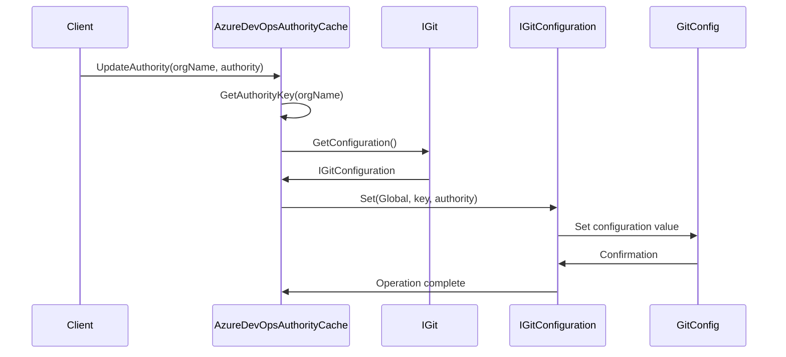
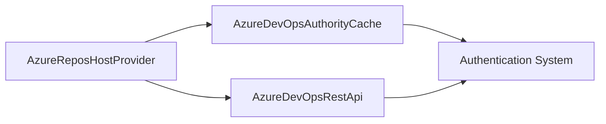

# AzureDevOpsAuthorityCache Module

## Overview

The AzureDevOpsAuthorityCache module provides a specialized caching mechanism for Azure DevOps authentication authorities within the Git Credential Manager ecosystem. This module is responsible for storing, retrieving, and managing Azure DevOps organization-specific authentication authority information in Git's global configuration, enabling efficient authentication workflows across different Azure DevOps organizations.

## Purpose and Core Functionality

The primary purpose of the AzureDevOpsAuthorityCache module is to:

- **Cache Azure DevOps Authentication Authorities**: Store organization-specific authentication authority endpoints to avoid repeated discovery operations
- **Optimize Authentication Performance**: Eliminate redundant authority resolution requests by maintaining a local cache
- **Support Multi-Organization Scenarios**: Handle authentication for multiple Azure DevOps organizations simultaneously
- **Integrate with Git Configuration**: Leverage Git's configuration system for persistent storage of authority information

## Architecture

### Component Structure



### Module Dependencies



## Data Flow

### Authority Retrieval Process



### Authority Update Process



## Configuration Key Format

The module uses a specific key format for storing authority information in Git configuration:

```
credential.<urn>:<org-prefix>/<organization-name>.azureAuthority
```

Where:
- `credential` is the standard Git credential section
- `<urn>` is the URN scheme for Azure DevOps (typically `azure-repos`)
- `<org-prefix>` is the organization prefix identifier
- `<organization-name>` is the specific Azure DevOps organization
- `azureAuthority` is the authority property suffix

## Integration with Azure Repos Provider



The AzureDevOpsAuthorityCache integrates with the broader Azure Repos provider ecosystem:

- **AzureReposHostProvider**: Uses the authority cache to determine the correct authentication endpoint for Azure DevOps organizations
- **AzureDevOpsRestApi**: Leverages cached authority information to construct proper API endpoints
- **Authentication System**: Works with various authentication mechanisms (OAuth, Microsoft Authentication, etc.) to provide the correct authority context

## Key Features

### 1. Persistent Storage
- Stores authority information in Git's global configuration
- Survives application restarts and system reboots
- Shared across all Git operations on the system

### 2. Organization-Specific Caching
- Maintains separate authority entries for each Azure DevOps organization
- Supports multi-organization development scenarios
- Prevents cross-organization authentication conflicts

### 3. Efficient Lookup
- Direct key-based retrieval from Git configuration
- Minimal overhead for authority resolution
- Reduces network calls to discovery endpoints

### 4. Cache Management
- Individual organization authority removal
- Bulk cache clearing functionality
- Automatic key generation and validation

## Error Handling and Validation

The module implements comprehensive validation:

- **Null/Empty Validation**: Ensures organization names and authorities are not null or whitespace
- **Key Format Validation**: Uses standardized key format with proper escaping
- **Configuration Level**: Operates exclusively at the Global configuration level to ensure system-wide availability

## Performance Considerations

- **Memory Efficiency**: No in-memory caching; relies on Git configuration system
- **Disk I/O**: Minimal disk access through targeted Git configuration operations
- **Scalability**: Efficient handling of multiple organizations through key-based lookups
- **Network Optimization**: Eliminates redundant authority discovery network requests

## Security Implications

- **Configuration Security**: Leverages Git's configuration security model
- **No Sensitive Data**: Caches only authority endpoints, not credentials or tokens
- **Global Scope**: Authority information is available system-wide for consistency
- **Audit Trail**: Trace logging provides visibility into authority cache operations

## Usage Patterns

### Typical Workflow
1. **Initial Authentication**: Authority discovered and cached during first authentication
2. **Subsequent Operations**: Cached authority retrieved for faster authentication
3. **Organization Switch**: Different authorities cached for different organizations
4. **Cache Refresh**: Authority updated when endpoints change or authentication fails

### Integration Points
- **Authentication Flows**: Integrated with OAuth and Microsoft authentication flows
- **API Operations**: Used by REST API clients to construct proper endpoints
- **Host Provider**: Central to Azure Repos host provider authentication logic

## Related Modules

- [AzureReposHostProvider](AzureReposHostProvider.md) - Main host provider that uses the authority cache
- [AzureDevOpsRestApi](AzureDevOpsRestApi.md) - REST API client that leverages cached authorities
- [Authentication System](AuthenticationSystem.md) - Core authentication infrastructure
- [Git Integration](GitIntegration.md) - Git configuration and operation components

## Conclusion

The AzureDevOpsAuthorityCache module serves as a critical optimization component in the Azure Repos authentication workflow. By caching Azure DevOps organization-specific authentication authorities, it significantly improves authentication performance and user experience while maintaining security and reliability standards. Its integration with Git's configuration system ensures persistence and system-wide availability, making it an essential component for efficient Azure DevOps operations.