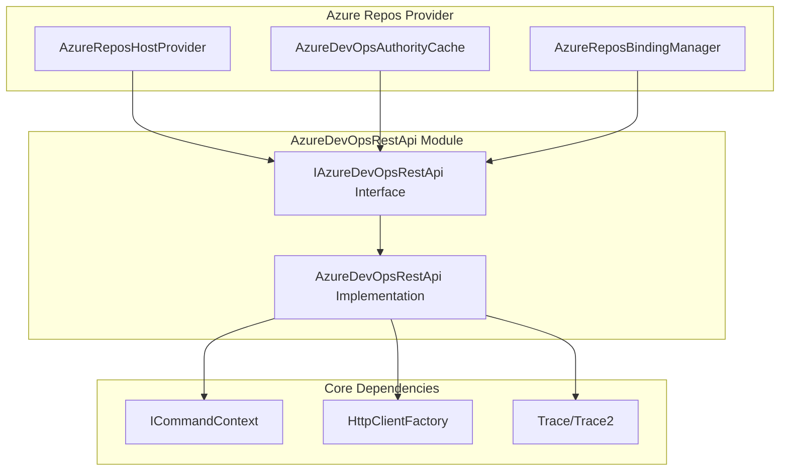
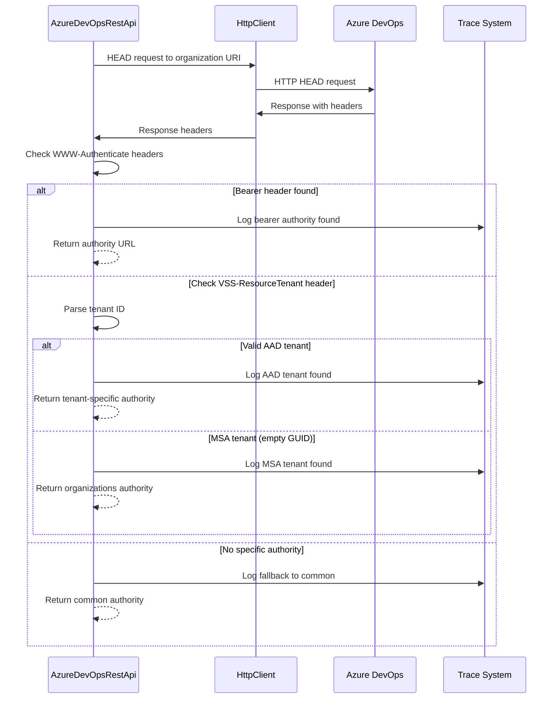
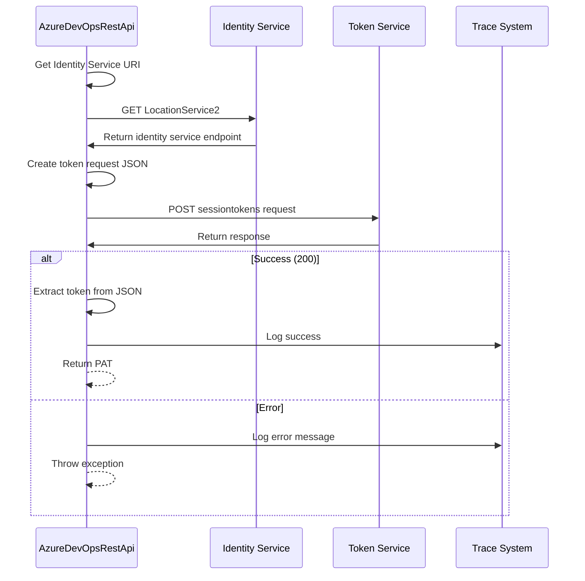
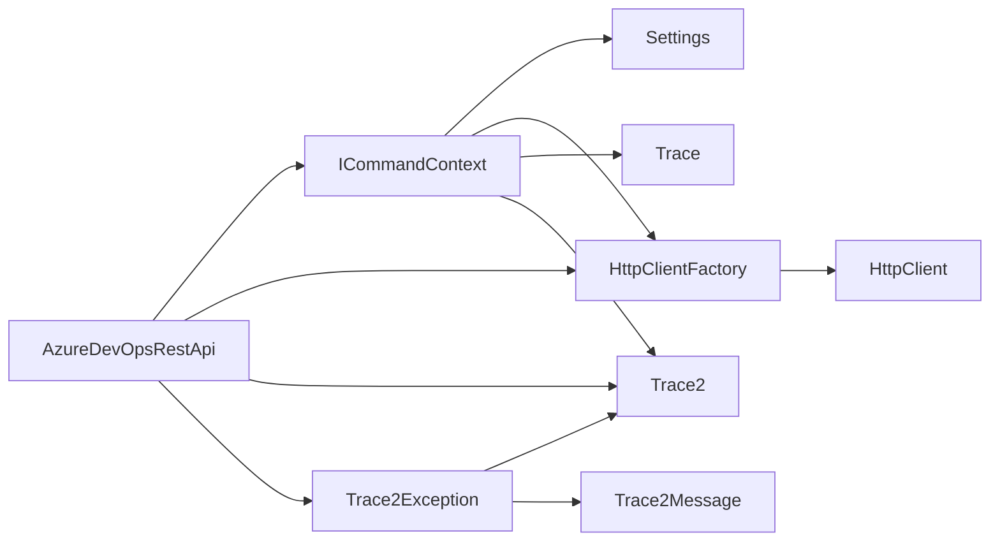
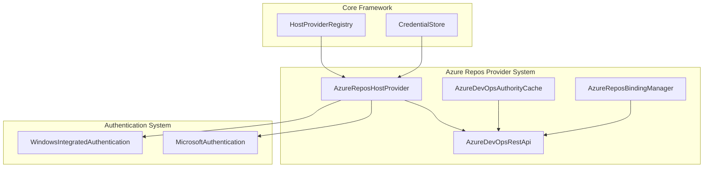

# AzureDevOpsRestApi Module Documentation

## Introduction

The AzureDevOpsRestApi module provides REST API communication capabilities for Azure DevOps services within the Git Credential Manager. This module handles authentication authority discovery and personal access token (PAT) creation for Azure DevOps organizations, enabling secure Git operations with Azure Repos.

## Architecture Overview

The AzureDevOpsRestApi module is a core component of the Azure Repos Provider, serving as the primary interface for communicating with Azure DevOps REST APIs. It implements a clean separation of concerns with a well-defined interface and concrete implementation.

## Core Components

### IAzureDevOpsRestApi Interface

The interface defines the contract for Azure DevOps REST API operations:

- **`GetAuthorityAsync(Uri organizationUri)`**: Discovers the appropriate authentication authority for a given Azure DevOps organization
- **`CreatePersonalAccessTokenAsync(Uri organizationUri, string accessToken, IEnumerable<string> scopes)`**: Creates a personal access token with specified scopes
- **`Dispose()`**: Implements IDisposable for resource cleanup

### AzureDevOpsRestApi Implementation

The concrete implementation provides the actual REST API communication logic:

#### Key Responsibilities

1. **Authentication Authority Discovery**
   - Analyzes HTTP headers to determine the correct authentication authority
   - Supports both Azure Active Directory (AAD) and Microsoft Account (MSA) authentication
   - Handles Azure DevOps-specific authentication scenarios including MSA pass-through

2. **Personal Access Token Management**
   - Creates PATs with specified scopes for Git operations
   - Communicates with Azure DevOps Identity Service
   - Handles token creation errors and validation

3. **HTTP Communication**
   - Manages HTTP client lifecycle and configuration
   - Implements proper request/response handling
   - Provides comprehensive tracing and diagnostics

## Data Flow

### Authority Discovery Process

### Personal Access Token Creation

## Component Dependencies

### Internal Dependencies

The AzureDevOpsRestApi module relies on several core framework components:

### External Dependencies

The module integrates with Azure DevOps-specific constants and utilities:

- **AzureDevOpsConstants**: Provides Azure DevOps-specific constants and configuration keys
- **UriHelpers**: Utility functions for URI manipulation and validation
- **Environment**: Standard .NET environment access for machine name

## Configuration and Settings

The module supports configuration through multiple channels:

1. **Environment Variables**: Developer override for AAD authority base URI
2. **Git Configuration**: Settings stored in Git configuration files
3. **Runtime Settings**: Dynamic settings from the command context

### Key Configuration Options

- **DevAadAuthorityBaseUri**: Override the default AAD authority base URL for development/testing
- **Credential settings**: Git configuration section for credential management

## Error Handling

The module implements comprehensive error handling:

1. **Argument Validation**: Input parameter validation with descriptive error messages
2. **HTTP Error Handling**: Proper handling of HTTP response codes
3. **JSON Parsing**: Robust JSON parsing with fallback mechanisms
4. **Trace Integration**: Detailed error logging through the trace system

### Exception Types

- **ArgumentException**: Invalid input parameters
- **Trace2Exception**: Operation failures with detailed context
- **HttpRequestException**: HTTP communication errors

## Security Considerations

### Authentication Flow

The module implements secure authentication practices:

1. **Token-based Authentication**: Uses bearer tokens for API authentication
2. **Authority Validation**: Proper validation of authentication authorities
3. **Secure HTTP**: Enforces HTTPS for all API communications
4. **Token Scoping**: Supports fine-grained scope specification for PATs

### Data Protection

- **Credential Isolation**: Separation of authentication tokens from other data
- **Secure Transmission**: All API calls use HTTPS
- **Token Lifecycle**: Proper disposal of HTTP clients and tokens

## Integration with Azure Repos Provider

The AzureDevOpsRestApi module is integrated into the broader Azure Repos Provider ecosystem:

## Usage Patterns

### Typical Usage Flow

1. **Authority Discovery**: Determine the correct authentication authority for an organization
2. **Authentication**: Obtain appropriate credentials (MSA, AAD, or Windows Integrated)
3. **Token Creation**: Create a PAT with necessary scopes for Git operations
4. **Credential Storage**: Store the PAT for future Git operations

### API Call Patterns

The module follows consistent patterns for API communication:

- **HTTP Method Selection**: Appropriate HTTP methods (GET, POST) for different operations
- **Header Management**: Proper header configuration including authentication and content type
- **Response Processing**: Systematic response validation and error handling
- **Tracing Integration**: Comprehensive logging of all operations

## Performance Considerations

### HTTP Client Management

- **Client Reuse**: HTTP client instances are reused across multiple requests
- **Proper Disposal**: Implements IDisposable for proper resource cleanup
- **Connection Pooling**: Leverages .NET's built-in HTTP connection pooling

### Caching Strategy

- **Authority Caching**: Authority discovery results can be cached externally (see [AzureDevOpsAuthorityCache](AzureDevOpsAuthorityCache.md))
- **No Internal Caching**: The module itself maintains no internal caches to avoid stale data

## Testing and Diagnostics

### Testability Features

- **Interface-based Design**: IAzureDevOpsRestApi enables easy mocking for unit tests
- **Internal Method Visibility**: Key helper methods are internal for testing purposes
- **Dependency Injection**: All external dependencies are injected through interfaces

### Diagnostic Support

- **Comprehensive Tracing**: All operations are traced with detailed information
- **HTTP Logging**: Full HTTP request/response logging (excluding sensitive data)
- **Error Context**: Detailed error messages with context for troubleshooting

## Related Documentation

- [AzureReposHostProvider](AzureReposHostProvider.md) - Main host provider for Azure Repos
- [AzureDevOpsAuthorityCache](AzureDevOpsAuthorityCache.md) - Authority caching mechanism
- [AzureReposBindingManager](AzureReposBindingManager.md) - Repository binding management
- [Authentication System](AuthenticationSystem.md) - Core authentication framework
- [Core Application Framework](CoreApplicationFramework.md) - Foundation services and utilities