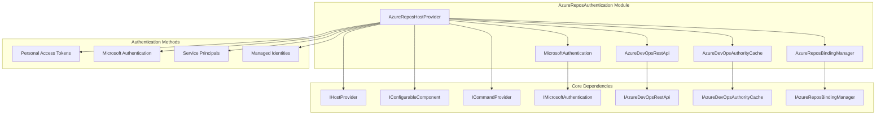
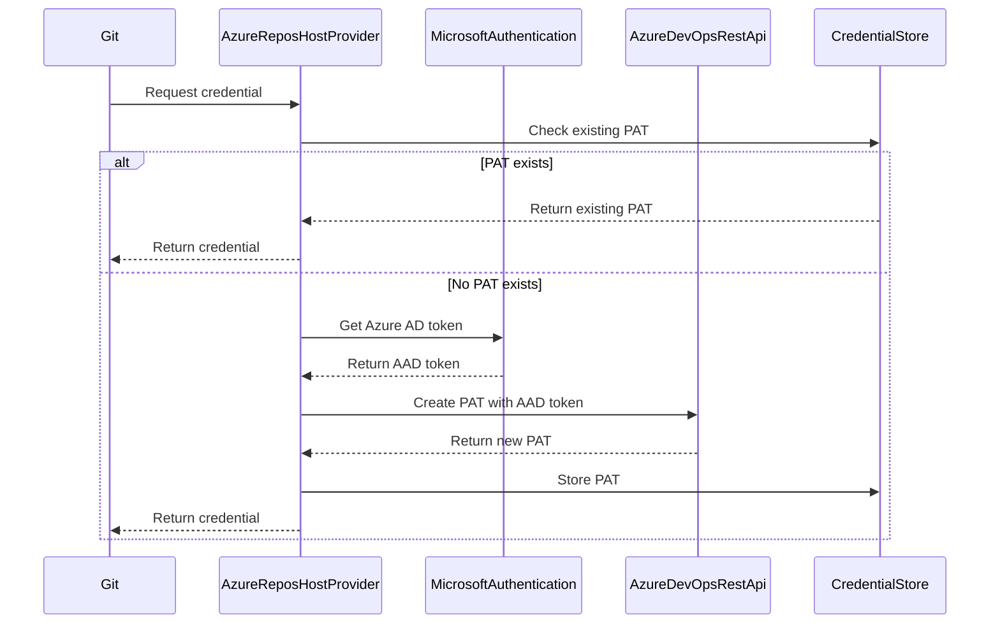
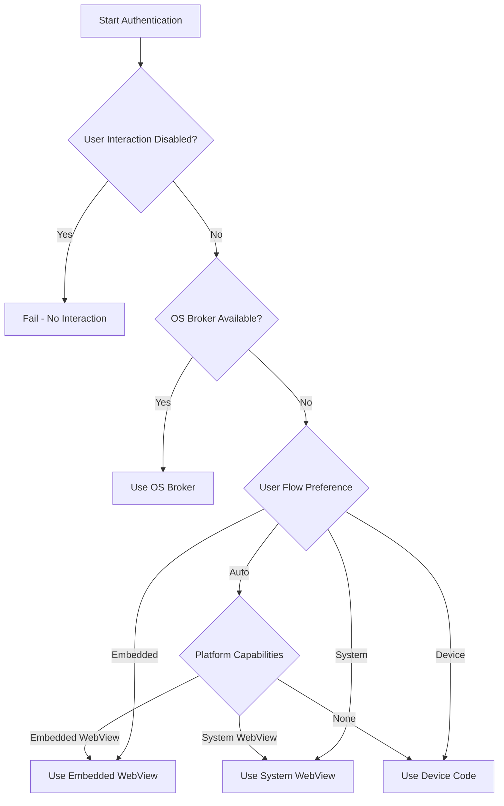
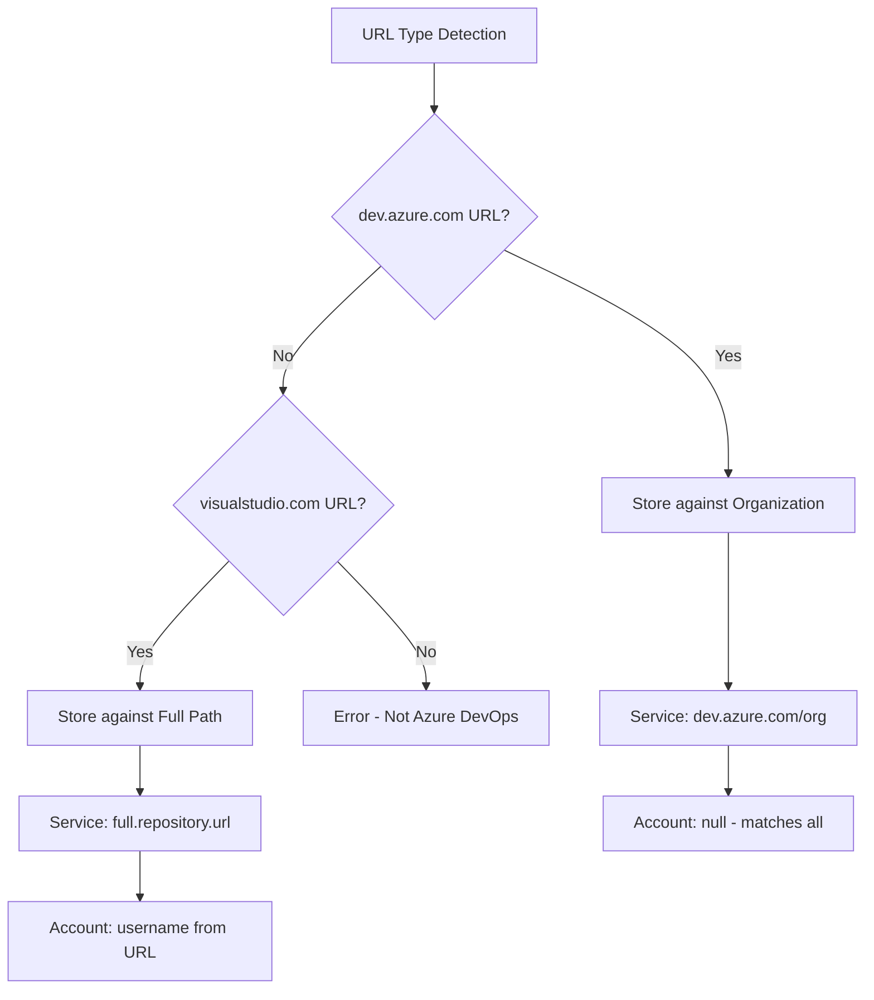

# AzureReposAuthentication Module Documentation

## Overview

The AzureReposAuthentication module provides comprehensive authentication capabilities for Azure DevOps repositories, supporting multiple authentication methods including Microsoft Authentication (MSA/Azure AD), Personal Access Tokens (PATs), Service Principals, and Managed Identities. This module is part of the Git Credential Manager ecosystem and serves as the primary authentication provider for Azure Repositories.

## Purpose and Core Functionality

The module's primary purpose is to:
- Authenticate users with Azure DevOps repositories using various authentication methods
- Manage user account bindings to Azure DevOps organizations
- Generate and manage Personal Access Tokens (PATs) for repository access
- Support enterprise scenarios with Service Principal and Managed Identity authentication
- Provide seamless integration with Git operations through the Git Credential Manager framework

## Architecture

### Component Structure



### Key Components

#### 1. AzureReposHostProvider
The main provider class that implements `IHostProvider`, `IConfigurableComponent`, and `ICommandProvider` interfaces. It orchestrates authentication operations and serves as the entry point for Azure Repos authentication.

**Key Responsibilities:**
- Determine supported authentication methods based on configuration and environment
- Coordinate authentication flows between different authentication types
- Manage credential storage and retrieval
- Handle user account bindings to organizations

#### 2. MicrosoftAuthentication
Handles Microsoft Authentication (MSA/Azure AD) flows using the Microsoft Authentication Library (MSAL).

**Key Features:**
- User authentication with silent and interactive flows
- Service Principal authentication with certificate or client secret
- Managed Identity authentication for cloud environments
- Token caching and persistence
- Multiple authentication flows (Embedded WebView, System WebView, Device Code)

#### 3. AzureDevOpsRestApi
Provides REST API integration with Azure DevOps services.

**Capabilities:**
- Query authentication authorities for organizations
- Create and manage Personal Access Tokens
- User information retrieval
- Organization metadata access

#### 4. AzureDevOpsAuthorityCache
Manages caching of Azure DevOps authentication authorities to optimize performance.

**Functions:**
- Cache authority information per organization
- Reduce API calls for authority discovery
- Provide fallback mechanisms for authority resolution

#### 5. AzureReposBindingManager
Manages user account bindings to Azure DevOps organizations.

**Features:**
- Bind user accounts to specific organizations
- Support both global and local (repository-specific) bindings
- User account lookup and management
- Integration with Git configuration

## Authentication Methods

### 1. Personal Access Tokens (PATs)
**Default authentication method** for most scenarios.



**Process:**
1. Check for existing PAT in credential store
2. If no PAT exists, authenticate with Azure AD
3. Use Azure AD token to create new PAT via Azure DevOps API
4. Store PAT for future use
5. Return PAT as credential

### 2. Microsoft Authentication (MSA/Azure AD)
**Alternative authentication method** using Microsoft identity platform.

**Supported Flows:**
- **Silent Authentication**: Automatic token acquisition using cached credentials
- **Interactive Authentication**: User login through web interface
- **Device Code Flow**: Authentication using device code for headless environments

**Authentication Flow Selection:**


### 3. Service Principal Authentication
**Enterprise authentication** using Azure AD service principals.

**Configuration Options:**
- Certificate-based authentication with X.509 certificates
- Client secret authentication
- Support for X5C certificate chain sending

### 4. Managed Identity Authentication
**Cloud environment authentication** for Azure resources.

**Supported Identity Types:**
- System-assigned managed identity
- User-assigned managed identity (by client ID)
- User-assigned managed identity (by resource ID)

## Configuration and Settings

### Environment Variables

| Variable | Description | Default |
|----------|-------------|---------|
| `GCM_AZREPOS_CREDENTIALTYPE` | Credential type preference (PAT/OAuth) | PAT |
| `GCM_AZREPOS_SERVICEPRINCIPAL` | Service principal configuration | - |
| `GCM_AZREPOS_SERVICEPRINCIPAL_SECRET` | Service principal client secret | - |
| `GCM_AZREPOS_SERVICEPRINCIPAL_CERT_THUMBPRINT` | Certificate thumbprint for SP | - |
| `GCM_AZREPOS_MANAGEDIDENTITY` | Managed identity configuration | - |
| `GCM_MSAUTH_FLOW` | Microsoft auth flow preference | Auto |
| `GCM_MSAUTH_USEBROKER` | Enable OS broker authentication | Platform dependent |

### Git Configuration

```ini
[credential "https://dev.azure.com"]
    useHttpPath = true
    
[credential]
    azreposCredentialType = pat|oauth
    azreposServicePrincipal = tenantId/clientId
    azreposServicePrincipalSecret = secret
    azreposServicePrincipalCertificateThumbprint = thumbprint
    azreposManagedIdentity = system|clientId|resourceId
    msAuthFlow = auto|embedded|system|devicecode
    msAuthUseBroker = true|false
```

## Command Line Interface

The module provides several commands for managing Azure Repos authentication:

### List Bindings
```bash
git-credential-manager azure-repos list [--show-remotes] [--verbose]
```

### Bind User Account
```bash
git-credential-manager azure-repos bind <organization> <username> [--local]
```

### Unbind User Account
```bash
git-credential-manager azure-repos unbind <organization> [--local]
```

### Clear Authority Cache
```bash
git-credential-manager azure-repos clear-cache
```

## Integration with Git Credential Manager

### Host Provider Registration
The AzureReposHostProvider is registered in the HostProviderRegistry and responds to Azure DevOps repository URLs:

- `https://dev.azure.com/<organization>/<project>/_git/<repository>`
- `https://<organization>.visualstudio.com/<project>/_git/<repository>`

### Credential Storage Strategy

The module implements different credential storage strategies based on URL type:



## Security Considerations

### Token Security
- Personal Access Tokens are stored in the system credential store
- Azure AD tokens are cached using MSAL's secure token cache
- Token expiration is handled automatically through refresh tokens

### Authentication Safety
- HTTPS is enforced for all Azure DevOps communications
- Unencrypted HTTP connections are rejected by default
- User interaction can be disabled for automated scenarios

### Certificate Management
- Service principal certificates are loaded from the system certificate store
- Certificate thumbprints are validated before use
- X5C certificate chain sending is supported for enhanced security

## Error Handling and Diagnostics

### Common Error Scenarios

1. **Authentication Failures**
   - Invalid credentials
   - Expired tokens
   - Network connectivity issues
   - Authority resolution failures

2. **Configuration Errors**
   - Invalid service principal configuration
   - Missing certificate or client secret
   - Incorrect managed identity specification

3. **Platform Issues**
   - Missing desktop session for GUI authentication
   - Unavailable web browser for system webview
   - Keychain access problems on macOS

### Diagnostic Capabilities

The module integrates with Git Credential Manager's diagnostic framework:
- Detailed tracing for authentication flows
- MSAL logging integration
- Performance metrics for authentication operations
- Error context preservation

## Platform Support

### Windows
- Full feature support including OS broker authentication
- Windows Credential Manager integration
- Certificate store integration for service principals
- Embedded WebView support on .NET Framework

### macOS
- Keychain integration for credential storage
- System webview authentication
- Certificate store integration
- macOS-specific token cache handling

### Linux
- SecretService/libsecret integration
- Fallback to plaintext token cache if needed
- System webview authentication
- Device code flow for headless environments

## Dependencies

### Core Dependencies
- [Microsoft.Identity.Client](https://www.nuget.org/packages/Microsoft.Identity.Client/) - MSAL library
- [Microsoft.Identity.Client.Extensions.Msal](https://www.nuget.org/packages/Microsoft.Identity.Client.Extensions.Msal/) - Token cache extensions
- Git Credential Manager Core components

### Platform-Specific Dependencies
- Windows: Windows Credential Manager, DPAPI
- macOS: macOS Keychain, Security Framework
- Linux: libsecret/SecretService, GPG (optional)

## Best Practices

### For Users
1. Use Personal Access Tokens for most scenarios
2. Configure user account bindings for multiple organizations
3. Enable OS broker authentication on supported platforms
4. Use HTTPS for all repository operations

### For Administrators
1. Configure service principals for CI/CD scenarios
2. Use managed identities in Azure environments
3. Implement proper certificate management for service principals
4. Configure organization-wide authentication policies

### For Developers
1. Handle authentication failures gracefully
2. Implement proper error handling and user feedback
3. Use the diagnostic framework for troubleshooting
4. Follow security best practices for credential storage

## Related Documentation

- [GitCredentialManager.md](GitCredentialManager.md) - Core Git Credential Manager documentation
- [MicrosoftAuthentication.md](MicrosoftAuthentication.md) - Microsoft Authentication component details
- [OAuth2.md](OAuth2.md) - OAuth2 authentication framework
- [CredentialManagement.md](CredentialManagement.md) - Credential storage and management
- [HostProviderFramework.md](HostProviderFramework.md) - Host provider architecture

## References

- [Azure DevOps Authentication Documentation](https://docs.microsoft.com/en-us/azure/devops/integrate/get-started/authentication/authentication-guidance)
- [Microsoft Authentication Library (MSAL) Documentation](https://docs.microsoft.com/en-us/azure/active-directory/develop/msal-overview)
- [Git Credential Manager Documentation](https://github.com/GitCredentialManager/git-credential-manager)