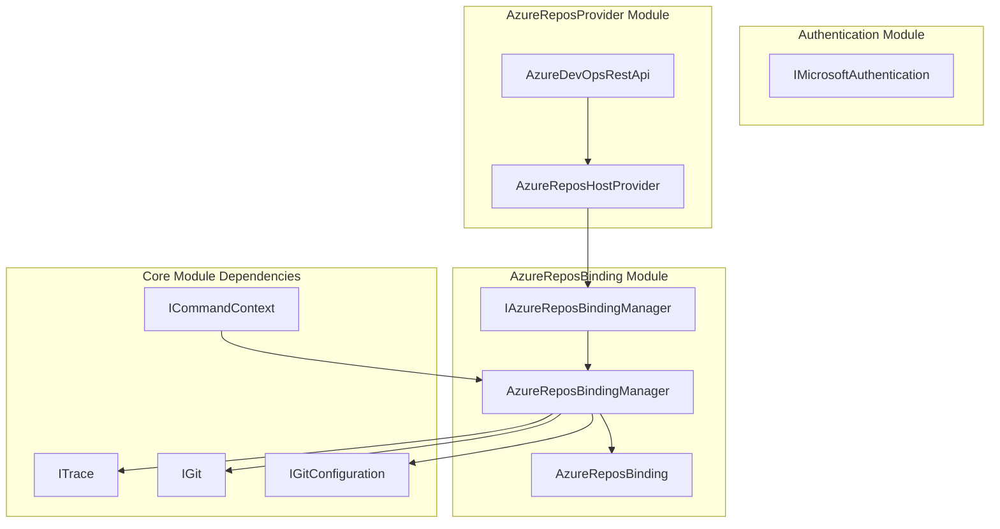
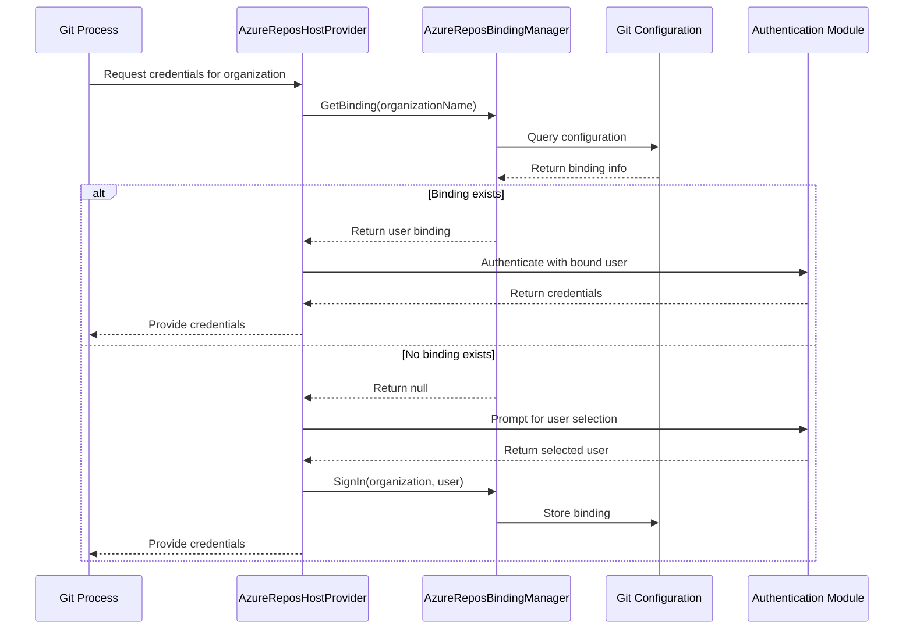
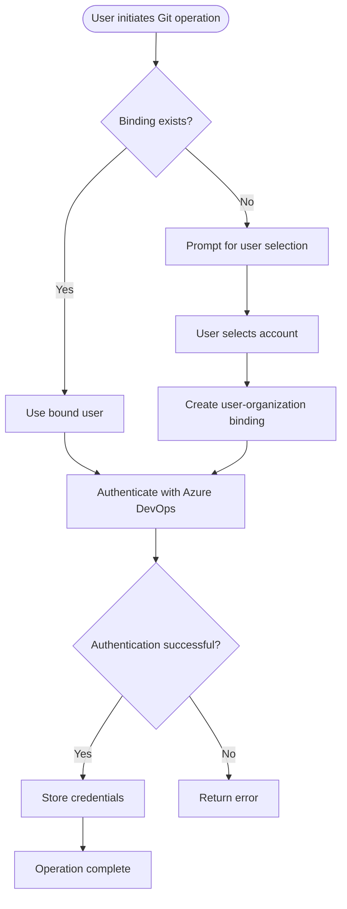
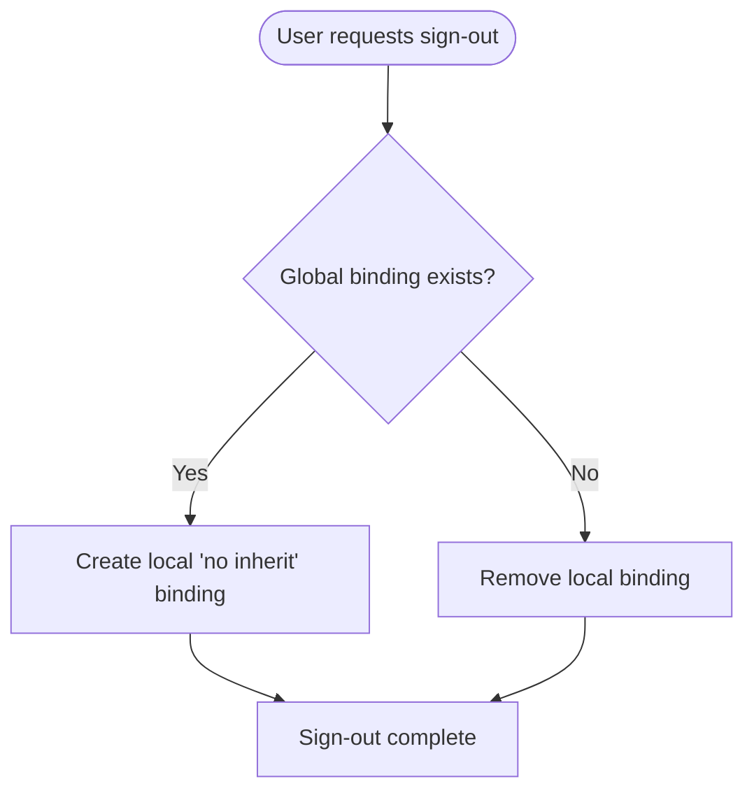

# AzureReposBinding Module Documentation

## Introduction

The AzureReposBinding module is a specialized component within the Git Credential Manager ecosystem that manages user-to-organization bindings for Azure DevOps repositories. This module provides the critical functionality to associate specific users with Azure DevOps organizations, enabling proper authentication and credential management when interacting with Azure Repos.

The module serves as a bridge between Git operations and Azure DevOps authentication, ensuring that the correct user credentials are used for each organization, which is essential for multi-tenant scenarios where developers may work with multiple Azure DevOps organizations.

## Architecture Overview

### Core Components

The AzureReposBinding module consists of three primary components:

1. **IAzureReposBindingManager** - The interface defining the contract for binding management operations
2. **AzureReposBindingManager** - The concrete implementation that handles user-organization bindings
3. **AzureReposBinding** - A data structure representing the binding between a user and an organization

### Module Dependencies

The AzureReposBinding module integrates with several other modules in the system:

- **Core Module**: Provides fundamental services like tracing (`ITrace`), Git operations (`IGit`), and configuration management
- **Authentication Module**: Leverages Microsoft authentication components for Azure DevOps authentication flows
- **AzureReposProvider Module**: Works in conjunction with the host provider to deliver complete Azure Repos functionality



## Component Details

### IAzureReposBindingManager Interface

The `IAzureReposBindingManager` interface defines the contract for managing user-organization bindings in Azure DevOps. It provides methods to:

- Retrieve bindings for specific organizations
- Create new user-organization bindings
- Remove existing bindings
- Enumerate all bindings with optional filtering

### AzureReposBindingManager Implementation

The `AzureReposBindingManager` class is the core implementation that manages the persistence and retrieval of user-organization bindings. Key features include:

#### Configuration Management
- Utilizes Git's configuration system to store bindings
- Supports both global and local configuration levels
- Uses URN-based keys for organization identification

#### Binding Hierarchy
The manager implements a sophisticated binding hierarchy that respects both global and local configurations:
- **Global bindings**: Apply across all repositories on the system
- **Local bindings**: Apply only to the current repository
- **Inheritance control**: Allows preventing inheritance of global bindings at the local level

#### Key Operations

1. **GetBinding**: Retrieves the binding for a specific organization
2. **Bind**: Creates or updates a user-organization binding
3. **Unbind**: Removes a user-organization binding
4. **GetBindings**: Enumerates all bindings with optional organization filtering

### AzureReposBinding Data Structure

The `AzureReposBinding` class represents the binding between an Azure DevOps organization and users at different configuration levels:

```csharp
public class AzureReposBinding
{
    public string Organization { get; }
    public string GlobalUserName { get; }
    public string LocalUserName { get; }
}
```

## Data Flow Architecture



## Process Flows

### User Sign-In Process



### User Sign-Out Process



## Configuration Storage

The module uses Git's configuration system with a specialized key format:

```
credential.urn:azure-repos:org/{organization}.username
```

This format ensures:
- **Namespace isolation**: Prevents conflicts with other credential configurations
- **Organization identification**: Clearly associates bindings with specific organizations
- **Hierarchical support**: Allows both global and local configuration levels

## Integration with AzureReposProvider

The AzureReposBinding module works closely with the AzureReposHostProvider to deliver a complete authentication experience:

1. **Host Provider Integration**: The AzureReposHostProvider uses the binding manager to determine which user should be authenticated
2. **Authentication Flow**: When no binding exists, the host provider can prompt for user selection and create new bindings
3. **Credential Management**: Bindings ensure consistent user selection across multiple Git operations

## Security Considerations

The module implements several security best practices:

- **No credential storage**: Bindings only store user identifiers, not actual credentials
- **Configuration isolation**: Uses Git's configuration system which respects file permissions
- **Inheritance control**: Allows preventing unwanted user inheritance in sensitive repositories
- **Case-insensitive matching**: Handles Azure DevOps organization names in a case-insensitive manner

## Error Handling

The module includes comprehensive error handling for:

- **Invalid organization names**: Validates organization name parameters
- **Repository context**: Checks if local configuration is possible (requires being inside a repository)
- **Configuration access**: Handles Git configuration read/write errors gracefully
- **Argument validation**: Validates all input parameters with appropriate error messages

## Extension Methods

The module provides convenient extension methods via `AzureReposUserManagerExtensions`:

- **GetUser**: Simplifies retrieving the effective user for an organization
- **SignIn**: Handles the complete sign-in process with intelligent binding logic
- **SignOut**: Manages the sign-out process with proper inheritance handling

These methods implement complex logic to handle various binding scenarios and ensure consistent behavior across the application.

## References

- [Core Module Documentation](Core.md) - For fundamental services and interfaces
- [Authentication Module Documentation](Authentication.md) - For authentication-related components
- [AzureReposProvider Module Documentation](AzureReposProvider.md) - For the host provider implementation