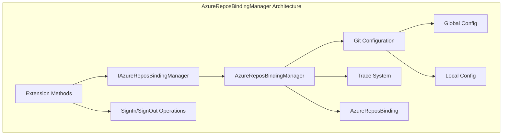
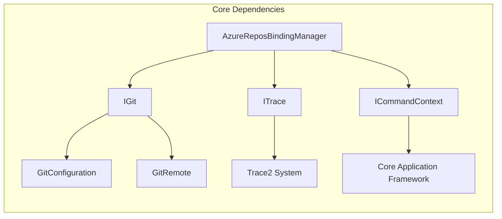
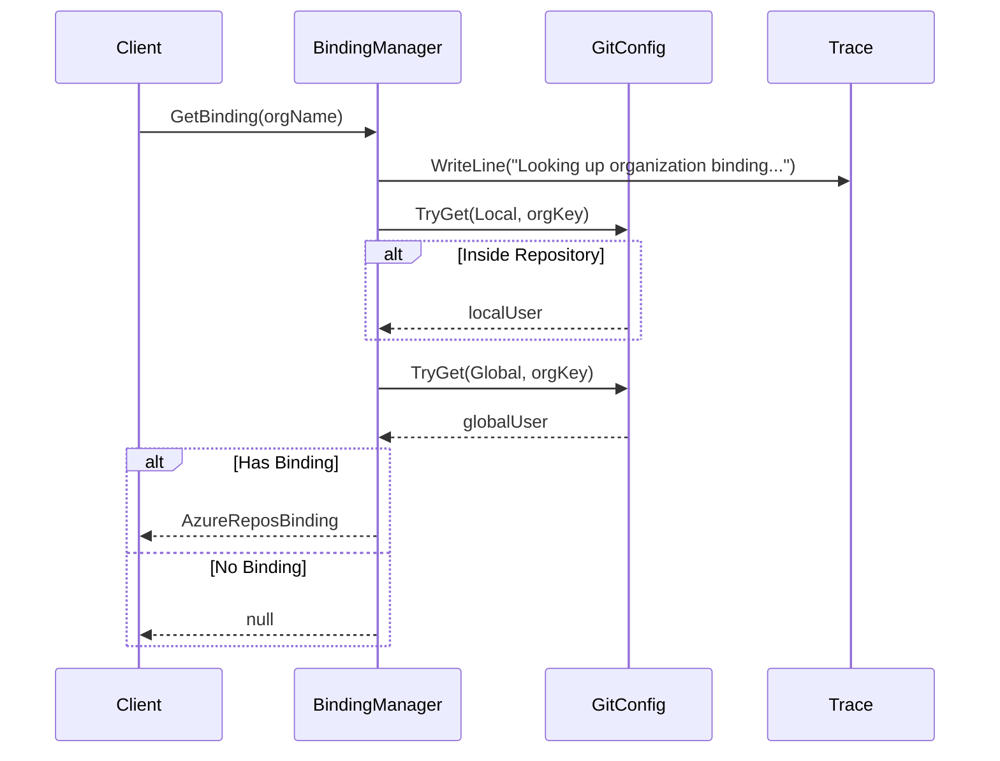
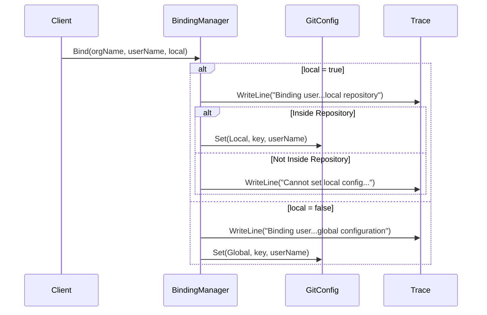
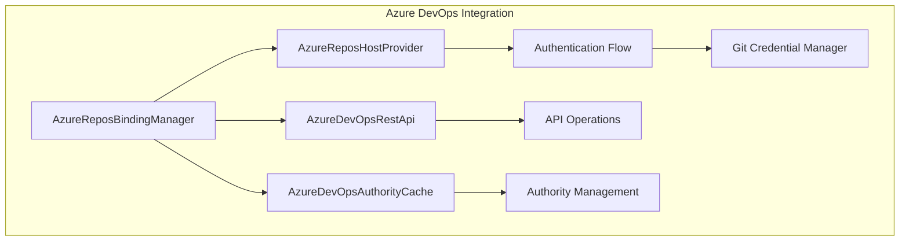

# AzureReposBindingManager Module Documentation

## Introduction

The AzureReposBindingManager module is a critical component of the Git Credential Manager that handles user-organization bindings for Azure DevOps repositories. This module manages the mapping between Azure DevOps organizations and user accounts, enabling seamless authentication and credential management across different organizational contexts.

## Module Overview

The AzureReposBindingManager provides a centralized mechanism for managing user bindings to Azure DevOps organizations, supporting both global and repository-local configuration levels. It integrates with Git's configuration system to persist user-organization relationships and enables sophisticated inheritance patterns for authentication scenarios.

## Core Components

### IAzureReposBindingManager Interface
The primary interface defining the contract for managing Azure Repos bindings:
- **GetBinding**: Retrieves binding information for a specific organization
- **Bind**: Creates or updates user-organization bindings
- **Unbind**: Removes user-organization bindings
- **GetBindings**: Enumerates all configured bindings with optional filtering

### AzureReposBinding Class
A data structure representing the binding relationship:
- **Organization**: The Azure DevOps organization name
- **GlobalUserName**: User binding at the global Git configuration level
- **LocalUserName**: User binding at the local repository level
- **NoInherit**: Special constant for preventing inheritance of global bindings

### AzureReposBindingManager Class
The concrete implementation providing:
- Git configuration integration
- Local and global binding management
- Organization-specific user mapping
- Inheritance control mechanisms

## Architecture



## Dependencies and Integration

### Core Dependencies
The module integrates with several core system components:



### Git Configuration Integration
The module leverages Git's configuration system through:
- **IGitConfiguration**: Interface for accessing Git configuration
- **GitConfigurationLevel**: Enum for local vs global configuration levels
- **GitConfigurationType**: Configuration entry types
- **Constants**: Predefined configuration section and key names

## Data Flow

### Binding Retrieval Process


### Binding Creation Process


## Configuration Schema

The module uses a specific configuration key format:
```
credential.urn:azure-repos:org/{organization}.username
```

Where:
- `credential` is the Git configuration section
- `urn:azure-repos:org/` is the URN prefix for Azure DevOps organizations
- `{organization}` is the actual organization name
- `username` is the configuration key

## Extension Methods

The module provides extension methods for common operations:

### GetUser Extension
Simplifies user retrieval by automatically handling inheritance:
- Returns local user if available and not set to "NoInherit"
- Falls back to global user if no local binding exists
- Returns null if no binding exists or inheritance is blocked

### SignIn Extension
Manages the sign-in process with intelligent binding logic:
- Creates global bindings when no conflict exists
- Creates local bindings when global binding conflicts with desired user
- Automatically cleans up local bindings when setting global ones

### SignOut Extension
Handles sign-out with sophisticated unbinding logic:
- Removes local bindings when no global binding exists
- Sets "NoInherit" local binding when global binding exists
- Prevents automatic fallback to global credentials

## Error Handling

The module implements comprehensive error handling:
- **Argument Validation**: All public methods validate input parameters
- **Repository Context**: Checks for repository context before local operations
- **Configuration Access**: Graceful handling of configuration read/write failures
- **Trace Logging**: Detailed logging for debugging and diagnostics

## Security Considerations

### Credential Isolation
- Local bindings override global bindings, preventing credential leakage
- "NoInherit" mechanism blocks unwanted credential inheritance
- Organization-specific bindings prevent cross-organization credential usage

### Configuration Persistence
- Bindings stored in Git's configuration system
- Global bindings apply to all repositories
- Local bindings apply only to specific repository contexts

## Integration with Azure DevOps

The module integrates with the broader Azure DevOps ecosystem:



## Usage Patterns

### Typical Binding Scenarios
1. **Single User per Organization**: Global binding for consistent access
2. **Multiple Users per Organization**: Local bindings for repository-specific access
3. **Organization Isolation**: "NoInherit" for preventing credential inheritance
4. **Cross-Organization Access**: Multiple bindings for different organizations

### Best Practices
- Use global bindings for personal development scenarios
- Use local bindings for team/shared repository scenarios
- Implement "NoInherit" for security-sensitive repositories
- Regular audit of bindings using GetBindings() method

## Testing and Diagnostics

The module supports comprehensive testing through:
- **Trace Integration**: Detailed operation logging
- **Mock Support**: Interface-based design enables unit testing
- **Configuration Inspection**: Direct access to Git configuration for verification
- **Binding Enumeration**: Complete visibility into all configured bindings

## Performance Considerations

- **Lazy Loading**: Configuration accessed only when needed
- **Caching**: Git configuration cached at the IGit level
- **Efficient Enumeration**: Optimized binding enumeration with optional filtering
- **Minimal I/O**: Single configuration read/write operations per method call

## Future Enhancements

Potential areas for enhancement include:
- **Binding Validation**: Verify user existence before creating bindings
- **Bulk Operations**: Support for multiple binding operations
- **Binding Metadata**: Additional context information (timestamps, reasons)
- **Migration Tools**: Utilities for binding migration and cleanup

## Related Documentation

- [AzureReposHostProvider](AzureReposHostProvider.md) - Host provider integration
- [AzureDevOpsRestApi](AzureDevOpsRestApi.md) - REST API operations
- [AzureDevOpsAuthorityCache](AzureDevOpsAuthorityCache.md) - Authority management
- [Git Integration](GitIntegration.md) - Core Git operations
- [Configuration Service](ConfigurationService.md) - Configuration management
- [Trace System](TraceSystem.md) - Diagnostic and logging framework