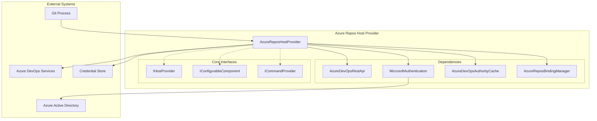
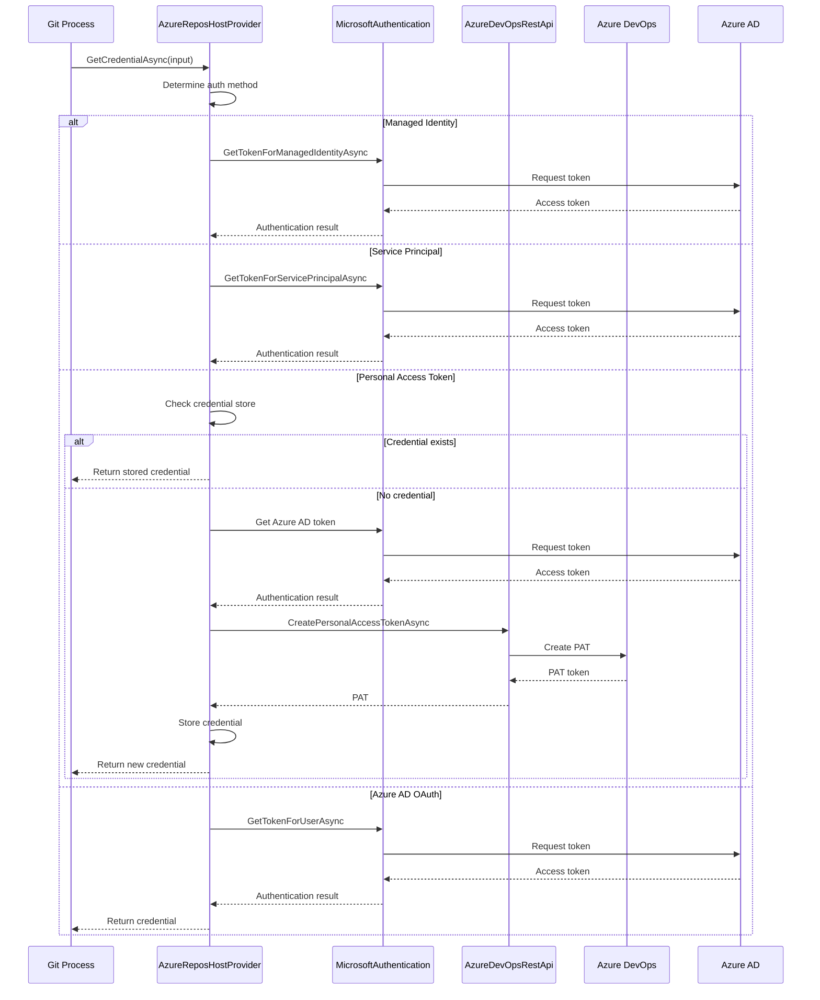
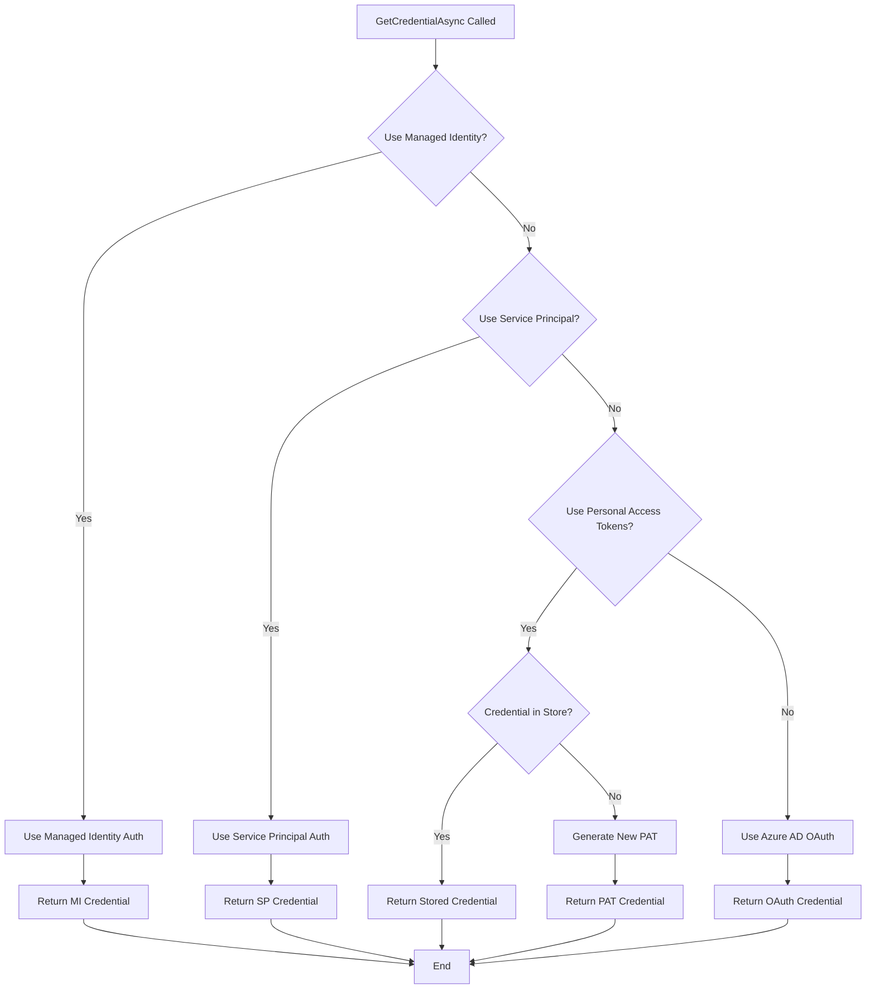
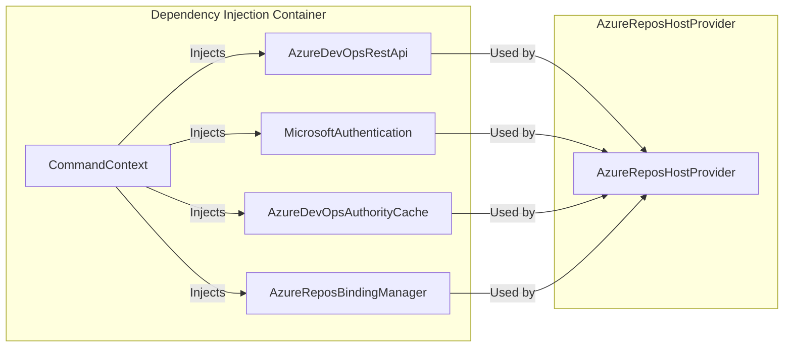

# Azure Repos Host Provider

The Azure Repos Host Provider is a specialized Git credential manager component that handles authentication and credential management for Azure DevOps repositories. It provides seamless integration with Azure DevOps Services and Azure DevOps Server, supporting multiple authentication methods including Microsoft authentication, personal access tokens (PATs), managed identities, and service principals.

## Overview

The AzureReposHostProvider serves as the primary interface between Git operations and Azure DevOps authentication systems. It implements the `IHostProvider` interface to integrate with the Git Credential Manager framework, providing credential storage, retrieval, and management capabilities specifically tailored for Azure DevOps repositories.

## Architecture

### Component Structure



### Authentication Flow Architecture



## Core Components

### AzureReposHostProvider

The main provider class that orchestrates authentication and credential management for Azure DevOps repositories. It implements three key interfaces:

- **IHostProvider**: Core credential management interface
- **IConfigurableComponent**: Git configuration management
- **ICommandProvider**: Command-line interface support

#### Key Properties

- **Id**: `"azure-repos"` - Unique identifier for the provider
- **Name**: `"Azure Repos"` - Human-readable name
- **SupportedAuthorityIds**: Microsoft authentication authority IDs

#### Supported Authentication Methods

1. **Managed Identity Authentication**
   - Automatic authentication for Azure-hosted environments
   - No user interaction required
   - Configured via environment variables

2. **Service Principal Authentication**
   - Application-based authentication
   - Supports both client secret and certificate-based authentication
   - Suitable for CI/CD scenarios

3. **Personal Access Token (PAT) Authentication**
   - Creates and manages PATs automatically
   - Default authentication method (except on DevBox)
   - Stored in credential store for reuse

4. **Azure AD OAuth Authentication**
   - Interactive user authentication
   - Uses Microsoft authentication library
   - Falls back when PATs are disabled

### Authentication Decision Logic



## Configuration Management

### Git Configuration

The provider automatically configures Git settings for optimal Azure DevOps integration:

- **credential.useHttpPath**: Set to `true` for `https://dev.azure.com` to ensure organization names are properly extracted from URLs
- **credential.helper**: Configured to use the Git Credential Manager

### Environment Variables

Key environment variables that control provider behavior:

- `GCM_AZREPOS_CREDENTIALTYPE`: Override default credential type (`pat` or `oauth`)
- `GCM_AZREPOS_MANAGEDIDENTITY`: Enable managed identity authentication
- `GCM_AZREPOS_SERVICEPRINCIPAL`: Configure service principal authentication
- `GCM_AZREPOS_SERVICEPRINCIPAL_SECRET`: Service principal client secret
- `GCM_AZREPOS_SERVICEPRINCIPAL_CERT_THUMBPRINT`: Certificate thumbprint for service principal

## Command-Line Interface

The provider exposes several commands for managing Azure DevOps authentication:

### Available Commands

- **`clear-cache`**: Clear the Azure authority cache
- **`list [organization] [--show-remotes] [--verbose]`**: List user account bindings
- **`bind <organization> <username> [--local]`**: Bind user account to organization
- **`unbind <organization> [--local]`**: Remove user account binding

### Command Examples

```bash
# List all Azure DevOps bindings
git credential-manager azure-repos list

# Bind user to organization
git credential-manager azure-repos bind myorg user@example.com

# Clear authority cache
git credential-manager azure-repos clear-cache
```

## Integration with Core Framework

### Dependency Injection

The provider integrates with the Git Credential Manager's dependency injection system:



### Host Provider Registration

The provider is automatically registered in the `HostProviderRegistry` and selected based on:

1. **Protocol**: HTTP or HTTPS
2. **Host Name**: Must be an Azure DevOps host (dev.azure.com or *.visualstudio.com)
3. **URL Pattern**: Must match Azure DevOps repository patterns

## Security Considerations

### Credential Storage

- **Personal Access Tokens**: Stored in the system credential store with organization-specific service names
- **Azure AD Tokens**: Not stored, obtained fresh for each operation
- **Managed Identity**: No credentials stored, uses system-assigned or user-assigned identities

### URL Handling

- **HTTPS Enforcement**: Warns about HTTP usage unless explicitly allowed
- **Organization Extraction**: Properly handles both dev.azure.com and visualstudio.com URL formats
- **User Info Parsing**: Safely extracts usernames from remote URLs

### Authentication Security

- **Token Scoping**: PATs are created with minimal required scopes (repos:write, artifacts:read)
- **Authority Validation**: Validates authentication authorities before use
- **Certificate Support**: Supports certificate-based service principal authentication

## Error Handling

The provider includes comprehensive error handling for common scenarios:

- **Unsafe Remote Protocols**: Prevents HTTP usage unless configured
- **Invalid URLs**: Validates Azure DevOps URL formats
- **Authentication Failures**: Provides detailed error messages for authentication issues
- **Missing Dependencies**: Validates required components are available

## Performance Optimizations

### Caching

- **Authority Cache**: Caches Azure AD authority information per organization
- **Credential Store**: Reuses stored credentials when available
- **Binding Manager**: Caches user-organization bindings

### Async Operations

All authentication operations are implemented asynchronously to prevent blocking Git operations:

- **Token Acquisition**: Non-blocking Azure AD token requests
- **API Calls**: Async REST API operations
- **Credential Storage**: Async credential store operations

## Platform Support

The provider supports all platforms where Git Credential Manager is available:

- **Windows**: Full feature support including Windows Credential Manager integration
- **macOS**: Full feature support including Keychain integration
- **Linux**: Full feature support including Secret Service integration

## Related Documentation

- [Microsoft Authentication](MicrosoftAuthentication.md) - Azure AD authentication implementation
- [AzureDevOpsRestApi](AzureDevOpsRestApi.md) - Azure DevOps REST API client
- [AzureDevOpsAuthorityCache](AzureDevOpsAuthorityCache.md) - Authority caching mechanism
- [AzureReposBindingManager](AzureReposBindingManager.md) - User-organization binding management
- [Host Provider Framework](HostProviderFramework.md) - General host provider architecture
- [Authentication System](AuthenticationSystem.md) - Overall authentication architecture