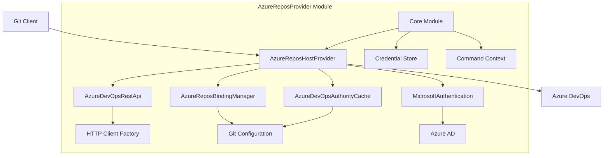
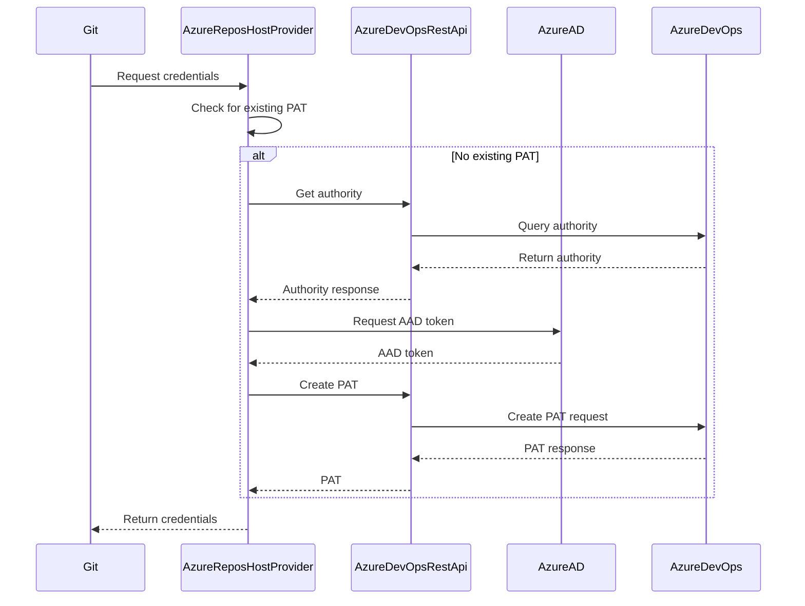
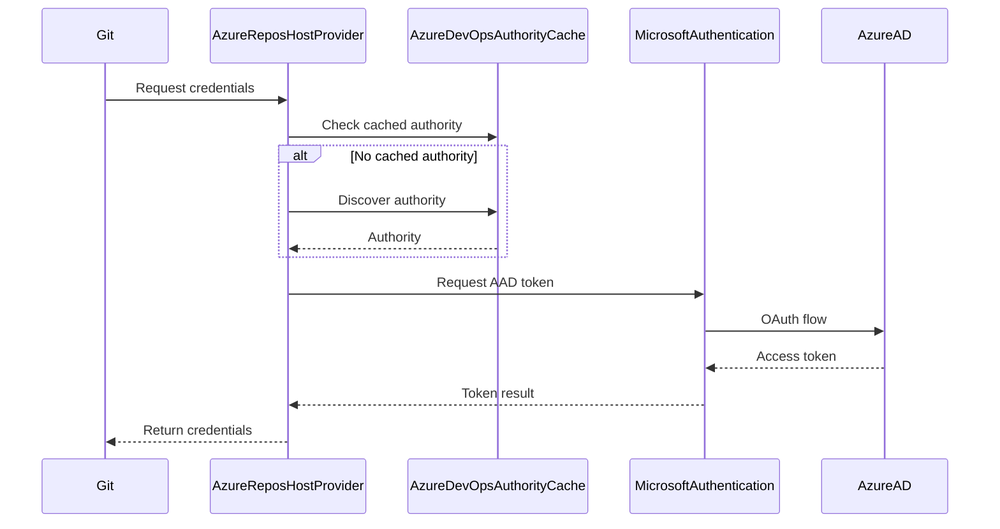

# AzureReposProvider Module Documentation

## Overview

The AzureReposProvider module is a specialized Git credential manager provider designed to handle authentication with Azure DevOps repositories (Azure Repos). It provides seamless authentication for Git operations against Azure DevOps-hosted Git repositories, supporting both personal access tokens (PATs) and Azure Active Directory (AAD) authentication flows.

## Purpose

This module serves as the primary authentication interface between Git clients and Azure DevOps repositories, offering:

- **Multi-Authentication Support**: Handles both Personal Access Tokens and Azure AD authentication
- **Organization Management**: Manages user bindings to Azure DevOps organizations
- **Authority Caching**: Caches authentication authorities to optimize performance
- **Cross-Platform Support**: Works across Windows, macOS, and Linux environments
- **Integration with Git Credential Manager**: Seamlessly integrates with the broader Git Credential Manager ecosystem

## Architecture



## Core Components

### 1. AzureReposHostProvider
The main provider class that implements `IHostProvider` and serves as the entry point for all Azure Repos authentication operations. It coordinates between different authentication methods and manages the overall authentication flow.

**Key Responsibilities:**
- Determines the appropriate authentication method (PAT, OAuth, Managed Identity, Service Principal)
- Handles credential storage and retrieval
- Manages user sign-in/sign-out operations
- Provides configuration commands for Git integration

### 2. AzureDevOpsRestApi
Handles REST API communications with Azure DevOps services for authentication-related operations.

**Key Responsibilities:**
- Discovers authentication authorities for organizations
- Creates personal access tokens via Azure DevOps APIs
- Handles HTTP communications with proper headers and authentication

### 3. AzureDevOpsAuthorityCache
Manages caching of authentication authorities to avoid repeated lookups and improve performance.

**Key Responsibilities:**
- Caches Azure AD/MSA authorities for organizations
- Provides fast lookup of previously discovered authorities
- Manages cache invalidation and cleanup

### 4. AzureReposBindingManager
Manages user bindings to Azure DevOps organizations, allowing users to be associated with specific organizations.

**Key Responsibilities:**
- Binds users to organizations at global or local level
- Manages user sign-in/sign-out states
- Provides organization-user relationship management

## Authentication Flows

### Personal Access Token (PAT) Flow


### Azure AD OAuth Flow


## Configuration

The module integrates with Git configuration to provide seamless authentication:

- **useHttpPath**: Automatically configured for `dev.azure.com` URLs to ensure proper organization detection
- **credential.helper**: Integrates with Git's credential helper system
- **Global vs Local Configuration**: Supports both system-wide and repository-specific settings

## Supported Authentication Methods

1. **Personal Access Tokens (PAT)**
   - Default authentication method (except on DevBox)
   - Created on-demand with appropriate scopes
   - Stored securely in the credential store

2. **Azure AD OAuth**
   - Used when PATs are disabled or on DevBox
   - Supports both MSA and AAD accounts
   - Leverages Microsoft Authentication Library (MSAL)

3. **Managed Identity**
   - For Azure-hosted environments
   - Automatic authentication without user interaction

4. **Service Principal**
   - For automated scenarios
   - Supports both certificate and client secret authentication

## Integration with Core Module

The AzureReposProvider heavily relies on the [Core Module](Core.md) for:
- **Authentication Framework**: Uses MicrosoftAuthentication from Core
- **Credential Storage**: Leverages ICredentialStore implementations
- **Git Integration**: Uses IGit for configuration management
- **Command Framework**: Implements ICommandProvider for CLI commands
- **Platform Services**: Utilizes platform-specific implementations

## Sub-modules

The AzureReposProvider module consists of several specialized sub-modules:

- **[AzureReposAuthentication](AzureReposAuthentication.md)**: Handles authentication logic and token management including support for Personal Access Tokens, Azure AD OAuth, Managed Identity, and Service Principal authentication methods
- **[AzureReposRestApi](AzureReposRestApi.md)**: Manages REST API communications with Azure DevOps services for authority discovery and personal access token creation
- **[AzureReposBinding](AzureReposBinding.md)**: Manages user-organization bindings and relationships, providing user sign-in/sign-out functionality and organization-specific user management

## Error Handling

The module implements comprehensive error handling:
- **Trace2 Integration**: Detailed logging and diagnostics
- **Graceful Fallbacks**: Falls back to alternative authentication methods
- **User-Friendly Messages**: Provides clear error messages for common issues
- **Security**: Never logs sensitive information like tokens or passwords

## Security Considerations

- **Token Security**: All tokens are stored securely using platform-specific credential stores
- **HTTPS Enforcement**: Warns against using unencrypted HTTP connections
- **Scope Management**: Requests minimal required scopes for operations
- **Cache Security**: Authority cache is stored in Git configuration with appropriate permissions

## Platform Support

The module supports all platforms that Git Credential Manager supports:
- **Windows**: Full feature support including Windows Credential Manager integration
- **macOS**: Full feature support including Keychain integration  
- **Linux**: Full feature support including Secret Service integration

## Usage Examples

### Basic Authentication
```bash
# Git automatically uses AzureReposProvider for Azure DevOps URLs
git clone https://org@dev.azure.com/org/project/_git/repo
```

### Configuration Commands
```bash
# List user bindings
git credential-manager azure-repos list

# Bind user to organization
git credential-manager azure-repos bind myorg user@example.com

# Clear authority cache
git credential-manager azure-repos clear-cache
```

### Environment Variables
```bash
# Force OAuth instead of PAT
export GCM_AZREPOS_CREDENTIALTYPE=oauth

# Use managed identity
export GCM_AZREPOS_MANAGEDIDENTITY=system

# Use service principal
export GCM_AZREPOS_SERVICEPRINCIPAL=tenant-id/client-id
```

This documentation provides a comprehensive overview of the AzureReposProvider module. For detailed information about specific sub-modules, refer to their individual documentation files.