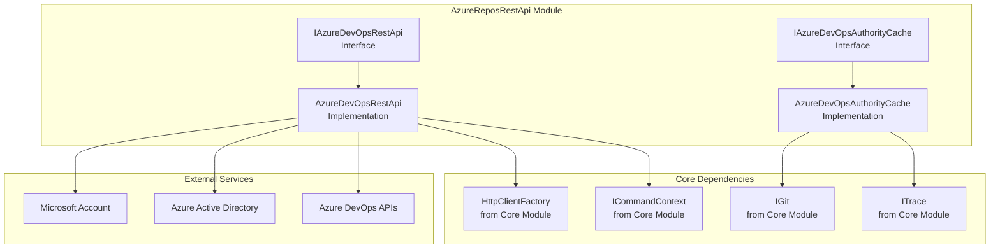
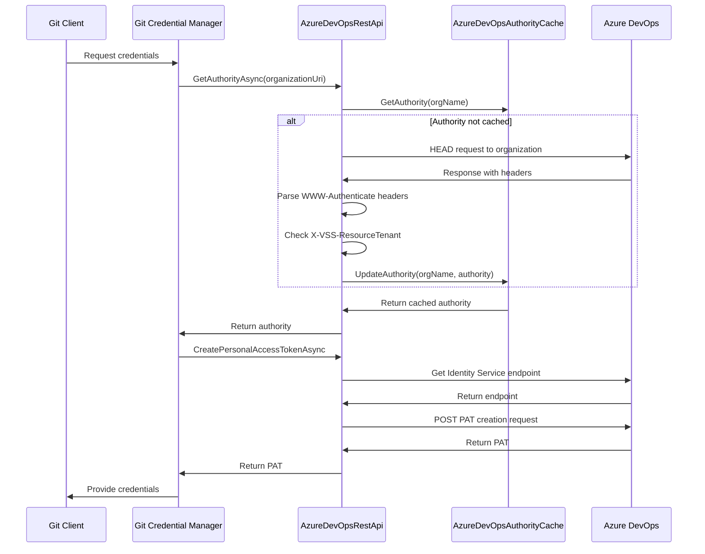
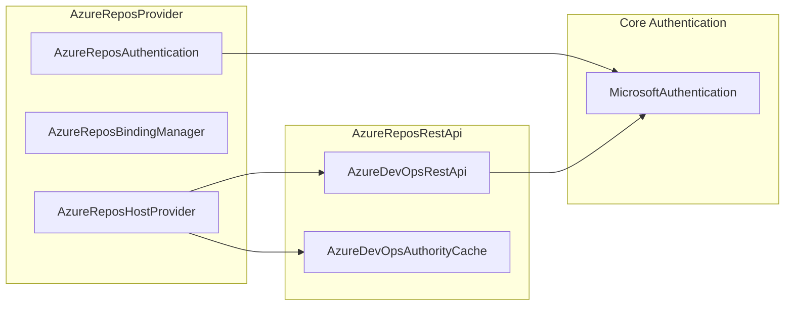
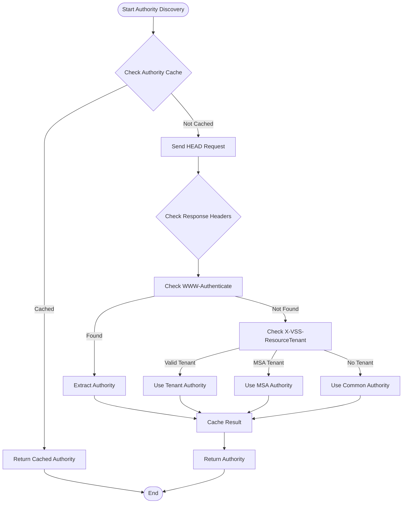
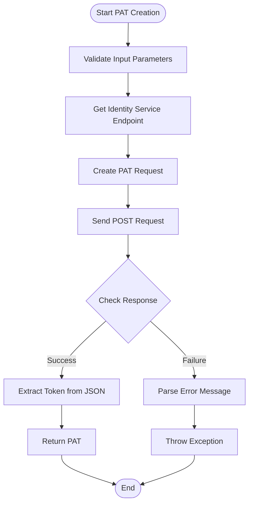

# AzureReposRestApi Module Documentation

## Overview

The AzureReposRestApi module provides REST API integration capabilities for Azure DevOps repositories, enabling authentication and personal access token (PAT) management for Git credential operations. This module serves as the core communication layer between Git Credential Manager and Azure DevOps services, handling authority discovery and token creation workflows.

## Purpose and Core Functionality

The module's primary responsibilities include:

- **Authority Discovery**: Automatically determine the correct Azure Active Directory (AAD) or Microsoft Account (MSA) authority for Azure DevOps organizations
- **Personal Access Token Creation**: Generate PATs with specified scopes for Git operations
- **Authority Caching**: Cache and manage Azure DevOps authority information to optimize authentication performance
- **REST API Communication**: Handle HTTP communications with Azure DevOps REST APIs

## Architecture

### Component Structure



### Data Flow Architecture



## Core Components

### IAzureDevOpsRestApi Interface

The primary interface defining the contract for Azure DevOps REST API operations:

```csharp
public interface IAzureDevOpsRestApi : IDisposable
{
    Task<string> GetAuthorityAsync(Uri organizationUri);
    Task<string> CreatePersonalAccessTokenAsync(Uri organizationUri, string accessToken, IEnumerable<string> scopes);
}
```

**Key Methods:**
- `GetAuthorityAsync`: Determines the appropriate authentication authority for an Azure DevOps organization
- `CreatePersonalAccessTokenAsync`: Creates a personal access token with specified scopes

### AzureDevOpsRestApi Implementation

The main implementation class that provides Azure DevOps REST API functionality:

**Key Features:**
- **Authority Discovery**: Uses HTTP HEAD requests to inspect response headers and determine the correct AAD/MSA authority
- **Header Analysis**: Examines WWW-Authenticate and X-VSS-ResourceTenant headers for authority information
- **Token Creation**: Communicates with Azure DevOps Identity Service to create PATs
- **Error Handling**: Comprehensive error handling with detailed trace logging

**Authority Discovery Logic:**
1. Sends HEAD request to organization URI
2. Checks WWW-Authenticate headers for Bearer authority
3. Examines X-VSS-ResourceTenant header for tenant information
4. Falls back to common authority if specific authority cannot be determined

### IAzureDevOpsAuthorityCache Interface

Interface for caching Azure DevOps authority information:

```csharp
public interface IAzureDevOpsAuthorityCache
{
    string GetAuthority(string orgName);
    void UpdateAuthority(string orgName, string authority);
    void EraseAuthority(string orgName);
    void Clear();
}
```

### AzureDevOpsAuthorityCache Implementation

Manages caching of Azure DevOps authority information using Git configuration:

**Storage Mechanism:**
- Uses Git's global configuration to store authority mappings
- Implements URN-based key format for organization identification
- Provides thread-safe operations for cache management

**Cache Key Format:**
```
credential.https://dev.azure.com/{orgName}.azureAuthority
```

## Integration with AzureReposProvider

The AzureReposRestApi module integrates with the broader AzureReposProvider ecosystem:



## Process Flows

### Authority Discovery Process



### Personal Access Token Creation Process



## Dependencies

### Core Module Dependencies

The AzureReposRestApi module relies on several core components:

- **[Core.Application](Core.md)**: Provides application context and command execution framework
- **[Core.Authentication.MicrosoftAuthentication](Core.md#microsoft-authentication)**: Handles Microsoft authentication flows
- **[Core.HttpClientFactory](Core.md#http-client-factory)**: Creates and manages HTTP client instances
- **[Core.GitConfiguration](Core.md#git-configuration)**: Manages Git configuration for authority caching

### External Dependencies

- **Azure DevOps REST APIs**: Primary service endpoint for authority and token operations
- **Azure Active Directory**: Authentication authority for organizational accounts
- **Microsoft Account Services**: Authentication authority for personal accounts

## Configuration

### Environment Variables

The module supports developer overrides through environment variables:

- `GCM_DEV_AAD_AUTHORITY_BASE_URI`: Override the default AAD authority base URI

### Git Configuration

Authority cache entries are stored in Git's global configuration:

```ini
[credential "urn:azure-repos:org:{organizationName}"]
    azureAuthority = https://login.microsoftonline.com/{tenantId}
```

## Error Handling

The module implements comprehensive error handling:

- **Network Errors**: Handles HTTP communication failures with retry logic
- **Authentication Errors**: Manages AAD/MSA authentication failures
- **Configuration Errors**: Validates input parameters and configuration settings
- **Service Errors**: Processes Azure DevOps API error responses

## Security Considerations

### Token Security

- PATs are created with minimal required scopes
- Tokens are transmitted over HTTPS only
- No token storage in the module (handled by credential stores)

### Authority Validation

- Validates all URIs for proper format and scheme
- Ensures Azure DevOps hostname validation
- Implements proper authentication header parsing

## Performance Optimization

### Caching Strategy

- Authority information is cached in Git configuration
- Cache entries persist across Git operations
- Manual cache clearing available for troubleshooting

### HTTP Client Reuse

- Single HTTP client instance per REST API instance
- Standard headers pre-configured for Azure DevOps APIs
- Proper disposal pattern implementation

## Troubleshooting

### Common Issues

1. **Authority Discovery Failures**
   - Check network connectivity to Azure DevOps
   - Verify organization URI format
   - Review trace logs for header inspection details

2. **PAT Creation Failures**
   - Validate access token permissions
   - Check scope requirements
   - Review Azure DevOps service health

3. **Cache Issues**
   - Clear authority cache if experiencing authentication problems
   - Verify Git configuration permissions
   - Check for conflicting cache entries

### Diagnostic Information

The module provides detailed trace logging for:
- HTTP request/response details
- Authority discovery process
- Cache operations
- Error conditions and exceptions

## Related Documentation

- [Core Module](Core.md) - Foundation services and authentication framework
- [AzureReposProvider](AzureReposProvider.md) - Host provider implementation for Azure Repos
- [GitIntegration](Core.md#git-integration) - Git operations and configuration management