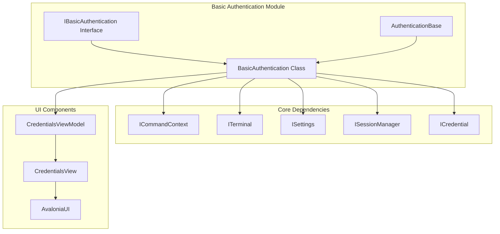
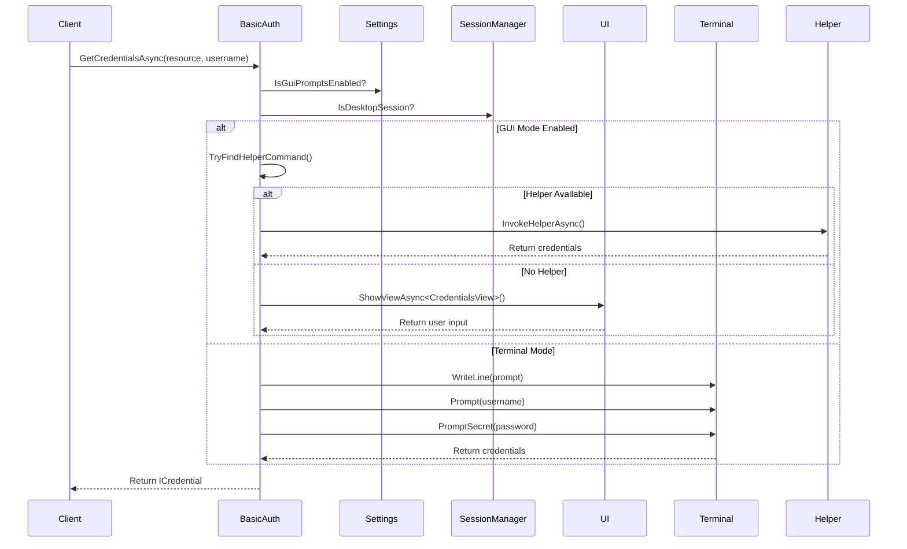
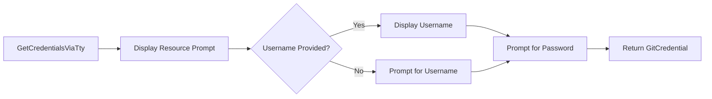

# Basic Authentication Module

The Basic Authentication module provides username and password authentication capabilities for Git Credential Manager, supporting multiple user interaction modes including GUI prompts, terminal-based input, and external helper applications.

## Overview

The Basic Authentication module implements the fundamental authentication mechanism using username/password credentials. It serves as one of the primary authentication methods in the Git Credential Manager ecosystem, alongside OAuth and Microsoft authentication providers.

### Key Features

- **Multi-modal User Interaction**: Supports GUI prompts, terminal input, and external helper applications
- **Flexible Credential Collection**: Can prompt for both username and password or use pre-specified usernames
- **Cross-platform Compatibility**: Works across Windows, macOS, and Linux environments
- **Integration with UI Framework**: Leverages Avalonia UI for graphical credential prompts
- **Helper Application Support**: Can delegate credential collection to external helper programs

## Architecture

### Component Structure



### Authentication Flow



## Core Components

### IBasicAuthentication Interface

The `IBasicAuthentication` interface defines the contract for basic authentication operations:

```csharp
public interface IBasicAuthentication
{
    Task<ICredential> GetCredentialsAsync(string resource, string userName);
}
```

**Key Methods:**
- `GetCredentialsAsync(string resource, string userName)`: Asynchronously retrieves credentials for the specified resource

### BasicAuthentication Class

The `BasicAuthentication` class implements the `IBasicAuthentication` interface and provides the core functionality for basic authentication:

**Properties:**
- `AuthorityIds`: Static array containing the authentication authority identifier `["basic"]`

**Constructor:**
- `BasicAuthentication(ICommandContext context)`: Initializes the authentication instance with the provided command context

**Key Methods:**
- `GetCredentialsAsync(string resource, string userName)`: Main entry point for credential collection
- `GetCredentialsViaUiAsync(string resource, string userName)`: Handles GUI-based credential collection
- `GetCredentialsViaTty(string resource, string userName)`: Handles terminal-based credential collection
- `GetCredentialsViaHelperAsync(string command, string args, string resource, string userName)`: Handles helper application credential collection

## Authentication Modes

### 1. GUI Mode

When GUI prompts are enabled and a desktop session is available, the module uses the Avalonia UI framework to display credential dialogs:


**Features:**
- User-friendly graphical interface
- Pre-filled username support
- Window cancellation handling
- Integration with parent window handles

### 2. Terminal Mode

When GUI is unavailable or disabled, the module falls back to terminal-based input:



**Features:**
- Command-line interaction
- Secure password input (hidden input)
- Username pre-fill support
- Cross-platform terminal compatibility

### 3. Helper Application Mode

The module can delegate credential collection to external helper applications:


**Features:**
- External credential collection
- Configurable helper applications
- Structured response parsing
- Error handling for missing fields

## Dependencies

### Core Framework Dependencies

The Basic Authentication module relies on several core framework components:

- **[CommandContext](Core%20Application%20Framework.md#command-context)**: Provides execution context and access to system resources
- **[Settings](Core%20Application%20Framework.md#configuration-and-settings)**: Manages application configuration and user preferences
- **[Terminal](Core%20Application%20Framework.md#io-and-communication)**: Handles terminal I/O operations
- **[SessionManager](Credential%20Management.md#session-management)**: Manages desktop session information

### UI Framework Dependencies

- **[AvaloniaUI](UI%20Framework.md)**: Cross-platform UI framework for graphical prompts
- **[CredentialsViewModel](UI%20Framework.md#view-models)**: Data binding for credential input forms
- **[CredentialsView](UI%20Framework.md#views)**: Visual representation of credential input

### Authentication Base

- **[AuthenticationBase](Authentication%20System.md#authentication-base)**: Provides common authentication functionality and helper methods

## Integration Points

### Host Provider Integration

The Basic Authentication module integrates with various host providers:

- **[GitHub Provider](GitHub%20Provider.md)**: Uses basic authentication for GitHub operations
- **[GitLab Provider](GitLab%20Provider.md)**: Supports GitLab basic authentication
- **[Bitbucket Provider](Bitbucket%20Provider.md)**: Handles Bitbucket credential collection
- **[Azure Repos Provider](Azure%20Repos%20Provider.md)**: Manages Azure DevOps authentication

### Credential Storage

Collected credentials are managed through the credential management system:

- **[ICredential](Credential%20Management.md#credential-interfaces)**: Represents the credential contract
- **[GitCredential](Credential%20Management.md#credential-types)**: Concrete implementation for Git credentials
- **[CredentialStore](Credential%20Management.md#credential-stores)**: Manages credential persistence

## Configuration

### Environment Variables

The module respects several environment variables for configuration:

- `GCM_UI_HELPER`: Specifies the external helper application for credential prompts
- Terminal prompt settings for controlling CLI behavior

### Git Configuration

Git configuration keys that affect basic authentication:

- `credential.uiHelper`: Specifies the UI helper application
- `credential.guiPrompt`: Controls whether GUI prompts are enabled
- `core.terminalPrompts`: Controls terminal prompt behavior

## Error Handling

The Basic Authentication module implements comprehensive error handling:

### User Interaction Disabled

Throws exceptions when user interaction is disabled but credentials are required:

```csharp
ThrowIfUserInteractionDisabled();
ThrowIfTerminalPromptsDisabled();
```

### Validation Errors

Validates input parameters and response data:

```csharp
EnsureArgument.NotNullOrWhiteSpace(resource, nameof(resource));
```

### Helper Response Validation

Ensures helper applications return required fields:

```csharp
if (!resultDict.TryGetValue("username", out userName))
{
    throw new Trace2Exception(Context.Trace2, "Missing 'username' in response");
}
```

## Security Considerations

### Password Handling

- Passwords are collected through secure input methods
- GUI mode uses password input fields with masking
- Terminal mode uses `PromptSecret` for hidden input
- Credentials are cleared from memory after use

### Resource Validation

- Resource strings are validated to prevent injection attacks
- Command arguments are properly quoted and escaped
- Helper application responses are validated before use

## Usage Examples

### Basic Usage

```csharp
// Create authentication instance
var basicAuth = new BasicAuthentication(commandContext);

// Get credentials for a resource
var credential = await basicAuth.GetCredentialsAsync("https://github.com", null);

// Use pre-filled username
var credential = await basicAuth.GetCredentialsAsync("https://gitlab.com", "john.doe");
```

### Extension Method Usage

```csharp
// Use extension method for username-only scenarios
var credential = await basicAuth.GetCredentialsAsync("https://bitbucket.org");
```

## Platform Support

The Basic Authentication module supports all platforms through its multi-modal design:

- **Windows**: Full GUI and terminal support, Windows Credential Manager integration
- **macOS**: GUI via Avalonia, terminal support, Keychain integration
- **Linux**: GUI via Avalonia, terminal support, Secret Service integration

## Related Documentation

- [Authentication System](Authentication%20System.md) - Overview of all authentication methods
- [OAuth Authentication](OAuth%20Authentication.md) - OAuth-based authentication implementation
- [Microsoft Authentication](Microsoft%20Authentication.md) - Microsoft-specific authentication
- [UI Framework](UI%20Framework.md) - User interface components and patterns
- [Credential Management](Credential%20Management.md) - Credential storage and management