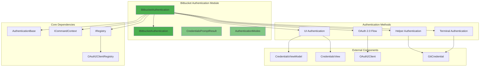
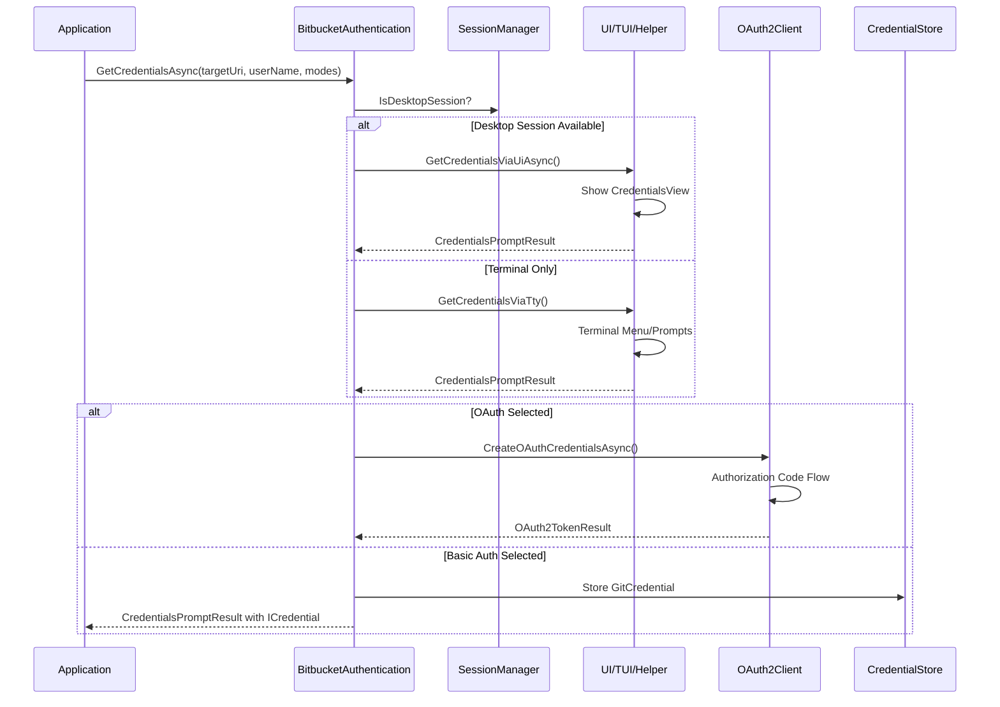
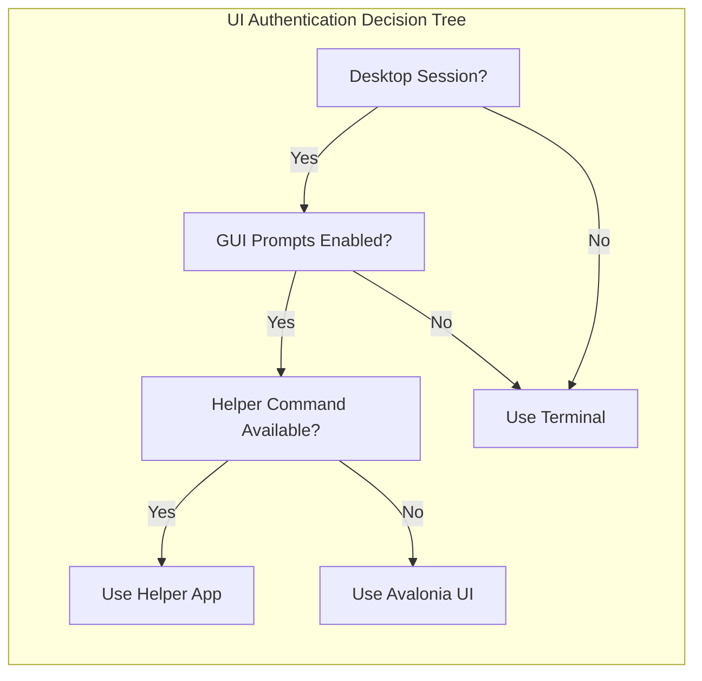
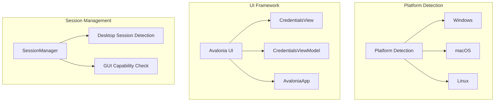

# Bitbucket Authentication Module

## Introduction

The Bitbucket Authentication module provides comprehensive authentication capabilities for Bitbucket Cloud and Bitbucket Data Center instances. It implements a flexible authentication system that supports both Basic Authentication (username/password) and OAuth 2.0 flows, with intelligent fallback mechanisms and platform-specific UI integration.

This module serves as the authentication gateway for Bitbucket repositories, handling credential acquisition, token management, and user interaction across different environments (GUI, terminal, and helper applications).

## Architecture Overview



## Core Components

### BitbucketAuthentication Class

The main authentication implementation that orchestrates credential acquisition through multiple channels:

- **Primary Interface**: `IBitbucketAuthentication`
- **Base Class**: `AuthenticationBase` (provides common authentication functionality)
- **Registry Integration**: Uses `IRegistry<BitbucketOAuth2Client>` for OAuth client management

### AuthenticationModes Enumeration

Defines supported authentication methods with flag-based combination support:

```csharp
[Flags]
public enum AuthenticationModes
{
    None = 0,
    Basic = 1,
    OAuth = 1 << 1,
    All = Basic | OAuth
}
```

### CredentialsPromptResult Class

Encapsulates the result of credential acquisition operations:

- **AuthenticationMode**: Indicates which authentication method was used
- **Credential**: Optional credential object (null for OAuth flows)

## Authentication Flow Architecture



## Authentication Method Selection

### 1. UI-Based Authentication (Desktop Sessions)



**Process**:
1. Creates `CredentialsViewModel` with appropriate flags
2. Displays `CredentialsView` using Avalonia UI framework
3. Handles user selection and credential input
4. Returns structured result with authentication mode

### 2. Terminal-Based Authentication

**Fallback Mechanism**:
- Uses `TerminalMenu` for method selection when multiple options available
- Direct prompts for username/password when only Basic auth is supported
- Automatic OAuth selection when only OAuth is available

### 3. Helper Application Integration

**Command Structure**:
```bash
helper prompt [--url <targetUri>] [--username <userName>] [--show-basic] [--show-oauth]
```

**Response Format**:
- OAuth: `mode=oauth`
- Basic: `mode=basic&username=<user>&password=<pass>`

## OAuth 2.0 Implementation

### Authorization Flow

```mermaid
graph TD
    subgraph "OAuth 2.0 Authorization Code Flow"
        A[CreateOAuthCredentialsAsync] --> B[Create OAuth2SystemWebBrowser]
        B --> C[Get Authorization Code]
        C --> D[Exchange Code for Token]
        D --> E[Return OAuth2TokenResult]
    end

    subgraph "Token Management"
        F[RefreshOAuthCredentialsAsync] --> G[Use Refresh Token]
        G --> H[Get New Access Token]
        H --> I[Return Updated TokenResult]
    end

    subgraph "Registry Integration"
        J[GetRefreshTokenServiceName] --> K[Get OAuth2Client from Registry]
        K --> L[Generate Service-Specific Name]
    end
```



### OAuth Client Registry Integration

The module uses a registry pattern to manage OAuth2 clients:

- **Cloud vs Data Center**: Different OAuth2 clients for Bitbucket Cloud and Data Center
- **Dynamic Selection**: Registry selects appropriate client based on input parameters
- **Service Name Generation**: Creates unique service names for credential storage

## Platform Integration

### Cross-Platform Support



### Environment-Specific Behavior

- **Desktop Sessions**: Full UI support with Avalonia framework
- **Headless Environments**: Terminal-based prompts and menus
- **CI/CD Environments**: Helper application support for automation

## Dependencies and Integration Points

### Core Framework Dependencies

- **[AuthenticationBase](Core%20Application%20Framework.md#authentication-base)**: Provides common authentication functionality
- **[ICommandContext](Core%20Application%20Framework.md#command-context)**: Access to system services and configuration
- **[IRegistry&lt;BitbucketOAuth2Client&gt;](Bitbucket%20Provider.md#registry-components)**: OAuth client management

### Authentication System Integration

- **[OAuth2SystemWebBrowser](Authentication%20System.md#oauth-web-browser)**: Web browser integration for OAuth flows
- **[OAuth2TokenResult](Authentication%20System.md#oauth-token-result)**: Token management and storage
- **[GitCredential](Credential%20Management.md#git-credential)**: Credential representation and storage

### UI Framework Dependencies

- **[CredentialsViewModel](Platform%20UI%20Components.md#bitbucket-credentials-viewmodel)**: View model for credential collection
- **[CredentialsView](Platform%20UI%20Components.md#bitbucket-credentials-view)**: Avalonia UI view component
- **[AvaloniaUi](UI%20Framework.md#avalonia-ui-integration)**: UI framework integration

## Error Handling and Security

### Security Considerations

- **Credential Protection**: Uses secure credential storage mechanisms
- **Token Management**: Automatic token refresh and secure storage
- **User Consent**: Clear authentication method selection
- **Environment Validation**: Desktop session detection prevents UI attempts in headless environments

### Exception Handling

- **User Interaction Disabled**: Throws appropriate exceptions when UI is disabled
- **Missing Credentials**: Validates required fields and provides clear error messages
- **OAuth Failures**: Handles authorization failures with user-friendly messages
- **Network Issues**: Graceful handling of connectivity problems

## Configuration and Customization

### Environment Variables

- `BITBUCKET_AUTHENTICATION_HELPER`: Override default helper command
- GUI prompt settings from core configuration
- Terminal prompt disable flags

### Git Configuration

- `credential.bitbucketAuthenticationHelper`: Git-level helper configuration
- Integration with Git's credential helper system

## Usage Examples

### Basic Authentication Flow

```csharp
var auth = new BitbucketAuthentication(context);
var result = await auth.GetCredentialsAsync(targetUri, userName, AuthenticationModes.All);

if (result.AuthenticationMode == AuthenticationModes.Basic)
{
    // Use result.Credential for authentication
}
else if (result.AuthenticationMode == AuthenticationModes.OAuth)
{
    var token = await auth.CreateOAuthCredentialsAsync(input);
    // Use token for API calls
}
```

### OAuth Token Refresh

```csharp
var newToken = await auth.RefreshOAuthCredentialsAsync(input, refreshToken);
// Update stored credentials with new token
```

## Related Documentation

- [Bitbucket Provider](Bitbucket%20Provider.md) - Overall Bitbucket integration architecture
- [Authentication System](Authentication%20System.md) - Core authentication framework
- [Credential Management](Credential%20Management.md) - Credential storage and management
- [UI Framework](UI%20Framework.md) - User interface components and framework
- [Core Application Framework](Core%20Application%20Framework.md) - Base application services