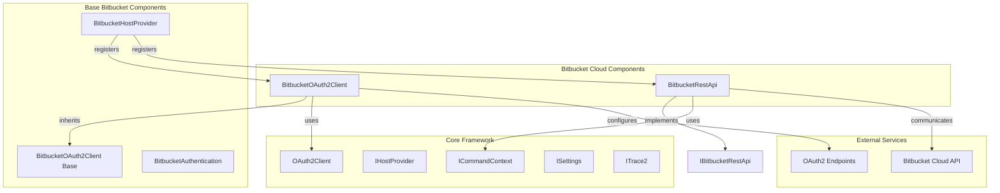
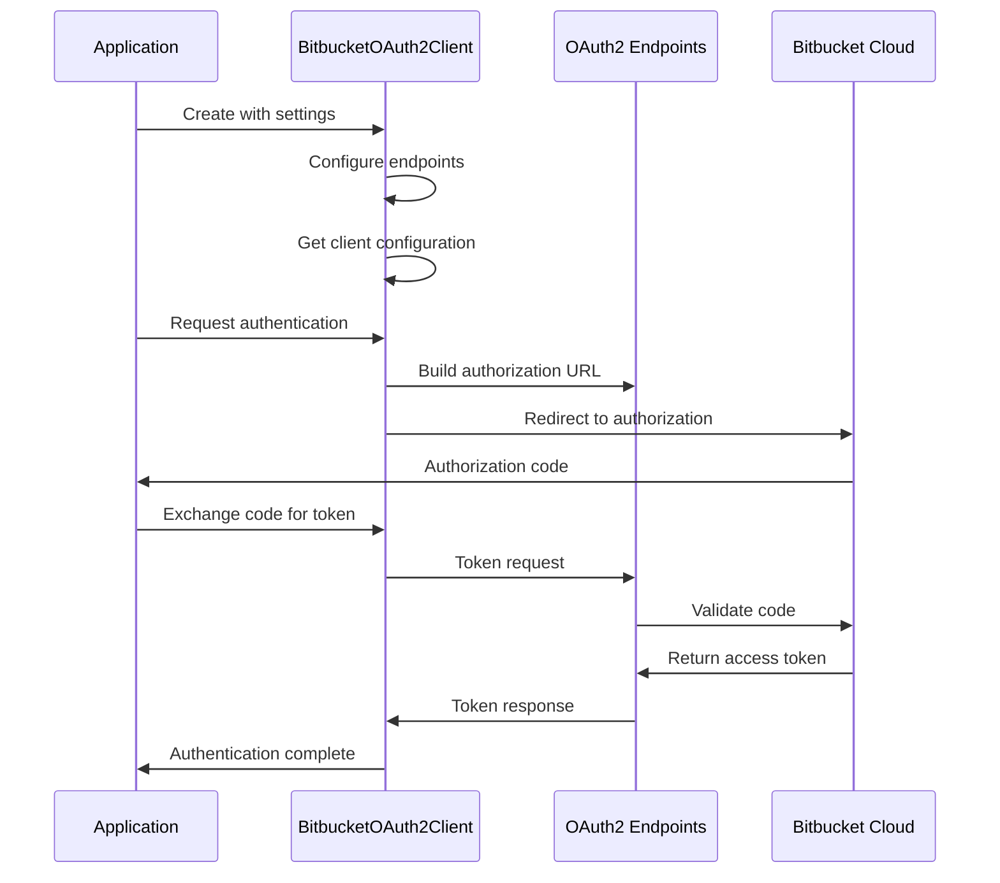
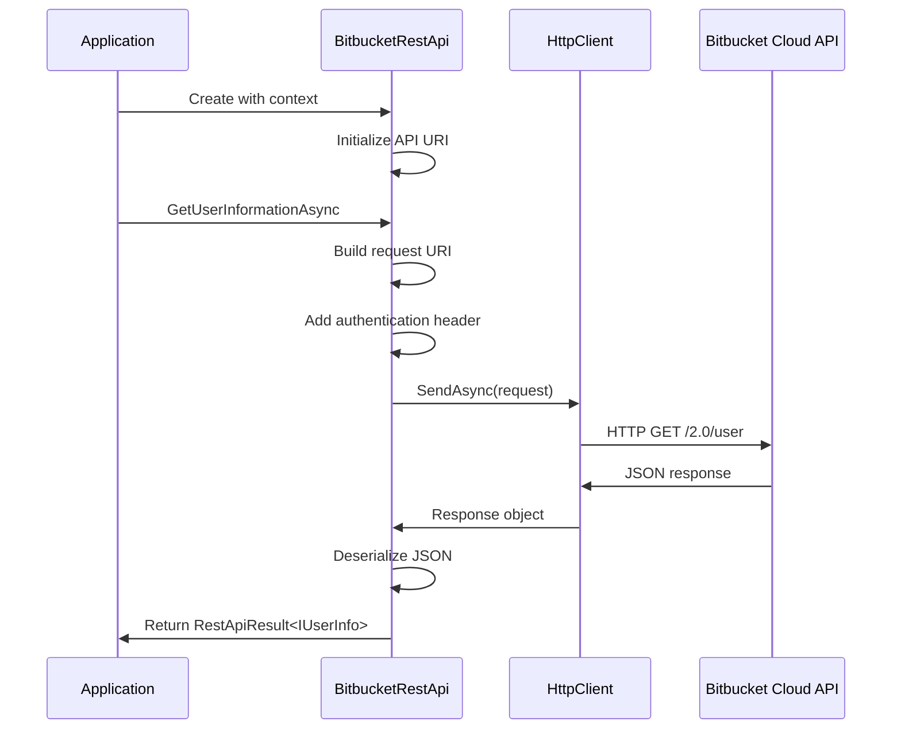
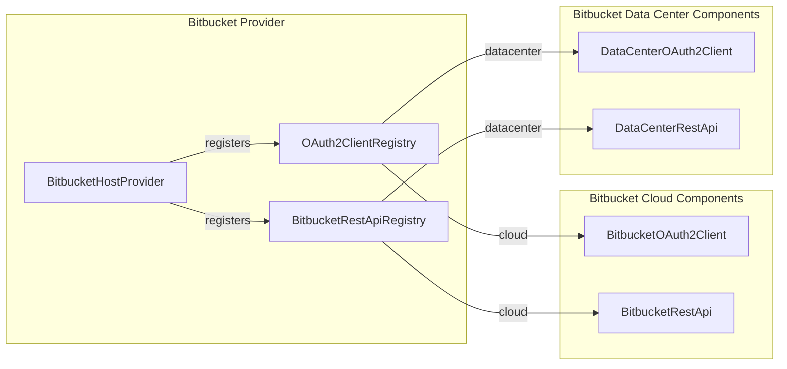

# Bitbucket Cloud Components Module

## Introduction

The Bitbucket Cloud Components module provides specialized OAuth2 authentication and REST API integration for Atlassian Bitbucket Cloud. This module extends the base Bitbucket provider functionality with cloud-specific implementations, enabling secure authentication and API communication with Bitbucket Cloud services.

## Module Architecture

### Core Components

The module consists of two primary components:

1. **BitbucketOAuth2Client** - Handles OAuth2 authentication flow for Bitbucket Cloud
2. **BitbucketRestApi** - Provides REST API communication with Bitbucket Cloud services

### Architecture Overview



## Component Details

### BitbucketOAuth2Client

The `BitbucketOAuth2Client` class extends the base `BitbucketOAuth2Client` and provides cloud-specific OAuth2 authentication functionality.

#### Key Features
- **Cloud-Specific Configuration**: Automatically configures OAuth2 endpoints for Bitbucket Cloud
- **Developer Override Support**: Allows customization of OAuth2 client ID, redirect URI, and client secret via settings
- **Scoped Authentication**: Requests specific OAuth2 scopes for repository and account access

#### OAuth2 Scopes
```csharp
RepositoryWrite - Repository write access
Account - Account information access
```

#### Configuration Sources
The client supports configuration through multiple sources (in priority order):
1. Environment variables (developer overrides)
2. Git configuration settings
3. Default cloud constants

#### OAuth2 Flow Implementation


### BitbucketRestApi

The `BitbucketRestApi` class implements the `IBitbucketRestApi` interface and provides REST API communication with Bitbucket Cloud.

#### Key Features
- **User Information Retrieval**: Fetches user details using both basic and bearer token authentication
- **Authentication Method Detection**: Determines available authentication methods through API response analysis
- **HTTP Client Management**: Manages HTTP client lifecycle and request/response handling

#### API Methods

##### GetUserInformationAsync
```csharp
// Supports both basic authentication and bearer token authentication
Task<RestApiResult<IUserInfo>> GetUserInformationAsync(string userName, string password, bool isBearerToken)
```

##### IsOAuthInstalledAsync
```csharp
// Always returns true for Bitbucket Cloud
Task<bool> IsOAuthInstalledAsync()
```

##### GetAuthenticationMethodsAsync
```csharp
// Returns empty list - methods determined via API response analysis
Task<List<AuthenticationMethod>> GetAuthenticationMethodsAsync()
```

#### REST API Communication Flow


## Integration with Bitbucket Provider

The Bitbucket Cloud Components integrate with the broader Bitbucket Provider through registries:



## Dependencies

### Direct Dependencies
- **GitCredentialManager.Core** - Core framework components
- **System.Net.Http** - HTTP client functionality
- **System.Text.Json** - JSON serialization

### Related Modules
- [Bitbucket Provider](Bitbucket Provider.md) - Base Bitbucket functionality
- [Authentication System](Authentication System.md) - OAuth2 authentication framework
- [Core Application Framework](Core Application Framework.md) - Core services and interfaces

## Configuration

### Environment Variables
```bash
# Developer overrides for OAuth2 configuration
GCM_BITBUCKET_CLOUD_OAUTH_CLIENT_ID     # Custom OAuth2 client ID
GCM_BITBUCKET_CLOUD_OAUTH_REDIRECT_URI  # Custom redirect URI
GCM_BITBUCKET_CLOUD_OAUTH_CLIENT_SECRET # Custom client secret
```

### Git Configuration
```ini
[credential "bitbucket.org"]
    oauthClientId = custom-client-id
    oauthRedirectUri = https://custom-redirect-uri
    oauthClientSecret = custom-client-secret
```

## Usage Examples

### OAuth2 Authentication
```csharp
// Create OAuth2 client with settings
var oauth2Client = new BitbucketOAuth2Client(httpClient, settings, trace2);

// Get authorization URL
var authUrl = oauth2Client.GetAuthorizationUrl();

// Exchange authorization code for token
var tokenResult = await oauth2Client.GetTokenByAuthorizationCodeAsync(authCode);
```

### REST API Usage
```csharp
// Create REST API client
var restApi = new BitbucketRestApi(commandContext);

// Get user information with bearer token
var userInfo = await restApi.GetUserInformationAsync(null, accessToken, true);

// Get user information with basic auth
var userInfo = await restApi.GetUserInformationAsync(username, password, false);
```

## Error Handling

The module implements comprehensive error handling:

- **HTTP Error Responses**: Properly handles non-success HTTP status codes
- **JSON Deserialization**: Gracefully handles malformed JSON responses
- **Authentication Failures**: Provides clear error messages for authentication issues
- **Network Errors**: Handles connection failures and timeouts

## Security Considerations

- **Token Storage**: Access tokens are stored securely via the credential store
- **HTTPS Enforcement**: All API communication uses HTTPS
- **Scope Limitation**: Requests minimal required OAuth2 scopes
- **Client Secret Protection**: Supports secure client secret configuration

## Testing and Diagnostics

The module integrates with the diagnostic framework to provide:

- **API Request Tracing**: Logs all HTTP requests and responses
- **Authentication Flow Tracing**: Tracks OAuth2 authentication steps
- **Error Diagnostics**: Provides detailed error information for troubleshooting

For diagnostic information, see [Diagnostics](Diagnostics.md) module documentation.