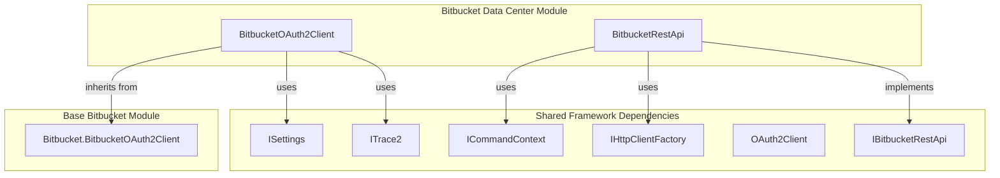
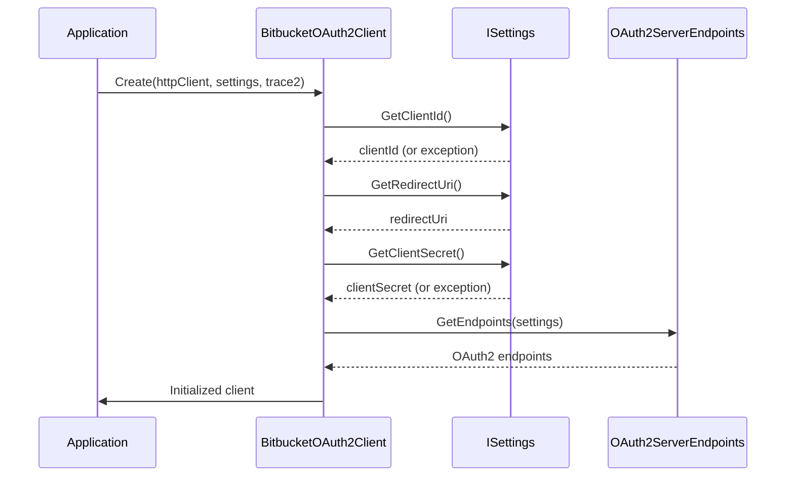
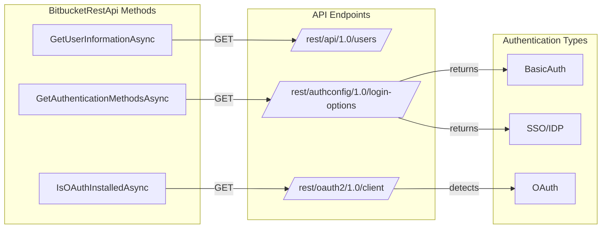
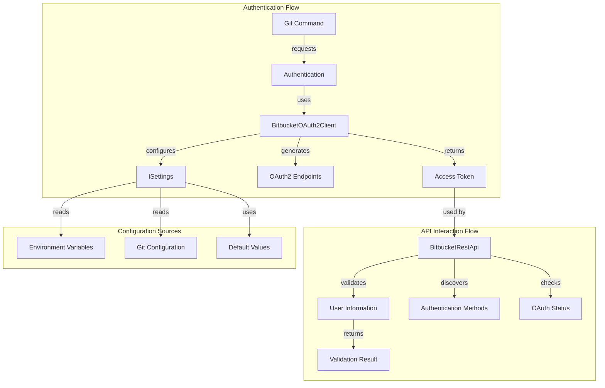
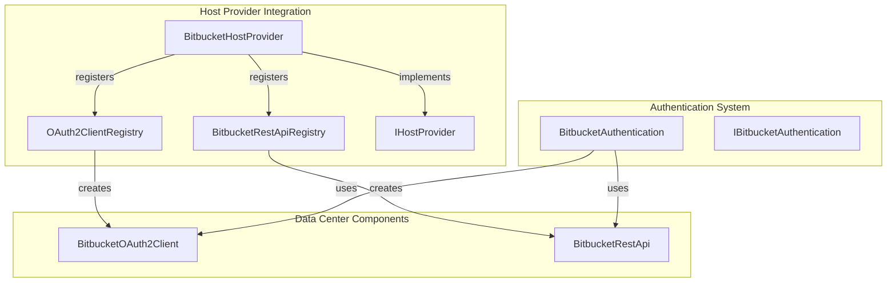

# Bitbucket Data Center Components

## Introduction

The Bitbucket Data Center Components module provides specialized authentication and API integration capabilities for Bitbucket Data Center (formerly Bitbucket Server) instances. This module extends the core Bitbucket provider functionality to support enterprise-grade Bitbucket deployments with OAuth2 authentication, REST API interactions, and Data Center-specific configurations.

## Architecture Overview

The Bitbucket Data Center module is built on top of the shared authentication and host provider frameworks, implementing specialized components for Data Center environments while maintaining compatibility with the broader Git Credential Manager ecosystem.

## Core Components

### BitbucketOAuth2Client

The `BitbucketOAuth2Client` class provides OAuth2 authentication capabilities specifically tailored for Bitbucket Data Center instances. It extends the base `BitbucketOAuth2Client` from the parent Bitbucket module and configures Data Center-specific OAuth2 parameters.

**Key Features:**
- Configurable OAuth2 client credentials via settings
- Data Center-specific OAuth2 scopes (public repos, repo read/write)
- Dynamic endpoint URL generation based on remote URI
- Support for developer overrides via environment variables

**Configuration Requirements:**
- OAuth Client ID (required)
- OAuth Client Secret (required)
- Redirect URI (optional, defaults to standard URI)

### BitbucketRestApi

The `BitbucketRestApi` class implements the `IBitbucketRestApi` interface and provides REST API functionality for Bitbucket Data Center instances. It handles user information retrieval, OAuth installation detection, and authentication method discovery.

**Key Features:**
- User information validation with configurable bypass
- OAuth installation detection
- Authentication method discovery (Basic Auth, SSO)
- Bearer token and Basic authentication support
- REST API endpoint management

**API Endpoints:**
- `/rest/api/1.0/users` - User information (validation only)
- `/rest/oauth2/1.0/client` - OAuth installation check
- `/rest/authconfig/1.0/login-options` - Authentication methods

## Data Flow Architecture

## Integration with Host Provider Framework

The Bitbucket Data Center components integrate with the broader host provider framework through registries and shared interfaces:

## Configuration and Settings

The module supports extensive configuration through environment variables and Git configuration settings:

### Environment Variables
- `GCM_BITBUCKET_DC_OAUTH_CLIENTID` - OAuth client ID
- `GCM_BITBUCKET_DC_OAUTH_CLIENTSECRET` - OAuth client secret  
- `GCM_BITBUCKET_DC_OAUTH_REDIRECTURI` - OAuth redirect URI
- `GCM_BITBUCKET_VALIDATESTOREDCREDENTIALS` - Credential validation toggle

### Git Configuration
- `credential.bitbucketDataCenterOAuthClientId` - OAuth client ID
- `credential.bitbucketDataCenterOAuthClientSecret` - OAuth client secret
- `credential.bitbucketDataCenterOAuthRedirectUri` - OAuth redirect URI
- `credential.bitbucketValidateStoredCredentials` - Credential validation toggle

## Security Considerations

1. **Credential Storage**: OAuth client secrets should be properly secured and not hardcoded
2. **Token Validation**: User information validation can be bypassed for performance reasons
3. **Endpoint Security**: All API calls use HTTPS with proper authentication headers
4. **Scope Management**: OAuth scopes are limited to repository access (read/write)

## Error Handling

The module implements comprehensive error handling:
- Missing configuration throws `ArgumentException` with descriptive messages
- HTTP errors are logged with status codes and response details
- OAuth endpoint detection handles unauthorized responses gracefully
- JSON deserialization includes error handling for malformed responses

## Dependencies

This module depends on several shared components:

- **[Core Application Framework](Core Application Framework.md)**: Provides `ISettings`, `ICommandContext`, and base authentication classes
- **[Authentication System](Authentication System.md)**: Supplies OAuth2 client infrastructure and token management
- **[Bitbucket Provider](Bitbucket Provider.md)**: Base Bitbucket functionality and shared constants
- **[Utilities](Utilities.md)**: HTTP client factory and other utility services

## Usage Patterns

### Typical Authentication Flow
1. Application requests authentication for Bitbucket Data Center remote
2. `BitbucketHostProvider` creates `BitbucketOAuth2Client` via registry
3. OAuth2 client obtains access token using Data Center endpoints
4. `BitbucketRestApi` validates token and retrieves user information
5. Credentials are stored and returned to Git

### API Discovery Pattern
1. Check if OAuth is installed via `IsOAuthInstalledAsync`
2. Discover available authentication methods via `GetAuthenticationMethodsAsync`
3. Select appropriate authentication method based on availability
4. Proceed with chosen authentication flow

This modular design allows the Bitbucket Data Center provider to seamlessly integrate with Git Credential Manager while providing specialized functionality for enterprise Bitbucket deployments.