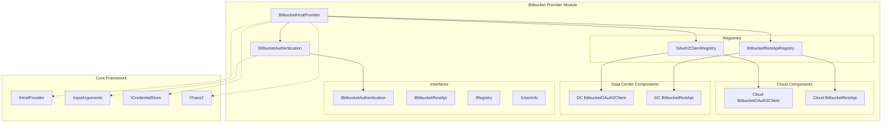
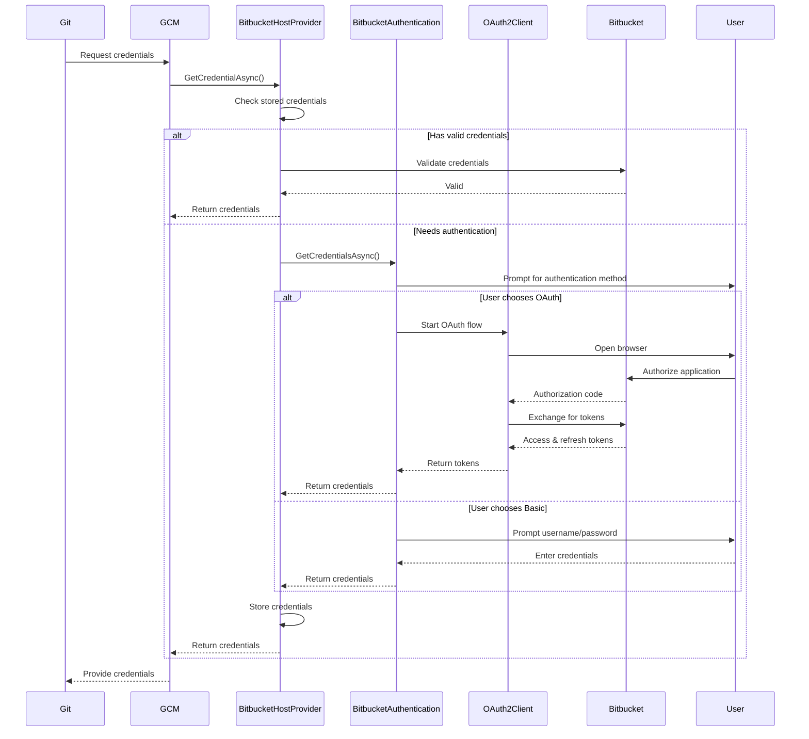

# Bitbucket Provider Module

## Overview

The Bitbucket Provider module is a comprehensive Git credential management system specifically designed for Atlassian Bitbucket hosting services. It provides seamless authentication and credential management for both Bitbucket Cloud (bitbucket.org) and Bitbucket Data Center/Server instances, supporting multiple authentication methods including OAuth 2.0 and Basic Authentication.

## Purpose

This module serves as the primary interface between Git Credential Manager and Bitbucket repositories, handling:

- **Credential Storage and Retrieval**: Securely stores and retrieves user credentials
- **Authentication Flow Management**: Orchestrates OAuth 2.0 and Basic Authentication flows
- **Multi-Platform Support**: Works with both Bitbucket Cloud and Data Center deployments
- **User Experience**: Provides both GUI and command-line authentication interfaces
- **Security**: Implements secure credential validation and refresh mechanisms

## Architecture

## Core Components

### 1. BitbucketHostProvider
The main entry point that implements `IHostProvider` interface. It orchestrates the entire credential management process, including:
- Host support detection for both Cloud and Data Center instances
- Credential validation and refresh workflows
- Authentication mode determination
- Integration with Git Credential Manager's core framework

### 2. BitbucketAuthentication
Manages the authentication process with support for:
- Multiple authentication modes (Basic, OAuth)
- GUI and terminal-based user prompts
- OAuth 2.0 token acquisition and refresh
- Platform-specific authentication flows

### 3. Cloud vs Data Center Components
The module provides separate implementations for Bitbucket Cloud and Data Center to handle their distinct APIs and authentication requirements:

- **Cloud Components**: Optimized for bitbucket.org with predefined OAuth settings
- **Data Center Components**: Configurable for on-premises deployments with dynamic endpoint resolution

### 4. Registry Pattern
Implements a registry pattern to dynamically select appropriate client implementations based on the target Bitbucket instance:
- `OAuth2ClientRegistry`: Manages OAuth2 client selection
- `BitbucketRestApiRegistry`: Handles REST API client selection

## Authentication Flows

## Key Features

### Multi-Platform Support
- **Bitbucket Cloud**: Native support for bitbucket.org with optimized OAuth flows
- **Bitbucket Data Center**: Full support for on-premises deployments with configurable settings

### Flexible Authentication
- **OAuth 2.0**: Recommended for enhanced security with token refresh capabilities
- **Basic Authentication**: Traditional username/password authentication
- **Personal Access Tokens**: Supported through basic authentication mechanism

### User Experience
- **GUI Prompts**: Modern Avalonia-based user interface when available
- **Terminal Prompts**: Command-line interface for headless environments
- **Helper Applications**: Support for external authentication helpers

### Security Features
- **Credential Validation**: Validates stored credentials before use
- **Token Refresh**: Automatic OAuth token refresh using refresh tokens
- **Secure Storage**: Integration with platform-specific credential stores
- **HTTPS Enforcement**: Warns against using unencrypted HTTP connections

## Integration Points

The Bitbucket Provider integrates with several core systems:

- **[Authentication System](Authentication System.md)**: Leverages OAuth 2.0 and Basic Authentication frameworks
- **[Host Provider Framework](Host Provider Framework.md)**: Implements standard host provider interface
- **[Credential Management](Credential Management.md)**: Uses credential store for secure storage
- **[UI Framework](UI Framework.md)**: Provides authentication user interfaces

## Configuration

The module supports extensive configuration through:
- Environment variables for OAuth client settings
- Git configuration options for authentication preferences
- Runtime settings for authentication mode overrides

## Error Handling

Comprehensive error handling includes:
- Network failure recovery
- Authentication failure management
- User cancellation handling
- Detailed tracing and diagnostics

## Sub-modules

The Bitbucket Provider module consists of several specialized sub-modules:

1. **[Bitbucket Authentication](Bitbucket Authentication.md)**: Detailed authentication management including OAuth 2.0 flows, user prompts, and credential acquisition
2. **[Bitbucket Cloud Components](Bitbucket Cloud Components.md)**: Cloud-specific implementations for bitbucket.org with predefined OAuth settings and REST API integration
3. **[Bitbucket Data Center Components](Bitbucket Data Center Components.md)**: Data Center-specific implementations for on-premises deployments with configurable endpoints and authentication methods
4. **[Bitbucket Registries](Bitbucket Registries.md)**: Registry pattern implementations for dynamic client selection and resource management

Each sub-module is documented in detail with its own architecture diagrams, component descriptions, and implementation details. These sub-modules work together to provide a comprehensive Bitbucket integration that adapts to different deployment scenarios while maintaining a consistent interface.