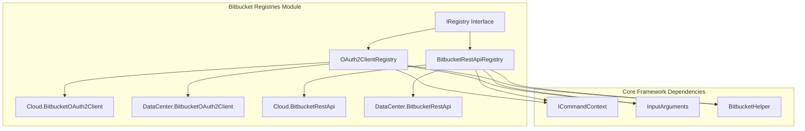
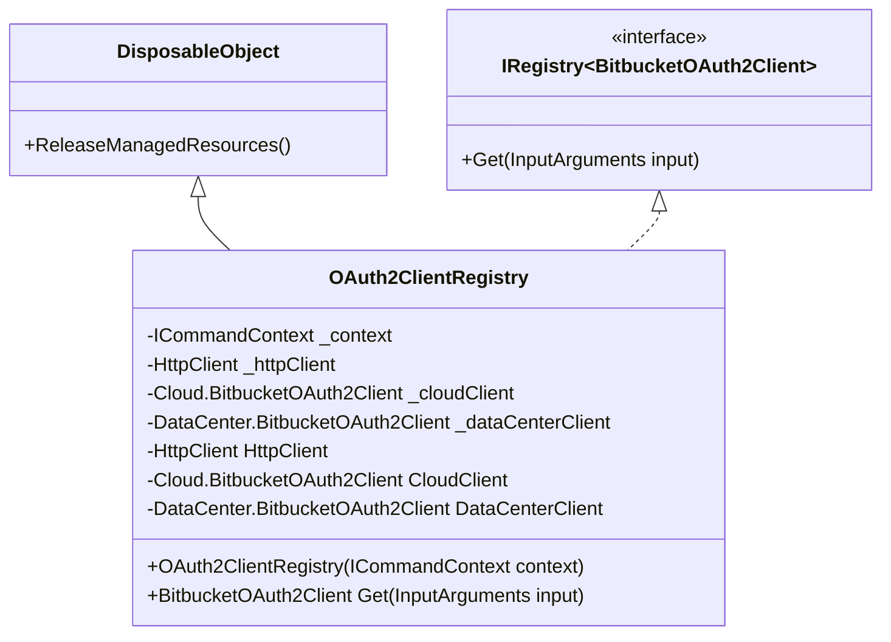
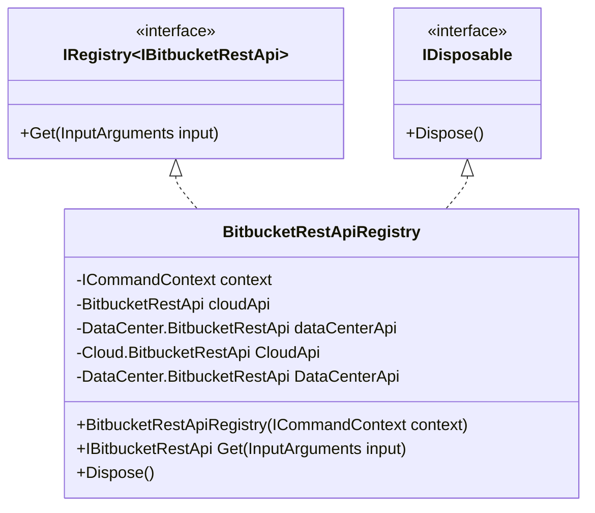
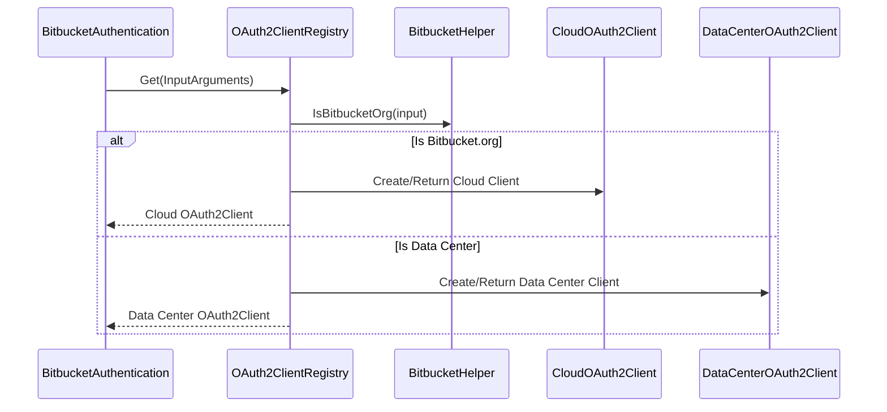
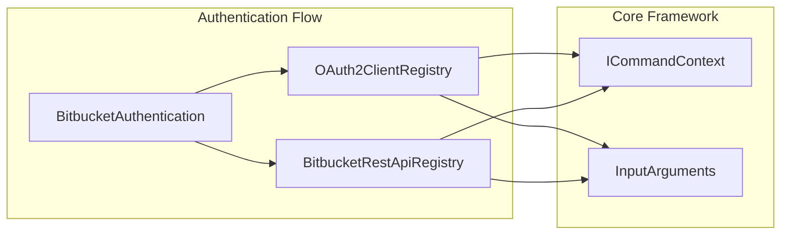

# Bitbucket Registries Module

## Introduction

The Bitbucket Registries module provides a centralized registry system for managing Bitbucket-specific components, enabling seamless integration with both Bitbucket Cloud and Bitbucket Data Center deployments. This module implements a factory pattern to dynamically instantiate appropriate OAuth2 clients and REST API clients based on the target Bitbucket instance type.

The registries serve as the core abstraction layer that allows the Git Credential Manager to interact with different Bitbucket deployment models (cloud vs. on-premises) through a unified interface, automatically selecting the correct implementation based on the target URI.

## Architecture Overview

The Bitbucket Registries module implements a dual-registry pattern with two primary registries:

1. **OAuth2ClientRegistry** - Manages OAuth2 client instances for authentication
2. **BitbucketRestApiRegistry** - Manages REST API client instances for API interactions

Both registries implement the generic `IRegistry<T>` interface, providing a consistent pattern for component resolution based on input arguments.



## Core Components

### IRegistry<T> Interface

The foundation interface that defines the contract for all registries in the Bitbucket module:

```csharp
public interface IRegistry<T> : IDisposable
{
    T Get(InputArguments input);
}
```

**Key Responsibilities:**
- Provides a generic factory method for component resolution
- Ensures proper resource cleanup through IDisposable
- Accepts InputArguments to determine the appropriate component type

### OAuth2ClientRegistry

Manages OAuth2 client instances for Bitbucket authentication, automatically selecting between Cloud and Data Center implementations.



**Key Features:**
- **Lazy Initialization**: Clients are created only when first requested
- **Resource Management**: Properly manages HttpClient lifecycle
- **Deployment Detection**: Uses `BitbucketHelper.IsBitbucketOrg()` to determine the target type
- **Thread Safety**: Client instances are cached after creation

### BitbucketRestApiRegistry

Manages REST API client instances for Bitbucket API interactions, providing unified access to both Cloud and Data Center APIs.



**Key Features:**
- **Unified Interface**: Returns `IBitbucketRestApi` for consistent API access
- **Resource Cleanup**: Implements proper disposal of API clients
- **Context Management**: Maintains command context for dependency injection

## Data Flow and Component Interaction



## Integration with Authentication System

The registries are primarily consumed by the [Bitbucket Authentication](Bitbucket%20Authentication.md) module, which uses them to obtain appropriate clients for OAuth2 operations:



## Deployment Detection Logic

Both registries rely on the `BitbucketHelper.IsBitbucketOrg()` method to determine whether the target is Bitbucket Cloud or Data Center. This decision affects:

1. **OAuth2 Client Selection**: Different OAuth2 implementations for cloud vs. data center
2. **API Endpoint Configuration**: Different REST API endpoints and authentication mechanisms
3. **Token Management**: Different token storage and refresh strategies

## Resource Management

The registries implement proper resource management patterns:

- **HttpClient Lifecycle**: Shared HttpClient instance managed by the registry
- **Client Caching**: Created clients are cached to avoid repeated instantiation
- **Disposal Pattern**: Proper cleanup of managed resources when registries are disposed

## Error Handling and Resilience

The registries incorporate several resilience patterns:

- **Null Checks**: Input validation using `EnsureArgument.NotNull()`
- **Lazy Initialization**: Clients created only when needed, reducing startup overhead
- **Resource Protection**: Proper exception handling during client creation

## Dependencies

### Core Framework Dependencies
- **[Core Application Framework](Core%20Application%20Framework.md)**: Provides `ICommandContext`, `InputArguments`, and `DisposableObject`
- **[Authentication System](Authentication%20System.md)**: Supplies OAuth2 client implementations
- **[Bitbucket Provider](Bitbucket%20Provider.md)**: Contains deployment-specific implementations

### External Dependencies
- **System.Net.Http**: For HTTP client management
- **GitCredentialManager**: Core namespace for shared types

## Usage Patterns

### Typical Usage in Authentication

```csharp
// Registry instantiation
var oauth2Registry = new OAuth2ClientRegistry(context);

// Client resolution
var oauth2Client = oauth2Registry.Get(inputArguments);

// Usage in OAuth flow
var tokenResult = await oauth2Client.GetTokenByAuthorizationCodeAsync(authCode, cancellationToken);
```

### Registry Lifecycle Management

```csharp
// Registry is typically long-lived
using (var registry = new OAuth2ClientRegistry(context))
{
    // Multiple client requests
    var client1 = registry.Get(input1);
    var client2 = registry.Get(input2);
    // Clients are cached and reused
}
```

## Extension Points

The registry pattern allows for future extensibility:

1. **New Deployment Types**: Support for additional Bitbucket deployment models
2. **Custom Client Implementations**: Plugin architecture for specialized OAuth2 clients
3. **Enhanced Detection Logic**: More sophisticated deployment detection algorithms

## Performance Considerations

- **Client Caching**: Eliminates repeated client instantiation overhead
- **Lazy Initialization**: Reduces memory footprint for unused clients
- **Shared HttpClient**: Minimizes socket and connection pool usage
- **Thread Safety**: Safe for concurrent access in multi-threaded scenarios

## Security Considerations

- **Resource Isolation**: Separate clients for different deployment types prevent cross-contamination
- **Proper Disposal**: Ensures sensitive resources (HTTP connections, tokens) are properly cleaned up
- **Input Validation**: Validates input arguments to prevent injection attacks

This registry architecture provides a robust foundation for Bitbucket integration, enabling the Git Credential Manager to seamlessly support both cloud and on-premises Bitbucket deployments through a unified interface.