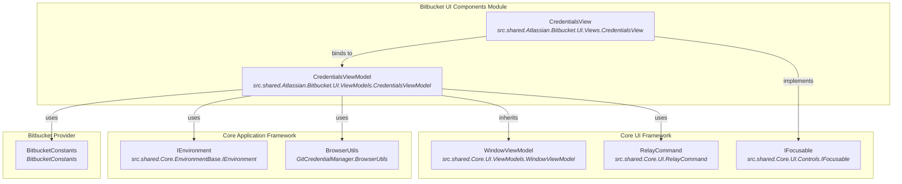
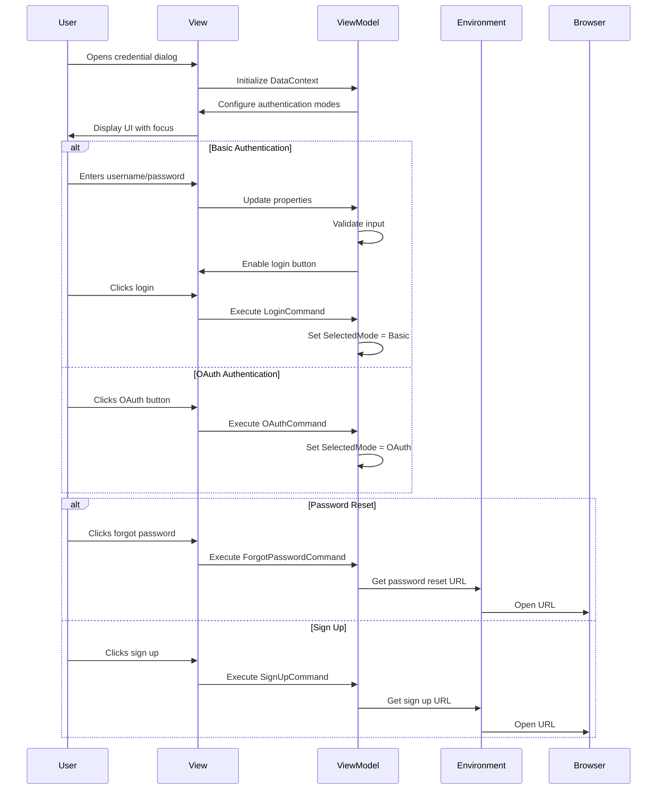

# Bitbucket UI Components Module

## Introduction

The Bitbucket UI Components module provides the user interface layer for Bitbucket authentication within the Git Credential Manager ecosystem. This module implements platform-specific UI components that facilitate secure credential collection and authentication flows for Bitbucket Cloud and Bitbucket Data Center instances.

The module follows the MVVM (Model-View-ViewModel) pattern and integrates with the broader authentication framework to provide a consistent user experience across different Git hosting platforms.

## Architecture Overview

## Component Details

### CredentialsViewModel

The `CredentialsViewModel` class serves as the primary ViewModel for Bitbucket credential collection, inheriting from the base `WindowViewModel` and implementing the MVVM pattern.

#### Key Responsibilities:
- **Authentication Mode Management**: Controls visibility and behavior for both OAuth and Basic authentication modes
- **Credential Collection**: Manages username and password input validation
- **Navigation Commands**: Provides commands for password reset, sign-up, and authentication flows
- **Environment Integration**: Utilizes the environment abstraction for browser operations

#### Properties:
- `Url`: Target Bitbucket instance URL
- `UserName`: Username input field
- `Password`: Password input field  
- `ShowOAuth`: Controls OAuth authentication visibility
- `ShowBasic`: Controls basic authentication visibility
- `SelectedMode`: Tracks the chosen authentication method

#### Commands:
- `LoginCommand`: Validates and accepts basic authentication credentials
- `OAuthCommand`: Initiates OAuth authentication flow
- `CancelCommand`: Cancels the authentication attempt
- `ForgotPasswordCommand`: Opens password reset URL in browser
- `SignUpCommand`: Opens sign-up URL in browser

### CredentialsView

The `CredentialsView` class implements the visual representation of the credential collection interface, providing platform-specific focus management and user interaction handling.

#### Key Features:
- **Platform-Aware Focus Management**: Implements workarounds for macOS-specific focus issues
- **Tab-Based Authentication**: Supports switching between OAuth and Basic authentication modes
- **Accessibility**: Implements `IFocusable` interface for proper keyboard navigation

#### Focus Behavior:
- Automatically focuses appropriate controls based on authentication mode
- Handles macOS-specific focus limitations
- Prioritizes empty fields for user convenience

## Data Flow

## Integration Points

### Dependencies

#### Core UI Framework
- **WindowViewModel**: Base class providing common ViewModel functionality
- **RelayCommand**: Command implementation for UI interactions
- **IFocusable**: Interface for focus management

#### Core Application Framework
- **IEnvironment**: Abstraction for environment-specific operations
- **BrowserUtils**: Utility for opening URLs in default browser

#### Bitbucket Provider
- **BitbucketConstants**: Contains URLs for password reset and sign-up flows

### Related Modules

- **[Core UI Framework](Core UI Framework.md)**: Provides base classes and common UI functionality
- **[Bitbucket Provider](Bitbucket Provider.md)**: Contains the main Bitbucket authentication logic and constants
- **[Core Application Framework](Core Application Framework.md)**: Supplies environment abstractions and utilities

## Usage Patterns

### Authentication Flow Integration

The Bitbucket UI Components integrate with the broader authentication system through the following pattern:

1. **Host Provider Detection**: The system identifies Bitbucket as the target host
2. **UI Component Selection**: Appropriate ViewModel and View are instantiated
3. **Credential Collection**: User interacts with the UI to provide credentials
4. **Authentication Mode Selection**: User chooses between OAuth or Basic authentication
5. **Result Processing**: Selected authentication mode and credentials are passed to the authentication layer

### Platform Considerations

The module handles platform-specific behaviors:
- **macOS**: Implements focus management workarounds for known Avalonia issues
- **Windows/Linux**: Standard focus behavior without special handling
- **Cross-platform**: Consistent UI appearance across all supported platforms

## Security Considerations

- **Credential Handling**: Passwords are handled in memory and cleared appropriately
- **URL Validation**: All external URLs are constructed using validated constants
- **Browser Integration**: External links open in the system default browser for security
- **Input Validation**: Basic validation prevents empty credential submission

## Extensibility

The module is designed for extensibility through:
- **Inheritance**: ViewModels can be extended to add custom behavior
- **Composition**: Additional authentication modes can be integrated
- **Theming**: Avalonia-based UI supports custom styling and theming
- **Localization**: UI strings can be localized for different regions

## Error Handling

The module implements basic error handling:
- **Input Validation**: Prevents submission of invalid credentials
- **Environment Errors**: Graceful handling of browser launch failures
- **Property Validation**: INotifyPropertyChanged implementation for UI updates

## Testing Considerations

- **Unit Testing**: ViewModels can be unit tested independently of Views
- **Mock Environment**: IEnvironment abstraction enables testing without system dependencies
- **UI Testing**: Avalonia framework supports automated UI testing
- **Cross-platform Testing**: Requires validation on Windows, macOS, and Linux platforms