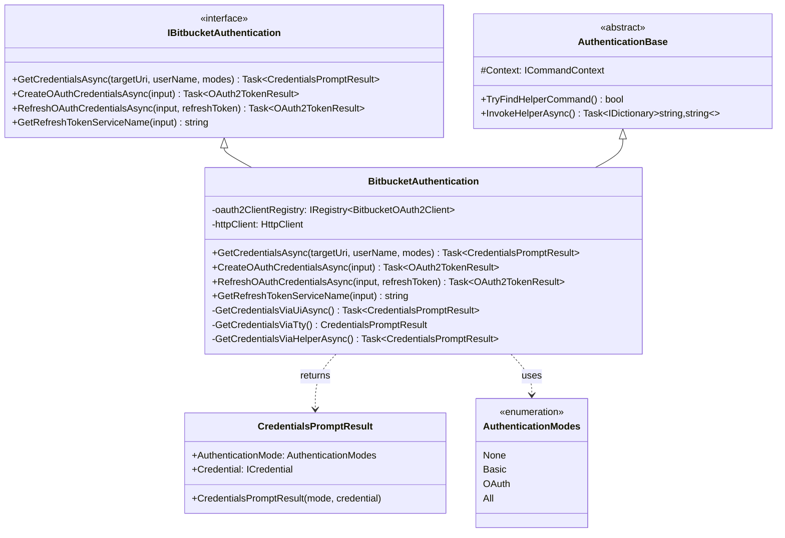
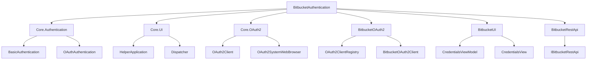
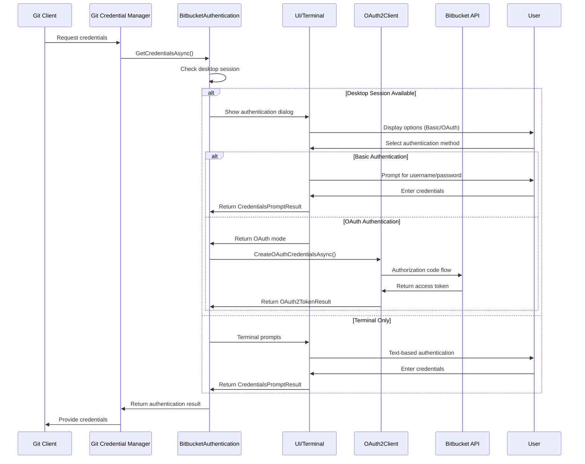
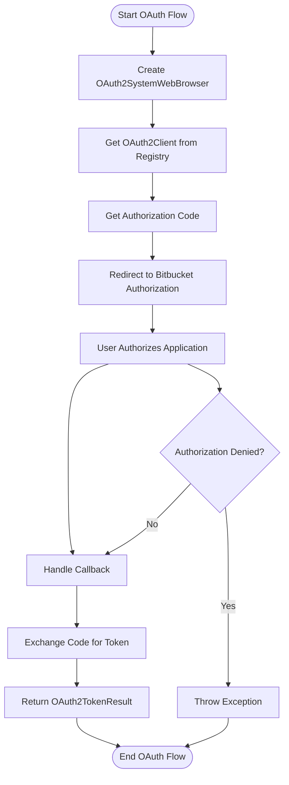
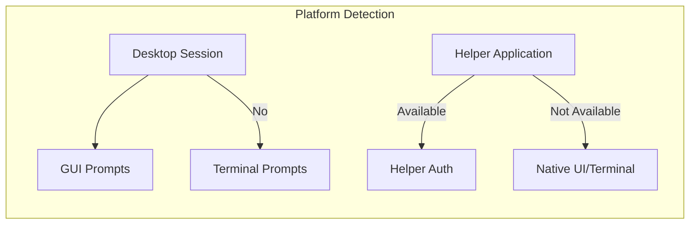

# BitbucketAuthentication Module Documentation

## Overview

The BitbucketAuthentication module provides comprehensive authentication capabilities for Bitbucket repositories, supporting both Basic Authentication (username/password) and OAuth 2.0 authentication flows. This module is part of the Git Credential Manager's extensible authentication framework and serves as the primary authentication provider for Bitbucket-hosted Git repositories.

## Purpose and Core Functionality

The module's primary responsibilities include:

- **Multi-Modal Authentication**: Supporting both Basic Authentication and OAuth 2.0 authentication methods
- **User Interaction Management**: Providing flexible credential collection through GUI, terminal, or helper applications
- **OAuth Flow Management**: Handling complete OAuth 2.0 authorization code flow with token refresh capabilities
- **Platform Integration**: Seamlessly integrating with the Git Credential Manager's authentication framework
- **Security**: Ensuring secure credential handling and storage through the credential management system

## Architecture

### Component Structure



### Module Dependencies



## Authentication Flows

### Primary Authentication Flow



### OAuth 2.0 Flow



## Key Components

### IBitbucketAuthentication Interface

The primary interface defining the contract for Bitbucket authentication operations:

- **GetCredentialsAsync**: Main entry point for credential acquisition with support for multiple authentication modes
- **CreateOAuthCredentialsAsync**: Initiates OAuth 2.0 authorization code flow
- **RefreshOAuthCredentialsAsync**: Refreshes expired OAuth tokens using refresh tokens
- **GetRefreshTokenServiceName**: Retrieves service name for refresh token storage

### BitbucketAuthentication Class

The concrete implementation providing:

- **Multi-Modal Support**: Handles both Basic and OAuth authentication methods
- **Flexible UI Options**: Supports GUI, terminal, and helper application interfaces
- **Session Detection**: Automatically adapts to desktop vs. terminal environments
- **OAuth Registry Integration**: Uses pluggable OAuth client registry for different Bitbucket environments

### CredentialsPromptResult Class

Simple data structure encapsulating authentication results:

- **AuthenticationMode**: Indicates which authentication method was selected/used
- **Credential**: Contains the actual credentials (for Basic auth) or null (for OAuth)

## Integration Points

### Core Framework Integration

The module integrates with several core frameworks:

- **Authentication Framework**: Inherits from `AuthenticationBase` providing common authentication functionality
- **UI Framework**: Uses Avalonia UI for desktop prompts and terminal interfaces for CLI environments
- **OAuth Framework**: Leverages the OAuth2Client infrastructure for OAuth flows
- **Credential Management**: Integrates with the credential store for secure credential persistence

### Platform-Specific Considerations



## Security Features

### Credential Protection

- **Secure Storage**: Credentials are stored using platform-specific secure storage mechanisms
- **Token Management**: OAuth tokens are managed with automatic refresh capabilities
- **Input Validation**: All user inputs are validated and sanitized
- **Trace Logging**: Comprehensive logging with sensitive data redaction

### Authentication Security

- **HTTPS Enforcement**: All OAuth flows use secure HTTPS connections
- **State Validation**: OAuth state parameter validation prevents CSRF attacks
- **Scope Limitation**: OAuth scopes are limited to minimum required permissions
- **Token Expiration**: Automatic handling of token expiration and refresh

## Error Handling

### Exception Types

- **ArgumentException**: Invalid authentication modes or parameters
- **Trace2Exception**: Helper application communication errors
- **InvalidOperationException**: User interaction disabled scenarios
- **HttpRequestException**: Network or API communication failures

### Recovery Mechanisms

- **Fallback Authentication**: Automatic fallback between authentication methods
- **Retry Logic**: Built-in retry mechanisms for transient failures
- **User Feedback**: Clear error messages and recovery instructions

## Configuration

### Environment Variables

- `BITBUCKET_AUTHENTICATION_HELPER`: Specifies custom authentication helper command
- `GCM_BITBUCKET_AUTHMODES`: Controls available authentication modes
- `GCM_GUI_PROMPT`: Enables/disables GUI prompts

### Git Configuration

- `credential.bitbucket.authHelper`: Git-level authentication helper configuration
- `credential.bitbucket.authModes`: Repository-level authentication mode settings

## Usage Examples

### Basic Usage

```csharp
// Create authentication instance
var bitbucketAuth = new BitbucketAuthentication(commandContext);

// Get credentials with both Basic and OAuth options
var result = await bitbucketAuth.GetCredentialsAsync(
    targetUri: new Uri("https://bitbucket.org"),
    userName: null,
    modes: AuthenticationModes.All
);

// Handle result
switch (result.AuthenticationMode)
{
    case AuthenticationModes.Basic:
        // Use result.Credential for Basic auth
        break;
    case AuthenticationModes.OAuth:
        // Initiate OAuth flow
        var token = await bitbucketAuth.CreateOAuthCredentialsAsync(input);
        break;
}
```

### OAuth Token Refresh

```csharp
// Refresh expired OAuth token
var newToken = await bitbucketAuth.RefreshOAuthCredentialsAsync(
    input: inputArguments,
    refreshToken: storedRefreshToken
);
```

## Related Documentation

- [Core.Authentication](Core.Authentication.md) - Core authentication framework
- [Core.OAuth2](Core.OAuth2.md) - OAuth 2.0 implementation details
- [BitbucketOAuth2](BitbucketOAuth2.md) - Bitbucket-specific OAuth client implementations
- [BitbucketUI](BitbucketUI.md) - User interface components for Bitbucket authentication
- [BitbucketRestApi](BitbucketRestApi.md) - Bitbucket REST API integration

## Performance Considerations

- **Lazy Initialization**: HTTP client and OAuth clients are created on-demand
- **Token Caching**: OAuth tokens are cached to avoid unnecessary refresh operations
- **Async Operations**: All network operations are asynchronous to prevent blocking
- **Resource Cleanup**: Proper disposal of HTTP clients and other resources

## Future Enhancements

- **Device Code Flow**: Support for OAuth device code flow in headless environments
- **Multi-Factor Authentication**: Enhanced support for MFA workflows
- **SSO Integration**: Integration with enterprise Single Sign-On solutions
- **Token Management**: Enhanced token lifecycle management and monitoring