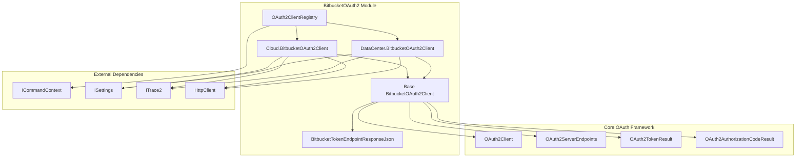
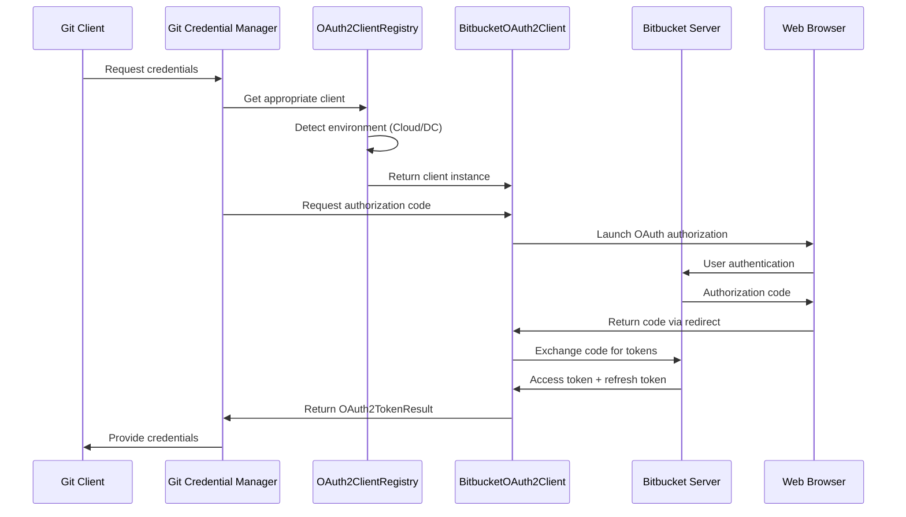
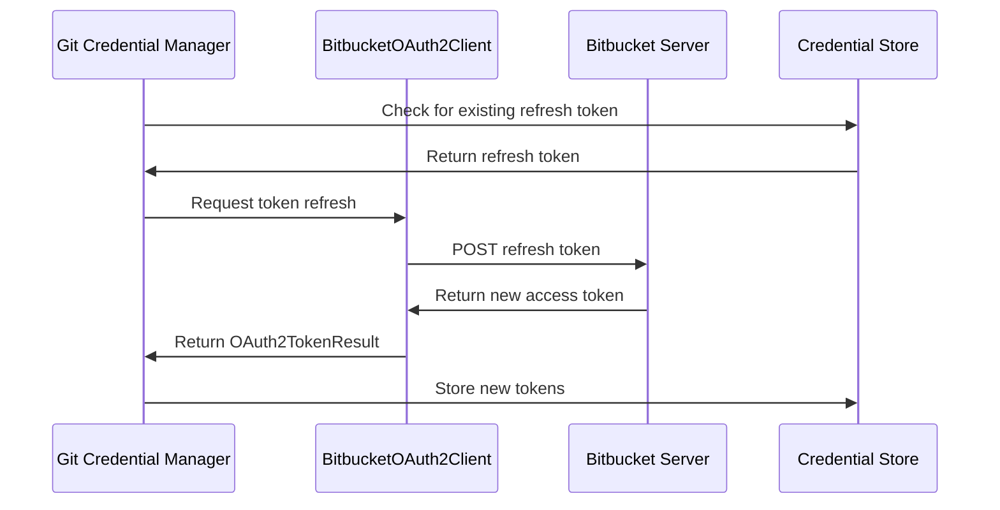

# BitbucketOAuth2 Module Documentation

## Overview

The BitbucketOAuth2 module provides OAuth 2.0 authentication capabilities for Bitbucket Cloud and Bitbucket Data Center (Server) environments within the Git Credential Manager. This module implements a dual-client architecture that automatically detects the target Bitbucket environment and uses the appropriate OAuth2 client configuration.

## Purpose and Core Functionality

The primary purpose of this module is to:
- Enable secure OAuth 2.0 authentication for Bitbucket repositories
- Support both Bitbucket Cloud (bitbucket.org) and self-hosted Bitbucket Data Center instances
- Handle OAuth token acquisition, refresh, and management
- Provide seamless integration with the Git Credential Manager's authentication framework

## Architecture

### Component Structure



### Key Components

#### 1. OAuth2ClientRegistry
The central registry that manages OAuth2 client instances and determines which client to use based on the target Bitbucket environment.

**Key Responsibilities:**
- Detect Bitbucket environment (Cloud vs Data Center)
- Manage client lifecycle and HTTP resources
- Provide thread-safe client access

#### 2. BitbucketOAuth2Client (Base)
Abstract base class that extends the core OAuth2Client with Bitbucket-specific functionality.

**Key Features:**
- Custom token endpoint response parsing
- Refresh token service name generation
- Scope management

#### 3. Cloud.BitbucketOAuth2Client
Concrete implementation for Bitbucket Cloud (bitbucket.org).

**Configuration:**
- Uses predefined OAuth2 endpoints
- Supports developer overrides via environment variables
- Fixed client credentials for GCM

#### 4. DataCenter.BitbucketOAuth2Client
Concrete implementation for Bitbucket Data Center/Server instances.

**Configuration:**
- Dynamic endpoint generation based on server URL
- Requires explicit client configuration
- Supports custom OAuth2 endpoints

#### 5. BitbucketTokenEndpointResponseJson
Custom JSON deserializer for Bitbucket's non-standard OAuth2 token responses.

**Purpose:**
- Handles Bitbucket's use of "scopes" instead of standard "scope"
- Ensures proper token response parsing regardless of property order

## Data Flow

### Authentication Flow



### Token Refresh Flow



## Configuration

### Environment Variables

#### Bitbucket Cloud
- `GCM_BITBUCKET_CLOUD_CLIENTID`: Override default client ID
- `GCM_BITBUCKET_CLOUD_CLIENTSECRET`: Override default client secret
- `GCM_BITBUCKET_CLOUD_OAUTH_REDIRECTURI`: Override default redirect URI

#### Bitbucket Data Center
- `GCM_BITBUCKET_DATACENTER_CLIENTID`: **Required** - Client ID for Data Center
- `GCM_BITBUCKET_DATACENTER_CLIENTSECRET`: **Required** - Client secret for Data Center
- `GCM_BITBUCKET_DATACENTER_OAUTH_REDIRECTURI`: Override default redirect URI

### Git Configuration

#### Bitbucket Cloud
```ini
[credential]
    cloudOAuthClientId = <custom-client-id>
    cloudOAuthClientSecret = <custom-client-secret>
    cloudOauthRedirectUri = <custom-redirect-uri>
```

#### Bitbucket Data Center
```ini
[credential]
    bitbucketDataCenterOAuthClientId = <required-client-id>
    bitbucketDataCenterOAuthClientSecret = <required-client-secret>
    bitbucketDataCenterOauthRedirectUri = <custom-redirect-uri>
```

## OAuth Scopes

### Bitbucket Cloud
- `repository:write` - Full repository access
- `account` - Account information access

### Bitbucket Data Center
- `PUBLIC_REPOS` - Access to public repositories
- `REPO_READ` - Read access to repositories
- `REPO_WRITE` - Write access to repositories

## Integration Points

### Dependencies
- **[OAuth2](OAuth2.md)**: Core OAuth2 authentication framework
- **[BitbucketProvider](BitbucketProvider.md)**: Parent module providing Bitbucket-specific functionality
- **[Core.Authentication.OAuth](Core.Authentication.OAuth.md)**: Base OAuth2 implementation

### Related Components
- **[BitbucketAuthentication](BitbucketAuthentication.md)**: Authentication orchestration
- **[BitbucketRestApi](BitbucketRestApi.md)**: REST API integration
- **[BitbucketUI](BitbucketUI.md)**: User interface components

## Error Handling

The module implements comprehensive error handling for:
- Missing required configuration (Data Center)
- Invalid OAuth2 endpoints
- Token parsing failures
- Network connectivity issues
- Authentication cancellations

## Security Considerations

1. **Client Secret Management**: Data Center requires explicit client secret configuration
2. **Token Storage**: Refresh tokens are stored securely in the credential store
3. **Scope Validation**: Ensures appropriate permissions are requested
4. **HTTPS Enforcement**: All OAuth2 communications use secure protocols
5. **Redirect URI Validation**: Prevents redirect URI manipulation

## Platform Support

This module supports all platforms where Git Credential Manager is available:
- Windows
- macOS  
- Linux

The OAuth2 implementation uses the system web browser for user authentication, ensuring consistent behavior across platforms.