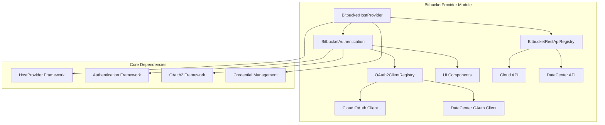
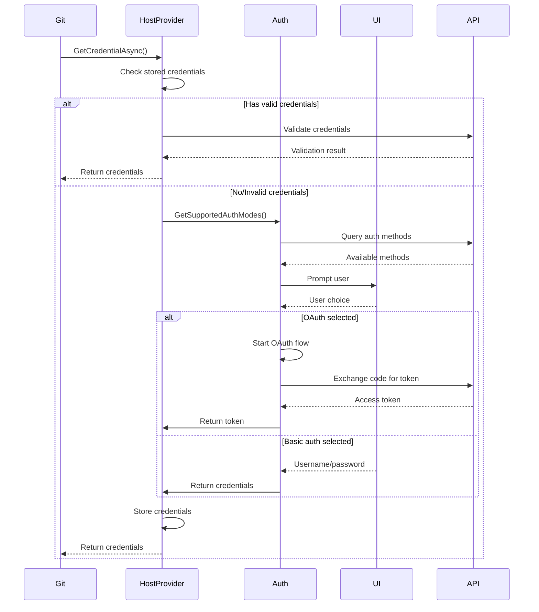

# BitbucketProvider Module Documentation

## Overview

The BitbucketProvider module is a Git Credential Manager component that provides authentication services for Bitbucket repositories. It supports both Bitbucket Cloud (bitbucket.org) and Bitbucket Data Center/Server instances, offering multiple authentication methods including Basic Authentication and OAuth2.

## Purpose

This module serves as the primary interface between Git operations and Bitbucket authentication systems, handling:
- Credential storage and retrieval
- OAuth2 token management
- User authentication prompts
- REST API interactions with Bitbucket services
- Support for both cloud and on-premises Bitbucket instances

## Architecture

## Key Components

### 1. BitbucketHostProvider
The main entry point that implements `IHostProvider` interface. It orchestrates the authentication flow and determines which authentication methods to use based on the target Bitbucket instance.

**Key Responsibilities:**
- Detects if a URI is supported (Bitbucket Cloud or Data Center)
- Manages credential storage and retrieval
- Handles OAuth token refresh flows
- Validates stored credentials

### 2. BitbucketAuthentication
Handles user authentication interactions and OAuth flows.

**Key Responsibilities:**
- Prompts users for credentials via UI or terminal
- Manages OAuth2 authorization code flow
- Handles token refresh operations
- Supports both GUI and TTY authentication modes

### 3. REST API Components
Provides communication with Bitbucket REST APIs for both Cloud and Data Center instances.

**Key Responsibilities:**
- User information retrieval
- Authentication method detection
- OAuth installation verification
- REST API result handling

### 4. OAuth2 Client Management
Manages OAuth2 clients for different Bitbucket environments.

**Key Responsibilities:**
- Client registration and configuration
- Token endpoint communication
- Scope management
- Authorization flow orchestration

## Authentication Flow

## Sub-modules

### [Authentication](BitbucketAuthentication.md)
Handles user authentication interactions, credential prompts, and OAuth flows. This sub-module manages the core authentication logic, including support for both Basic Authentication and OAuth2, with intelligent fallback mechanisms and user interaction handling.

### [REST API Integration](BitbucketRestApi.md)
Provides communication with Bitbucket REST APIs for user information and authentication method detection. Includes specialized implementations for both Bitbucket Cloud and Data Center environments, with automatic environment detection and appropriate API endpoint usage.

### [OAuth2 Management](BitbucketOAuth2.md)
Manages OAuth2 clients, token flows, and authorization for both Cloud and Data Center environments. Features separate client configurations for different Bitbucket deployments, with proper scope management and token lifecycle handling.

### [UI Components](BitbucketUI.md)
Provides user interface components for credential collection and authentication method selection. Includes Avalonia-based UI controls with platform-specific focus management and accessibility features.

## Configuration

The module supports various configuration options through environment variables and Git configuration:

- `GCM_BITBUCKET_ALWAYS_REFRESH_CREDENTIALS`: Force credential refresh
- `GCM_BITBUCKET_AUTH_MODES`: Override supported authentication modes
- `GCM_BITBUCKET_VALIDATE_STORED_CREDENTIALS`: Control credential validation
- OAuth client settings for Data Center instances

## Dependencies

This module relies on several core frameworks:

- **[HostProvider Framework](HostProviderFramework.md)**: Base provider infrastructure
- **[Authentication Framework](Authentication.md)**: Core authentication interfaces
- **[OAuth2 Framework](OAuth2.md)**: OAuth2 implementation
- **[Credential Management](CredentialManagement.md)**: Credential storage and retrieval
- **[UI Framework](UI.md)**: User interface components

## Platform Support

The BitbucketProvider supports multiple platforms with appropriate authentication methods:

- **Windows**: Full GUI and terminal support
- **macOS**: Full GUI and terminal support  
- **Linux**: Terminal support (GUI requires desktop session)

## Security Considerations

- Credentials are stored securely using platform-specific credential stores
- OAuth tokens are managed with automatic refresh capabilities
- HTTP communication is discouraged for bitbucket.org
- Token scopes are limited to minimum required permissions
- Refresh tokens are stored separately from access tokens

## Error Handling

The module implements comprehensive error handling:
- Network connectivity issues
- Invalid credentials
- OAuth flow failures
- API unavailability
- Configuration errors

All errors are logged with appropriate trace levels and user-friendly messages where applicable.