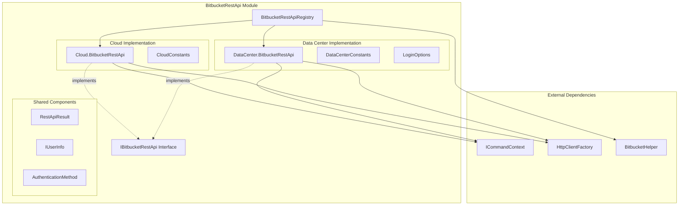
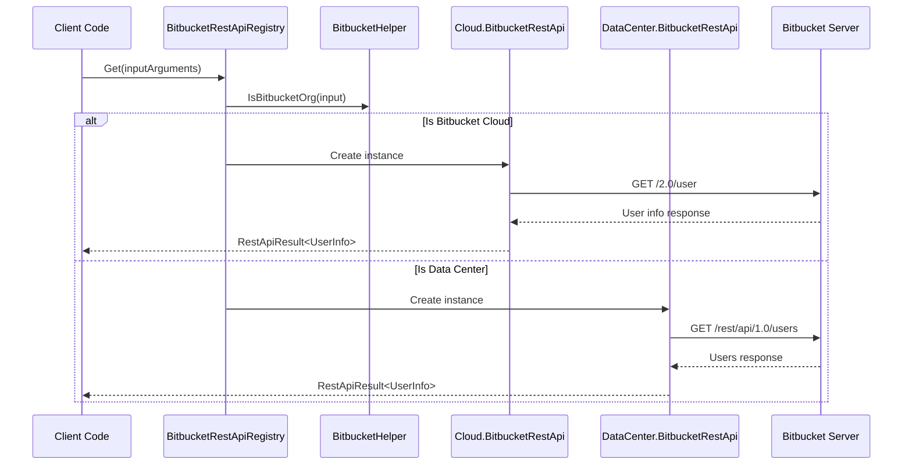
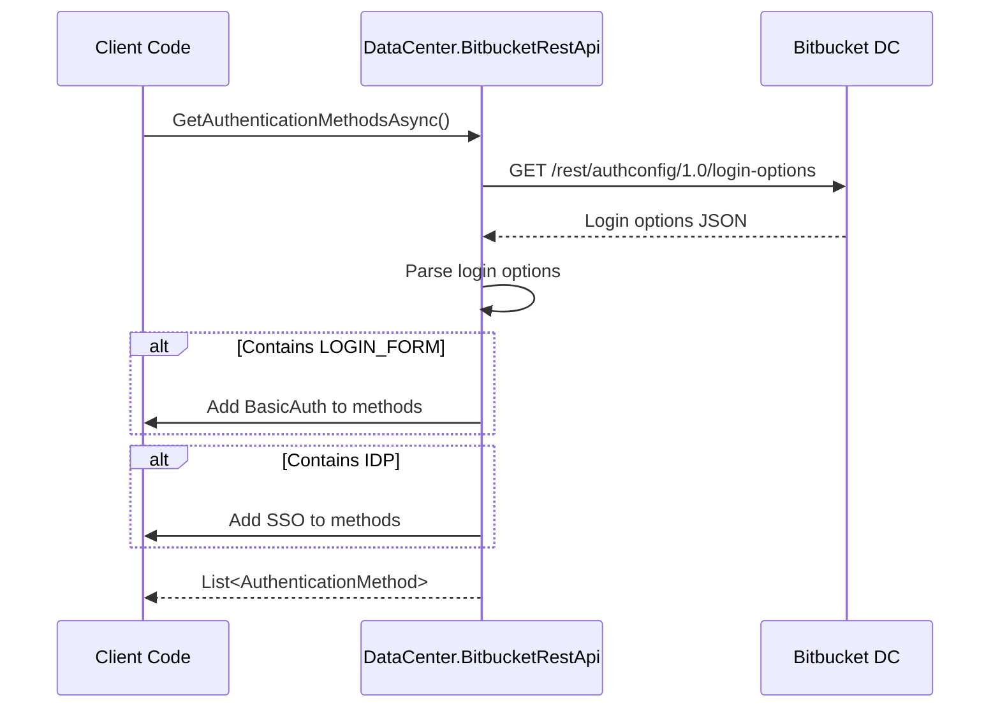

# BitbucketRestApi Module Documentation

## Introduction

The BitbucketRestApi module provides REST API integration capabilities for Bitbucket Cloud and Bitbucket Data Center/Server instances. It serves as the communication layer between the Git Credential Manager and Bitbucket's REST APIs, handling user authentication, credential validation, and authentication method discovery.

## Overview

The module implements a unified interface (`IBitbucketRestApi`) that abstracts the differences between Bitbucket Cloud and Data Center APIs, providing consistent functionality across both platforms. It supports multiple authentication methods including Basic Authentication, OAuth2, and SSO integration.

## Architecture

### Component Structure



### Key Components

#### 1. IBitbucketRestApi Interface
The core interface that defines the contract for Bitbucket REST API operations:
- `GetUserInformationAsync`: Retrieves user information using provided credentials
- `IsOAuthInstalledAsync`: Checks if OAuth is available on the Bitbucket instance
- `GetAuthenticationMethodsAsync`: Discovers available authentication methods

#### 2. BitbucketRestApiRegistry
Factory class that determines which API implementation to use based on the target Bitbucket instance:
- Routes requests to Cloud or Data Center implementations
- Manages the lifecycle of API instances
- Uses `BitbucketHelper.IsBitbucketOrg()` to determine the target platform

#### 3. Cloud.BitbucketRestApi
Implementation for Bitbucket Cloud (bitbucket.org):
- Uses Bitbucket Cloud's 2.0 REST API
- Always supports OAuth (returns true for `IsOAuthInstalledAsync`)
- User information retrieved from `/2.0/user` endpoint

#### 4. DataCenter.BitbucketRestApi
Implementation for Bitbucket Data Center/Server:
- Uses Bitbucket Server's REST API endpoints
- Supports configuration-based credential validation
- Discovers authentication methods via `/authconfig/1.0/login-options`
- OAuth availability checked via `/oauth2/1.0/client` endpoint

## Data Flow

### Authentication Flow



### Authentication Method Discovery



## API Methods

### GetUserInformationAsync
Retrieves user information using the provided credentials.

**Parameters:**
- `userName`: The username for authentication
- `password`: The password or access token
- `isBearerToken`: Whether the password is a bearer token

**Behavior:**
- **Cloud**: Makes authenticated request to `/2.0/user` endpoint
- **Data Center**: Makes authenticated request to `/rest/api/1.0/users` endpoint
- Returns placeholder username for Data Center OAuth scenarios

### IsOAuthInstalledAsync
Checks if OAuth2 is available on the Bitbucket instance.

**Behavior:**
- **Cloud**: Always returns `true`
- **Data Center**: Checks `/rest/oauth2/1.0/client` endpoint anonymously

### GetAuthenticationMethodsAsync
Discovers available authentication methods for the Bitbucket instance.

**Behavior:**
- **Cloud**: Returns empty list (methods determined during authentication process)
- **Data Center**: Queries `/rest/authconfig/1.0/login-options` and parses available methods

## Configuration

### Data Center Specific Settings

The Data Center implementation supports configuration options:

- `credential.bitbucket.validateStoredCredentials`: Controls whether to validate stored credentials
- Environment variable: `GCM_BITBUCKET_VALIDATE_STORED_CREDENTIALS`
- When set to `false`, skips user information retrieval and returns placeholder data

## Error Handling

The module uses `RestApiResult<T>` to encapsulate API responses:

```csharp
public class RestApiResult<T>
{
    public HttpStatusCode StatusCode { get; }
    public T Response { get; }
    public bool Succeeded => 199 < (int)StatusCode && (int)StatusCode < 300;
}
```

- **Success**: Status codes 200-299
- **Failure**: Non-success status codes with default response
- **Network errors**: Thrown as exceptions from HttpClient

## Dependencies

### Core Dependencies
- [ICommandContext](Core.md#icommandcontext): Provides access to settings, tracing, and HTTP client factory
- [HttpClientFactory](Core.md#httpclientfactory): Creates HTTP clients for API requests
- [BitbucketHelper](BitbucketProvider.md): Determines Bitbucket instance type

### Authentication Integration
- Integrates with [BitbucketAuthentication](BitbucketProvider.md#bitbucketauthentication) for credential management
- Works with [OAuth2Client](BitbucketProvider.md#bitbucketoauth2) for OAuth flows

## Platform Differences

| Feature | Bitbucket Cloud | Bitbucket Data Center |
|---------|-----------------|----------------------|
| User API | `/2.0/user` | `/rest/api/1.0/users` |
| OAuth Check | Always available | `/rest/oauth2/1.0/client` |
| Auth Methods | Determined during auth | `/rest/authconfig/1.0/login-options` |
| Configuration | Standard | Supports validation bypass |

## Usage Examples

### Basic Usage
```csharp
// Get the appropriate API instance
var registry = new BitbucketRestApiRegistry(context);
var api = registry.Get(inputArguments);

// Get user information
var result = await api.GetUserInformationAsync(username, password, isBearerToken);
if (result.Succeeded)
{
    Console.WriteLine($"User: {result.Response.UserName}");
}
```

### Authentication Method Discovery
```csharp
var methods = await api.GetAuthenticationMethodsAsync();
foreach (var method in methods)
{
    Console.WriteLine($"Available method: {method}");
}
```

## Thread Safety

- `BitbucketRestApiRegistry` is thread-safe for concurrent access
- Individual API instances (`Cloud.BitbucketRestApi`, `DataCenter.BitbucketRestApi`) should not be shared across threads
- HTTP clients are created per-instance and should be disposed properly

## Performance Considerations

- API instances are cached within the registry
- HTTP clients are reused within each API instance
- Consider using `HttpClientFactory` for optimal connection pooling
- Data Center API supports credential validation bypass for performance

## Security Considerations

- All authentication headers are properly formatted and encoded
- Bearer tokens are handled securely without exposure
- HTTPS is used for all API communications
- Credential validation can be disabled in controlled environments

## Testing and Monitoring

### Tracing Integration
The module integrates with the Git Credential Manager's tracing system:
- All HTTP requests and responses are logged with trace level information
- Request URIs, status codes, and response times are recorded
- Error conditions are logged with appropriate detail levels

### Diagnostic Capabilities
- Failed requests include detailed status code information
- Network errors are captured and logged
- Authentication failures provide specific error context

### Health Checks
- `IsOAuthInstalledAsync()` can be used to verify OAuth availability
- `GetUserInformationAsync()` serves as a credential validation endpoint
- Both Cloud and Data Center implementations support health checking

## Related Documentation

- [BitbucketProvider](BitbucketProvider.md) - Parent module containing authentication and provider components
- [Core](Core.md) - Core infrastructure components including ICommandContext and HttpClientFactory
- [Authentication](Core.md#authentication) - Authentication framework used by this module