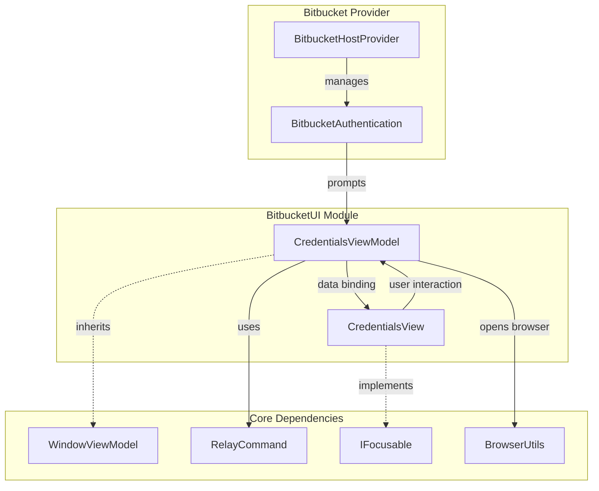
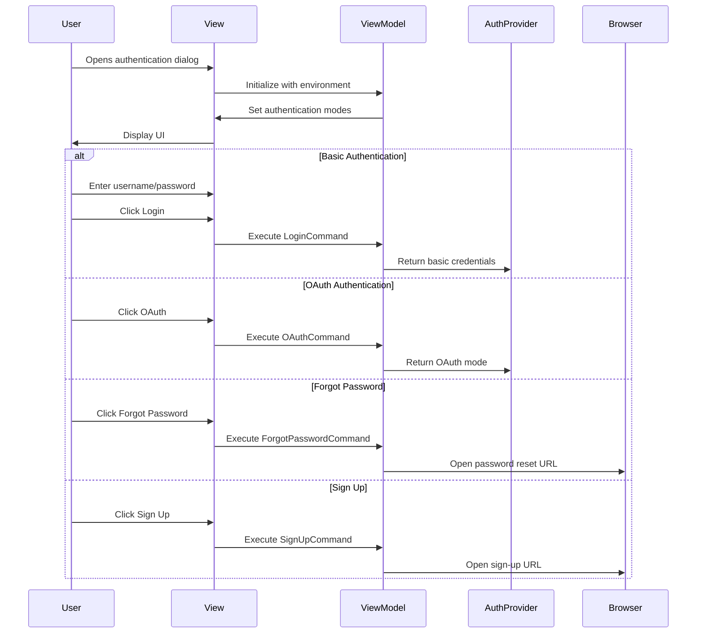

# BitbucketUI Module Documentation

## Introduction

The BitbucketUI module provides the user interface components for Bitbucket authentication within the Git Credential Manager. This module handles the presentation layer for credential collection, offering both basic authentication (username/password) and OAuth authentication options to users connecting to Bitbucket repositories.

## Module Overview

The BitbucketUI module is responsible for:
- Presenting authentication dialogs to users
- Collecting user credentials for Bitbucket access
- Supporting both basic and OAuth authentication methods
- Providing a consistent user experience across different platforms
- Integrating with the broader Bitbucket provider ecosystem

## Architecture

### Component Structure

### Key Components

#### CredentialsViewModel
The `CredentialsViewModel` class serves as the data context and business logic layer for the authentication dialog. It manages:

- **User Input**: Username and password fields
- **Authentication Modes**: Toggle between basic and OAuth authentication
- **Commands**: Login, cancel, OAuth, forgot password, and sign-up actions
- **Navigation**: Opening external URLs for password reset and sign-up

#### CredentialsView
The `CredentialsView` class is the Avalonia UI control that presents the authentication interface. It handles:

- **Visual Layout**: XAML-based user interface
- **Focus Management**: Programmatically setting focus based on authentication mode
- **Platform-Specific Behavior**: Workarounds for macOS focus issues

## Data Flow

## Authentication Modes

### Basic Authentication
- **Username/Password**: Traditional credential collection
- **Validation**: Ensures both fields are populated
- **Security**: Credentials are handled securely through the credential store

### OAuth Authentication
- **Browser-Based**: Redirects to Bitbucket OAuth flow
- **Token Management**: Secure token storage and refresh
- **User Experience**: Seamless authentication without password entry

## Platform Integration

### Cross-Platform Support
The module supports multiple platforms with platform-specific considerations:

- **Windows**: Standard focus behavior
- **macOS**: Special focus handling due to platform limitations
- **Linux**: Standard focus behavior

### External Browser Integration
The module integrates with system browsers for:
- Password reset flows
- Account sign-up processes
- OAuth authentication redirects

## Dependencies

### Core Dependencies
- **GitCredentialManager.UI**: Base UI framework and controls
- **Avalonia**: Cross-platform UI framework
- **System**: .NET runtime components

### Bitbucket Provider Dependencies
- **BitbucketAuthentication**: Authentication logic and credential processing
- **BitbucketHostProvider**: Host provider integration
- **BitbucketConstants**: URLs and configuration constants

### Related Modules
- [BitbucketProvider](BitbucketProvider.md): Core Bitbucket authentication and API integration
- [Core.UI](Core.md#ui-components): Shared UI components and utilities

## User Experience Features

### Accessibility
- **Keyboard Navigation**: Full keyboard support for all interactions
- **Focus Management**: Intelligent focus placement based on context
- **Visual Feedback**: Clear indication of available actions

### Error Handling
- **Input Validation**: Real-time validation of user input
- **Mode Switching**: Graceful handling between authentication methods
- **External Links**: Safe opening of browser links

## Configuration

### Authentication Mode Selection
The module supports dynamic authentication mode selection based on:
- Server capabilities
- User preferences
- Security requirements

### URL Handling
The module intelligently handles different Bitbucket environments:
- **Bitbucket Cloud**: Standard Bitbucket.org URLs
- **Bitbucket Data Center**: Enterprise deployment URLs
- **Custom Endpoints**: Configurable authentication endpoints

## Security Considerations

### Credential Handling
- **Secure Storage**: Integration with platform-specific credential stores
- **Memory Management**: Proper cleanup of sensitive data
- **Transport Security**: Secure transmission of credentials

### OAuth Security
- **Token Validation**: Proper OAuth token validation
- **Scope Management**: Appropriate permission scoping
- **Refresh Token Handling**: Secure token refresh mechanisms

## Testing and Diagnostics

### UI Testing
- **Design-Time Support**: XAML designer compatibility
- **Mock Data**: Support for design-time data contexts
- **Platform Testing**: Cross-platform UI validation

### Integration Testing
- **Authentication Flows**: End-to-end authentication testing
- **Browser Integration**: External link opening verification
- **Error Scenarios**: Proper error handling validation

## Future Enhancements

### Potential Improvements
- **Biometric Authentication**: Integration with platform biometric APIs
- **Single Sign-On**: Enhanced SSO support for enterprise environments
- **Multi-Factor Authentication**: Built-in MFA support
- **Remember Me**: Persistent authentication options

### Performance Optimizations
- **Lazy Loading**: Deferred loading of UI components
- **Caching**: Intelligent caching of authentication state
- **Async Operations**: Non-blocking UI operations

## Conclusion

The BitbucketUI module provides a robust, user-friendly interface for Bitbucket authentication within the Git Credential Manager ecosystem. Its clean separation of concerns, cross-platform support, and comprehensive authentication options make it an essential component for secure Git operations with Bitbucket repositories.