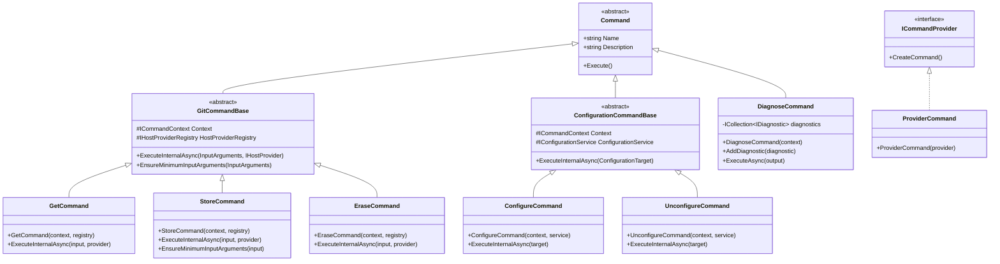
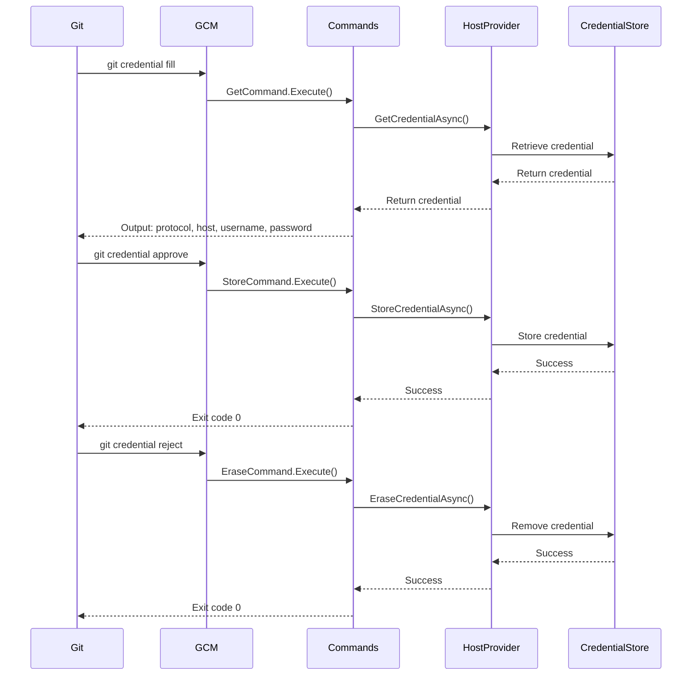
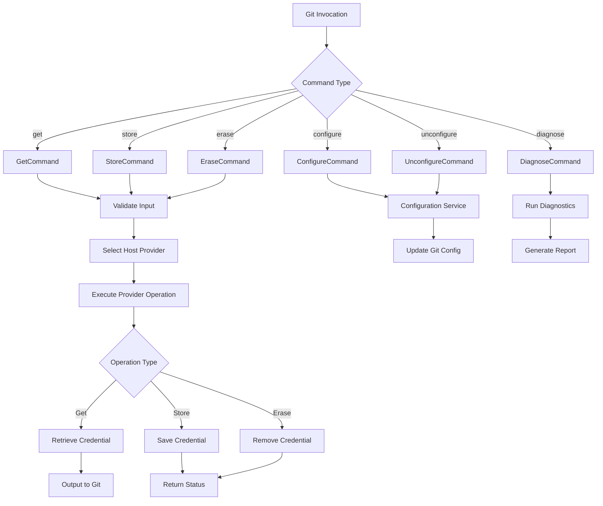

# Commands Module Documentation

## Introduction

The Commands module is the core command processing layer of Git Credential Manager (GCM). It implements the Git credential helper protocol by providing a set of commands that Git invokes to manage authentication credentials. This module serves as the primary interface between Git and the credential management system, handling credential retrieval, storage, erasure, configuration, and diagnostic operations.

The Commands module implements the standard Git credential helper protocol commands (`get`, `store`, `erase`) while also providing additional utility commands for configuration management and system diagnostics. It acts as the orchestration layer that coordinates between various GCM subsystems including authentication providers, credential stores, and platform-specific services.

## Architecture Overview

### Core Components

The Commands module consists of six primary command implementations:

1. **GetCommand** - Retrieves stored credentials from the appropriate host provider
2. **StoreCommand** - Stores credentials in the secure credential store
3. **EraseCommand** - Removes credentials from the secure credential store
4. **ConfigureCommand** - Configures GCM as Git's credential helper
5. **UnconfigureCommand** - Removes GCM configuration from Git
6. **DiagnoseCommand** - Runs system diagnostics and generates troubleshooting logs

### Command Hierarchy



## Command Processing Flow

### Git Credential Protocol Implementation

The Commands module implements Git's credential helper protocol through three primary commands that Git invokes during authentication operations:



### Command Execution Architecture



## Component Details

### GitCommandBase

The abstract base class for all Git protocol commands provides common functionality:

- **Input Validation**: Ensures required arguments (protocol, host) are present
- **Host Provider Selection**: Uses the HostProviderRegistry to select appropriate provider
- **Error Handling**: Standardized exception handling and trace logging
- **Context Management**: Provides access to command context, tracing, and streams

### GetCommand

Implements the `git credential fill` protocol command:

- **Purpose**: Retrieve stored credentials for a Git operation
- **Input**: Protocol, host, and optional path from Git
- **Process**: 
  1. Validates input arguments
  2. Selects appropriate host provider
  3. Requests credential from provider
  4. Outputs credential data to Git in expected format
- **Output**: Protocol, host, path, username, and password

### StoreCommand

Implements the `git credential approve` protocol command:

- **Purpose**: Store credentials for future use
- **Input**: Protocol, host, path, username, and password
- **Validation**: Ensures username and password are provided
- **Process**: Delegates storage to the selected host provider
- **Security**: Credentials are stored in platform-specific secure storage

### EraseCommand

Implements the `git credential reject` protocol command:

- **Purpose**: Remove stored credentials
- **Input**: Protocol, host, and optional path
- **Process**: Delegates credential removal to the selected host provider
- **Use Case**: Called when authentication fails to remove invalid credentials

### Configuration Commands

#### ConfigureCommand

- **Purpose**: Configure GCM as Git's credential helper
- **Options**: `--system` for system-wide vs user configuration
- **Process**: Uses ConfigurationService to update Git configuration
- **Result**: Sets `credential.helper` to GCM executable

#### UnconfigureCommand

- **Purpose**: Remove GCM from Git's credential helper configuration
- **Options**: `--system` for system-wide vs user configuration
- **Process**: Uses ConfigurationService to remove GCM configuration
- **Result**: Removes `credential.helper` settings

### DiagnoseCommand

Comprehensive diagnostic tool for troubleshooting GCM issues:

- **Purpose**: Run system diagnostics and generate troubleshooting logs
- **Diagnostics Included**:
  - Environment diagnostic (environment variables, paths)
  - File system diagnostic (permissions, access)
  - Networking diagnostic (connectivity, proxy)
  - Git diagnostic (Git version, configuration)
  - Credential store diagnostic (storage availability)
  - Microsoft authentication diagnostic (MSAL, Azure AD)
- **Output**: Comprehensive log file with system information and test results
- **Extensibility**: Supports adding custom diagnostics via `AddDiagnostic()`

## Dependencies and Integration

### Core Dependencies

The Commands module integrates with several key GCM subsystems:

```mermaid
graph TD
    Commands --> Application[Application Layer]
    Commands --> HostProvider[Host Provider Framework]
    Commands --> CredentialStore[Credential Management]
    Commands --> Configuration[Configuration Service]
    Commands --> Diagnostics[Diagnostics Framework]
    
    Application --> Context[Command Context]
    Application --> InputArgs[Input Arguments]
    
    HostProvider --> Registry[Provider Registry]
    HostProvider --> Providers[Host Providers]
    
    CredentialStore --> Stores[Credential Stores]
    CredentialStore --> Security[Platform Security]
    
    Configuration --> GitConfig[Git Configuration]
    Configuration --> Settings[Settings Management]
    
    Diagnostics --> Environment[Environment Diagnostic]
    Diagnostics --> FileSystem[File System Diagnostic]
    Diagnostics --> Network[Network Diagnostic]
    Diagnostics --> GitDiag[Git Diagnostic]
    Diagnostics --> StoreDiag[Credential Store Diagnostic]
    Diagnostics --> AuthDiag[Authentication Diagnostic]
```



### External Integrations

- **Git Integration**: Implements Git's credential helper protocol
- **Platform Services**: Uses platform-specific credential storage
- **Authentication Providers**: Delegates to host-specific authentication logic
- **Configuration Management**: Integrates with Git's configuration system

## Security Considerations

### Credential Handling

- **Secure Storage**: All credentials are stored in platform-specific secure storage
- **Memory Protection**: Sensitive data is handled securely in memory
- **Trace Logging**: Passwords are redacted in trace logs
- **Validation**: Input validation prevents injection attacks

### Access Control

- **User vs System**: Configuration commands support both user and system-wide settings
- **Permission Checks**: File system operations include permission validation
- **Provider Selection**: Host provider selection is based on trusted configuration

## Error Handling

### Exception Management

- **Standardized Errors**: Consistent error handling across all commands
- **Trace Integration**: All errors are logged with detailed trace information
- **User Feedback**: Clear error messages for common failure scenarios
- **Exit Codes**: Appropriate exit codes for Git integration

### Diagnostic Support

- **Comprehensive Logging**: Detailed logging for troubleshooting
- **System Information**: Collection of system state for diagnostics
- **Failure Analysis**: Structured diagnostic results for support scenarios

## Usage Examples

### Git Integration

```bash
# Git automatically invokes these commands
$ git credential fill
protocol=https
host=github.com

$ git credential approve
protocol=https
host=github.com
username=octocat
password=ghp_xxxxxxxxxxxx

$ git credential reject
protocol=https
host=github.com
```

### Manual Configuration

```bash
# Configure GCM as credential helper
$ git-credential-manager configure

# Configure system-wide
$ git-credential-manager configure --system

# Remove GCM configuration
$ git-credential-manager unconfigure
```

### Diagnostics

```bash
# Run all diagnostics
$ git-credential-manager diagnose

# Save diagnostics to specific directory
$ git-credential-manager diagnose --output /path/to/logs
```

## Extension Points

### Custom Commands

The `ICommandProvider` interface allows for custom command implementations:

```csharp
public interface ICommandProvider
{
    ProviderCommand CreateCommand();
}
```

### Additional Diagnostics

The `DiagnoseCommand` supports adding custom diagnostics:

```csharp
public void AddDiagnostic(IDiagnostic diagnostic)
{
    _diagnostics.Add(diagnostic);
}
```

## Related Documentation

- [Application](Application.md) - Core application layer and command context
- [HostProviderFramework](HostProviderFramework.md) - Host provider selection and management
- [CredentialManagement](CredentialManagement.md) - Secure credential storage systems
- [Configuration](Configuration.md) - Git configuration management services
- [Platform](Platform.md) - Platform-specific services and abstractions
- [Authentication](Authentication.md) - Authentication provider implementations
- [Diagnostics](Diagnostics.md) - Diagnostic framework and components