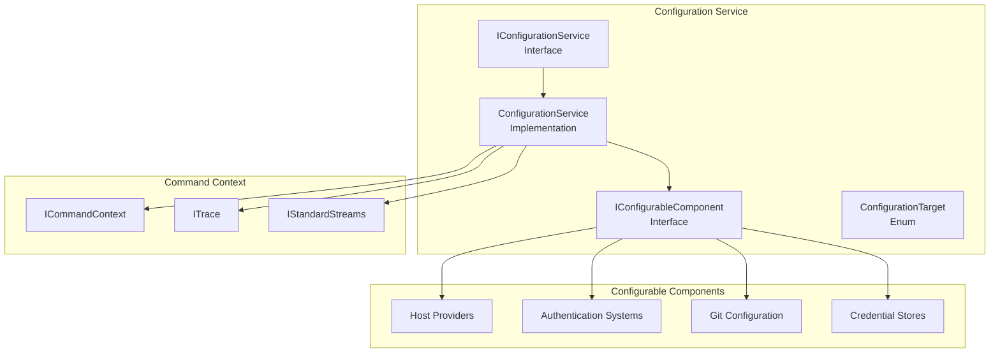
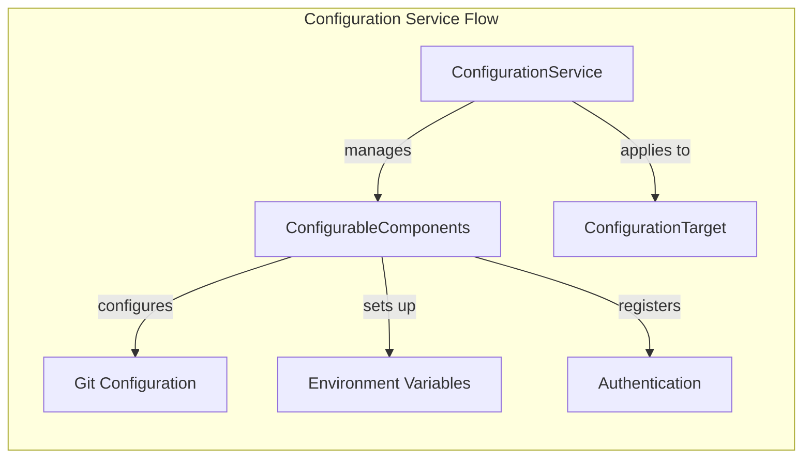
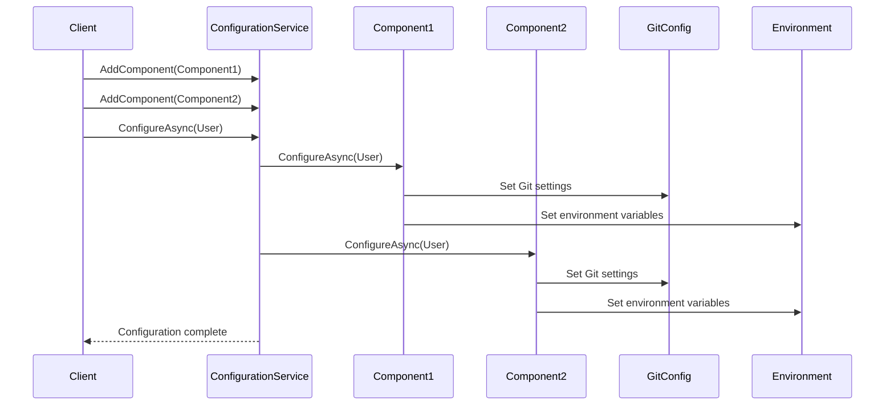
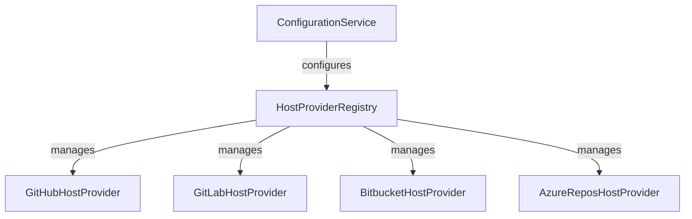
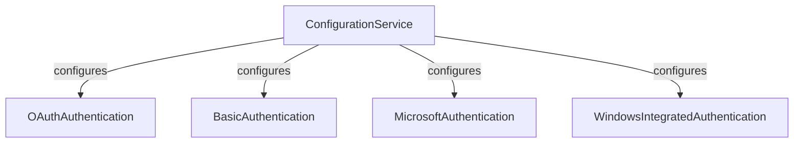
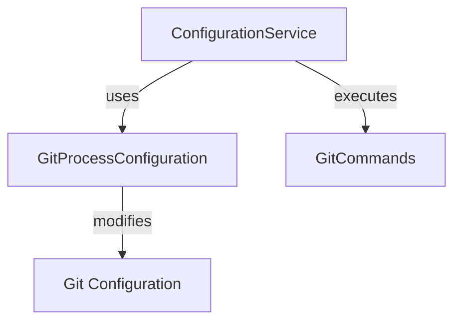
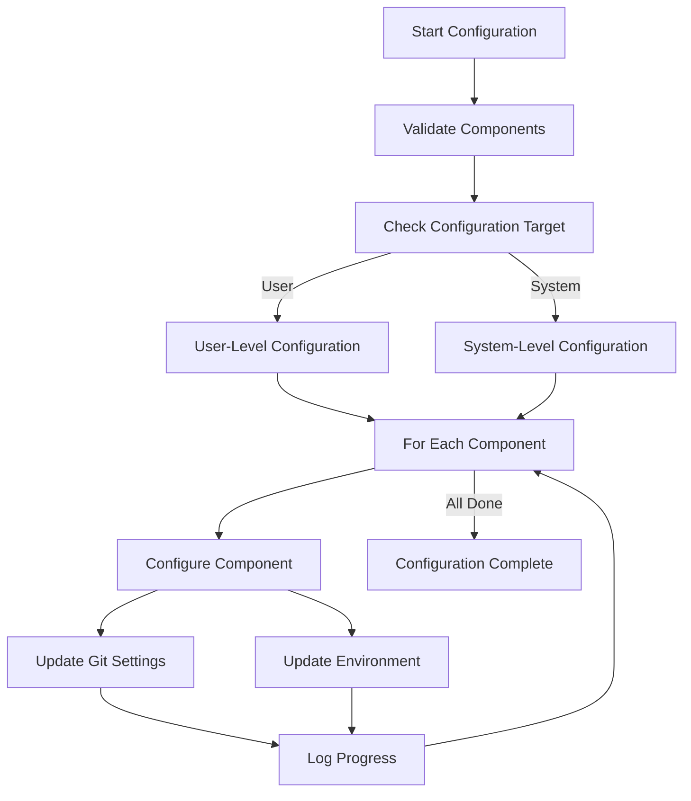
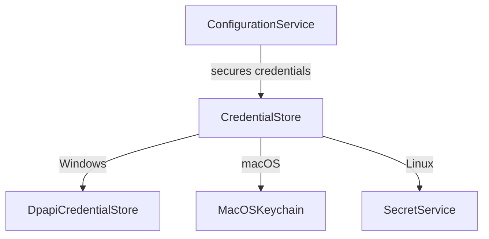

# Configuration Service

The Configuration Service module provides a centralized system for managing Git and environment configuration across multiple hosting providers and authentication systems. It orchestrates the configuration and unconfiguration of various components that require Git or environment setup to function properly.

## Overview

The Configuration Service acts as a coordinator for all configurable components in the system, providing a unified interface to configure Git settings, environment variables, and other system-wide configurations. It supports both user-level and system-level configuration targets, making it suitable for both individual developer environments and enterprise deployments.

## Architecture

### Core Components



### Component Relationships



## Key Interfaces and Classes

### IConfigurationService
The main service interface that provides methods to manage and execute configuration operations across all registered components.

**Key Methods:**
- `AddComponent(IConfigurableComponent component)`: Registers a new configurable component
- `ConfigureAsync(ConfigurationTarget target)`: Configures all registered components
- `UnconfigureAsync(ConfigurationTarget target)`: Removes configuration from all components

### IConfigurableComponent
Interface that must be implemented by any component requiring Git or environment configuration.

**Key Methods:**
- `ConfigureAsync(ConfigurationTarget target)`: Sets up the component configuration
- `UnconfigureAsync(ConfigurationTarget target)`: Removes the component configuration

### ConfigurationTarget Enum
Defines the scope of configuration operations:
- `User`: Configuration changes apply to the current user only
- `System`: Configuration changes apply to all users on the system

## Data Flow



## Integration with Other Modules

### Host Provider Framework Integration
The Configuration Service works closely with the [Host Provider Framework](Host%20Provider%20Framework.md) to configure Git settings for different hosting providers:



### Authentication System Integration
Configuration Service coordinates with the [Authentication System](Authentication%20System.md) to set up authentication-related configurations:



### Git Integration
The service leverages the [Git Integration](Git%20Integration.md) module to modify Git configuration:



## Configuration Process Flow



## Usage Patterns

### Component Registration
Components that require configuration implement `IConfigurableComponent` and register themselves with the Configuration Service:

```csharp
public class MyHostProvider : IHostProvider, IConfigurableComponent
{
    public string Name => "My Host Provider";
    
    public async Task ConfigureAsync(ConfigurationTarget target)
    {
        // Configure Git settings
        // Set environment variables
        // Register authentication helpers
    }
    
    public async Task UnconfigureAsync(ConfigurationTarget target)
    {
        // Remove Git settings
        // Clean up environment variables
        // Unregister authentication helpers
    }
}
```

### Service Usage
The Configuration Service is typically used during application initialization or when explicitly requested by the user:

```csharp
// Register components
configurationService.AddComponent(githubProvider);
configurationService.AddComponent(gitlabProvider);

// Configure all components
await configurationService.ConfigureAsync(ConfigurationTarget.User);

// Later, unconfigure if needed
await configurationService.UnconfigureAsync(ConfigurationTarget.User);
```

## Error Handling and Logging

The Configuration Service provides comprehensive logging through the [Tracing and Diagnostics](Core%20Application%20Framework.md#tracing-and-diagnostics) system:

- **Trace Logging**: Detailed configuration steps and component status
- **Error Streams**: User-visible progress messages
- **Diagnostic Information**: Configuration state and validation results

## Security Considerations

### Configuration Target Security
- **User-level**: Safe for individual user modifications
- **System-level**: Requires elevated permissions and careful validation

### Credential Management
The service works with the [Credential Management](Credential%20Management.md) system to ensure secure handling of authentication configurations:



## Cross-Platform Support

The Configuration Service integrates with [Cross-Platform Support](Cross-Platform%20Support.md) to handle platform-specific configuration requirements:

- **Windows**: Registry settings, Windows Credential Manager
- **macOS**: macOS Keychain, plist preferences
- **Linux**: Secret Service, GPG pass
- **POSIX**: Environment variables, file-based configuration

## Testing and Diagnostics

The service integrates with the [Diagnostics](Diagnostics.md) module to provide configuration validation and troubleshooting:

- **EnvironmentDiagnostic**: Validates environment setup
- **GitDiagnostic**: Checks Git configuration
- **CredentialStoreDiagnostic**: Verifies credential storage

## Best Practices

1. **Component Isolation**: Each component should handle its own configuration independently
2. **Idempotent Operations**: Configuration operations should be safe to run multiple times
3. **Rollback Support**: Always implement unconfiguration to support clean removal
4. **Target Awareness**: Respect the configuration target (user vs. system)
5. **Error Propagation**: Properly handle and report configuration failures
6. **Logging**: Provide adequate logging for troubleshooting

## Related Documentation

- [Core Application Framework](Core%20Application%20Framework.md) - Base framework and command context
- [Host Provider Framework](Host%20Provider%20Framework.md) - Host provider configuration
- [Authentication System](Authentication%20System.md) - Authentication configuration
- [Git Integration](Git%20Integration.md) - Git configuration management
- [Credential Management](Credential%20Management.md) - Secure credential handling
- [Cross-Platform Support](Cross-Platform%20Support.md) - Platform-specific configuration
- [Diagnostics](Diagnostics.md) - Configuration validation and troubleshooting