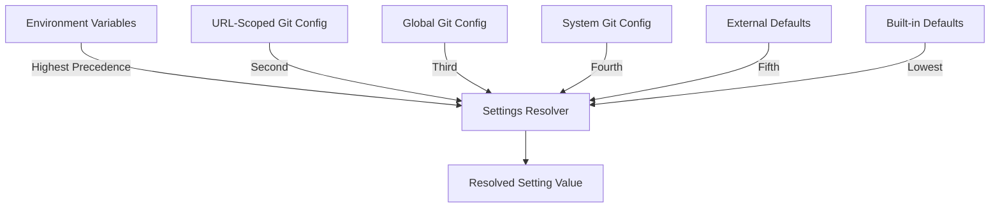
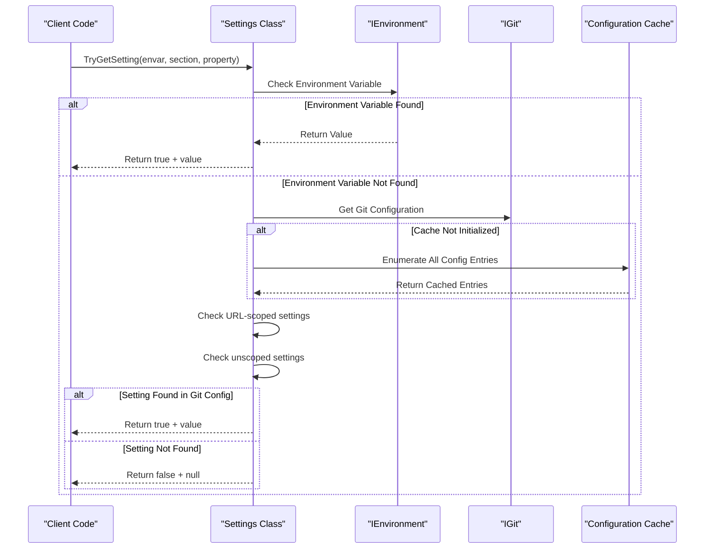
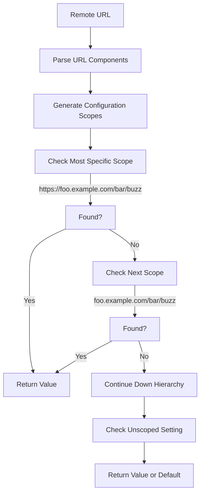
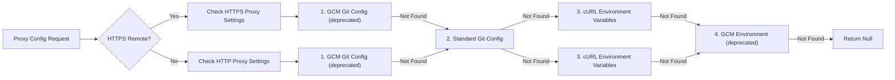
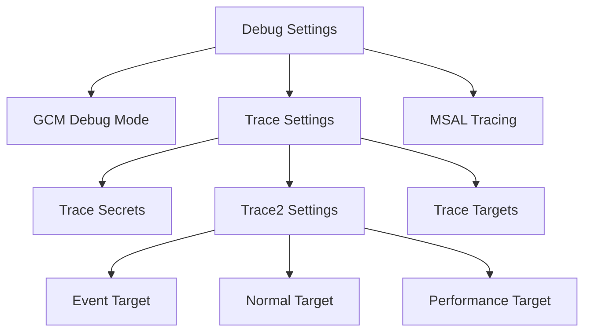

# Configuration and Settings Module

## Introduction

The Configuration and Settings module is a core component of the Git Credential Manager (GCM) that provides centralized configuration management and settings resolution. This module serves as the primary interface for accessing and managing all configuration options across the application, handling the complex hierarchy of environment variables, Git configuration, and URL-scoped settings.

The module implements a sophisticated settings resolution system that respects Git's configuration precedence rules while extending them with additional sources like environment variables and external defaults. It provides type-safe access to hundreds of configuration options that control everything from authentication behavior to UI preferences and network settings.

## Architecture Overview

### Core Components

The module consists of three primary components that work together to provide comprehensive configuration management:

#### ISettings Interface
The `ISettings` interface defines the contract for all configuration operations, providing methods to retrieve settings from various sources with proper precedence handling. It exposes over 20 properties that represent different aspects of GCM configuration, from basic debugging flags to complex proxy configurations.

#### Settings Implementation
The `Settings` class implements `ISettings` and serves as the main configuration resolver. It orchestrates the retrieval of settings from multiple sources including environment variables, Git configuration files, and URL-scoped settings. The implementation includes sophisticated caching mechanisms to optimize performance during repeated configuration lookups.

#### ProxyConfiguration Class
The `ProxyConfiguration` class encapsulates all proxy-related settings and provides utilities for parsing and validating proxy configurations. It supports multiple proxy configuration methods and includes logic for handling proxy bypass lists in libcurl-compatible format.

### Configuration Sources and Precedence

The module implements a multi-layered configuration system with the following precedence order (highest to lowest):

1. **Environment Variables**: Take highest precedence and can override any other setting
2. **URL-Scoped Git Configuration**: Settings specific to particular Git remotes
3. **Global Git Configuration**: Standard Git configuration settings
4. **System Git Configuration**: System-wide Git defaults
5. **External Defaults**: Platform or policy-defined defaults
6. **Built-in Defaults**: Hard-coded fallback values



## Detailed Component Architecture

### Settings Resolution Flow



### URL-Scoped Configuration Resolution

The module implements sophisticated URL-scoped configuration that follows Git's configuration rules while extending them for GCM-specific needs:



### Proxy Configuration Resolution

The proxy configuration system supports multiple configuration methods with clear precedence:



## Key Features and Capabilities

### Type-Safe Configuration Access

The module provides type-safe access to configuration values through specialized methods:

- **Boolean Settings**: Automatic conversion of string values to boolean with support for various truthy/falsy representations
- **Path Settings**: Automatic path canonicalization and expansion of relative paths
- **URI Settings**: Validation and parsing of URI values with proper error handling
- **Integer Settings**: Conversion with range validation and default fallbacks
- **Enum Settings**: Type-safe enumeration parsing with fallback to default values

### Performance Optimizations

The implementation includes several performance optimizations:

1. **Configuration Caching**: All Git configuration entries are cached on first access to avoid repeated enumeration
2. **Lazy Evaluation**: Settings are only resolved when actually requested
3. **String Interning**: Repeated configuration keys are interned to reduce memory usage
4. **Early Termination**: The resolution process stops as soon as a value is found

### URL-Scoped Configuration Support

The module implements Git's URL-scoped configuration system with enhancements:

- **Hierarchical Scoping**: Supports configuration at multiple URL specificity levels
- **Scheme-Agnostic Matching**: Allows configuration to apply to both HTTP and HTTPS variants
- **Wildcard Support**: Handles subdomain wildcards in configuration scopes
- **Case Sensitivity**: Properly handles case-sensitive URL components while being case-insensitive for configuration names

### Cross-Platform Compatibility

The configuration system is designed to work consistently across platforms:

- **Environment Variable Naming**: Handles platform-specific environment variable conventions
- **Path Separators**: Automatically converts path separators for the target platform
- **Line Endings**: Normalizes line endings in configuration values
- **Encoding**: Handles various text encodings in configuration files

## Integration with Other Modules

### Application Management Module

The Configuration and Settings module is tightly integrated with the Application Management module:

- **Application Lifecycle**: Settings are initialized during application startup and disposed during shutdown
- **Command Context**: Configuration values are accessed through the command context for command execution
- **Input Arguments**: Command-line arguments can override configuration settings

### Authentication System Integration

The module provides configuration for all authentication-related settings:

- **Provider Selection**: Allows overriding automatic host provider detection
- **Authentication Methods**: Configures which authentication methods are enabled/disabled
- **Token Management**: Controls token caching and refresh behavior
- **Windows Integrated Authentication**: Configures WIA usage and fallback behavior

### Network Configuration

Comprehensive network configuration support:

- **Proxy Settings**: Full proxy configuration with authentication and bypass lists
- **TLS/SSL Settings**: Certificate verification, custom certificate bundles, and TLS backend selection
- **Timeout Configuration**: Network timeout settings for various operations
- **Cookie Management**: Support for custom cookie files

## Configuration Categories

### Debugging and Tracing

The module provides extensive debugging and tracing configuration:



### User Interface Configuration

UI-related settings control the interaction model:

- **Prompting Mode**: Terminal vs GUI prompts with fallback logic
- **Interactivity**: Global control over user interaction permissions
- **Software Rendering**: Platform-specific rendering mode selection
- **Parent Window**: Platform-specific window parenting for dialogs

### Security Settings

Security-related configuration options:

- **Certificate Verification**: Control over SSL certificate validation
- **Client Certificates**: Automatic client certificate usage
- **Unsafe Remotes**: Permission to use non-HTTPS remotes
- **Credential Storage**: Namespace and backing store configuration

## Usage Patterns and Best Practices

### Basic Configuration Access

```csharp
// Simple setting retrieval
if (settings.TryGetSetting("GCM_DEBUG", "credential", "debug", out string debugValue))
{
    Console.WriteLine($"Debug mode: {debugValue}");
}

// Path setting with automatic canonicalization
if (settings.TryGetPathSetting("GCM_TRACE", "credential", "trace", out string tracePath))
{
    Console.WriteLine($"Trace file: {tracePath}");
}
```

### URL-Scoped Configuration

```csharp
// Set remote URI for scoped configuration
settings.RemoteUri = new Uri("https://github.com/user/repo.git");

// Access scoped setting - will check URL-specific configuration first
if (settings.TryGetSetting(null, "credential", "provider", out string provider))
{
    Console.WriteLine($"Provider for {settings.RemoteUri}: {provider}");
}
```

### Proxy Configuration

```csharp
// Get proxy configuration
var proxyConfig = settings.GetProxyConfiguration();
if (proxyConfig != null)
{
    Console.WriteLine($"Proxy: {proxyConfig.Address}");
    if (!string.IsNullOrEmpty(proxyConfig.NoProxyRaw))
    {
        var bypassPatterns = ProxyConfiguration.ConvertToBypassRegexArray(proxyConfig.NoProxyRaw);
        Console.WriteLine($"Bypass patterns: {string.Join(", ", bypassPatterns)}");
    }
}
```

## Error Handling and Validation

### Configuration Validation

The module implements comprehensive validation for all configuration values:

- **URI Validation**: Ensures proxy addresses and other URIs are well-formed
- **Path Validation**: Verifies that file paths exist and are accessible
- **Range Validation**: Ensures numeric values fall within acceptable ranges
- **Enum Validation**: Validates enumeration values and provides sensible defaults

### Error Recovery

When configuration errors are encountered:

1. **Invalid Values**: Invalid configuration values are ignored and defaults are used
2. **Missing Files**: Missing configuration files are handled gracefully
3. **Permission Errors**: Permission issues result in fallback to safe defaults
4. **Syntax Errors**: Malformed configuration is logged and ignored

## Performance Characteristics

### Memory Usage

- **Configuration Cache**: Approximately 1KB per 100 configuration entries
- **String Interning**: Reduces memory usage by ~20% for typical configurations
- **Lazy Loading**: Settings objects are created on-demand

### CPU Usage

- **First Access**: ~5-10ms for initial configuration enumeration
- **Subsequent Access**: <0.1ms for cached configuration values
- **URL Scoping**: Additional ~1-2ms for complex URL scope resolution

### Scalability

- **Configuration Entries**: Tested with up to 10,000 configuration entries
- **URL Scopes**: Efficient handling of up to 50 URL scope levels
- **Concurrent Access**: Thread-safe for read operations

## Security Considerations

### Sensitive Data Handling

- **Credential Storage**: Configuration never stores actual credentials
- **Secret Tracing**: Optional tracing of sensitive data with explicit opt-in
- **Path Validation**: Strict validation of file paths to prevent directory traversal
- **URI Validation**: Validation of all URIs to prevent injection attacks

### Access Control

- **Environment Isolation**: Each process has its own configuration instance
- **Immutable Settings**: Configuration values are read-only after initialization
- **Audit Trail**: All configuration changes are logged when tracing is enabled

## Future Enhancements

### Planned Features

1. **Configuration Hot-Reload**: Ability to reload configuration without restart
2. **Configuration Validation**: Real-time validation of configuration changes
3. **Configuration Profiles**: Support for named configuration profiles
4. **Remote Configuration**: Support for configuration from remote sources

### Performance Improvements

1. **Parallel Enumeration**: Parallel processing of configuration sources
2. **Incremental Updates**: Only re-resolve changed configuration values
3. **Memory Pooling**: Reduce allocation overhead for configuration strings
4. **Native Integration**: Platform-specific optimizations for configuration access

## Related Documentation

- [Application Management](Application Management.md) - For integration with application lifecycle
- [Authentication System](Authentication System.md) - For authentication-related configuration
- [Cross-Platform Support](Cross-Platform Support.md) - For platform-specific configuration handling
- [Diagnostics](Diagnostics.md) - For configuration debugging and troubleshooting