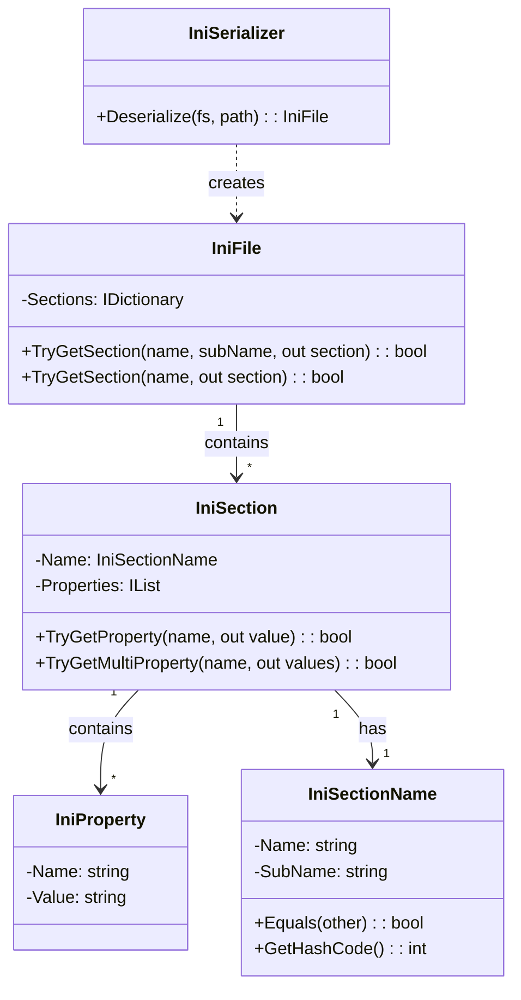
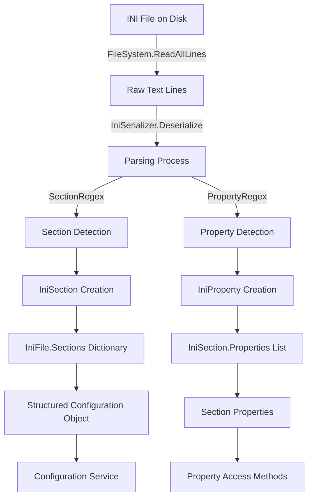
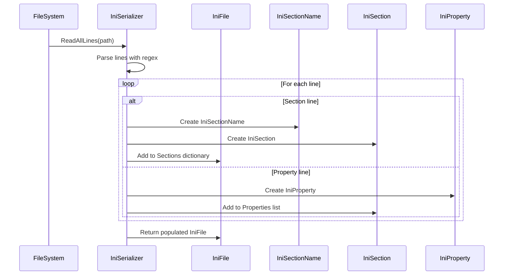
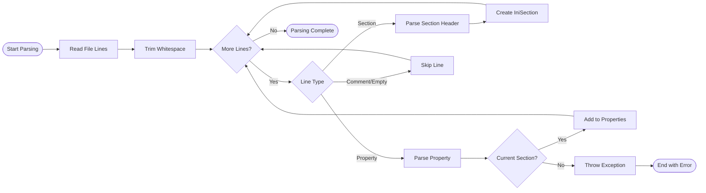

# Configuration-Parsing Module Documentation

## Overview

The Configuration-Parsing module provides a robust INI file parsing and manipulation system for Git Credential Manager. This module is responsible for reading, parsing, and managing configuration files in the standard INI format, supporting sections, properties, and subsections with case-sensitive and case-insensitive handling rules.

## Purpose and Core Functionality

The module serves as the foundation for configuration management across the entire Git Credential Manager ecosystem, enabling:

- **INI File Parsing**: Reading and parsing standard INI format configuration files
- **Section Management**: Handling main sections and subsections with proper naming conventions
- **Property Access**: Providing both single and multi-value property retrieval
- **Configuration Serialization**: Converting INI file content into structured objects
- **Cross-Platform Compatibility**: Working with file system abstractions for platform independence

## Architecture

### Component Structure



### Data Flow Architecture



## Core Components

### IniFile
The root container class that represents an entire INI file structure. It maintains a dictionary of sections and provides methods to retrieve sections by name.

**Key Features:**
- Section dictionary with `IniSectionName` keys
- Case-insensitive main section name matching
- Case-sensitive subsection name matching
- Null-safe operations

### IniSectionName
A value type that represents a section identifier, supporting both main sections and subsections. Implements custom equality comparison with specific case-sensitivity rules.

**Case Sensitivity Rules:**
- Main section names: Case-insensitive comparison
- Subsection names: Case-sensitive comparison
- Hash code generation follows the same rules

### IniSection
Represents a single section within an INI file, containing a collection of properties. Provides methods for property retrieval with support for both single and multi-value properties.

**Property Access Patterns:**
- `TryGetProperty`: Returns the last occurrence of a property
- `TryGetMultiProperty`: Returns all occurrences of a property
- Case-insensitive property name matching

### IniProperty
A simple data class representing a name-value pair within a section.

### IniSerializer
Static utility class responsible for parsing INI file content. Uses regular expressions to identify sections and properties, with support for:

- Comment handling (lines starting with #)
- Quoted value processing
- Subsection parsing with quoted names
- Empty line and whitespace trimming

## Component Interactions



## Integration with Other Modules

### File System Integration
The module integrates with the [Cross-Platform Support](Cross-Platform-Support.md) module through the `IFileSystem` interface, ensuring platform-independent file operations.

### Configuration Service Integration
Parsed INI files are consumed by the [Configuration Service](Configuration-Service.md) module, which provides higher-level configuration management functionality.

### Settings Integration
The [Core Application Framework](Core-Application-Framework.md) module's Settings components utilize the Configuration-Parsing module for reading configuration files.

## Process Flow

### INI File Parsing Process



## Key Features and Capabilities

### 1. Flexible Section Naming
- Support for main sections: `[section]`
- Support for subsections: `[section "subsection"]`
- Case-insensitive main section names
- Case-sensitive subsection names

### 2. Property Value Processing
- Automatic whitespace trimming
- Comment removal (respecting quoted strings)
- Quote stripping for quoted values
- Multi-value property support

### 3. Robust Error Handling
- Missing section detection for properties
- Malformed line skipping
- Empty section name handling
- Null-safe operations throughout

### 4. Performance Optimizations
- Compiled regular expressions
- Dictionary-based section lookup
- Lazy property evaluation
- Efficient string operations

## Usage Patterns

### Basic Configuration Reading
```csharp
// Typical usage through Configuration Service
IConfigurationService configService = /* injected service */;
IniFile config = configService.GetConfiguration();

// Direct parsing (less common)
IFileSystem fileSystem = /* platform-specific */;
IniFile iniFile = IniSerializer.Deserialize(fileSystem, configPath);
```

### Section and Property Access
```csharp
// Accessing sections
if (iniFile.TryGetSection("user", out IniSection userSection))
{
    // Accessing properties
    if (userSection.TryGetProperty("name", out string userName))
    {
        // Use the value
    }
    
    // Accessing multi-value properties
    if (userSection.TryGetMultiProperty("email", out IEnumerable<string> emails))
    {
        // Process all values
    }
}
```

## Platform Considerations

The module is designed to work seamlessly across all supported platforms:

- **Windows**: Uses Windows file system abstractions
- **macOS**: Integrates with macOS file system
- **Linux**: Works with Linux file system implementations

All file operations go through the `IFileSystem` interface, ensuring consistent behavior regardless of the underlying platform.

## Dependencies

### Internal Dependencies
- [Cross-Platform Support](Cross-Platform-Support.md) - For file system operations
- [Utilities](Utilities.md) - Shared utility functions

### External Dependencies
- System.Text.RegularExpressions - For INI file parsing
- System.Collections.Generic - For data structures
- System.IO - For file operations (through abstractions)

## Future Considerations

The module is designed to be extensible for future enhancements:

- **Validation Support**: Potential addition of configuration validation
- **Schema Support**: Possible INI schema definition and validation
- **Performance Monitoring**: Optional parsing performance metrics
- **Error Recovery**: Enhanced error recovery mechanisms

## Summary

The Configuration-Parsing module provides a solid foundation for configuration management within Git Credential Manager. Its clean architecture, robust parsing capabilities, and platform independence make it an essential component for managing application settings and configuration across the entire system.