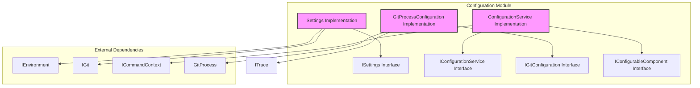
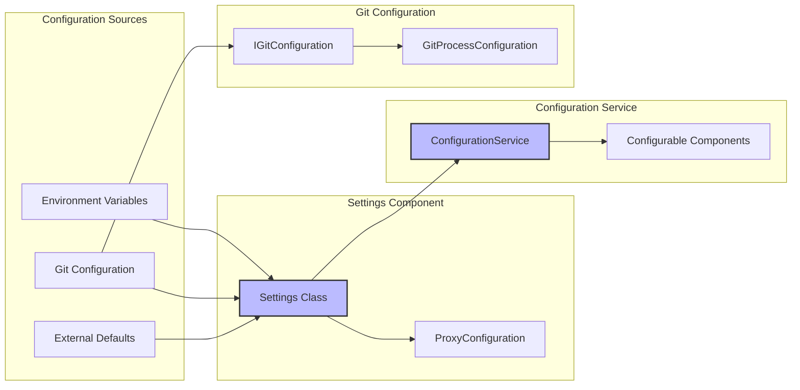
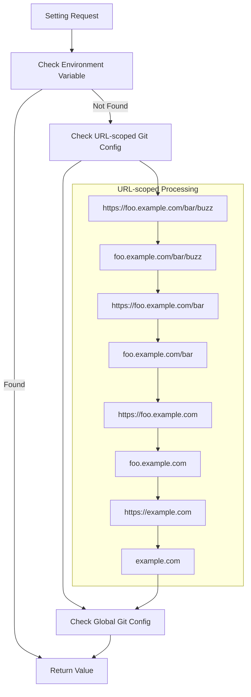
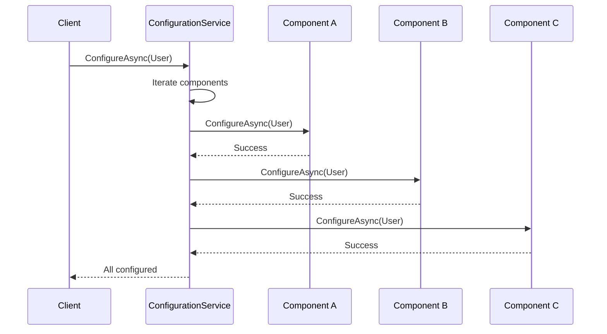
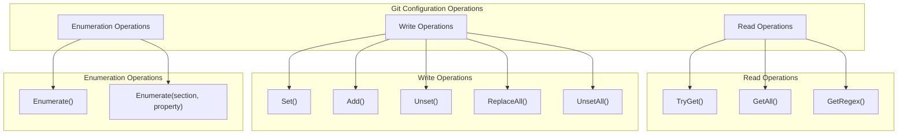

# Configuration Module Documentation

## Overview

The Configuration module is a core component of the Git Credential Manager (GCM) that provides centralized management of application settings, Git configuration, and component configuration services. It serves as the central hub for reading, managing, and applying configuration settings across the entire GCM system.

## Purpose and Core Functionality

The Configuration module provides three primary functions:

1. **Settings Management**: Centralized access to all GCM settings from environment variables and Git configuration
2. **Component Configuration**: Orchestrates the configuration and unconfiguration of configurable components
3. **Git Configuration Interface**: Provides a managed interface for interacting with Git's configuration system

## Architecture

### Component Structure



### Data Flow Architecture



## Core Components

### 1. Settings Management (ISettings/Settings)

The Settings component provides a unified interface for accessing configuration values from multiple sources with a defined precedence order.

#### Key Features:
- **Hierarchical Configuration**: Environment variables take precedence over Git configuration
- **URL-scoped Settings**: Supports Git's URL-scoped configuration for granular control
- **Type Safety**: Provides typed access to common settings (booleans, paths, URIs)
- **Proxy Configuration**: Sophisticated proxy detection and configuration
- **Performance Optimization**: Caches Git configuration entries to avoid repeated Git process calls

#### Configuration Precedence:
```
1. Environment Variables (highest priority)
2. Git URL-scoped configuration (most specific to least specific)
3. Git global configuration
4. Git system configuration
5. External defaults (lowest priority)
```

#### URL-scoped Configuration Logic:
The Settings component implements Git's URL-scoped configuration with enhancements:



### 2. Configuration Service (IConfigurationService/ConfigurationService)

The ConfigurationService orchestrates the configuration of multiple components that implement the IConfigurableComponent interface.

#### Key Features:
- **Component Registration**: Dynamic registration of configurable components
- **Batch Operations**: Configure/unconfigure all registered components at once
- **Target Support**: Supports both user-level and system-level configuration
- **Progress Reporting**: Provides feedback during configuration operations

#### Configuration Process Flow:


### 3. Git Configuration Interface (IGitConfiguration/GitProcessConfiguration)

Provides a managed interface for interacting with Git's configuration system through the Git command-line interface.

#### Key Features:
- **Process-based**: Uses Git process to read/write configuration
- **Type Support**: Supports different Git configuration types (raw, bool, path)
- **Multi-valued Entries**: Handles Git's multi-valued configuration entries
- **Level Filtering**: Supports system, global, and local configuration levels
- **Performance Optimization**: Efficient enumeration and caching strategies

#### Git Configuration Operations:


## Key Settings Categories

### Authentication Settings
- **Provider Override**: Force specific authentication provider
- **Authority Override**: Override authentication authority
- **Windows Integrated Authentication**: Enable/disable WIA detection
- **Certificate Verification**: Control SSL certificate verification
- **Client Certificates**: Automatic client certificate usage

### UI/Interaction Settings
- **GUI Prompts**: Enable/disable graphical user interface prompts
- **Terminal Prompts**: Control terminal-based prompting
- **Interaction Allowed**: Global interactivity control
- **Software Rendering**: Force software rendering for GUI

### Network Settings
- **Proxy Configuration**: Comprehensive proxy support with multiple sources
- **Custom Certificate Bundle**: Path to custom CA certificates
- **TLS Backend**: SSL/TLS backend selection
- **Auto-detect Timeout**: Timeout for provider auto-detection

### Diagnostic Settings
- **Tracing**: Enable various tracing levels
- **Debug Mode**: Enable debug output
- **Secret Tracing**: Control sensitive information logging
- **MSAL Tracing**: Microsoft Authentication Library tracing

### Credential Management Settings
- **Credential Namespace**: Namespace for credential storage
- **Credential Store**: Override credential backing store
- **Allow Unsafe Remotes**: Permit non-HTTPS remote URLs

## Integration with Other Modules

### Authentication Module Integration
The Configuration module provides settings that control authentication behavior:
- Provider selection and overrides
- Authentication method preferences
- Certificate and security settings

### Platform Module Integration
Configuration settings are sourced from platform-specific environments:
- Environment variables from the platform's environment
- Platform-specific credential store selection
- Platform-specific path handling

### Git Integration Module
The GitConfiguration component directly integrates with Git:
- Uses GitProcess for configuration operations
- Respects Git's configuration hierarchy
- Supports Git's URL-scoped configuration

## Usage Patterns

### Reading Settings
```csharp
// Simple setting access
if (_settings.TryGetSetting("GCM_DEBUG", "credential", "debug", out string debugValue))
{
    // Use debugValue
}

// Path setting with canonicalization
if (_settings.TryGetPathSetting("GCM_SSL_CA_INFO", "http", "sslCAInfo", out string caPath))
{
    // Use canonical path
}

// Multiple values
IEnumerable<string> values = _settings.GetSettingValues(null, "credential", "provider", false);
```

### Component Configuration
```csharp
// Register configurable components
_configurationService.AddComponent(new MyConfigurableComponent());

// Configure all components
await _configurationService.ConfigureAsync(ConfigurationTarget.User);

// Unconfigure all components
await _configurationService.UnconfigureAsync(ConfigurationTarget.User);
```

### Git Configuration Operations
```csharp
// Read configuration
if (gitConfig.TryGet(GitConfigurationLevel.Global, GitConfigurationType.Raw, "user.name", out string userName))
{
    // Use userName
}

// Set configuration
gitConfig.Set(GitConfigurationLevel.Global, "user.name", "John Doe");

// Enumerate configuration
gitConfig.Enumerate(entry =>
{
    Console.WriteLine($"{entry.Key} = {entry.Value}");
    return true; // Continue enumeration
});
```

## Performance Considerations

### Settings Caching
- Git configuration entries are cached after first access
- Environment variables are read on each access (expected to be fast)
- URL-scoped configuration resolution is performed on each lookup

### Git Process Optimization
- Batch enumeration to minimize Git process calls
- Efficient argument quoting and process management
- Null-terminated output parsing for reliability

### Memory Management
- Settings class implements IDisposable for cleanup
- Cached configuration entries are stored in memory for performance
- Large enumeration results are streamed when possible

## Security Considerations

### Sensitive Information Handling
- Secret tracing is controlled by explicit settings
- Configuration values may contain sensitive data (tokens, passwords)
- Path settings are canonicalized to prevent directory traversal

### External Input Validation
- Environment variable values are validated before use
- Git configuration values are processed through Git's validation
- URL-scoped configuration follows Git's security model

## Error Handling

### Configuration Service Errors
- Component configuration failures are propagated to the caller
- Individual component failures don't affect other components
- Detailed error messages are provided via the command context

### Settings Resolution Errors
- Missing settings return false/null rather than throwing exceptions
- Invalid setting values are handled gracefully with defaults
- Git configuration errors are wrapped in appropriate exceptions

### Git Configuration Errors
- Git process failures are captured and reported
- Configuration level restrictions are enforced
- Malformed configuration output is handled gracefully

## Future Considerations

### Potential Enhancements
- Configuration validation and schema support
- Hot-reload of configuration changes
- Configuration migration and versioning
- Performance monitoring of configuration operations
- Enhanced error recovery and fallback mechanisms

### Scalability Considerations
- Current design supports single-process usage
- Caching strategy may need adjustment for long-running processes
- Git configuration enumeration could be optimized for large repositories

## Related Documentation

- [Authentication Module](Authentication.md) - For authentication-related configuration
- [Platform Module](Platform.md) - For platform-specific environment handling
- [Git Integration Module](GitIntegration.md) - For Git configuration details
- [Credential Management Module](CredentialManagement.md) - For credential storage configuration