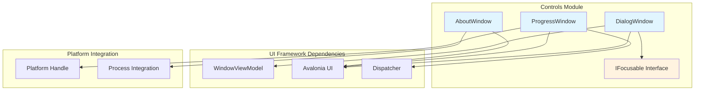
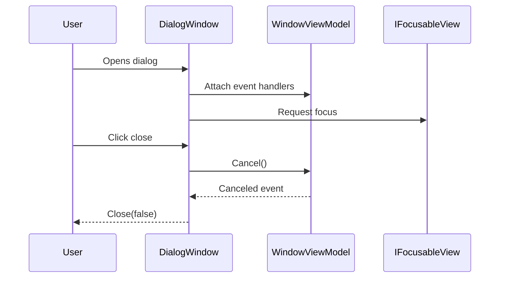
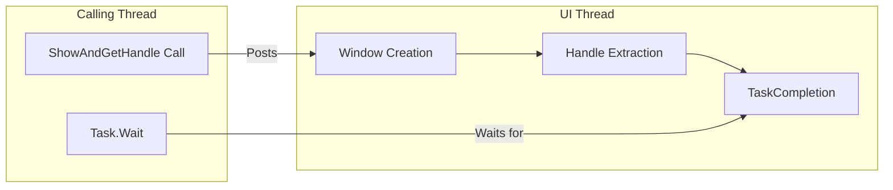
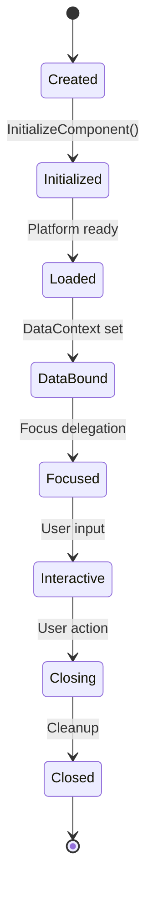

# Controls Module Documentation

## Introduction

The Controls module provides the foundational UI window components for the Git Credential Manager application. Built on the Avalonia UI framework, this module implements reusable window controls that serve as the primary interface elements for user interactions, including dialog windows, progress indicators, and informational displays.

## Architecture Overview

The Controls module implements a hierarchical window management system with specialized window types for different interaction patterns. The architecture follows the Model-View-ViewModel (MVVM) pattern, integrating with the broader UI framework to provide consistent user experiences across authentication flows and application interactions.



## Core Components

### DialogWindow

The `DialogWindow` class serves as the primary modal dialog container for the application. It provides a standardized window frame that hosts various authentication and configuration views while managing the dialog lifecycle and user interactions.

**Key Features:**
- Hosts arbitrary view controls within a consistent window chrome
- Implements MVVM pattern integration with `WindowViewModel`
- Handles window dragging via pointer events
- Provides keyboard shortcuts for debug mode (Alt+D in debug builds)
- Manages focus delegation to child views implementing `IFocusable`

**Architecture Integration:**


### ProgressWindow

The `ProgressWindow` provides a lightweight progress indicator window designed for long-running operations. It implements a static factory pattern for creating platform-specific window handles while maintaining thread safety.

**Key Features:**
- Static factory method `ShowAndGetHandle()` for cross-thread creation
- Platform handle extraction for native integration
- Cancellation token support for operation management
- Asynchronous window creation via Avalonia UI dispatcher

**Threading Model:**


### AboutWindow

The `AboutWindow` displays application information including version details and project links. It demonstrates simple window implementation with external process integration for hyperlink navigation.

**Key Features:**
- Version string binding from application constants
- External URL navigation via system shell
- Minimal window chrome for informational display

### IFocusable Interface

The `IFocusable` interface defines a contract for view components that require programmatic focus management. This abstraction enables the `DialogWindow` to delegate focus to appropriate child controls regardless of their specific implementation.

**Interface Definition:**
```csharp
public interface IFocusable
{
    void SetFocus();
}
```

## Data Flow and Interactions

### Window Lifecycle Management



### Focus Management Flow

The focus management system ensures proper keyboard navigation and accessibility:

1. **Window Creation**: `DialogWindow` constructor accepts a view control
2. **Data Context Binding**: ViewModel events are wired to window lifecycle
3. **Focus Delegation**: On idle, focus is passed to `IFocusable` implementations
4. **Event Handling**: User interactions trigger ViewModel commands
5. **Window Closure**: Result is communicated via dialog result

## Integration Points

### UI Framework Integration

The Controls module integrates with the broader [UI Framework](UI-Framework.md) through:

- **ViewModels**: All windows expect `WindowViewModel` derived data contexts
- **Dispatcher**: ProgressWindow utilizes Avalonia's dispatcher for thread-safe operations
- **Platform Services**: Window handle extraction for native platform integration

### Authentication Flow Integration

DialogWindow serves as the primary host for authentication-related views:

- [Authentication System](Authentication-System.md) views are hosted within DialogWindow instances
- OAuth flows utilize ProgressWindow for authorization waiting periods
- Credential prompts leverage the modal dialog behavior for security

## Platform Considerations

### Cross-Platform Window Management

The Controls module abstracts platform-specific windowing through Avalonia UI while providing hooks for platform integration:

- **Windows**: Native window handle extraction via `TryGetPlatformHandle()`
- **macOS**: Consistent with macOS window management patterns
- **Linux**: Compatible with X11/Wayland window systems

### Threading Requirements

- **UI Thread**: All window creation must occur on the UI thread
- **Background Operations**: ProgressWindow supports cancellation from background threads
- **Focus Management**: Focus delegation occurs on UI thread idle

## Usage Patterns

### Basic Dialog Usage

```csharp
// Create view and viewmodel
var view = new CredentialsView();
var viewModel = new CredentialsViewModel();

// Create dialog window
var dialog = new DialogWindow(view)
{
    DataContext = viewModel
};

// Show modally
bool? result = await dialog.ShowDialog<bool>(parentWindow);
```

### Progress Window Usage

```csharp
// Show progress window and get native handle
using var cts = new CancellationTokenSource();
IntPtr handle = ProgressWindow.ShowAndGetHandle(cts.Token);

// Perform long-running operation
await LongRunningOperationAsync(cts.Token);
```

## Security Considerations

- **Modal Dialogs**: Ensure credential prompts remain modal to prevent UI spoofing
- **Focus Management**: Proper focus delegation prevents input interception
- **External Navigation**: URL navigation uses system shell to prevent spoofing

## Performance Characteristics

- **Window Creation**: Lightweight initialization with deferred content loading
- **Memory Management**: Automatic cleanup on window closure
- **Thread Safety**: ProgressWindow factory method is thread-safe
- **Resource Usage**: Minimal resource footprint for background progress display

## Future Considerations

The Controls module provides a solid foundation for UI window management. Potential enhancements could include:

- Additional window types for specific interaction patterns
- Enhanced theming support for consistent visual design
- Accessibility improvements for screen reader compatibility
- Animation support for smoother user experiences